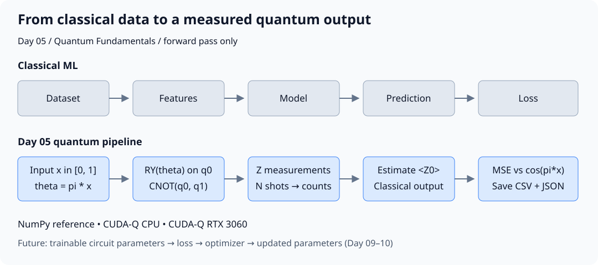

# Day 05｜從 Classical ML Pipeline 看懂 QML Pipeline

## 本章摘要｜初學者學習筆記

### 中文

[Day4](../day04/README.md) 建立兩量子位元的 Bell state，透過不同量測基底與重複抽樣，理解糾纏、相關性與量測結果的差別。Day5 接著把輸入資料、量子電路與量測結果串起來，建立從一般數值輸入到可評估數值輸出的完整流程。

這一章目標在於理解 **「一般資料如何進入量子電路，以及量測結果如何轉成機器學習流程能使用的數值」**，讓前幾章的量子概念各自對應到明確的處理步驟。本章用一個介於 0 與 1 的數值 `x` 作為輸入，透過 `θ = πx` 轉成 RY 旋轉閘的角度，再接上 CNOT，準備兩量子位元的狀態。量測後，將第一個量子位元的 0／1 結果分別換成 +1／−1，再取平均，得到 `⟨Z0⟩` 的估計值；這個輸出與 Day4 用來描述兩量子位元相關性的數值不同。由於理想答案可直接算成 `cos(πx)`，每個處理階段都能核對，並以 MSE（平均平方誤差）觀察有限 shots 帶來的抽樣誤差。這裡的角度由資料決定，尚未透過 optimizer（最佳化器）學習參數，因此本章完成的是 forward pass（前向計算）。讀完本章，應能說明編碼、電路、量測、數值轉換與評估各自的用途，理解量子運算與一般程式如何分工，並知道後續還需要加入可訓練參數與更新步驟，才能形成訓練流程。

### English

[Day4](../day04/README.md) constructed a two-qubit Bell state and used different measurement bases and repeated sampling to distinguish entanglement, correlation, and measurement outcomes. Day5 connects input data, quantum circuits, and measurement results into a complete workflow from an ordinary numerical input to a numerical output that can be evaluated.

This chapter aims to explain **how ordinary data enters a quantum circuit and how measurement results become numerical outputs usable in a machine learning workflow**, giving the concepts from earlier chapters a clear role in the process. A scalar input `x` between 0 and 1 is converted into an RY rotation angle through `θ = πx`. A subsequent CNOT completes the two-qubit state preparation. After measurement, outcomes 0 and 1 for the first qubit are mapped to +1 and −1 and averaged to estimate `⟨Z0⟩`. This output differs from the two-qubit correlation examined in Day4. Since the ideal answer can be calculated directly as `cos(πx)`, each stage can be checked, and mean squared error (MSE) can quantify the sampling error from finite shots. The angle is determined by the input data; no optimizer learns parameters at this stage, so the implementation is a forward pass. The learning goal is to explain the roles of encoding, circuit execution, measurement, numerical post-processing, and evaluation; understand how quantum operations and classical code work together; and identify the trainable parameters and update steps still needed to build a training workflow.

---

Day 3 實作單量子位元 gate，Day 4 用 H + CNOT 建立 Bell state。今天將這些元件串成一條完整路徑：**輸入資料 → 編碼 → 電路 → 量測 → 數值輸出 → 評估與保存**。

今天完成第一個 Quantum Fundamentals milestone：文章、Notebook、架構圖，以及可在 NumPy、CUDA-Q CPU 和 RTX 3060 執行的 circuit demo。

## 1. 從熟悉的 Classical ML 流程開始

一般 supervised ML 會從 dataset 出發，經 preprocessing、model、prediction、loss，訓練時再由 optimizer 更新參數。

QML 的模型部分可以包含量子電路，但資料整理、loss 計算、參數更新與結果紀錄通常仍由 classical code 負責。今天只先實作 forward pass；可訓練電路與 optimizer 會在 Day 9–10 加入。



| 階段 | Classical ML 常見操作 | 本日示範 |
|---|---|---|
| Input | 讀取數值特徵 | 9 個位於 `[0, 1]` 的 scalar inputs |
| Preprocessing／Encoding | scaling、feature transform | `theta = πx`，以 RY 寫入 q0 |
| Model／Circuit | 參數化函數 | RY(q0) → CNOT(q0, q1) |
| Readout | 數值 tensor | Z-basis counts → `⟨Z0⟩` 估計 |
| Evaluation | 比較預測與 label | 比較已知函數 `cos(πx)`，計算 MSE |
| Training | optimizer 更新 weights | 本日沒有參數更新 |
| Record | metrics、設定、版本 | CSV、JSON、backend、shots、seed |

這張表是工作流程的對照，不表示 quantum gate 等同任意 neural network layer。

## 2. 本日實驗問題與範圍

問題是：「給定 scalar input `x`，能否用同一套介面完成 NumPy 與 CUDA-Q 的前向計算，並驗證有限 shots 的輸出誤差？」

資料由 `np.linspace(0, 1, 9)` 直接產生，target 是已知的 `cos(πx)`。這是一個可解析的驗證問題，沒有資料集下載、train/test split、fit 或 generalization 結論。

這個範圍讓每個階段都能獨立檢查，避免還不理解量測輸出，就開始追蹤複雜的 training loss。

## 3. 環境與交付物

在 repository 根目錄執行，沿用既有 `.venv`：

```bash
source .venv/bin/activate
python -m pip install -r requirements-day05.txt
python -m pip check
```

全新 checkout 請先使用 `python3.12 -m venv .venv`。本日保留 NumPy 2.2.6 與 CUDA-Q 0.15.1，增加 Notebook 執行套件；完整依賴版本見 [requirements-day05-lock.txt](../../requirements-day05-lock.txt)。

| 檔案 | 用途 |
|---|---|
| [pipeline.py](pipeline.py) | encoding、NumPy reference、counts 後處理、metrics 與 CLI |
| [cudaq_pipeline.py](cudaq_pipeline.py) | CUDA-Q kernel 與抽樣 |
| [Quantum Fundamentals Notebook](../../notebooks/day05_quantum_fundamentals.ipynb) | Day 2–5 概念回顧與完整 CPU 示範 |
| [架構圖 SVG](../../figures/day05_pipeline.svg) | 可在文章與 Notebook 顯示的獨立圖檔 |
| [execute_notebook.py](execute_notebook.py) | 使用目前 Python 重跑 Notebook 全部儲存格 |
| [results/day05](../../results/day05/) | 每個 backend 的 predictions.csv 與 summary.json |

`pipeline.py` 直接重用 Day 3 的 RY／I／`|0⟩` 與 Day 4 的 CNOT／basis labels；未再複製一份 gate 定義。現階段仍以文章目錄為主，尚未將教學模組封裝成安裝套件。

## 4. 第一步：讓 Classical Input 決定角度

本日輸入已在 `[0, 1]`，定義：

```python
def encode(value: float) -> float:
    if not np.isfinite(value) or not 0 <= value <= 1:
        raise ValueError("input must be finite and in [0, 1]")
    return float(np.pi * value)
```

這裡不對越界輸入靜默 clipping，因為那會掩蓋資料契約問題。真正資料集若需要 scaler，未來應只在 training split 擬合，再套用到 validation/test split。

`theta = πx` 是 **資料決定的角度**。它雖然是 kernel argument，卻不是本日學習出來的 trainable parameter。之後才會把資料 `x` 和待訓練的 weights 分開。

## 5. 第二步：RY + CNOT 形成完整電路

從 `|00⟩` 開始，先對 q0 使用 RY，再用 q0 控制 q1：

```text
q0: ──RY(πx)──●──MZ
              │
q1: ──────────X──MZ
```

依 Day 3 的 rotation 定義與 Day 4 的 CNOT truth table：

```text
|ψ(x)⟩ = cos(πx/2)|00⟩ + sin(πx/2)|11⟩
```

三個可立即驗證的輸入：

| x | 輸出狀態 | Z0 精確期望值 |
|---:|---|---:|
| 0 | `|00⟩` | +1 |
| 0.5 | Day 4 的 Bell state `(|00⟩ + |11⟩)/√2` | 0 |
| 1 | `|11⟩` | −1 |

本日 CUDA-Q kernel 如下，完整版本在 [cudaq_pipeline.py](cudaq_pipeline.py)：

```python
@cudaq.kernel
def encoded_pair(theta: float, measure: bool):
    q = cudaq.qvector(2)
    ry(theta, q[0])
    x.ctrl(q[0], q[1])
    if measure:
        mz(q[0])
        mz(q[1])
```

`measure=False` 僅用於模擬器 `get_state` 正確性測試；正式預測使用 `measure=True` 的 counts。`get_state` 與 `sample` 分別提供狀態資訊與抽樣結果，兩者不能混為同一種硬體讀出方式。[D3]

## 6. 第三步：把 Counts 轉成數值輸出

輸出 observable 選為 q0 的 Z，將首位 0 對應 +1、首位 1 對應 −1：

```text
prediction = (n00 + n01 − n10 − n11) / shots
```

例如 `00:493`、`11:507`，估計值為 `−0.014`。這是 Day 4 的 counts 接到 classical output 的第一步。

注意不能用 `P(00)+P(11)−P(01)−P(10)` 代替它；那是 Day 4 的兩 Qubit correlation。對本日電路，correlation 始終為 1，無法表達輸入如何改變 `⟨Z0⟩`。

`prediction_from_counts` 會檢查 bitstring、非負整數 counts 與非零 shots，並保留 01／10。即使理想電路只出現 00／11，後處理也不應依賴這個特殊假設。

由狀態推導：

```text
⟨Z0⟩ = cos²(πx/2) − sin²(πx/2) = cos(πx)
```

這是今天用來核對程式的解析答案。CNOT 保留在示範中以銜接 Day 4，但對這個單獨的 Z0 輸出，移除 CNOT 也會得到相同結果。不能把兩 Qubit 的存在解讀成此任務需要糾纏。

## 7. 完整執行範例

```bash
python articles/day05/pipeline.py --backend numpy
python articles/day05/pipeline.py --backend qpp-cpu
python articles/day05/pipeline.py --backend nvidia
```

每個 backend 使用 9 個 inputs、3 組 repeat seeds（42、43、44）、每筆 1,000 shots，產生 27 筆資料。每個 input 透過 `SeedSequence([seed, input_index])` 衍生自己的抽樣 seed，實際 seed 也寫進 CSV。

結果存於 `results/day05/<backend>/`；重跑更新同一目錄，或使用 `--output-dir /tmp/day05-check` 另存。增加 shots 的範例：

```bash
python articles/day05/pipeline.py --backend qpp-cpu --shots 10000 --output-dir /tmp/day05-more-shots
```

CSV 記錄 input、angle、seeds、shots、四種 counts、target、prediction、squared error 與時間。JSON 保存環境、encoding、circuit、observable、noise、MSE 與每個 repeat seed 的 MSE。

## 8. 結果怎麼判讀？

本次預設設定的結果如下，來源為各 backend 的 `summary.json`：

| 方法 | MSE |
|---|---:|
| NumPy finite shots | 約 0.00047117 |
| CUDA-Q qpp-cpu finite shots | 約 0.00036461 |
| CUDA-Q nvidia finite shots | 約 0.00036461 |
| 永遠輸出 0 的簡單對照 | 0.55555556 |
| Classical 解析式 `cos(πx)` | 0（依定義） |

解析式就是 target 的生成規則，因此得到零誤差是預期結果。擊敗 constant-zero 並不代表 quantum advantage；本例已有便宜、精確的 classical 解。

對獨立 ±1 量測的樣本平均，理論變異數為：

```text
Var(prediction) = (1 − cos²(πx)) / shots
```

對本日九個 inputs，1,000 shots 時平均預期 squared error 為 `4/9000 ≈ 0.00044444`。實際 MSE 在此尺度附近波動，有限三組 seeds 不保證精確等於期望值。

本次 CPU 與 GPU 的 counts 一致，但重現契約是設定與統計行為可追溯，不是所有框架／版本的亂數必須相同。時間包含編譯與初始化，沒有暖機、負載控制或效能比較設計，不能當 GPU benchmark。

## 9. Notebook 示範與驗證

在 IDE 開啟 [Notebook](../../notebooks/day05_quantum_fundamentals.ipynb)，選取專案 `.venv/bin/python` 後 Run All。Notebook 包含已執行輸出，順序涵蓋 gate、Bell state、encoding、counts、NumPy 與 CUDA-Q CPU pipeline。

也可不開 Notebook UI，直接執行：

```bash
python articles/day05/execute_notebook.py
```

此指令用目前 interpreter 啟動暫時的 Jupyter kernel，遇到 cell error 即失敗，成功後更新 Notebook 輸出；不註冊全域 kernel。Notebook 的 CSV／JSON 寫入示範使用暫存目錄，不覆蓋正式結果。[D6]

測試指令：

```bash
python -m unittest discover -s articles/day05 -p 'test_*.py' -v
DAY05_TARGET=nvidia python -m unittest discover -s articles/day05 -p 'test_cudaq_pipeline.py' -v
```

測試涵蓋輸入契約、解析 amplitudes、非對稱 counts 的位元順序、seed 重現、保存指標與完整 CUDA-Q pipeline。執行環境與限制見 [ENVIRONMENT.md](ENVIRONMENT.md)。

## 10. Milestone 1：目前已完成哪些成果？

Day 1 確立研究與工程界線；Day 2 把 Qubit 寫成向量；Day 3 用 unitary matrix 改變狀態；Day 4 建立兩 Qubit 系統並理解量測相關性；Day 5 把輸入、電路、counts 與 metrics 接起來。

現在已有完整 forward pipeline，但沒有 optimizer、trained model 或真實資料集 benchmark。之後的工作就是讓電路擁有獨立的 trainable parameters，計算 loss 與 gradient，再由 classical optimizer 更新參數。

## 11. 本日來源與下一篇

- [D3] [NVIDIA CUDA-Q Executing Kernels](https://nvidia.github.io/cuda-quantum/latest/using/examples/executing_kernels.html)：`sample` 與 `get_state` 的用途。
- [D6] [nbclient — Executing notebooks](https://nbclient.readthedocs.io/en/latest/client.html)：程式化執行 Notebook 與錯誤處理。
- 本日狀態、expectation 與 variance 公式由 Day 3–4 的定義推導，並以代碼驗證。文獻索引見 [REFERENCES.md](../../REFERENCES.md)。查閱日期：2026-09-06。

[Day 06](../day06/README.md) 將系統整理 CUDA-Q、CUDA、cuQuantum 的分工，以及已經跑通的 Ubuntu／RTX 3060 環境，附上可重跑的診斷程式與 Hello Quantum。
