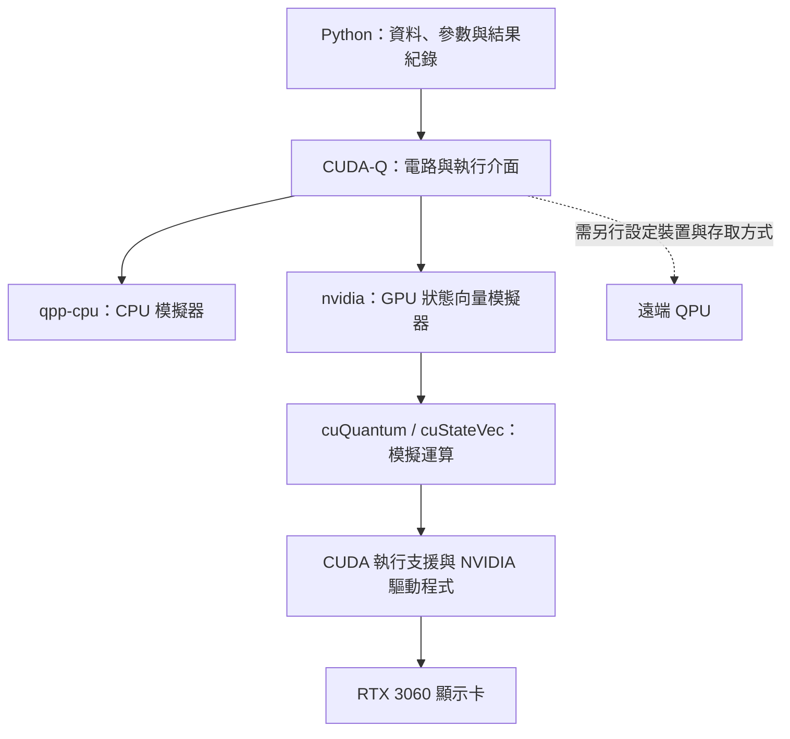

# Day 06｜CUDA-Q、CUDA、cuQuantum 有何不同？

[Day5](../day05/README.md) 將資料編碼、量子電路、量測與結果評估串成完整的前向計算流程，並用已知答案核對輸出。Day6 接著整理支撐這條流程的工具與執行環境，釐清程式如何選擇 CPU／GPU 模擬器，以及如何確認環境確實能執行指定的工作。

**CUDA-Q、CUDA 與 cuQuantum 分工不同；分清楚各自的角色，才能知道環境出錯時該從哪裡查起。**CUDA-Q 提供撰寫量子電路與選擇 backend（執行後端）的介面；CUDA 提供 NVIDIA GPU 平行運算的基礎；cuQuantum 則提供加速量子模擬的函式庫。這個分工有助於判斷錯誤發生在 Python 套件、GPU 驅動程式、裝置存取，還是電路執行階段。本章也區分 driver（驅動程式）、toolkit（開發工具組）與 runtime（執行時支援）的版本，避免把不同層次的資訊混成單一「CUDA 版本」。實作沿用熟悉的 Bell state 作為最小驗證案例，檢查指定後端、量測次數、狀態正確性與位元順序，並保存診斷結果和失敗訊息。套件匯入成功只代表程式能找到套件；指定後端是否真的能完成電路，仍需依執行結果確認。GPU 在這裡執行的是經典數值模擬；本章驗證的是環境與小型電路的正確性，尚未比較模擬效能或證明量子優勢。

[Day5](../day05/README.md) connected data encoding, quantum circuits, measurement, and evaluation into a complete forward pass, checking the outputs against a known answer. Day6 examines the tools and execution environment supporting that workflow, explaining how CPU/GPU simulators are selected and how to verify that the environment can run the requested task.

**CUDA-Q, CUDA, and cuQuantum serve different roles; understanding those roles helps identify where an execution problem begins.** CUDA-Q provides interfaces for writing quantum circuits and selecting an execution backend. CUDA provides the foundation for parallel computing on NVIDIA GPUs, while cuQuantum supplies libraries that accelerate quantum simulation. Understanding these roles helps distinguish problems involving Python packages, GPU drivers, device access, and circuit execution. The chapter also separates driver, toolkit, and runtime versions rather than treating these different layers as a single “CUDA version.” The implementation reuses the familiar Bell state as a minimal verification case, checking the requested backend, shot totals, state correctness, and bit ordering while preserving diagnostic results and failure messages. A successful package import confirms that the package can be found, but running a circuit is still necessary to verify the requested backend. GPU execution here performs classical numerical simulation; this chapter verifies the environment and a small circuit, without measuring simulation speed or establishing quantum advantage.

---

前幾章已完成從資料到量測輸出的前向計算，也就是固定設定下從輸入算到輸出的一次流程。本章用同一個小電路檢查工具、裝置與結果，將環境問題拆成可以逐項確認的步驟。

## 1. 三個名字，各自解決什麼問題？

| 名稱 | 角色 | 本專案中的用途 |
|---|---|---|
| CUDA | NVIDIA 的平行運算平台 | 讓 GPU 同時處理大量合適的數值運算，提供開發與執行所需的支援 |
| cuQuantum | 加速量子模擬的函式庫集合 | 提供已實作好的數值運算，供模擬器使用 |
| CUDA-Q | 量子與經典混合程式的開發平台 | 描述量子電路、安排執行，並取得量測結果 |

CPU 是中央處理器，負責一般程式運算與流程控制；GPU 是圖形處理器，擅長大量可同時進行的運算。兩者都是經典硬體，也就是一般電腦的運算設備。QPU 則是量子處理器，實際使用量子系統執行操作。

函式庫（library）是可由其他程式呼叫的既有功能集合。cuQuantum 中的 cuStateVec 協助狀態向量模擬，也就是保存振幅並計算電路如何改變它們；cuTensorNet 則處理張量網路運算，以彼此連接的多維數值陣列表示與計算系統。[D4] 本系列先從 CUDA-Q 的程式介面（API）使用這些能力，不需要先直接呼叫底層函式庫。[D1][D9]

量子核心程式（quantum kernel）是描述量子操作的程式區塊。一般 Python 程式負責資料、參數與結果紀錄，再將量子核心程式交給執行後端（backend，也稱 target）。後端指定實際使用哪個模擬器或硬體。



這是概念上的分工圖，不是函式庫的實際載入順序。程式可能先載入尚未使用的功能，因此看到 GPU 函式庫出現在記憶體中，還不能單獨證明電路在 GPU 上執行。

## 2. GPU 如何協助量子模擬？

純態是能用一個狀態向量完整描述的量子狀態。`n` 個量子位元的純態向量包含 `2^n` 個複數振幅；振幅是用來計算量測機率的係數，取絕對值平方後才是機率。

模擬器保存這些數值，再計算量子閘如何改變向量。若每個複數用實部與虛部各 64 位元儲存，總共需要 16 位元組（bytes）。只計算一份狀態向量：

```text
記憶體 = 16 × 2^n 位元組
28 個量子位元 → 4 GiB
29 個量子位元 → 8 GiB
```

1 GiB 等於 `2^30` 位元組。每增加一個量子位元，所需空間就加倍。實際執行還需要工作區，也就是中間運算的暫存空間，以及其他程序占用的記憶體，因此不能將 RTX 3060 的全部 6 GiB 都當成狀態向量容量。

這是容量估算，並未測量本機最大可執行規模。GPU 模擬成功也不代表量子優勢；量子優勢需要在明確任務、品質與成本條件下，與適當的經典方法比較。CPU／GPU 的效能評測會在 Day 27 處理。

## 3. 「CUDA 版本」其實可能指不同東西

驅動程式（driver）協助作業系統與 GPU 溝通；開發工具組（toolkit）包含編譯器等開發工具；執行時支援（runtime）則提供程式運作時需要的功能。編譯器會將程式轉換成可執行的形式。這些元件各有版本，不必顯示相同數字。

| 資訊 | 本次紀錄 | 代表什麼 |
|---|---|---|
| NVIDIA 驅動程式 | 570.211.01 | 主機安裝的驅動程式版本 |
| `nvidia-smi` 的 CUDA Version | 12.8 | 驅動程式回報的 CUDA 支援資訊，不是已安裝工具組清單 |
| `nvcc --version` | release 12.8，V12.8.93 | 目前選到的 CUDA 編譯器與工具組版本 |
| `nvidia-cuda-runtime-cu12` | 12.9.79 | Python 環境安裝的執行支援套件版本 |

`nvidia-smi` 是查看 NVIDIA GPU 狀態的工具；`nvcc` 是 CUDA 編譯器。系統會依 `PATH` 中列出的資料夾順序尋找命令，因此安裝了某個版本，不代表終端機目前選到的就是該版本。[D7]

CUDA 的次版本相容機制允許部分同一主版本的組合共同運作，但仍有功能限制。例如 PTX 是供後續編譯的中間程式表示，使用它時還需確認驅動程式是否支援。[D8] 本次系統工具組 12.8 與 Python 執行支援套件 12.9 共存，且小型 GPU 測試通過；這只驗證本次程式，並未涵蓋所有功能。

`pip` 是 Python 套件管理工具；它回報的是套件版本。Linux 的 `.so` 檔案是共享函式庫，可以在程式執行時載入。套件版本、載入檔案與驅動程式版本需要分別記錄。

## 4. 沿用已驗證的獨立環境

虛擬環境 `.venv` 為專案分開保存 Python 套件，避免與其他專案互相影響。已有 Day 5 環境時：

```bash
source .venv/bin/activate
python -m pip check
python -c "import sys; print(sys.executable)"
```

若是新取得的專案副本，可在 Ubuntu 上依固定版本建立環境。Ubuntu 是 Linux 作業系統的一種：

```bash
python3.12 -m venv .venv
source .venv/bin/activate
python -m pip install -r requirements-day06.txt
```

[requirements-day06.txt](../../requirements-day06.txt) 引用 [Day 4 固定版本清單](../../requirements-day04-lock.txt)，包含 `cuda-quantum-cu12==0.15.1` 與 `numpy==2.2.6`。NumPy 是 Python 的數值運算套件。若需要 Day 5 的互動式筆記本，改用 [Day 5 固定版本清單](../../requirements-day05-lock.txt)。

固定版本清單記錄套件及其依賴，也就是執行時需要的其他套件。官方提醒不同 CUDA-Q 發行套件可能衝突，因此本專案依既有清單重建環境。[D1]

`pip check` 檢查套件依賴是否相容，`import cudaq` 檢查 Python 能否載入套件；兩者都不能取代一次指定後端的電路執行。

## 5. Hello Quantum：用小電路確認環境

Hello Quantum 是本章最小量子程式的名稱。這種先確認基本功能能運作的簡短測試，也稱為冒煙測試（smoke test）。範例沿用 Day 4 的貝爾態（Bell state），理想狀態為 `(|00⟩ + |11⟩)/√2`，在 Z 基底下只會量到 `00` 或 `11`。

H 是 Hadamard 閘，先建立疊加；CNOT 是受控反相閘，依第一個位元控制第二個位元的翻轉。程式中的 `h`、`x.ctrl` 分別執行這兩步，`mz` 則在區分 0、1 的 Z 基底下量測：

```python
import cudaq

@cudaq.kernel
def bell(measure: bool):
    q = cudaq.qvector(2)
    h(q[0])
    x.ctrl(q[0], q[1])
    if measure:
        mz(q[0])
        mz(q[1])

cudaq.set_target("qpp-cpu")
cudaq.set_random_seed(42)
counts = cudaq.sample(bell, True, shots_count=1000,
                     explicit_measurements=True)
print(counts)
```

`qvector(2)` 建立兩個量子位元。`sample` 取得重複量測的計數（counts），`shots_count` 指定重複次數。隨機種子（seed）控制模擬抽樣的起始設定，方便在相同環境重做實驗。完整版本位於 [hello_quantum.py](hello_quantum.py)：

```bash
python articles/day06/hello_quantum.py --backend qpp-cpu
python articles/day06/hello_quantum.py --backend nvidia
```

程式明確選擇後端，要求 GPU 卻無法使用時就回報失敗。五項檢查包括：

1. 實際後端名稱符合要求。
2. 各結果出現次數相加等於要求的量測次數。
3. 貝爾態的結果只包含 `00` 與 `11`。
4. 模擬狀態與理想狀態的保真度接近 1。
5. 另用只翻轉第一個位元的電路，確認回傳字串為 `10`。

保真度（fidelity）衡量兩個狀態的接近程度；對本例的純態，是兩個正規化向量內積的絕對值平方，1 表示相同物理狀態。容差則是數值比較時允許的微小誤差。

`00` 與 `11` 左右交換後仍相同，因此還需要 `10` 這種不對稱結果檢查位元順序。`explicit_measurements=True` 讓輸出依明確寫出的量測順序排列。

`get_state` 用來檢查模擬器保存的完整向量，不表示真實 QPU 能一次讀出所有振幅。若要保存單次結果，可加上 `--output /tmp/day06-hello.json`。

## 6. 產生環境報告

```bash
python articles/day06/check_environment.py
```

診斷預設要求 CPU 與 GPU 都通過，結果保存到 [environment.json](../../results/day06/environment.json)。JSON 是以欄位名稱保存結構化資料的文字格式。只驗證 CPU 時：

```bash
python articles/day06/check_environment.py --backends qpp-cpu --output /tmp/day06-cpu.json
```

| 報告欄位 | 內容 |
|---|---|
| `python` | Python 執行程式的位置；`prefix` 與 `base_prefix` 協助辨認是否使用虛擬環境 |
| `platform`／`os_release` | 作業系統與處理器架構 |
| `packages` | 已安裝套件及版本 |
| `tools` | GPU 清單、工具輸出與退出碼 |
| `backends` | 各後端的測試結果與原始輸出 |
| `probe_environment` | 小型測試使用的執行緒設定 |

每個後端由獨立子程序執行，也就是另外啟動一個程序做測試；主要程序負責收集結果。因此即使 GPU 初始化失敗，仍能保存錯誤紀錄。

標準輸出（stdout）通常保存一般結果，標準錯誤輸出（stderr）通常保存診斷訊息。退出碼（exit code）是程序結束時的狀態數字，0 通常表示正常結束；逾時（timeout）表示未在指定時間內完成。診斷會一起檢查這些資訊與數值結果。

總結果 `passed` 為真，表示套件依賴檢查及所有指定後端通過。缺少 GPU 開發工具不一定影響只用 CPU 的測試，因此主機工具狀態另行保存。每個命令預設最多 60 秒，可用 `--timeout` 調整。

OpenMP 是將 CPU 工作分配給多個執行緒的方式；執行緒是程序內可分別安排的工作單位。未指定 `OMP_NUM_THREADS` 時，本章小型測試使用 1 個執行緒。

## 7. 保存的實測結果

本次主機為 Ubuntu 22.04.5 LTS、Python 3.12.7 與 RTX 3060 Laptop GPU。LTS 表示長期支援版本；GPU 記憶體為 6144 MiB，其中 1 MiB 等於 `2^20` 位元組。運算能力版本（compute capability）8.6 是 GPU 支援功能的架構識別，不是效能分數。

| 執行環境 | CPU 後端 | GPU 後端 | 總結果 |
|---|---|---|---|
| 工具沙箱 | 通過 | 失敗：看不到 CUDA 裝置 | 未通過 |
| 沙箱外主機 | 通過 | 通過 | 通過 |

沙箱是限制程序可存取資源的隔離環境。同一套 Python 套件，可能因裝置存取權限不同而得到不同結果。兩份原始紀錄分別為 [主機報告](../../results/day06/environment.json) 與 [沙箱報告](../../results/day06/sandbox_environment.json)。

主機兩個後端都得到 `00:493`、`11:507`；位元順序測試得到 `10:16`。保真度約為 CPU `1.0`、GPU `0.999999966`，在本例允許的絕對誤差 `1e-5`（0.00001）內。相同計數是本次觀察，不要求不同版本的抽樣器逐筆相同。

兩個程序的 `/proc/self/maps` 都列出 `libcustatevec.so.1`。這份 Linux 紀錄顯示程序映射到記憶體的檔案，只能證明函式庫已載入；本章另外保存後端設定與電路執行結果。

## 8. GPU 結束時的訊息

本次 GPU 子程序的錯誤輸出包含 `cudaErrorCudartUnloading`，退出碼為 0，五項檢查全部通過。報告保留原始訊息，根因尚未定位。

這能確認小型電路已完成，但不能直接推論程序關閉時的所有行為都正常。相關觀察見 [Day 4 環境紀錄](../day04/ENVIRONMENT.md)。

## 9. 遇到問題時依序檢查

| 現象 | 優先檢查 |
|---|---|
| 找不到 `cudaq` 套件 | 是否使用專案的 `.venv/bin/python`，以及套件是否安裝在同一環境 |
| `pip check` 失敗 | 安裝版本與固定清單是否一致 |
| CPU 可以、GPU 不行 | 主機能否看到 GPU、驅動程式、隔離環境的裝置權限與子程序錯誤輸出 |
| 工具組與執行支援版本不同 | 分開記錄版本，再檢查相容條件及實際測試 |
| 次數不符或出現 `01`／`10` | 電路、位元順序及是否加入雜訊；雜訊是使狀態或量測偏離理想情況的干擾 |
| 執行逾時 | 初始化、執行緒設定與其他工作占用的資源 |

診斷會讀取環境與執行小型模擬，不會自動重裝驅動程式或改變後端。

## 10. 診斷程式的測試

```bash
python -m unittest discover -s articles/day06 -p 'test_*.py' -v
```

四個測試涵蓋命令不存在、錯誤輸出與非零退出碼、逾時前的部分輸出，以及後端名稱、結果內容和退出碼互相矛盾時，是否正確回報失敗。量子電路本身則由前面的五項檢查驗證。

程式入口為 [Hello Quantum](hello_quantum.py)、[環境診斷](check_environment.py) 與 [診斷測試](test_environment.py)。這些紀錄用來確認環境與基本結果，尚未比較 CPU／GPU 速度或訓練模型。

## 11. 本日來源與下一篇

- [D1] [NVIDIA CUDA-Q Quick Start](https://nvidia.github.io/cuda-quantum/latest/using/quick_start.html)：CUDA-Q 定位、安裝提醒、貝爾態範例與後端。
- [D4] [NVIDIA cuQuantum Documentation](https://docs.nvidia.com/cuda/cuquantum/latest/index.html)：量子模擬函式庫。
- [D7] [CUDA Toolkit, Driver, and Architecture Matrix](https://docs.nvidia.com/datacenter/tesla/drivers/cuda-toolkit-driver-and-architecture-matrix.html)：驅動程式／開發工具組 與 nvidia-smi 資訊。
- [D8] [CUDA Minor Version Compatibility](https://docs.nvidia.com/deploy/cuda-compatibility/minor-version-compatibility.html)：同一 主版本系列 的相容機制與限制。
- [D9] [NVIDIA CUDA Zone](https://developer.nvidia.com/cuda-zone)：CUDA 平行運算平台與程式設計模型。

查閱日期：2026-09-06。文件會更新，實際安裝版本與執行結果分別由依賴清單及報告保存，見 [REFERENCES.md](../../REFERENCES.md)。

[Day 07](../day07/README.md) 將拆解量子核心程式的寫法：建立量子位元、施加量子閘、傳入參數，以及使用條件與迴圈安排操作，讓已能執行的電路更容易修改與擴充。
