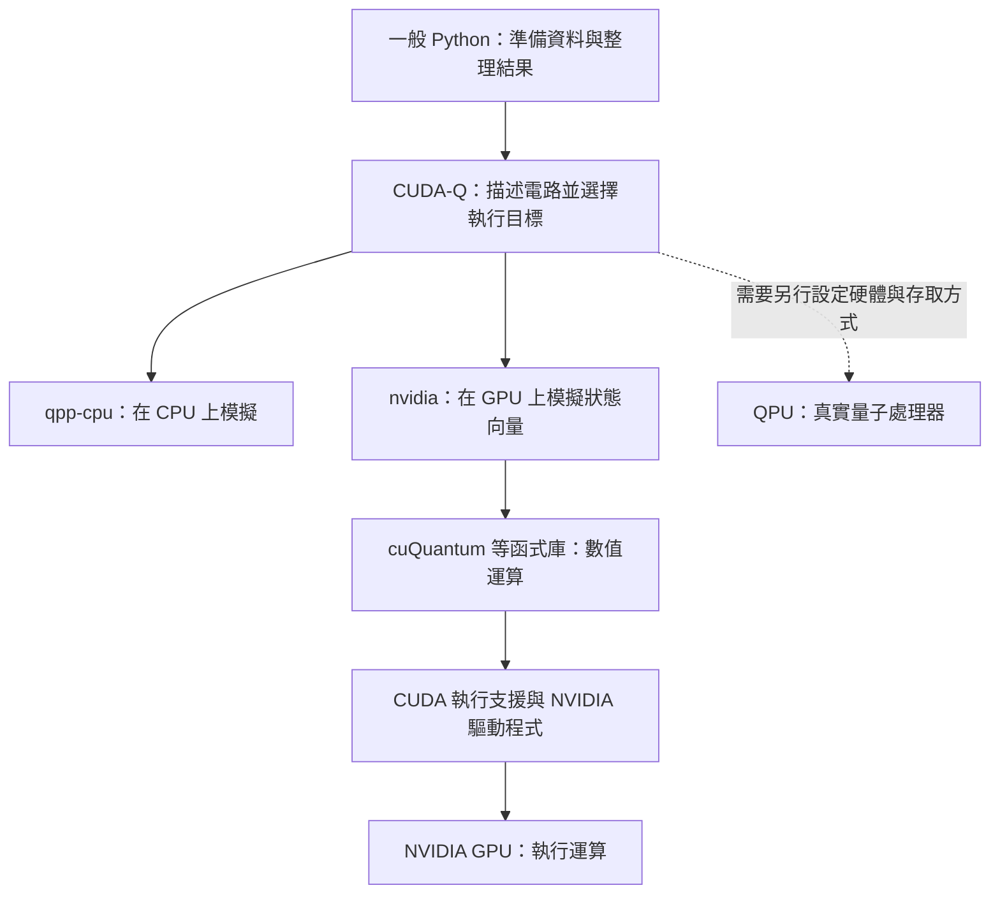

# Day 06｜CUDA-Q、CUDA、cuQuantum 有何不同？

假設 Day5 的程式能在 CPU 上執行，但改成 GPU 後卻失敗。這時終端機可能同時出現 CUDA-Q、CUDA、cuQuantum、driver 等名稱，還附上好幾組版本數字。到底應該先查哪一個？

今天沿著「程式如何把工作交給硬體」來拆解這個問題。先分清楚誰描述電路、誰提供模擬運算、誰讓程式使用 GPU，再用已知答案的小電路逐層檢查。

本章的目標是一份能說清楚條件與結果的環境報告：使用哪個 Python、要求哪個執行後端、電路是否完成、數值是否正確，以及失敗時留下了什麼訊息。**套件安裝成功、GPU 可以存取、電路結果正確，是需要分別確認的事。**

Day6 follows a quantum program from its Python environment to the selected execution backend. It distinguishes CUDA-Q, CUDA, and cuQuantum, explains why driver, toolkit, and runtime versions describe different components, and uses a known Bell-state circuit to verify execution. Saved reports illustrate how device access, backend selection, numerical checks, and process messages must be interpreted together. These checks establish basic simulation functionality, not performance or quantum advantage.

---

## 1. 從一行程式追到實際運算

前幾章使用過這個設定：

```python
import cudaq

cudaq.set_target("qpp-cpu")
```

它告訴 CUDA-Q：「接下來把量子電路交給這個 CPU 模擬器。」若在本專案的環境中改成 `nvidia`，則要求使用 NVIDIA GPU 的量子模擬後端。

**後端（backend，也稱 target）**就是實際接手執行的模擬器或硬體。它像工作單上的目的地；寫下目的地之後，仍要確認對方可用，而且真的完成了工作。

在這條流程中，三個容易混淆的名字各有角色：

| 名稱 | 它負責什麼？ | 在本系列會怎麼接觸它？ |
|---|---|---|
| CUDA-Q | 描述量子電路、安排執行、取得結果 | 在 Python 裡寫量子操作，選 CPU／GPU 模擬後端 |
| cuQuantum | 提供加速量子模擬的數值運算函式庫 | 由相應的模擬器使用，初期不必自己呼叫底層功能 |
| CUDA | NVIDIA GPU 的平行運算平台與相關支援 | 讓 GPU 程式與函式庫執行適合平行處理的工作 |

**函式庫**是一組可以重用的程式功能。與其每次重新實作大型向量運算，模擬器可以使用已提供的功能。cuQuantum 中，cuStateVec 處理狀態向量相關運算；cuTensorNet 則處理張量網路計算，也就是將運算表示成彼此連接的多維數值陣列。這是不同的模擬計算路線，不能只看名稱就當作同一種方法。[NVIDIA cuQuantum 文件](https://docs.nvidia.com/cuda/cuquantum/latest/index.html)

本系列先透過 CUDA-Q 的介面使用模擬器。CUDA-Q 並不等於 CUDA 的另一個名稱，也不是只要安裝 CUDA 就會自動擁有的 Python 套件。



這張圖表示工作分工，不是所有函式庫實際載入的先後順序。CPU 是一般電腦的中央處理器，GPU 是擅長大量平行運算的圖形處理器；QPU 才是真正使用量子系統執行操作的硬體。前兩種模擬路線都仍在一般電腦上計算。

## 2. GPU 在模擬什麼？為什麼需要很多記憶體？

Day2–4 用向量保存振幅，再用矩陣計算量子閘的作用。狀態向量模擬器也做類似的事，只是要處理更大的陣列。GPU 的角色是加速其中適合平行處理的數值工作，不是把顯示卡變成量子電腦。

對 n 個量子位元，完整純態向量有 `2ⁿ` 個複數振幅。每增加一個位元，原本每種結果又多出最後一位是 0 或 1 的兩種組合，所以分量數加倍。

假設每個複數以實部、虛部各 64 位元保存，總共是 16 位元組，光一份向量就需要：

```text
記憶體需求 = 16 × 2ⁿ 位元組
```

| 量子位元數 | 完整向量的分量數 | 一份向量所需空間 |
|---:|---:|---:|
| 2 | 4 | 64 位元組 |
| 28 | 268,435,456 | 4 GiB |
| 29 | 536,870,912 | 8 GiB |

1 GiB 是 `2³⁰` 位元組。這個估算只適用於上述儲存精度與完整向量方法，沒有包含運算時的暫存空間、函式庫工作區與其他程序。

本專案的 RTX 3060 筆電 GPU 記憶體是 6 GiB。在這個假設下，29 位元的一份向量已超過容量；28 位元雖然帳面上需要 4 GiB，也還不能保證整個程式放得下。這是容量推算，不是本機最大規模的實測。

只用兩個量子位元檢查安裝，能快速確認基本功能；它的工作量很小，初始化成本可能比主要運算還明顯。因此，本日不從這個小電路的耗時判斷 CPU／GPU 的速度優劣，效能比較會在 Day27 另行設計。

## 3. 四個版本數字，為什麼可以同時存在？

以下是本專案歷史環境的紀錄，並非建議所有機器都安裝相同版本：

| 從哪裡看到？ | 保存值 | 這個數字在描述什麼？ |
|---|---|---|
| NVIDIA driver | 570.211.01 | 主機上的 GPU 驅動程式版本 |
| nvidia-smi 的 CUDA Version | 12.8 | 驅動程式回報的 CUDA 支援資訊 |
| nvcc --version | release 12.8，V12.8.93 | 目前命令指向的 CUDA 編譯器／工具組版本 |
| Python 套件 nvidia-cuda-runtime-cu12 | 12.9.79 | 這個 Python 環境安裝的 CUDA 執行支援套件版本 |

**驅動程式（driver）**負責讓作業系統與 GPU 溝通。**開發工具組（toolkit）**包含編譯器等工具，用來建立程式；編譯器就是把程式描述轉成可以執行形式的工具。**執行時支援（runtime）**則提供程式運作時需要的功能。

它們是不同元件，因此版本不必長得一模一樣。`nvidia-smi` 顯示的 CUDA 資訊，不是「這台機器所有已安裝 CUDA 工具組的清單」；要查看目前選到的編譯器，需另外讀 `nvcc --version`。[NVIDIA 工具組與驅動程式對照文件](https://docs.nvidia.com/datacenter/tesla/drivers/cuda-toolkit-driver-and-architecture-matrix.html)

如果電腦有多份 nvcc，終端機依 `PATH` 所列資料夾的順序尋找命令，所以「有安裝」不代表「現在用到」。Python 也有相同問題：某個套件裝在一份 Python 裡，不表示另一份 Python 找得到它。

### 看到 12.8 與 12.9，是否應該立刻重裝？

先確認這兩個數字各自描述什麼，再檢查相容條件。CUDA 對同一主版本系列提供一定範圍的次版本相容機制，但不是所有組合、所有功能都無條件可用。

例如，某些新功能需要較新的驅動程式；若程式使用 PTX 這種需要進一步編譯的中間表示，也要考慮驅動程式是否支援。相容性必須連同程式實際用到的功能判讀。[CUDA 次版本相容文件](https://docs.nvidia.com/deploy/cuda-compatibility/minor-version-compatibility.html)

本專案保存的環境同時有工具組 12.8 與執行支援套件 12.9，小型 GPU 電路檢查通過。這支持該工作在當時組合上可執行，不能擴大成所有 CUDA 功能都已驗證。

## 4. 先確認正在使用哪一個 Python

如果一執行就顯示找不到 `cudaq`，最先要查的是套件是否安裝在「目前這份 Python」裡。GPU 驅動程式通常還不是這一步的直接問題。

從專案根目錄，在 Linux／Ubuntu 終端機啟用既有環境：

```bash
source .venv/bin/activate
python -c "import sys; print(sys.executable)"
python -m pip check
```

`.venv` 是替專案分開保存套件的虛擬環境。第二行應指向專案內的 `.venv/bin/python`；第三行檢查已安裝套件宣告的依賴條件是否衝突。

使用 `python -m pip` 的好處，是明確讓當前 Python 執行套件管理工作，降低把套件裝到另一份 Python 的機會。

若是全新副本，可依本專案固定版本建立環境：

```bash
python3.12 -m venv .venv
source .venv/bin/activate
python -m pip install -r requirements-day06.txt
```

[requirements-day06.txt](../../requirements-day06.txt) 引用 [Day4 固定清單](../../requirements-day04-lock.txt)，包含 `cuda-quantum-cu12==0.15.1` 與 `numpy==2.2.6`。若也需要 Day5 筆記本功能，可改用 [Day5 固定清單](../../requirements-day05-lock.txt)。這些清單記錄已驗證的套件組合，不是追蹤最新版的安裝指南。

不同 CUDA-Q 二進位發行套件可能互相衝突，因此重建本專案時依既有清單處理，不要額外疊裝其他發行套件。[CUDA-Q 入門與安裝文件](https://nvidia.github.io/cuda-quantum/latest/using/quick_start.html)

套件檢查成功後，還需要實際執行電路。`pip check` 不會測量子狀態，也不會證明目前程序能存取 GPU。

## 5. 用已知答案的小電路驗證環境

本日沿用 Day4 的貝爾態：

```text
|00⟩ → H 作用在 q0 → CNOT(q0, q1) → (|00⟩ + |11⟩)/√2
```

理想量測只會得到 00、11，各一半。因為答案已知，若結果出錯，就能優先查實作或執行條件，而不用同時猜測演算法是否有效。

這類確認基本功能能跑通的小測試，稱為**冒煙測試（smoke test）**。本日程式名為 Hello Quantum。以下最小範例可存成 Python 檔案執行：

```python
import cudaq


@cudaq.kernel
def bell(measure: bool):
    q = cudaq.qvector(2)
    h(q[0])
    x.ctrl(q[0], q[1])
    if measure:
        mz(q[0])
        mz(q[1])


cudaq.set_target("qpp-cpu")
cudaq.set_random_seed(42)
counts = cudaq.sample(
    bell, True, shots_count=1000, explicit_measurements=True
)
print(counts)
```

`@cudaq.kernel` 標記描述量子操作的區塊；`qvector(2)` 準備兩個量子位元，`h` 與 `x.ctrl` 建立貝爾態，`mz` 量測 0／1。`sample` 回傳每種結果出現的次數，1,000 shots 就是累積 1,000 個結果。

種子 42 控制模擬抽樣的起始設定，方便在相同環境重做。理論上各半，不要求這一批剛好各 500 次。

完整的 [hello_quantum.py](hello_quantum.py) 除了執行，還會核對結果並產生報告：

```bash
python articles/day06/hello_quantum.py --backend qpp-cpu
python articles/day06/hello_quantum.py --backend nvidia
```

第一個明確要求 CPU，第二個明確要求 GPU。若指定 GPU 卻無法使用，程式回報失敗，不會改用 CPU 後仍把結果標成 GPU。要另存單次報告，可以加上 `--output /tmp/day06-hello.json`。

## 6. 五項檢查，各自排除什麼錯誤？

| 檢查 | 怎麼核對？ | 為什麼需要？ |
|---|---|---|
| 目標一致 | 回報後端與要求後端相同 | 避免要求 GPU，卻測到另一種執行路線 |
| 次數完整 | 所有計數相加等於 shots | 避免遺漏結果或取錯一批資料 |
| 結果種類正確 | 理想貝爾電路只出現 00、11 | 檢查基本電路與量測是否符合預期 |
| 狀態正確 | 模擬向量與理想貝爾態比較 | 只看 00、11 還不足以完整辨識狀態 |
| 位元順序正確 | 另做只翻轉 q0 的電路，應得到 10 | 00、11 左右交換仍相同，抓不出順序錯誤 |

狀態比較使用**保真度（fidelity）**。對這裡兩個正規化純態，計算方式是兩個向量內積的絕對值平方；值為 1，表示它們代表相同物理純態，允許整體相位不同。

程式允許保真度與 1 相差不超過 `1e-5`，也就是 0.00001，這個允許範圍稱為容差。有限精度的計算不必每個數字都逐字相同，但容差也不應隨意放寬到讓真正的錯誤通過。

`get_state` 取得模擬器內保存的完整向量，提供比抽樣計數更直接的數值檢查。它不代表真實量子處理器可以靠一次量測讀出完整狀態。

這五項檢查共同支持「指定後端能完成這個小電路」。它們沒有檢查大型電路、長時間訓練或遠端量子硬體。

## 7. 讓報告保存失敗，而不只保存成功畫面

只把終端機上的 PASS 抄進筆記，日後不容易知道當時要求了哪些功能。完整診斷會一起保存環境與執行結果：

```bash
python articles/day06/check_environment.py
```

預設要求 CPU、GPU 都通過，並更新 [environment.json](../../results/day06/environment.json)。JSON 是以欄位名稱保存資料的文字格式。若這次只驗證 CPU，並希望另存：

```bash
python articles/day06/check_environment.py --backends qpp-cpu --output /tmp/day06-cpu.json
```

報告中的欄位可以依問題閱讀：

| 想回答的問題 | 對應欄位 |
|---|---|
| 用了哪份 Python？ | `python.executable`、版本、是否為虛擬環境 |
| 主機與套件條件是什麼？ | `platform`、`os_release`、`packages` |
| GPU 工具與套件檢查是否成功？ | `tools` |
| 要求哪個後端，實際發生什麼？ | `backends` 下各後端的 `process` 與 `result` |
| 小型測試的執行緒設定為何？ | `probe_environment` |
| 本次要求的範圍是否通過？ | 最外層 `passed` 與 `scope` |

`python.prefix` 與 `base_prefix` 可協助辨認虛擬環境：前者是目前環境位置，後者是基礎 Python 的位置。不同位置不表示錯誤，反而常是虛擬環境正常運作的跡象。

### 程序狀態與數值結果要一起看

每個後端由獨立的子程序執行，主程序負責收集。這樣某個後端初始化失敗，仍能保留失敗訊息與其他檢查結果。

每個子程序有三種重要資訊：**標準輸出（stdout）**通常保存結果，**標準錯誤輸出（stderr）**通常保存診斷訊息，**退出碼（returncode）**則描述程序結束狀態，0 通常表示正常結束。

不能只挑其中一個判斷。例如，程式曾印出成功結果，卻在結束時以非零退出碼離開，診斷仍應判定失敗；即使退出碼為 0，若回報的後端不符或數值檢查沒過，也不能標記通過。

每個命令預設最多 60 秒，可用 `--timeout` 調整。逾時時保留已產生的部分輸出，有助於知道卡在啟動還是後續操作。這是每個命令的限制，不是整份診斷的總時間上限。

本日小型後端測試在未設定 `OMP_NUM_THREADS` 時使用 1 個 CPU 執行緒。執行緒是程序內可分開安排的工作單位；OpenMP 可將數值工作分給多個執行緒，但兩位元測試未必受益於很大的執行緒群。

### passed 到底保證什麼？

最外層 `passed=true` 表示套件依賴檢查與**所有這次指定的後端**通過。若只指定 CPU，通過不代表 GPU 也可用。

主機工具的狀態另外保存；例如沒有 nvcc，不一定使 CPU 電路測試失敗。因此，報告要連同指定範圍一起讀，不能把一個布林值擴大成整台機器的健康證明。

## 8. 真實紀錄一：主機有 GPU，沙箱卻看不到

本專案保存兩份歷史報告，對應台灣時間 2026-09-06 的檢查。JSON 使用 UTC 記錄，因此時間字串日期為 2026-09-05。

| 執行位置 | CPU 後端 | GPU 後端 | 本次要求是否全部通過？ |
|---|---|---|---|
| 工具沙箱 | 通過 | 失敗：沒有可見的 CUDA 裝置 | 否 |
| 沙箱外主機 | 通過 | 通過 | 是 |

原始資料為 [沙箱報告](../../results/day06/sandbox_environment.json) 與 [主機報告](../../results/day06/environment.json)。沙箱是限制程序可以存取哪些資源的隔離環境，所以同一台電腦、同一組套件，也可能因裝置存取條件不同而有不同結果。

這個對照讓我們把問題縮小到執行環境與裝置可見性，而不是只看到 GPU 失敗就推論整台主機的驅動程式壞掉。仍應保存具體錯誤，不把所有「看不到 GPU」都歸為同一原因。

主機報告的設備是 Ubuntu 22.04.5 LTS、Python 3.12.7、RTX 3060 Laptop GPU，GPU 記憶體 6144 MiB。MiB 是 `2²⁰` 位元組，6144 MiB 等於 6 GiB；LTS 表示作業系統的長期支援版本。另記錄的運算能力版本 8.6 是 GPU 架構功能識別，不是速度評分。

## 9. 真實紀錄二：載入 GPU 函式庫，不等於電路用了 GPU

主機報告中，CPU 與 GPU 子程序都列出 `libcustatevec.so.1`。如果只憑這個檔名判斷，就會誤以為 CPU 測試也證明了 GPU 執行。

這份資訊來自 Linux 的 `/proc/self/maps`，列出目前程序映射到記憶體的檔案。`.so` 是可由程序載入的共享函式庫。程式啟動時可能載入之後未使用的功能，所以檔案存在於程序記憶體，只能證明它被載入。

本章因此另外要求後端名稱一致，並檢查該後端的電路執行結果。若將來要分析到底哪些 GPU 工作執行多久，還需要更詳細的效能追蹤，不能只依載入清單推論。

主機保存的數值如下：

| 項目 | CPU | GPU |
|---|---:|---:|
| 00 次數 | 493 | 493 |
| 11 次數 | 507 | 507 |
| 順序檢查 | 10 出現 16 次 | 10 出現 16 次 |
| 保真度 | 約 1.0 | 約 0.999999966 |
| 五項小電路檢查 | 全部通過 | 全部通過 |

這次兩邊計數相同，不是不同版本與後端都必須滿足的要求。GPU 保真度與 1 的差約為 `3.4 × 10⁻⁸`，小於本例容差；這說明數值在檢查範圍內一致，不表示 GPU 已比 CPU 更快或更準。

## 10. 真實紀錄三：結果通過，結束時仍有訊息

保存的 GPU 子程序在 stderr 留下 `cudaErrorCudartUnloading`，但退出碼為 0，五項數值與設定檢查也全部通過。

這份紀錄可以支持「小電路已完成，指定檢查通過」，但程序關閉時的訊息仍應保留，不能為了報表漂亮而刪除。根因尚未定位，相關歷史觀察見 [Day4 環境紀錄](../day04/ENVIRONMENT.md)。

本日診斷沒有要求 stderr 必須為空，也沒有因為退出碼為 0 就忽略結果內容。通過與否依明確條件判斷，其他訊息則留下來，供後續調查。這讓「已確認可用的部分」與「仍待解釋的現象」能同時被看見。

## 11. 從故障現象選擇下一個檢查

| 現象 | 下一個有助於縮小原因的檢查 |
|---|---|
| Python 找不到 cudaq | 印出 Python 路徑，確認套件裝在同一環境 |
| pip check 失敗 | 閱讀具體依賴衝突，與固定版本清單比對 |
| CPU 成功、GPU 失敗 | 比較主機與隔離環境的 GPU 可見性，讀取後端錯誤輸出 |
| nvcc 與 runtime 數字不同 | 確認各自角色，再查功能所需的相容條件 |
| 貝爾電路出現 01、10 | 檢查電路、量測順序與是否加入雜訊 |
| 程序逾時 | 看保留輸出，分辨初始化、執行緒或資源負載問題 |
| 最後有錯誤訊息但退出碼為 0 | 一起看數值檢查與訊息發生階段，保留尚未解釋的部分 |

這些步驟先蒐集能區分原因的資訊。診斷程式會讀取環境並執行小型模擬，不會自動重裝驅動程式，也不會在失敗後悄悄切換後端。

診斷本身也要測試，尤其要確認它不會把失敗包裝成成功：

```bash
python -m unittest discover -s articles/day06 -p 'test_*.py' -v
```

[test_environment.py](test_environment.py) 的四項測試涵蓋命令不存在、非零退出碼與錯誤輸出、逾時保留部分輸出，以及結果內容與後端／退出碼不一致的情況。這些測試是在驗證報告邏輯；量子電路另由 [hello_quantum.py](hello_quantum.py) 的五項檢查驗證，報告收集入口則是 [check_environment.py](check_environment.py)。

2026-09-11 本次改寫時，四項診斷測試與 CPU 環境報告均通過，CPU 的五項小電路檢查也通過。GPU 數字與沙箱對照沿用既有保存報告，本次未重新執行 GPU 驗證。

一份可供他人重查的環境結論，應說清楚「在哪個環境、要求哪種工作、哪些檢查通過」。從這個基礎往後擴充電路與訓練，才能知道新問題出在模型，還是原本的執行條件已經改變。

## 12. 來源與下一篇

- [D1] [NVIDIA CUDA-Q Quick Start](https://nvidia.github.io/cuda-quantum/latest/using/quick_start.html)：CUDA-Q 定位、安裝提醒、貝爾態範例與後端。
- [D4] [NVIDIA cuQuantum Documentation](https://docs.nvidia.com/cuda/cuquantum/latest/index.html)：量子模擬函式庫。
- [D7] [CUDA Toolkit, Driver, and Architecture Matrix](https://docs.nvidia.com/datacenter/tesla/drivers/cuda-toolkit-driver-and-architecture-matrix.html)：驅動程式、開發工具組與 nvidia-smi 資訊。
- [D8] [CUDA Minor Version Compatibility](https://docs.nvidia.com/deploy/cuda-compatibility/minor-version-compatibility.html)：同一主版本系列的相容機制與限制。
- [D9] [NVIDIA CUDA Zone](https://developer.nvidia.com/cuda)：CUDA 平行運算平台與程式設計模型。

原始查閱日期：2026-09-06；本次於 2026-09-11 重新核對 cuQuantum、驅動程式／工具組與次版本相容文件。文件會更新，實際安裝版本與執行結果分別由依賴清單及報告保存，見 [REFERENCES.md](../../REFERENCES.md)。

[Day 07](../day07/README.md) 將拆解量子核心程式的寫法：建立量子位元、施加量子閘、傳入參數，以及使用條件與迴圈安排操作，讓已能執行的電路更容易修改與擴充。

### 延伸研究

[N4] Xin Zhan et al. “A Full Stack Framework for High Performance Quantum-Classical Computing.” CUG 2025 proceedings (2025)；會議論文。[原始來源](https://cug.org/proceedings/cug2025_proceedings/includes/files/pap142s2-file1.pdf)；[完整書目](../../REFERENCES.md#n4)。

本章區分驅動程式、工具包與執行環境；這篇系統研究進一步呈現軟體各層如何銜接大型計算資源。
