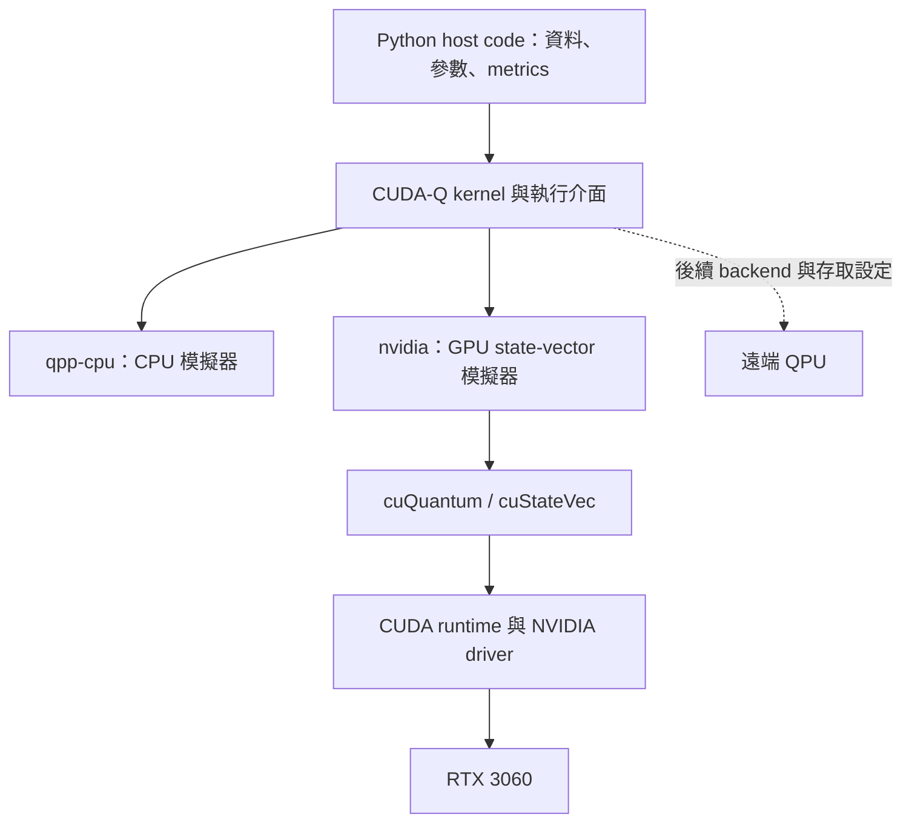

# Day 06｜CUDA-Q、CUDA、cuQuantum 有何不同？

Day 4 已經在 RTX 3060 上建立 Bell state，Day 5 也完成資料到量測輸出的 forward pipeline。今天進入第二階段，先把底層工具與環境整理清楚：**我們寫的是 CUDA-Q 程式，GPU 上執行的是量子模擬；CUDA 與 cuQuantum 分別提供不同層次的支援。**

今天留下可重跑的環境診斷與 Hello Quantum。之後遇到 import、driver、backend 或結果差異，就有明確的檢查入口。

## 1. 三個名字，各自解決什麼問題？

| 名稱 | 角色 | 本專案中的位置 |
|---|---|---|
| CUDA | NVIDIA 的平行運算平台與程式設計模型 | GPU 計算的軟體基礎；toolkit 提供開發工具，runtime／driver 協助執行 |
| cuQuantum | 加速量子計算模擬的函式庫集合 | 例如 cuStateVec 處理 state-vector simulation，cuTensorNet 處理 tensor-network 工作 |
| CUDA-Q | 量子與經典混合程式的開發平台 | 用 Python 寫 kernel、執行 sample／observe，並選擇 backend |

CUDA 的定位見 NVIDIA 官方入口 [D9]，cuQuantum 的模擬函式庫定位見 [D4]，CUDA-Q 的混合程式模型與 CPU／GPU target 見 [D1]。

本系列從 CUDA-Q 的介面開始學習，不必先直接寫 CUDA C++ 或 cuStateVec API。這也不表示 CUDA-Q 的每種 backend 都經過同一條 GPU 路徑。



圖中表示概念上的執行分工，不是動態 library 載入順序。本次 CPU 程序也載入了部分 GPU libraries，因此「載入了 libcustatevec」不能單獨證明電路跑在 GPU。

## 2. GPU 為什麼和 Quantum Computing 放在一起？

Day 2 已看到 `n` 個 Qubit 的 pure state vector 有 `2^n` 個 complex amplitudes。模擬器需要保存這些數值，並計算 gate transformation；GPU 可以協助這些經典數值運算。

只計算 state vector 本身，以每個 complex amplitude 16 bytes 為例：

```text
memory = 16 × 2^n bytes
28 qubits → 4 GiB
29 qubits → 8 GiB
```

這是記憶體估算，不是本機 qubit 上限實測，也未包含 workspace、暫存、其他程序或不同精度。RTX 3060 的 6 GiB 不能直接全部當成 state vector 容量。CPU／GPU scaling 留到 Day 27 再做完整 benchmark。

GPU 上成功模擬 Bell state，表示經典硬體完成了量子狀態演化的數值計算。它沒有把 GPU 變成 QPU，也沒有因此得到 quantum advantage。

## 3. 先區分四種版本資訊

這台筆電的輸出同時存在不同版本，應分層閱讀：

| 資訊 | 本次值 | 代表什麼 |
|---|---|---|
| NVIDIA driver | 570.211.01 | 主機 driver 版本 |
| `nvidia-smi` CUDA Version | 12.8 | driver 回報的 CUDA 支援版本，不是已安裝 toolkit 的清單 |
| `nvcc --version` | release 12.8，V12.8.93 | 目前 PATH 選到的 CUDA compiler／toolkit |
| venv `nvidia-cuda-runtime-cu12` | 12.9.79 | Python 環境內安裝的 runtime 發行套件版本 |

官方 driver 文件解釋 `nvidia-smi` 回報的是 driver 的 CUDA 支援資訊。[D7] CUDA 12.x 也有 minor-version compatibility 機制，但新功能與 PTX 等情況有額外限制；不能只因 major version 相同，就保證所有工作都能執行。[D8]

本次 12.8 系統工具鏈與 12.9 runtime 套件共存，Hello Quantum GPU 測試通過。這是本次程式的實測結果，不能延伸成所有 CUDA 12.9 功能均已驗證。

`pip` 套件版本、已載入的 `.so` 名稱與實際 driver 是不同證據。診斷報告分開保存它們，不用單一「CUDA version」欄位混在一起。

## 4. 沿用已驗證的獨立環境

今天不新增依賴，沿用 Day 4 鎖定的 CUDA 12 stack。已有 Day 5 `.venv` 時：

```bash
source .venv/bin/activate
python -m pip check
python -c "import sys; print(sys.executable)"
```

全新 Ubuntu checkout 可依固定版本建立：

```bash
python3.12 -m venv .venv
source .venv/bin/activate
python -m pip install -r requirements-day06.txt
```

[requirements-day06.txt](../../requirements-day06.txt) 引用已驗證的 [Day 4 lock](../../requirements-day04-lock.txt)，包括 `cuda-quantum-cu12==0.15.1` 與 `numpy==2.2.6`。若也要執行 Day 5 Notebook，使用 [Day 5 lock](../../requirements-day05-lock.txt)。

官方快速入門提供通用 `cudaq` 安裝入口，同時提醒不同 CUDA-Q binary distributions 可能衝突。[D1] 本專案已固定 CUDA 12 發行套件，重建時使用上述清單。這份安裝指令針對本系列 Ubuntu 環境，不作為所有作業系統的通用安裝方式。

`pip check` 驗證依賴關係，不能驗證 GPU 可見性；`import cudaq` 成功，也不能替代一次真正的 backend 執行。

## 5. Hello Quantum：最小可驗證程式

Day 4 的 Bell state 很適合當 smoke test，因為 amplitudes、量測支援集合與位元順序都能檢查。核心 kernel：

```python
import cudaq

@cudaq.kernel
def bell(measure: bool):
    q = cudaq.qvector(2)
    h(q[0])
    x.ctrl(q[0], q[1])
    if measure:
        mz(q[0])
        mz(q[1])

cudaq.set_target("qpp-cpu")
cudaq.set_random_seed(42)
counts = cudaq.sample(bell, True, shots_count=1000,
                     explicit_measurements=True)
print(counts)
```

這是官方 Bell 入門結構的延伸。[D1] 完整可執行版本位於 [hello_quantum.py](hello_quantum.py)：

```bash
python articles/day06/hello_quantum.py --backend qpp-cpu
python articles/day06/hello_quantum.py --backend nvidia
```

程式明確選擇 target，沒有 GPU 時不會靜默 fallback 再把結果標為 nvidia。五項檢查包括：

1. 實際 target 名稱符合要求。
2. counts 總數等於 shots。
3. Bell counts 只含 00／11。
4. 模擬器 state 與理想 Bell state 的 fidelity 在容差內等於 1。
5. 另外用只翻轉 q0 的電路確認明確量測順序得到 `10`。

這些條件比「畫面有印出 counts」更能驗證安裝結果。`get_state` 僅作 simulator 正確性核對；QPU 不能以相同方式直接讀出全部 amplitudes。若要求保存單次結果，可加 `--output /tmp/day06-hello.json`。

## 6. 一個指令產生完整環境報告

```bash
python articles/day06/check_environment.py
```

診斷程式預設要求 CPU 與 GPU 都通過，並保存到 [results/day06/environment.json](../../results/day06/environment.json)。若只想驗證 CPU：

```bash
python articles/day06/check_environment.py --backends qpp-cpu --output /tmp/day06-cpu.json
```

報告包括：

| 欄位 | 證據 |
|---|---|
| `python` | interpreter、prefix、base_prefix、是否 venv |
| `platform`／`os_release` | 作業系統與架構 |
| `packages` | 本次安裝的 Python distributions 與版本 |
| `tools` | nvidia-smi、GPU inventory、nvcc、pip check 的 stdout／stderr／exit code |
| `backends` | 各自獨立程序的 Hello Quantum 結果、檢查與原始輸出 |
| `probe_environment` | 此次 smoke test 使用的 OMP_NUM_THREADS |

每個 backend 在獨立子程序執行。即使 GPU initialization 失敗或程序結束時印出訊息，父程序仍能保存該次狀況。command 缺失、非零退出碼、timeout 與數值檢查失敗都保留；不只判讀「是否有 JSON」。

診斷的總 `passed` 定義為 **pip check 與所有指定 backend 通過**。主機工具另外各自標示狀態；例如 CPU-only 執行環境沒有 nvcc，不必因此判定 CPU kernel 失敗。預設每個命令最多 60 秒，可用 `--timeout` 調整。未指定 OpenMP 執行緒數時，小型 smoke test 預設使用 1 個。

## 7. 本次實測結果

主機為 Ubuntu 22.04.5 LTS、Python 3.12.7、RTX 3060 Laptop GPU，GPU 記憶體 6144 MiB、compute capability 8.6。以下均來自本日診斷輸出：

| 執行環境 | qpp-cpu | nvidia | 總 passed |
|---|---|---|---|
| 工具沙箱 | PASS | FAIL：看不到 CUDA 裝置 | false |
| 沙箱外主機 | PASS | PASS | true |

保留兩份報告：[主機結果](../../results/day06/environment.json)、[沙箱結果](../../results/day06/sandbox_environment.json)。同一個 Python 環境，因可存取的裝置不同，backend 結果也不同。

主機兩個 backend 的 Bell counts 都是 `00:493`、`11:507`，位元順序 probe 都是 `10:16`。Fidelity 約為 CPU `1.0`、GPU `0.999999966`，通過本例的 `1e-5` 絕對容差。CPU 與 GPU 同 counts 是本次觀察，不是跨版本的必要保證。

值得注意的是，CPU 與 GPU 程序都在 `/proc/self/maps` 中看到 `libcustatevec.so.1` 與其他 GPU libraries。這只說明 library 被載入；backend 設定與實際 kernel 執行才是本日驗證的重點。

## 8. GPU 結束訊息如何處理？

本次 GPU 子程序的 stderr 仍有 `cudaErrorCudartUnloading`，退出碼為 0，五項檢查全通過。診斷報告保留原始 stderr，而不把它刪掉或包裝成「沒有任何訊息」。

此現象與 Day 4–5 一致；本日尚未定位根因。可以確認的是這個兩 Qubit 測試已完成，不能只靠成功結果推定所有 shutdown 行為皆正常。先前的錯誤名稱來源與觀察見 [Day 4 環境紀錄](../day04/ENVIRONMENT.md)。

## 9. 後續遇到問題時的檢查順序

| 現象 | 優先檢查 |
|---|---|
| `ModuleNotFoundError: cudaq` | 目前 interpreter 是否為專案 `.venv/bin/python`，套件是否安裝在同一環境 |
| `pip check` 失敗 | 固定版本清單與目前 distributions 是否一致 |
| CPU 可以、GPU 不行 | 主機 GPU 可見性、driver、容器／沙箱的裝置存取與 GPU 子程序 stderr |
| nvcc 版本與 pip runtime 不同 | 分層記錄版本，查 compatibility 與實際 backend 測試 |
| counts 總數不符、出現 01／10 | 確認 kernel、量測順序與 noise 設定，檢查數值驗證結果 |
| 程序超時 | 保留 timeout 報告；檢查初始化、執行緒設定與負載，再調整時限 |

這個診斷只讀取環境並執行小型模擬，不會重裝 driver、修改 shell profile 或自動更換 backend。

## 10. 測試與本日交付

```bash
python -m unittest discover -s articles/day06 -p 'test_*.py' -v
```

四個診斷測試涵蓋 missing command、stderr／非零 exit code、timeout 的部分輸出，以及 target／payload／退出碼不一致時拒絕誤報成功。實際量子行為另外由 CPU／GPU smoke test 的五項檢查驗證。

本日完成 [Hello Quantum](hello_quantum.py)、[環境診斷](check_environment.py)、[診斷測試](test_environment.py)、固定依賴入口與兩種執行環境的 JSON 報告。這是環境驗證，不是訓練實驗或 CPU／GPU benchmark。

## 11. 本日來源與下一篇

- [D1] [NVIDIA CUDA-Q Quick Start](https://nvidia.github.io/cuda-quantum/latest/using/quick_start.html)：CUDA-Q 定位、安裝提醒、Bell 範例與 targets。
- [D4] [NVIDIA cuQuantum Documentation](https://docs.nvidia.com/cuda/cuquantum/latest/index.html)：量子模擬函式庫。
- [D7] [CUDA Toolkit, Driver, and Architecture Matrix](https://docs.nvidia.com/datacenter/tesla/drivers/cuda-toolkit-driver-and-architecture-matrix.html)：driver／toolkit 與 nvidia-smi 資訊。
- [D8] [CUDA Minor Version Compatibility](https://docs.nvidia.com/deploy/cuda-compatibility/minor-version-compatibility.html)：同一 major family 的相容機制與限制。
- [D9] [NVIDIA CUDA Zone](https://developer.nvidia.com/cuda-zone)：CUDA 平行運算平台與程式設計模型。

查閱日期：2026-09-06。文件會更新，實際安裝版本與執行結果分別由依賴清單及報告保存，見 [REFERENCES.md](../../REFERENCES.md)。

[Day 07](../day07/README.md) 將正式拆解 Quantum Kernel 的寫法：qubit allocation、gate 操作、參數與 control flow，把今天能跑的程式變成可理解、可修改的工程元件。
