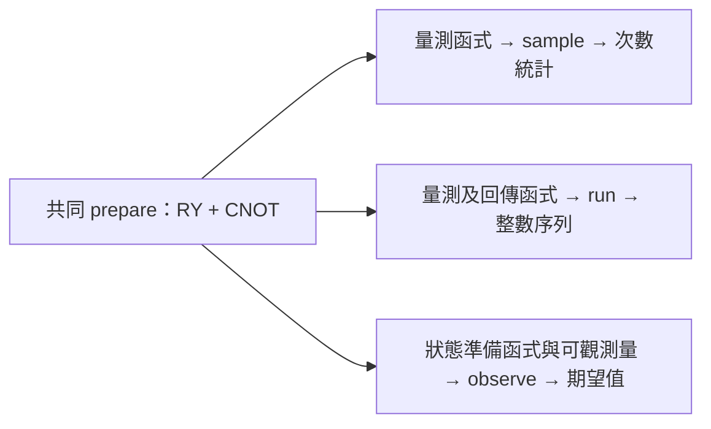

# Day 08｜`sample`、`run`、`observe`：同一電路的三種執行方式

[Day7](../day07/README.md) 拆解量子核心程式的寫法，透過參數、迴圈與分支建立可調整的電路，並釐清一般 Python 程式與量子操作的分工。Day8 接著探討電路執行後如何取得結果，依後續需要的資料形式，選擇合適的執行介面。

**同一份量子狀態準備，可以產生不同形式的輸出：各結果出現幾次、每次回傳什麼，以及指定量測的平均值。** 分清楚這些數值的意義，才能將電路輸出用於後續分析與量子機器學習（QML）模型。本章共用 RY 加 CNOT 的狀態準備，再依輸出需求調整外層函式：`sample` 回傳各位元字串出現的次數，適合觀察分布；`run` 回傳逐次執行的自訂一般數值，本例以整數記錄兩個量測位元；`observe` 則根據指定的 可觀測量（observable），取得對應的期望值。重點在於理解每個數字的意義：位元字串編成整數後，直接取平均並不等於量子位元 Z 的期望值，而 Z 基底的量測計數 也不能直接算出所有其他可觀測量。本章另外比較有限量測次數（shots）的抽樣估計與理想模擬器的精確期望值，區分抽樣波動與浮點誤差。三種介面共用狀態準備，但各自需要的量測、回傳格式與執行成本仍有差異。

[Day7](../day07/README.md) examined quantum kernel construction, using qubit allocation, parameters, loops, and branches to build configurable circuits while clarifying the host–kernel division. Day8 explores how to retrieve results after circuit execution and choose an execution interface based on the data needed for subsequent processing.

**A shared state preparation can produce different outputs: counts of outcomes, individual return values, or an average for a specified measurement.** Understanding these outputs makes them usable in analysis and quantum machine learning (QML) models. The chapter shares an RY-plus-CNOT state preparation and adapts the surrounding function to each output requirement. `sample` returns counts for each bitstring, making it useful for examining distributions. `run` returns a sequence of custom classical values; this example encodes two measured bits as an integer. `observe` takes a specified observable and returns its expectation value. The central task is to understand what each number represents: averaging integers that encode bitstrings does not directly yield a qubit's Z expectation, and Z-basis counts cannot directly determine every other observable. The chapter also compares finite-shot estimates with exact expectations from ideal simulators, separating sampling fluctuations from floating-point error. Shared state preparation still permits different measurement procedures, return formats, and execution costs.

---

量子核心程式（quantum kernel）是描述量子操作的函式，一般 Python 主控端（host）則安排執行與處理結果。API 是程式介面，也就是程式用來呼叫功能的入口。電路建立之後，接著要決定：**電路寫好後，應該用哪個 API 取得結果？**

狀態準備是從初始狀態出發，施加量子閘以建立所需量子狀態的過程。本章將這段操作放在共用函式，再由外層函式安排是否量測、如何回傳結果。這裡的「同一電路」指相同的量子態準備；三個 API 的回傳契約不同，因此不是把完全相同的函式任意塞給三個 API。

## 1. 先看每個介面回傳什麼

| API | 本日量子核心程式形式 | 回傳資料 | 常見用途 |
|---|---|---|---|
| `sample` | 準備 + 明確量測 | 位元字串 → 次數 | 看分布、相關性、後處理 |
| `run` | 準備 + 量測 + `return int` | 每次執行的回傳值序列 | 保留逐次結果、客製一般回傳值 |
| `observe` | 準備，無電路末端量測 | `ObserveResult`，由 `.expectation()` 取數值 | 以可觀測量定義模型輸出或損失函數所需數值 |

回傳契約是介面約定的輸出格式與意義。位元字串是由 0、1 排列的結果，例如 `00`；量測計數記錄各結果出現幾次。可觀測量（observable）指定量測所關心的量，期望值是依機率計算的平均值。損失函數將模型預測與答案的差距轉成數值。`ObserveResult` 是保存結果的物件，`.expectation()` 從中取得期望值。

`run` 要求函式明確回傳數值，不能只有操作而沒有回傳值。介面規則見官方執行教學 [D3]。本日明確指定量測次數；不要把各 API 的預設次數當成公平比較條件。

## 2. 共用一份狀態準備

RY 是以角度旋轉單一量子位元狀態的操作，受控 X 閘（CNOT）則在控制位元為 1 時翻轉目標位元。q0、q1 是兩個量子位元的編號。延續 Day 5–7 的組合：

```text
q0: ──RY(theta)──●──
                │
q1: ────────────X──

|ψ(theta)⟩ = cos(theta/2)|00⟩ + sin(theta/2)|11⟩
```

[kernels.py](kernels.py) 使用可被其他量子核心程式呼叫的準備函式：

```python
import cudaq

@cudaq.kernel
def prepare(q: cudaq.qview, theta: float):
    ry(theta, q[0])
    x.ctrl(q[0], q[1])
```

`theta: float` 指角度參數使用浮點數，也就是電腦以有限位數表示的小數。`cos` 與 `sin` 是餘弦、正弦函數，決定式中兩項的振幅；振幅絕對值平方才是量測機率。角度使用弧度，`π` 代表半圈。

外層配置 `qvector(2)`，再把量子位元的存取介面（`qview`，指向已配置的量子位元）傳給 `prepare`；準備函式操作既有量子位元，不另配置一套量子暫存器，也就是一組量子位元。量子核心程式組合與相關型別見 [D11]，此寫法已在本系列 CUDA-Q 0.15.1 的 CPU／GPU 驗證。



## 3. `sample`：得到分布的計數

```python
@cudaq.kernel
def sample_kernel(theta: float):
    q = cudaq.qvector(2)
    prepare(q, theta)
    mz(q[0])
    mz(q[1])

counts = cudaq.sample(sample_kernel, theta, shots_count=32,
                     explicit_measurements=True)
```

`mz` 在 Z 基底下量測，也就是區分 0 與 1。`shots_count` 指定次數，`explicit_measurements=True` 要求按明確寫出的量測順序組合結果。隨機種子（seed）是模擬抽樣的起始設定，方便在相同環境重做實驗。

本日按 q0、q1 順序量測，字串也按此順序解讀。對 theta=π/3，理想 `P(00)=0.75`、`P(11)=0.25`。本次隨機種子 42、32 次量測的 CPU 示範得到：

```text
00: 25
11: 7
```

量測計數不包含逐次執行的先後順序；若只拿到這張次數分布表，不能還原第幾次得到 11。

以 Z0 作為數值輸出，首位 0 記 +1、首位 1 記 −1：

```text
Z0 estimate = (n00 + n01 − n10 − n11) / N
            = (25 − 7) / 32 = 0.5625
```

`N` 是總量測次數，`n00` 是結果 `00` 出現的次數，其餘符號同理。Z0 指第一個量子位元的 Z 可觀測量。

這是 Day 5 的一般電腦上的結果處理，今天將它與另外兩個 API 的結果對照。

## 4. `run`：保留每次的一般回傳值

本例將兩個量測結果編成整數，規則為「第一位乘以 2，再加第二位」。這裡的位元值來自量測，並不是直接將量子位元當成普通數字。本日回傳 `2*q0 + q1`，使用整數保留兩個量測位元：

```python
@cudaq.kernel
def return_kernel(theta: float) -> int:
    q = cudaq.qvector(2)
    prepare(q, theta)
    first = mz(q[0])
    second = mz(q[1])
    value = 0
    if first:
        value += 2
    if second:
        value += 1
    return value

values = cudaq.run(return_kernel, theta, shots_count=32)
```

| 整數 | q0 q1 |
|---:|---|
| 0 | 00 |
| 1 | 01 |
| 2 | 10 |
| 3 | 11 |

本次示範的前幾個值為 `[3, 3, 0, 0, 0, 0, 3, 3, ...]`。完整序列保存於 `raw_results.json`，長度應等於量測次數。

`return` 將函式算出的數值交回呼叫端，`-> int` 表示回傳整數。`if first` 檢查第一個量測結果是否為真；`value += 2` 表示將目前數值加上 2。

在主控端用 `Counter(format(value, '02b') for value in values)` 可重新形成次數分布表；其中 `format(value, '02b')` 將整數轉成兩位元字串，`Counter` 統計各字串出現幾次，再計算 Z0。對本例，不能直接把整數序列的平均當成 Z0：序列是位元字串編碼，不是 ±1 可觀測量的值。

這裡 `if first`／`if second` 使用量測結果計算一般回傳值，沒有依量測結果再施加量子量子閘。它不是 Day 7 輸入布林值分支的同一用途，也不是完整的量測回饋示範。

## 5. `observe`：直接指定可觀測量

提供沒有電路末端量測的狀態準備的外層函式：

```python
@cudaq.kernel
def state_kernel(theta: float):
    q = cudaq.qvector(2)
    prepare(q, theta)

observable = cudaq.spin.z(0)
exact = cudaq.observe(state_kernel, observable, theta,
                      shots_count=-1).expectation()
estimated = cudaq.observe(state_kernel, observable, theta,
                          shots_count=32).expectation()
```

`cudaq.spin.z(0)` 指定第一個量子位元的 Z 可觀測量。狀態向量模擬器保存完整振幅，以一般電腦直接計算量子狀態；無雜訊表示本例未加入使運算偏離理想情況的干擾。

本日無雜訊狀態向量模擬器使用 `shots_count=-1` 取得無量測抽樣的期望值；正數量測次數則進行有限抽樣。[D5] QPU 是實際執行量子操作的量子處理器。這個精確模式不代表真實 QPU 能用零成本讀出精確期望值。

由 Day 5 的推導：

```text
⟨Z0⟩ = cos(theta)
theta=π/3 → 0.5
```

本次 CPU 示範中，精確約為 `0.5000000000000002`，有限次抽樣為 `0.5625`。浮點誤差來自有限位數的數值儲存與計算；抽樣誤差則來自只量測有限次，得到的比例未必剛好等於理論機率。

## 6. 為什麼 Z 基底 Counts 不能算所有可觀測量？

X 基底區分 `|+⟩` 與 `|−⟩`，這兩個狀態分別是 `(|0⟩ + |1⟩)/√2` 與 `(|0⟩ − |1⟩)/√2`。`X0 X1` 表示兩個位元 X 量測結果（各記為 +1 或 −1）的乘積，XX 是它的簡寫。改成這個可觀測量：

```python
xx = cudaq.spin.x(0) * cudaq.spin.x(1)
value = cudaq.observe(state_kernel, xx, theta,
                      shots_count=-1).expectation()
```

對本日準備態，直接代入矩陣可得 `⟨X0X1⟩ = sin(theta)`；theta=π/3 時約為 `0.8660254`。程式與測試會核對此值。

前面的 Z 基底量測計數描述的是 Z 量測分布，不能直接用同一個 ±1 加權公式取得 XX。Day 4 已示範在 X 基底前加 H 的方式；一般 `observe` 則讓可觀測量成為執行介面的輸入。

這不表示任何可觀測量都只需同一批量測次數。Pauli 項是由各位元的 X、Y、Z 或不改變狀態的 I 操作組合而成的可觀測量。若目標是多項的加權和，需要考慮哪些項可共用量測設定；這稱為量測分組，會影響總量測成本。本日有限次抽樣比較只使用單一 Pauli 可觀測量 Z0。

## 7. 執行示範與完整實驗

`.venv` 是專案獨立保存 Python 套件的虛擬環境。沿用既有環境，沒有新增依賴；全新環境的套件入口為 [requirements-day08.txt](../../requirements-day08.txt)。在專案根目錄執行：

```bash
source .venv/bin/activate

# theta=π/3、32 shots、seed 42，印出完整回傳結果。
OMP_NUM_THREADS=1 python articles/day08/experiment.py --demo

# 每個 backend 各 16 組設定。
OMP_NUM_THREADS=1 python articles/day08/experiment.py --backend qpp-cpu
OMP_NUM_THREADS=1 python articles/day08/experiment.py --backend nvidia
```

CPU 是一般電腦的中央處理器，GPU 是擅長平行運算的圖形處理器。執行後端（backend）指定使用的模擬器：`qpp-cpu` 使用 CPU，`nvidia` 使用 GPU。`OMP_NUM_THREADS=1` 將 OpenMP 平行工作的 CPU 執行緒數設為 1。

完整代碼位於 [experiment.py](experiment.py)。每個執行後端的掃描為：

| 欄位 | 設定 |
|---|---|
| 量子位元數／準備 | 2／RY(q0) + CNOT(q0,q1) |
| theta | 0、π/3、π/2、π |
| 每個有限次抽樣 API 呼叫的量測次數 | 32、256 |
| 隨機種子 | 42、43 |
| 主要可觀測量 | Z0 |
| 補充精確可觀測量 | X0X1 |
| 雜訊 | 無 |
| 組合數 | 4 × 2 × 2 = 16 |

每組會分別執行 sample、run、有限次抽樣 observe，以及 Z0／XX 的精確 observe。三個有限次抽樣呼叫各自有 N 次量測，不是把同一批 N 次量測重用三次。程式在每個抽樣 API 前重設同一隨機種子，方便追溯；這些數列不能視為相互獨立的重複實驗。

## 8. 結果保存與誤差判讀

CSV 是表格文字檔，JSON 以欄位名稱保存結構化資料。

各執行後端寫入 `results/day08/<backend>/`：

- `api_comparison.csv`：theta、量測次數、隨機種子、Z0 參考值與四種 Z0 輸出。
- `raw_results.json`：sample 量測計數、完整 run 序列、重新形成的次數分布表、XX、檢查結果與各呼叫時間。
- `summary.json`：環境、數值精度、設定與最大精確 Z0 誤差。

重跑會更新該執行後端目錄；可用 `--output-dir /tmp/day08-check` 另存。示範模式只印出結果，不寫入正式資料。

標準誤描述重複做同樣實驗時，估計值的典型波動尺度；`sqrt` 表示平方根。若各次量測彼此獨立且機率不變，對 Z0 的 ±1 樣本平均，理論標準誤為 `sqrt((1−cos²(theta))/N)`。theta=π/3、32 次量測時約 0.1531，本次估計值 0.5625 與參考值 0.5 的差異位於合理的抽樣尺度。

不要要求三種有限次抽樣 API 每次都給出相同數字；固定隨機種子的重現只在指定版本、執行後端與呼叫方式下檢查。也不要把精確 observe 比較接近解析值解讀成「模型比較準」：它使用的資訊與有限抽樣不同。

本日測試檢查精確值與解析式、結果確定的角度端點、資料長度／範圍，以及各 API 自己的固定隨機種子重跑。容差是檢查時允許的數值差距。有限抽樣只用寬鬆容差檢查是否有明顯錯誤，並未建立信賴區間（用抽樣方法描述未知真值可能範圍的統計區間），也未評估誤差隨次數增加而縮小的速度。

## 9. 測試與選擇方式

```bash
OMP_NUM_THREADS=1 python -m unittest discover -s articles/day08 -p 'test_*.py' -v
OMP_NUM_THREADS=1 DAY08_TARGET=nvidia python -m unittest discover -s articles/day08 -p 'test_*.py' -v
```

程式位於 [test_execution.py](test_execution.py)，實測摘要見 [結果紀錄](../../results/day08/README.md)。

需要分布時使用 sample；需要自訂逐次一般回傳值時使用 run；需要可觀測量的數值輸出時使用 observe。要在模擬器檢查狀態本身，才使用先前的 get_state。

編譯是將程式轉成可執行形式，初始化則是建立執行所需的資源。執行時間包含這些成本，且 run、sample 與精確 observe 的工作方式不同，本日不作速度排名。這個系列仍處於執行介面與正確性驗證，尚未進行模型訓練。

## 10. 本日來源與下一篇

- [D3] [NVIDIA Executing Kernels](https://nvidia.github.io/cuda-quantum/latest/using/examples/executing_kernels.html)：sample、run、observe 的回傳契約。
- [D5] [NVIDIA CUDA-Q Python API](https://nvidia.github.io/cuda-quantum/latest/api/languages/python_api.html)：shots_count、可觀測量與 expectation。
- [D11] [NVIDIA Quantum Kernels Specification](https://nvidia.github.io/cuda-quantum/latest/specification/cudaq/kernels.html)：量子核心程式組合與型別。

查閱日期：2026-09-06。實際執行使用 CUDA-Q 0.15.1；解析結果由本日程式交叉驗證，共用索引見 [REFERENCES.md](../../REFERENCES.md)。

[Day 09](../day09/README.md) 將把電路參數分成資料與可訓練權重，建立參數化量子電路，也就是含有可調整角度等參數的電路，為 Day 10 的反覆調整參數的流程做準備。

## 延伸研究

[N11] Archie Butterworth et al. “Efficient quantum state preparation on Quantinuum hardware.” arXiv:2609.08414v1 (2026)；預印本。[原始來源](https://arxiv.org/abs/2609.08414v1)；[完整書目](../../REFERENCES.md#n11)。

本章比較抽樣次數與期望值；此研究提供硬體量測設計的延伸案例。閱讀重點是量測方向與驗證資源，並非把模擬器的精確狀態當成硬體可直接讀出的資訊。
