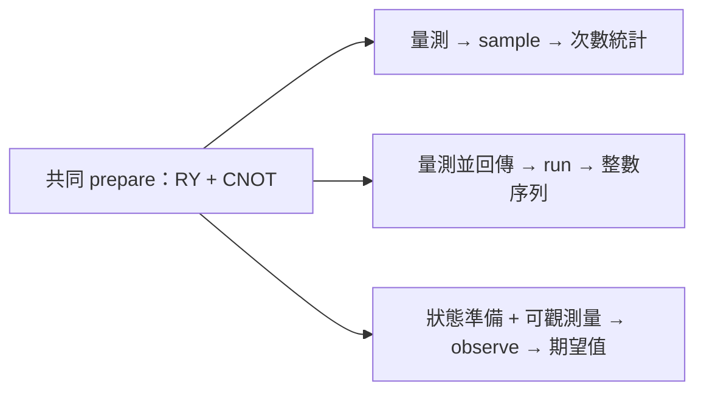

# Day 08｜`sample`、`run`、`observe`：同一電路的三種執行方式

電路寫好之後，下一步不是「再多加幾個閘」，而是決定：**結果要長什麼樣子？**

有時你想看各種答案各出現幾次；有時想留下每一次實驗的原始紀錄；有時只需要一個可放進模型或損失計算的數字。同一套量子狀態準備，可以對應這三種需求，但呼叫的介面不同，回傳的意義也不同。

今天沿用 Day 5–7 的兩位元電路，比較 CUDA-Q 的 `sample`、`run` 與 `observe`。重點不是背函式名稱，而是能回答：這個數字是怎麼來的？能不能拿去算另一個量？有限次量測帶來的誤差，和模擬器精算時的微小誤差，差在哪裡？

Day8 compares three ways to read out the same two-qubit state preparation. `sample` returns outcome counts, `run` returns a sequence of custom classical values, and `observe` returns the expectation of a chosen observable. Worked examples separate bitstring averages from Z expectations, contrast finite-shot estimates with exact simulator values, and record verified CPU and GPU results without claiming hardware advantage or model training.

---

## 1. 先用日常例子對齊三種需求

想像你重複擲一枚「有偏」的硬幣很多次。

| 你想知道什麼 | 日常對應 | 本日對應的介面 |
|---|---|---|
| 正反面各出現幾次 | 統計次數表 | `sample` |
| 每一次擲出的結果清單 | 留下逐次紀錄 | `run` |
| 「平均偏到哪一邊」的分數 | 依規則把結果換成 ±1 再平均 | `observe` |

三種做法都來自同一物理過程，但報表格式不同。若把「把每次結果編成整數再取平均」誤當成「Z 方向的期望值」，結論就會錯。本章會把這個陷阱寫清楚。

量子核心程式（quantum kernel）描述量子操作；一般 Python 主控端（host）負責呼叫與整理結果。API 是程式呼叫功能的入口。本章說的「同一電路」，是指**同一段狀態準備**；三個 API 對「是否量測、回傳什麼」的約定不同，因此不是把完全相同的函式隨便丟給三個入口。

## 2. 三種介面各回傳什麼？

| API | 本日怎麼寫電路 | 你拿到什麼 | 什麼時候用 |
|---|---|---|---|
| `sample` | 準備狀態後明確量測 | 各位元字串出現的次數 | 看分布、檢查相關性、自己做後處理 |
| `run` | 準備、量測，並 `return` 一個一般數值 | 每次執行的回傳值序列 | 需要逐次紀錄或自訂編碼 |
| `observe` | 只準備狀態，不在電路末端寫量測 | 指定可觀測量的期望值 | 模型輸出、損失函數需要單一數值時 |

**位元字串**是一串 0 與 1，例如 `00`、`11`。**量測計數**記錄各字串出現幾次。**可觀測量（observable）**指定你關心的物理量；**期望值**是依機率加權後的平均。`ObserveResult` 是保存結果的物件，用 `.expectation()` 取出那個平均。

`run` 必須明確回傳數值，不能只有操作、沒有回傳。介面規則見官方執行教學 [D3]。本日會明確指定量測次數；不要把各 API 的預設次數當成公平比較條件。

## 3. 共用同一段狀態準備

RY 依角度旋轉單一量子位元；受控 X 閘（CNOT）在控制位元為 1 時翻轉目標位元。延續前幾天的組合：

```text
q0: ──RY(theta)──●──
                │
q1: ────────────X──

|ψ(theta)⟩ = cos(theta/2)|00⟩ + sin(theta/2)|11⟩
```

讀法：角度 `theta`（弧度；π 是半圈）決定兩種結果的振幅；振幅絕對值平方才是量測機率。理想上只會看到 `00` 與 `11`，比例由 `theta` 決定。

[kernels.py](kernels.py) 把這段準備寫成可被其他量子核心程式呼叫的函式：

```python
import cudaq

@cudaq.kernel
def prepare(q: cudaq.qview, theta: float):
    ry(theta, q[0])
    x.ctrl(q[0], q[1])
```

`theta: float` 表示角度是浮點數（電腦用有限位數表示的小數）。外層配置兩個量子位元 `qvector(2)`，再把指向它們的存取介面 `qview` 傳給 `prepare`。準備函式操作既有位元，不另外再開一套暫存器。組合與型別見 [D11]；此寫法已在本系列 CUDA-Q 0.15.1 的 CPU／GPU 驗證。



## 4. `sample`：先看分布長什麼樣子

```python
@cudaq.kernel
def sample_kernel(theta: float):
    q = cudaq.qvector(2)
    prepare(q, theta)
    mz(q[0])
    mz(q[1])

counts = cudaq.sample(sample_kernel, theta, shots_count=32,
                     explicit_measurements=True)
```

`mz` 在區分 0、1 的 Z 基底下量測。`shots_count` 是重複準備並量測的次數。`explicit_measurements=True` 要求結果依你寫出的量測順序組合。隨機種子（seed）固定模擬抽樣的起始設定，方便在相同環境重做。

本日依 q0、q1 順序量測，也依此順序讀字串。對 `theta = π/3`，理想機率是 `P(00) = 0.75`、`P(11) = 0.25`。種子 42、32 次量測的 CPU 示範得到：

```text
00: 25
11: 7
```

這張表只告訴你各結果出現幾次，**不保存第幾次先出現 11**。若任務需要時間順序，這份輸出不夠。

若要把分布換成「第一個位元的 Z 分數」，規則是：首位為 0 記 +1，首位為 1 記 −1，再平均：

```text
Z0 estimate = (n00 + n01 − n10 − n11) / N
            = (25 − 7) / 32 = 0.5625
```

`N` 是總次數；`n00` 是 `00` 的次數，其餘同理。這是 Day 5 在一般電腦上做過的後處理；今天會把它與另外兩個 API 對照。

## 5. `run`：留下每一次的自訂數值

有時你不只想看次數表，還想留下每一次實驗回傳的數字。本例把兩個量測位元編成整數：第一位貢獻 2，第二位貢獻 1，也就是 `2*q0 + q1`。這裡的 0、1 來自量測，不是把量子位元直接當成普通整數變數。

```python
@cudaq.kernel
def return_kernel(theta: float) -> int:
    q = cudaq.qvector(2)
    prepare(q, theta)
    first = mz(q[0])
    second = mz(q[1])
    value = 0
    if first:
        value += 2
    if second:
        value += 1
    return value

values = cudaq.run(return_kernel, theta, shots_count=32)
```

| 整數 | 對應的 q0 q1 |
|---:|---|
| 0 | 00 |
| 1 | 01 |
| 2 | 10 |
| 3 | 11 |

本次示範的前幾個值為 `[3, 3, 0, 0, 0, 0, 3, 3, ...]`。完整序列在 `raw_results.json`，長度應等於量測次數。

`-> int` 表示回傳整數；`if first` 檢查第一個量測是否為真。在主控端可用 `Counter(format(value, '02b') for value in values)` 把整數序列重新統計成次數表，再算 Z0。

**常見誤解：**直接對整數序列取平均，並不是 Z0。整數 0、1、2、3 是位元字串的編碼；Z0 需要的是 ±1 規則。編碼方式一換，平均的意義就變了。

此處的 `if` 只用量測結果組裝一般回傳值，沒有依量測結果再施加量子閘。它與 Day 7「由輸入布林值決定要不要執行某段電路」用途不同，也不是完整的量測回饋控制示範。

## 6. `observe`：直接問「這個量的平均是多少？」

若下游只需要一個分數，可以指定可觀測量，讓介面回傳期望值：

```python
@cudaq.kernel
def state_kernel(theta: float):
    q = cudaq.qvector(2)
    prepare(q, theta)

observable = cudaq.spin.z(0)
exact = cudaq.observe(state_kernel, observable, theta,
                      shots_count=-1).expectation()
estimated = cudaq.observe(state_kernel, observable, theta,
                          shots_count=32).expectation()
```

`cudaq.spin.z(0)` 指定第一個量子位元的 Z。狀態向量模擬器在一般電腦上保存完整振幅；本例未加入雜訊。

`shots_count=-1` 在無雜訊狀態向量模擬器上，取得**不做量測抽樣**的精算期望值；正整數則做有限次抽樣。[D5] 這不表示真實量子處理器（QPU）能零成本讀出精確期望值。

由 Day 5 的推導：

```text
⟨Z0⟩ = cos(theta)
theta = π/3 → 0.5
```

本次 CPU 示範中，精算約為 `0.5000000000000002`，32 次抽樣為 `0.5625`。前者多半來自浮點數的有限位數；後者來自只量測有限次，比例未必剛好等於理論機率。兩者都叫「誤差」，成因不同，後續處理方式也不同。

## 7. 為什麼 Z 基底的次數表，算不出所有可觀測量？

換一個問題：兩個位元在 X 方向上的乘積 `X0 X1`（簡寫 XX）。X 基底區分 `|+⟩` 與 `|−⟩`，也就是 `(|0⟩ ± |1⟩)/√2`。

```python
xx = cudaq.spin.x(0) * cudaq.spin.x(1)
value = cudaq.observe(state_kernel, xx, theta,
                      shots_count=-1).expectation()
```

對本日的準備態，`⟨X0X1⟩ = sin(theta)`；`theta = π/3` 時約為 `0.8660254`。程式與測試會核對此值。

前面 `sample` 得到的是 **Z 方向**的次數表。你不能把同一套「首位 0 記 +1、首位 1 記 −1」的公式，直接套用到 XX。換可觀測量，通常要換量測設定。Day 4 曾示範在 X 量測前加 H；`observe` 則把可觀測量當成執行介面的輸入。

這也不表示「任何可觀測量都只要同一批量測次數」。若目標是多個 Pauli 項（由各量子位元的 X、Y、Z 或 I 組合）的加權和，還要考慮哪些項能共用量測設定，也就是量測分組；它會影響總成本。本日有限次抽樣比較只使用單一項 Z0。

## 8. 怎麼重跑示範與完整實驗？

`.venv` 是專案獨立的 Python 環境。沿用既有環境即可；全新安裝見 [requirements-day08.txt](../../requirements-day08.txt)。在專案根目錄：

```bash
source .venv/bin/activate

# theta=π/3、32 shots、seed 42，印出完整回傳結果。
OMP_NUM_THREADS=1 python articles/day08/experiment.py --demo

# 每個 backend 各 16 組設定。
OMP_NUM_THREADS=1 python articles/day08/experiment.py --backend qpp-cpu
OMP_NUM_THREADS=1 python articles/day08/experiment.py --backend nvidia
```

`qpp-cpu` 用 CPU 模擬，`nvidia` 用 GPU 模擬。`OMP_NUM_THREADS=1` 把 OpenMP 的 CPU 執行緒數固定為 1，減少平行度造成的時間波動。

完整代碼在 [experiment.py](experiment.py)。每個後端掃描：

| 欄位 | 設定 |
|---|---|
| 量子位元數／準備 | 2／RY(q0) + CNOT(q0,q1) |
| theta | 0、π/3、π/2、π |
| 每個有限次抽樣呼叫的量測次數 | 32、256 |
| 隨機種子 | 42、43 |
| 主要可觀測量 | Z0 |
| 補充精算可觀測量 | X0X1 |
| 雜訊 | 無 |
| 組合數 | 4 × 2 × 2 = 16 |

每組會分別跑 sample、run、有限次 `observe`，以及 Z0／XX 的精算 `observe`。三個有限次抽樣呼叫**各自**使用 N 次量測，不是同一批 N 次結果的三種顯示。程式在每次抽樣 API 前重設同一種子，方便追溯；這些數列不能當成彼此獨立的重複實驗。

## 9. 結果存在哪裡？誤差怎麼讀？

CSV 是表格文字檔；JSON 用欄位名稱保存結構化資料。各後端寫入 `results/day08/<backend>/`：

- `api_comparison.csv`：theta、量測次數、種子、Z0 參考值與四種 Z0 輸出。
- `raw_results.json`：sample 計數、完整 run 序列、重建的次數表、XX、檢查結果與各呼叫時間。
- `summary.json`：環境、數值精度、設定與最大精算 Z0 誤差。

重跑會更新該後端目錄；可用 `--output-dir /tmp/day08-check` 另存。示範模式只印結果，不寫入正式資料。

**標準誤**描述「同樣實驗再做很多次時，估計值典型會晃多大」；`sqrt` 是平方根。若各次量測彼此獨立且機率不變，Z0 的 ±1 樣本平均，理論標準誤約為 `sqrt((1 − cos²(theta))/N)`。`theta = π/3`、32 次時約 0.1531；本次估計 0.5625 與參考值 0.5 的差距，落在合理的抽樣尺度內。

不要要求三種有限次抽樣 API 每次數字都一樣；固定種子的重現，只在指定版本、後端與呼叫方式下檢查。也不要把「精算 observe 很接近公式」說成「這個模型比較準」：它用的資訊與有限抽樣不同。

本日測試檢查：精算值與解析式、結果確定的角度端點、資料長度與範圍，以及各 API 自己的固定種子重跑。容差是允許的數值差距。有限抽樣只用較寬容差抓明顯錯誤，**沒有**建立信賴區間，也**沒有**評估誤差隨次數增加而縮小的速度。

## 10. 測試指令與怎麼選介面

```bash
OMP_NUM_THREADS=1 python -m unittest discover -s articles/day08 -p 'test_*.py' -v
OMP_NUM_THREADS=1 DAY08_TARGET=nvidia python -m unittest discover -s articles/day08 -p 'test_*.py' -v
```

測試程式在 [test_execution.py](test_execution.py)；實測摘要見 [結果紀錄](../../results/day08/README.md)。

選擇很直接：

- 需要分布 → `sample`
- 需要自訂逐次回傳 → `run`
- 需要可觀測量的數值 → `observe`
- 要在模擬器檢查完整狀態本身 → 才用先前的 `get_state`

執行時間包含編譯與初始化等成本；run、sample 與精算 observe 的工作內容不同，本日**不做速度排名**。這個系列仍在確認執行介面與正確性，尚未進入模型訓練。

本日核對三種讀出契約、解析式與有限次抽樣波動。它不是硬體效能報告，也不是已訓練模型的成效證明。

## 11. 本日來源與下一篇

- [D3] [NVIDIA Executing Kernels](https://nvidia.github.io/cuda-quantum/latest/using/examples/executing_kernels.html)：sample、run、observe 的回傳契約。
- [D5] [NVIDIA CUDA-Q Python API](https://nvidia.github.io/cuda-quantum/latest/api/languages/python_api.html)：shots_count、可觀測量與 expectation。
- [D11] [NVIDIA Quantum Kernels Specification](https://nvidia.github.io/cuda-quantum/latest/specification/cudaq/kernels.html)：量子核心程式組合與型別。

查閱日期：2026-09-06。實際執行使用 CUDA-Q 0.15.1；解析結果由本日程式交叉驗證，共用索引見 [REFERENCES.md](../../REFERENCES.md)。

[Day 09](../day09/README.md) 會把電路參數分成「這筆資料決定的角度」與「之後可訓練的權重」，建立參數化量子電路，為 Day 10 的反覆調整參數做準備。

## 延伸研究

[N11] Archie Butterworth et al. “Efficient quantum state preparation on Quantinuum hardware.” arXiv:2609.08414v1 (2026)；預印本。[原始來源](https://arxiv.org/abs/2609.08414v1)；[完整書目](../../REFERENCES.md#n11)。

本章比較抽樣次數與期望值；此研究提供硬體量測設計的延伸案例。閱讀重點是量測方向與驗證資源，並非把模擬器的精確狀態當成硬體可直接讀出的資訊。
