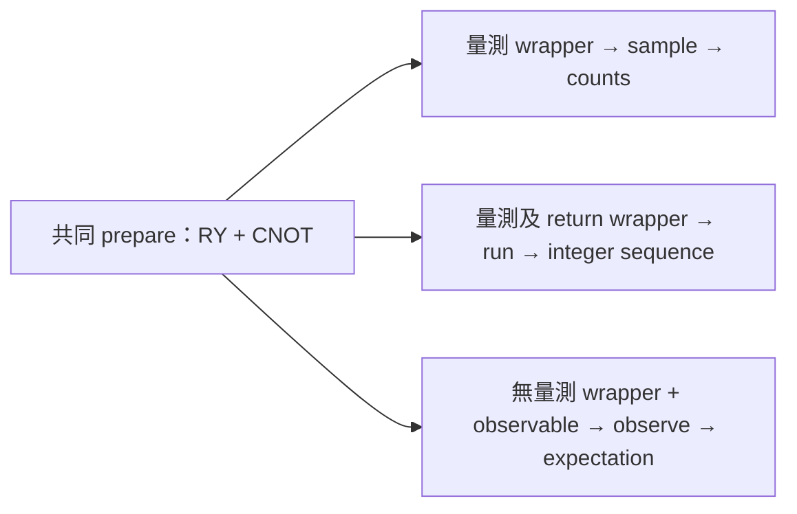

# Day 08｜`sample`、`run`、`observe`：同一電路的三種執行方式

Day 7 學會用 allocation、參數與 control flow 寫 kernel。今天解決另一個問題：**電路寫好後，應該用哪個 API 取得結果？**

我們共用一份狀態準備，再依 readout 的需求接上不同 wrapper。這裡的「同一電路」指相同的量子態準備；三個 API 的回傳契約不同，因此不是把完全相同的函式任意塞給三個 API。

## 1. 先看輸出契約

| API | 本日 kernel 形式 | 回傳資料 | 常見用途 |
|---|---|---|---|
| `sample` | 準備 + 明確量測 | bitstring → count | 看分布、相關性、後處理 |
| `run` | 準備 + 量測 + `return int` | 每次執行的回傳值序列 | 保留逐次結果、客製 classical 回傳值 |
| `observe` | 準備，無 terminal measurement | `ObserveResult`，由 `.expectation()` 取數值 | 以 observable 定義模型輸出或 loss 所需數值 |

上述 API 角色與 `run` 的非 void return 要求見官方執行教學 [D3]。本日明確指定 shots；不要把各 API 的預設次數當成公平比較條件。

## 2. 共用一份 State Preparation

延續 Day 5–7 的 RY + controlled-X：

```text
q0: ──RY(theta)──●──
                │
q1: ────────────X──

|ψ(theta)⟩ = cos(theta/2)|00⟩ + sin(theta/2)|11⟩
```

[kernels.py](kernels.py) 使用可被其他 kernel 呼叫的準備函式：

```python
import cudaq

@cudaq.kernel
def prepare(q: cudaq.qview, theta: float):
    ry(theta, q[0])
    x.ctrl(q[0], q[1])
```

外層配置 `qvector(2)`，再把 qubits 的 view 傳給 `prepare`；準備函式操作既有 qubits，不另配置一套 register。kernel composition 與相關型別見 [D11]，此寫法已在本系列 CUDA-Q 0.15.1 的 CPU／GPU 驗證。



## 3. `sample`：得到分布的計數

```python
@cudaq.kernel
def sample_kernel(theta: float):
    q = cudaq.qvector(2)
    prepare(q, theta)
    mz(q[0])
    mz(q[1])

counts = cudaq.sample(sample_kernel, theta, shots_count=32,
                     explicit_measurements=True)
```

本日按 q0、q1 順序量測，字串也按此順序解讀。對 theta=π/3，理想 `P(00)=0.75`、`P(11)=0.25`。本次 seed 42、32 shots 的 CPU 示範得到：

```text
00: 25
11: 7
```

counts 不包含逐次執行的先後順序；若只拿到這張 histogram，不能還原第幾次得到 11。

以 Z0 作為數值輸出，首位 0 記 +1、首位 1 記 −1：

```text
Z0 estimate = (n00 + n01 − n10 − n11) / N
            = (25 − 7) / 32 = 0.5625
```

這是 Day 5 的 classical post-processing，今天將它與另外兩個 API 的結果對照。

## 4. `run`：保留每次的 Classical Return Value

本日回傳 `2*q0 + q1`，使用整數保留兩個量測位元：

```python
@cudaq.kernel
def return_kernel(theta: float) -> int:
    q = cudaq.qvector(2)
    prepare(q, theta)
    first = mz(q[0])
    second = mz(q[1])
    value = 0
    if first:
        value += 2
    if second:
        value += 1
    return value

values = cudaq.run(return_kernel, theta, shots_count=32)
```

| Integer | q0 q1 |
|---:|---|
| 0 | 00 |
| 1 | 01 |
| 2 | 10 |
| 3 | 11 |

本次示範的前幾個值為 `[3, 3, 0, 0, 0, 0, 3, 3, ...]`。完整序列保存於 `raw_results.json`，長度應等於 shots。

在 host 用 `Counter(format(value, '02b') for value in values)` 可重新形成 histogram，再計算 Z0。對本例，不能直接把整數序列的平均當成 Z0：序列是 bitstring encoding，不是 ±1 observable 的值。

這裡 `if first`／`if second` 使用量測結果計算 classical return，沒有依量測結果再施加量子 gate。它不是 Day 7 輸入 bool 分支的同一用途，也不是完整的 quantum feedback 示範。

## 5. `observe`：直接指定 Observable

提供沒有 terminal measurement 的 preparation wrapper：

```python
@cudaq.kernel
def state_kernel(theta: float):
    q = cudaq.qvector(2)
    prepare(q, theta)

observable = cudaq.spin.z(0)
exact = cudaq.observe(state_kernel, observable, theta,
                      shots_count=-1).expectation()
estimated = cudaq.observe(state_kernel, observable, theta,
                          shots_count=32).expectation()
```

本日 noiseless state-vector simulators 使用 `shots_count=-1` 取得無 shot sampling 的期望值；正數 shots 則進行有限抽樣。[D5] 這個 exact 模式不代表真實 QPU 能用零成本讀出精確期望值。

由 Day 5 的推導：

```text
⟨Z0⟩ = cos(theta)
theta=π/3 → 0.5
```

本次 CPU 示範中，exact 約為 `0.5000000000000002`，finite-shot 為 `0.5625`。微小浮點誤差與 finite-shot 誤差要分開看。

## 6. 為什麼 Z-basis Counts 不能算所有 Observable？

改成 `X0 X1`：

```python
xx = cudaq.spin.x(0) * cudaq.spin.x(1)
value = cudaq.observe(state_kernel, xx, theta,
                      shots_count=-1).expectation()
```

對本日準備態，直接代入矩陣可得 `⟨X0X1⟩ = sin(theta)`；theta=π/3 時約為 `0.8660254`。程式與測試會核對此值。

前面的 Z-basis counts 描述的是 Z 量測分布，不能直接用同一個 ±1 加權公式取得 XX。Day 4 已示範在 X 基底前加 H 的方式；一般 `observe` 則讓 observable 成為執行介面的輸入。

這不表示任何 observable 都只需同一批 shots。若改成多個 Pauli terms，measurement grouping 與量測成本需要另外分析。本日 finite-shot 比較只使用單一 Pauli observable Z0。

## 7. 執行示範與完整實驗

沿用 `.venv`，沒有新增依賴；全新環境的套件入口為 [requirements-day08.txt](../../requirements-day08.txt)。在 repository 根目錄執行：

```bash
source .venv/bin/activate

# theta=π/3、32 shots、seed 42，印出完整回傳結果。
OMP_NUM_THREADS=1 python articles/day08/experiment.py --demo

# 每個 backend 各 16 組設定。
OMP_NUM_THREADS=1 python articles/day08/experiment.py --backend qpp-cpu
OMP_NUM_THREADS=1 python articles/day08/experiment.py --backend nvidia
```

完整代碼位於 [experiment.py](experiment.py)。每個 backend 的掃描為：

| 欄位 | 設定 |
|---|---|
| Qubits／準備 | 2／RY(q0) + CNOT(q0,q1) |
| theta | 0、π/3、π/2、π |
| 每個 finite-shot API 呼叫的 shots | 32、256 |
| seed | 42、43 |
| 主要 observable | Z0 |
| 補充 exact observable | X0X1 |
| noise | 無 |
| 組合數 | 4 × 2 × 2 = 16 |

每組會分別執行 sample、run、finite-shot observe，以及 Z0／XX 的 exact observe。三個 finite-shot 呼叫各自有 N shots，不是把同一批 N 次量測重用三次。程式在每個抽樣 API 前重設同一 seed，方便追溯；這些數列不能視為相互獨立的重複實驗。

## 8. 結果保存與誤差判讀

各 backend 寫入 `results/day08/<backend>/`：

- `api_comparison.csv`：theta、shots、seed、Z0 reference 與四種 Z0 輸出。
- `raw_results.json`：sample counts、完整 run 序列、重新形成的 histogram、XX、checks 與各呼叫時間。
- `summary.json`：環境、precision、設定與最大 exact Z0 誤差。

重跑會更新該 backend 目錄；可用 `--output-dir /tmp/day08-check` 另存。示範模式只印出結果，不寫入正式資料。

對 Z0 的 ±1 樣本平均，理論標準誤為 `sqrt((1−cos²(theta))/N)`。theta=π/3、32 shots 時約 0.1531，本次估計值 0.5625 與 reference 0.5 的差異位於合理的抽樣尺度。

不要要求三種 finite-shot API 每次都給出相同數字；固定 seed 的重現只在指定版本、backend 與呼叫方式下檢查。也不要把 exact observe 比較接近解析值解讀成「模型比較準」：它使用的資訊與有限抽樣不同。

本日測試檢查 exact 值與解析式、deterministic endpoints、資料長度／範圍，以及各 API 自己的固定 seed 重跑。有限抽樣僅用寬鬆容差做基本檢查，沒有用幾筆資料宣稱嚴格的信賴區間或收斂速度。

## 9. 測試與選擇方式

```bash
OMP_NUM_THREADS=1 python -m unittest discover -s articles/day08 -p 'test_*.py' -v
OMP_NUM_THREADS=1 DAY08_TARGET=nvidia python -m unittest discover -s articles/day08 -p 'test_*.py' -v
```

程式位於 [test_execution.py](test_execution.py)，實測摘要見 [結果紀錄](../../results/day08/README.md)。

需要分布時使用 sample；需要自訂逐次 classical return 時使用 run；需要 observable 的數值輸出時使用 observe。要在 simulator 檢查 state 本身，才使用先前的 get_state。

執行時間包含編譯與初始化，且 run、sample 與 exact observe 的工作方式不同，本日不作速度排名。這個系列仍處於執行介面與 correctness 驗證，尚未進行模型訓練。

## 10. 本日來源與下一篇

- [D3] [NVIDIA Executing Kernels](https://nvidia.github.io/cuda-quantum/latest/using/examples/executing_kernels.html)：sample、run、observe 的回傳契約。
- [D5] [NVIDIA CUDA-Q Python API](https://nvidia.github.io/cuda-quantum/latest/api/languages/python_api.html)：shots_count、observable 與 expectation。
- [D11] [NVIDIA Quantum Kernels Specification](https://nvidia.github.io/cuda-quantum/latest/specification/cudaq/kernels.html)：kernel composition 與型別。

查閱日期：2026-09-06。實際執行使用 CUDA-Q 0.15.1；解析結果由本日程式交叉驗證，共用索引見 [REFERENCES.md](../../REFERENCES.md)。

[Day 09](../day09/README.md) 將把電路參數分成資料與可訓練 weights，建立 Parameterized Quantum Circuit，為 Day 10 的 optimization loop 做準備。
