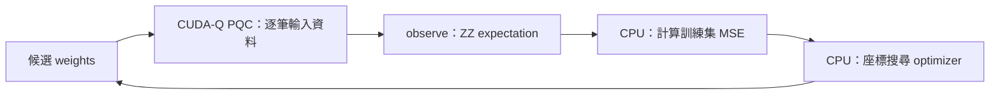

# Day 10｜第一個 CUDA-Q Optimization Loop

## 本章摘要｜初學者學習筆記

### 中文

[Day9](../day09/README.md) 將輸入資料與可訓練權重分開，建立參數化量子電路，並觀察改動權重如何影響輸出。Day10 接著加入損失函數與最佳化器，讓權重根據預測誤差更新，形成第一個完整的訓練迴圈。

這一章目標在於理解 **「量子電路如何從產生輸出，走到依任務目標調整參數」**，釐清量子與經典計算在訓練中的分工。本章沿用 Day9 的兩量子位元、四個旋轉權重與 `Z0Z1` 期望值讀出，以已知函數產生小型回歸資料，方便核對訓練流程。量子模擬器負責逐筆計算預測，一般 Python 程式則用 MSE（平均平方誤差）衡量預測與目標的差距，再由座標搜尋最佳化器依序嘗試增加或減少單一權重，只有誤差降低時才接受更新。這個方法不需要計算梯度，但每次比較候選權重都必須重新評估電路，因此訓練成本也要記錄。重點除了觀察 loss 是否下降，還包括保留未參與更新的 holdout（保留資料）作額外核對，以及分清楚停止原因、評估次數與訓練效果。本章使用理想模擬器的精確期望值訓練，最終另做有限 shots 抽樣，兩者用途不同。讀完本章，應能說明「預測 → 計算誤差 → 比較候選權重 → 更新」的流程，理解 `observe` 負責取得輸出、optimizer 負責選擇參數，以及小型合成任務的誤差下降仍不足以證明實務泛化能力或量子優勢。

### English

[Day9](../day09/README.md) separated input data from trainable weights, built a parameterized quantum circuit, and examined how weight changes affect outputs. Day10 adds a loss function and an optimizer so that prediction errors guide weight updates, forming the first complete training loop.

This chapter aims to explain **how a quantum circuit progresses from producing outputs to adjusting parameters toward a task objective**, clarifying the division between quantum and classical computation during training. The implementation reuses Day9's two-qubit circuit, four rotation weights, and `Z0Z1` expectation readout. A known function generates a small regression dataset, making the training workflow easier to verify. The quantum simulator evaluates predictions for individual inputs, while ordinary Python code calculates mean squared error (MSE). A coordinate-search optimizer then tries increasing or decreasing one weight at a time, accepting an update only when the error decreases. No gradients are required, but each candidate comparison requires further circuit evaluations, so training cost must also be recorded. Beyond tracking loss reduction, the chapter preserves holdout inputs that do not participate in updates and distinguishes stopping reasons, evaluation counts, and training outcomes. Training uses exact expectations from an ideal simulator; finite-shot sampling is performed separately at the end. The learning goal is to explain the prediction–loss–candidate comparison–update cycle, distinguish the output-evaluation role of `observe` from the parameter-selection role of the optimizer, and recognize that lower error on a small synthetic task does not establish practical generalization or quantum advantage.

---

Day 9 的 weights 由人指定；今天讓 classical optimizer 根據 loss 更新它們。沿用兩個 qubit、一層四個 RY weights 與 ZZ readout，不改動 [Day 9 的模型](../day09/pqc.py)。完整可執行程式：[train.py](train.py)。

## 1. 今天學什麼？



`observe` 的 expectation 可以成為 classical objective 的組成部分；NVIDIA 的 algorithmic primitives 文件也描述這個最佳化工作流程。[D12] 本文使用自行實作的座標搜尋，使接受候選參數的條件與評估成本都可見，沒有呼叫 `cudaq.optimizers`。CPU backend 與 NVIDIA GPU backend 都是量子模擬器。

## 2. 小型回歸任務與可達到的答案

固定兩個 features，標籤由解析函數產生：

```python
y = np.cos(np.pi * features[:, 1] + 0.6)
```

訓練資料為 `x0 ∈ {-0.6,0,0.6}` 與 `x1 ∈ {-0.5,0,0.5}` 的九個組合。另保留四筆未參與 optimizer 的輸入：`[-0.8,-0.3]`、`[-0.2,0.7]`、`[0.3,-0.7]`、`[0.8,0.2]`。`dataset()` 固定這些值，不從網路下載資料。

本題刻意只讓標籤依賴 x1。由 Day 9 的 CNOT 與 ZZ 解析式可知，`weights=[0,0.6,0,0]` 能表示此目標；測試也逐筆核對。這是檢查訓練流程是否能降低誤差的合成問題，不代表真實資料集成效。optimizer 不會取得這個已知答案；它從 seed 42 或 43 的小角度隨機 weights 出發。

## 3. Loss 在 Host 計算

定義平均平方誤差：

```text
L(w) = (1/N) Σ_i (f(x_i,w) − y_i)²
f(x,w) = ⟨Z0 Z1⟩
```

程式中的核心如下：

```python
def objective(weights):
    predictions = [predict(x, weights, 1) for x in train_features]
    return mse(predictions, train_labels)
```

每次 objective 包含九次 exact `observe`；Python／NumPy 計算 loss，量子 simulator 計算 forward。不要把 `observe` 本身當成 optimizer，也不要把這個實數回歸值當分類機率。

## 4. 不需要梯度的座標搜尋

每一輪依序處理 w0 到 w3。對當前參數產生 `w[j]−step` 與 `w[j]+step` 兩個候選，選擇 loss 較小者；只有嚴格降低 loss 才接受。下一個座標使用已接受的 weights。

```python
candidate = weights.copy()
candidate[j] += direction * step
candidate_loss = objective(candidate)
# 每個座標比較正負兩個候選，再決定是否更新。
```

初始 step=0.4 radians；整輪沒有任何更新才把 step 減半。step 小於 `1e-4` 或達到 40 輪即停止。這是教學用的離散搜尋，不保證找到全域最佳解。`max_sweeps` 代表用完預算，不能解讀為已收斂。

四個參數每輪需要八次 objective，因此跑完 S 輪後：

```text
objective evaluations = 1 + 8S
training observe calls = 9 × (1 + 8S)
```

第一項是初始 loss。最終資料核對、holdout 與抽樣另計，不包含在 `training_observe_calls`。`history.json` 的第 0 筆是初始狀態，之後每筆保存一輪後的 weights、loss、該輪使用的 step 與累積評估次數。

## 5. 獨立環境與執行

沿用 `.venv`，沒有新增依賴；[requirements-day10.txt](../../requirements-day10.txt) 延續固定版本鏈。從專案根目錄執行：

```bash
source .venv/bin/activate
OMP_NUM_THREADS=1 python articles/day10/train.py
OMP_NUM_THREADS=1 python articles/day10/train.py --seed 43
OMP_NUM_THREADS=1 python articles/day10/train.py --backend nvidia
OMP_NUM_THREADS=1 python articles/day10/train.py --backend nvidia --seed 43
```

預設寫入 `results/day10/<backend>/seed<seed>/`，重跑會更新該目錄。可用 `--output-dir /tmp/day10-check` 另存；`--sweeps 3` 可做短流程示範。小型電路設定 `OMP_NUM_THREADS=1` 是為了控制執行緒開銷，不是 GPU 加速效果的證據。

## 6. 怎麼讀結果？

- `summary.json`：環境版本、seed、初始／最終 weights、停止原因、評估成本與 train／holdout MSE。
- `history.json`、`training_curve.csv`：每輪訓練曲線與權重，可直接載入試算表或 Python。
- `predictions.json`：所有輸入、標籤、初始／最終預測、NumPy reference 與最終 1,000 shots counts。

常數 baseline 使用**訓練集標籤平均值**，同時評估 train 和 holdout。holdout 不參與 loss、step 選擇或停止條件；兩個 seeds 都保留，不挑一個來代表整體表現。四筆 holdout 只提供這個示範的額外核對，不能估計實務泛化能力。

最終 predictions 與 Day 9 的 NumPy 矩陣計算比較，檢查 CUDA-Q forward 的數值正確性；它不是另一個學習模型的效能對照。實際數字與完整紀錄見 [Day 10 結果](../../results/day10/README.md)。

## 7. Exact 訓練不等於 Shot-based 訓練

訓練沿用 `shots_count=-1`，在無噪聲 simulator 上取得 exact expectation。最終另以 1,000 shots 讀出，保存 sampling seed 與 counts，沒有把抽樣值回傳給 optimizer。

因此訓練 history 中的 loss 不增加，是「只接受較低的 deterministic loss」這個實作條件的結果。若以 finite shots 訓練，抽樣波動會影響候選比較；本日沒有驗證這種訓練方式。不同 precision 的浮點誤差也可能改變非常接近的候選排序，因此不要求 CPU／GPU 的 weights 逐位一致。

## 8. 測試與第二階段交付

```bash
OMP_NUM_THREADS=1 python -m unittest discover -s articles/day10 -p 'test_*.py' -v
OMP_NUM_THREADS=1 DAY10_TARGET=nvidia python -m unittest discover -s articles/day10 -p 'test_*.py' -v
```

測試涵蓋 MSE 輸入驗證、已知二次函數的 optimizer 行為、評估次數、停止原因、原始 weights 不被修改、解析標籤可表示性、資料分離，以及真正 CUDA-Q 更新後與 NumPy 的 loss 核對。

至此完成 Day 6–10 的 Parameterized Circuit、Variational Optimization Demo 與 Hybrid Loop。下一篇 [Day 11](../day11/README.md) 進一步整理 Classical Data 如何進入 Quantum Circuit；正式分類任務依 Roadmap 留待 Day 15。

## 9. 來源

[D12] [NVIDIA Quantum Algorithmic Primitives](https://nvidia.github.io/cuda-quantum/latest/specification/cudaq/algorithmic_primitives.html)：observable expectation 與 objective optimization 的角色。查閱日期：2026-09-06，實際執行 CUDA-Q 0.15.1。座標搜尋與合成回歸任務是本文教學實作；共用來源索引見 [REFERENCES.md](../../REFERENCES.md)。
