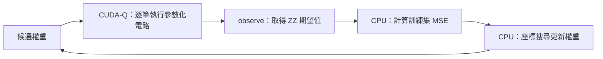

# Day 10｜第一個 CUDA-Q 訓練迴圈：依預測誤差更新權重

[Day9](../day09/README.md) 將輸入資料與可訓練權重分開，建立參數化量子電路，並觀察改動權重如何影響輸出。Day10 接著加入損失函數與最佳化器，讓權重根據預測誤差更新，形成第一個完整的訓練迴圈。

**電路產生預測後，還需要衡量誤差、比較候選權重並接受更新，才會形成訓練流程。** 量子模擬器與一般程式分別負責其中不同的步驟。本章沿用 Day9 的兩量子位元、四個旋轉權重與 `Z0Z1` 期望值讀出，以已知函數產生小型回歸資料，方便核對訓練流程。量子模擬器負責逐筆計算預測，一般 Python 程式則用 MSE（平均平方誤差）衡量預測與目標的差距，再由座標搜尋最佳化器依序嘗試增加或減少單一權重，只有誤差降低時才接受更新。這個方法不需要計算梯度，但每次比較候選權重都必須重新評估電路，因此訓練成本也要記錄。重點除了觀察損失是否下降，還包括保留未參與更新的 保留資料（holdout）作額外核對，以及分清楚停止原因、評估次數與訓練效果。本章使用理想模擬器的精確期望值訓練，最終另做有限次量測（shots）的抽樣，兩者用途不同。`observe` 負責取得電路輸出，最佳化器負責選擇權重；小型合成任務的誤差下降，仍不足以證明模型能處理實際新資料，也不等於量子方法優於一般方法。

[Day9](../day09/README.md) separated input data from trainable weights, built a parameterized quantum circuit, and examined how weight changes affect outputs. Day10 adds a loss function and an optimizer so that prediction errors guide weight updates, forming the first complete training loop.

**Training connects predictions, error calculations, candidate comparisons, and weight updates.** Quantum simulation and ordinary code handle different parts of this process. The implementation reuses Day9's two-qubit circuit, four rotation weights, and `Z0Z1` expectation readout. A known function generates a small regression dataset, making the training workflow easier to verify. The quantum simulator evaluates predictions for individual inputs, while ordinary Python code calculates mean squared error (MSE). A coordinate-search optimizer then tries increasing or decreasing one weight at a time, accepting an update only when the error decreases. No gradients are required, but each candidate comparison requires further circuit evaluations, so training cost must also be recorded. Beyond tracking loss reduction, the chapter preserves holdout inputs that do not participate in updates and distinguishes stopping reasons, evaluation counts, and training outcomes. Training uses exact expectations from an ideal simulator; finite-shot sampling is performed separately at the end. The output-evaluation role of `observe` differs from the parameter-selection role of the optimizer. Lower error on this small synthetic task does not establish practical generalization or quantum advantage.

---

Day 9 的權重由人指定；今天讓一般電腦上的最佳化器根據損失更新它們。沿用兩個量子位元、一層四個 RY 權重與 ZZ 輸出讀取，不改動 [Day 9 的模型](../day09/pqc.py)。完整可執行程式：[train.py](train.py)。

## 1. 一輪訓練如何運作？



參數化量子電路（Parameterized Quantum Circuit，PQC）含有可調整的操作角度，本章把這些角度稱為權重。RY 是旋轉量子位元狀態的量子閘；ZZ 是 `Z0Z1` 的簡寫，將兩個量測位元相同記為 +1、不同記為 −1，再計算平均值。這個依機率計算的平均值稱為期望值（expectation value）。

`observe` 的期望值可以成為一般程式中的目標函數的組成部分；NVIDIA 的量子演算法基本功能文件也描述這個最佳化工作流程。[D12] 本文使用自行實作的座標搜尋，使接受候選參數的條件與評估成本都可見，沒有呼叫 `cudaq.optimizers`。CPU 是一般電腦的中央處理器，GPU 是擅長平行運算的圖形處理器。執行後端（backend）指定負責運算的模擬器或硬體；本章兩種後端都用一般電腦數值運算模擬量子電路，沒有使用真實量子處理器。

## 2. 小型回歸任務與可達到的答案

回歸（regression）預測連續數值，例如溫度；分類則判斷類別。特徵是描述輸入的數值，標籤是要預測的正確答案。本章固定兩個特徵，標籤由可直接計算答案的解析函數產生：

```python
y = np.cos(np.pi * features[:, 1] + 0.6)
```

`features[:, 1]` 取出所有樣本的第二個特徵，也就是 `x1`；Python 編號從 0 開始。`np.cos` 是 NumPy 的餘弦函數，`np.pi` 是圓周率，0.6 是固定角度位移。NumPy 是 Python 的數值運算套件。

訓練資料為 `x0 ∈ {-0.6,0,0.6}` 與 `x1 ∈ {-0.5,0,0.5}` 的九個組合。另保留四筆未參與最佳化器的輸入：`[-0.8,-0.3]`、`[-0.2,0.7]`、`[0.3,-0.7]`、`[0.8,0.2]`。`dataset()` 固定這些值，不從網路下載資料。

本題刻意只讓標籤依賴 x1。由 Day 9 的 CNOT 與 ZZ 解析式可知，`weights=[0,0.6,0,0]` 能表示此目標；測試也逐筆核對。這是檢查訓練流程是否能降低誤差的合成問題，不代表真實資料集成效。最佳化器不會取得這個已知答案；它從隨機種子 42 或 43 的小角度隨機權重出發。初始化就是指定訓練起點，隨機種子（seed）則控制隨機序列，方便在相同環境重做實驗。

## 3. 損失在主控端計算

主控端（host）是安排電路執行與處理結果的一般 Python 程式。損失函數（loss function）將預測誤差轉成數值；本章使用平均平方誤差（mean squared error，MSE），先將每筆預測減去答案，平方後再平均。例如誤差為 0.1，該筆平方誤差就是 0.01。

下式 `N` 是訓練樣本數，`i` 是樣本編號，`x_i` 是輸入，`y_i` 是答案，`w` 是整組權重，`Σ` 表示將所有樣本加總：

```text
L(w) = (1/N) Σ_i (f(x_i,w) − y_i)²
f(x,w) = ⟨Z0 Z1⟩
```

程式中的核心如下：

```python
def objective(weights):
    predictions = [predict(x, weights, 1) for x in train_features]
    return mse(predictions, train_labels)
```

目標函數（objective）是最佳化器用來比較候選設定的數值規則；本例就以整批訓練資料的 MSE 作為目標。前向計算是固定權重下從輸入算出預測，不會更新權重。

每次目標函數包含九次精確 `observe`；Python／NumPy 計算損失，量子模擬器計算前向計算。不要把 `observe` 本身當成最佳化器，也不要把這個實數回歸值當分類機率。

## 4. 不需要梯度的座標搜尋

座標搜尋（coordinate search）將每個權重當作一個可調整方向，每次只試著改變其中一個。梯度描述參數微小改變時損失的變化方向與幅度；這個方法直接比較候選結果，不需計算梯度。

每一輪依序處理 w0 到 w3。對當前參數產生 `w[j]−step` 與 `w[j]+step` 兩個候選，選擇損失較小者；只有嚴格降低損失才接受。下一個座標使用已接受的權重。

```python
candidate = weights.copy()
candidate[j] += direction * step
candidate_loss = objective(candidate)
# 每個座標比較正負兩個候選，再決定是否更新。
```

`weights.copy()` 複製權重，避免測試候選值時改到原資料；`j` 是權重編號，`direction` 為 +1 或 −1。步長（step）是每次嘗試增加或減少的量。弧度是角度單位，`π` 弧度等於半圈。

初始步長為 0.4 弧度；整輪沒有任何更新才把步長減半。步長小於 `1e-4` 或達到 40 輪即停止。這是每次嘗試有限候選值的離散搜尋，不保證找到所有可能權重中誤差最低的全域最佳解。`max_sweeps` 代表用完預算，不能解讀為已收斂；收斂通常表示某項誤差或更新量已達到事先設定的穩定條件。

四個參數每輪需要八次目標函數，因此跑完 S 輪後：

```text
objective evaluations = 1 + 8S
training observe calls = 9 × (1 + 8S)
```

`S` 是已完成的輪數，`objective evaluations` 是目標函數評估次數，`training observe calls` 是訓練期間的電路求值次數。第一項是初始損失。最終資料核對、保留資料與抽樣另計，不包含在 `training_observe_calls`。`history.json` 的第 0 筆是初始狀態，之後每筆保存一輪後的權重、損失、該輪使用的步長與累積評估次數。

## 5. 獨立環境與執行

虛擬環境 `.venv` 為專案分開保存 Python 套件，避免與其他專案互相影響。沿用既有環境，沒有新增依賴；[requirements-day10.txt](../../requirements-day10.txt) 延續固定版本鏈。從專案根目錄執行：

```bash
source .venv/bin/activate
OMP_NUM_THREADS=1 python articles/day10/train.py
OMP_NUM_THREADS=1 python articles/day10/train.py --seed 43
OMP_NUM_THREADS=1 python articles/day10/train.py --backend nvidia
OMP_NUM_THREADS=1 python articles/day10/train.py --backend nvidia --seed 43
```

預設寫入 `results/day10/<backend>/seed<seed>/`，重跑會更新該目錄。可用 `--output-dir /tmp/day10-check` 另存；`--sweeps 3` 可做短流程示範。`OMP_NUM_THREADS=1` 指定 CPU 的 OpenMP 平行工作使用 1 個執行緒；執行緒是程序內可分別安排的工作單位。小型電路採用此設定是為了控制安排平行工作的額外成本，不是 GPU 加速效果的證據。

## 6. 怎麼讀結果？

JSON 以欄位名稱保存結構化資料，CSV 是可用試算表讀取的表格文字檔。

- `summary.json`：環境版本、隨機種子、初始／最終權重、停止原因、評估成本與訓練資料／保留資料 MSE。
- `history.json`、`training_curve.csv`：每輪訓練曲線與權重，可直接載入試算表或 Python。
- `predictions.json`：所有輸入、標籤、初始／最終預測、NumPy 參考值與最終 1,000 量測次數量測計數。

比較基準（baseline）提供同一任務的參考方法。常數方法對所有輸入都給出同一數值，本章使用**訓練集標籤平均值**，同時評估訓練資料和保留資料。保留資料不參與損失、步長選擇或停止條件；兩個隨機種子都保留，不挑一個來代表整體表現。四筆保留資料只提供這個示範的額外核對，不能估計實務泛化能力，也就是模型對未參與訓練的新資料表現如何。

最終預測與 Day 9 的 NumPy 矩陣計算比較，檢查 CUDA-Q 前向計算的數值正確性；它不是另一個學習模型的效能對照。實際數字與完整紀錄見 [Day 10 結果](../../results/day10/README.md)。

## 7. 精確訓練不等於抽樣式訓練

訓練沿用 `shots_count=-1`，在未加入雜訊干擾的模擬器上直接由狀態計算期望值，不做有限次抽樣；這裡的「精確」仍有電腦浮點數誤差。浮點數是電腦以有限位數表示的小數。最終另以 1,000 次量測讀出，保存抽樣隨機種子與量測計數（counts，即各結果出現幾次），沒有把抽樣值回傳給最佳化器。

因此訓練紀錄中的損失不增加，是「只接受較低的結果確定的損失」這個實作條件的結果。若以有限次抽樣訓練，抽樣波動會影響候選比較；本日沒有驗證這種訓練方式。數值精度描述電腦用多少位數保存與計算數值。不同精度的浮點誤差也可能改變非常接近的候選排序，因此不要求 CPU／GPU 的權重逐位一致。

## 8. 測試與後續延伸

```bash
OMP_NUM_THREADS=1 python -m unittest discover -s articles/day10 -p 'test_*.py' -v
OMP_NUM_THREADS=1 DAY10_TARGET=nvidia python -m unittest discover -s articles/day10 -p 'test_*.py' -v
```

測試涵蓋 MSE 輸入驗證、已知二次函數（含參數平方項的函數）的最佳化器行為、評估次數、停止原因、原始權重不被修改、解析標籤可表示性、資料分離，以及真正 CUDA-Q 更新後與 NumPy 的損失核對。

至此完成 Day 6–10 的參數化電路、反覆調整參數的示範與量子與經典混合的訓練流程。下一篇 [Day 11](../day11/README.md) 進一步整理一般資料如何進入量子電路；正式分類任務依學習路線留待 Day 15。

## 9. 來源

[D12] [NVIDIA Quantum Algorithmic Primitives](https://nvidia.github.io/cuda-quantum/latest/specification/cudaq/algorithmic_primitives.html)：可觀測量的期望值與目標函數最佳化的角色。查閱日期：2026-09-06，實際執行 CUDA-Q 0.15.1。座標搜尋與合成回歸任務是本文教學實作；共用來源索引見 [REFERENCES.md](../../REFERENCES.md)。
