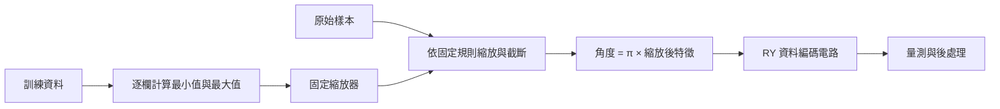

# Day 11｜一般數值資料如何轉成量子態？

[Day10](../day10/README.md) 加入損失函數與最佳化器，讓量子電路的權重根據預測誤差更新，完成第一個訓練迴圈。Day11 接著回到資料進入電路之前的步驟，探討原始數值如何經過前處理與編碼，以及哪些差異可能在轉換途中消失。

**資料轉成量子態之前，需要先決定如何縮放與編碼；每一步都可能讓原本不同的資料變得無法區分。** 追查這些差異在哪裡消失，有助於選擇適合任務的資料表示。本章先比較 basis encoding（基底編碼）、angle encoding（角度編碼）與 amplitude encoding（振幅編碼）各自如何表示資料，再實作角度編碼的完整路徑：只用訓練資料計算縮放範圍，將數值轉到指定區間，最後換成 RY 旋轉角度。重點在於區分原始資料、scaler（縮放器）的統計量與模型權重，並確保 holdout（保留資料）不參與縮放規則的擬合。本章也追查資訊在哪個階段消失：clipping（截斷越界值）可能讓不同資料變成相同輸入；編碼本身可能把不同輸入映成相同物理態；即使量子態不同，選定的量測方式仍可能得到相同分布。實作以 NumPy 比較三種表示方式，並用 CUDA-Q 的 CPU／GPU 模擬核對角度編碼結果，尚未新增模型訓練。保存原始資料、縮放規則與截斷紀錄，才能沿著「原始資料 → 縮放 → 角度 → 量子態 → 量測」回查差異，分辨問題來自資料處理、編碼或量測方式。

[Day10](../day10/README.md) added a loss function and an optimizer so that prediction errors could guide quantum-circuit weight updates, completing the first training loop. Day11 returns to the steps before data enters the circuit, examining how raw numerical values are preprocessed and encoded, and which differences may disappear during those transformations.

**Scaling and encoding determine how numerical data becomes a quantum state, and each step can make distinct inputs indistinguishable.** Tracing where those differences disappear helps assess whether a representation suits the task. The chapter first compares how basis, angle, and amplitude encoding represent data, then implements an angle-encoding workflow: fit scaling ranges using training data only, transform values into a specified interval, and convert the scaled values into RY rotation angles. A central distinction is between raw data, fitted scaler statistics, and model weights. Holdout data must not participate in fitting the scaling rules. The chapter also traces where information can be lost: clipping can turn different raw values into identical inputs; encoding can map distinct inputs to the same physical state; and a chosen measurement can produce identical distributions even when the states differ. NumPy illustrates the three representations, while CUDA-Q CPU/GPU simulation verifies angle encoding without additional model training. Preserving raw data, scaling rules, and clipping records makes it possible to trace differences through preprocessing, encoding, and measurement.

---

Day 10 已完成訓練迴圈，但資料本來就位於 `[-1,1]`。本章回到資料處理的起點：**原始數值如何經過前處理，成為電路角度與量子態？哪些資訊在途中消失？**

完整程式：[encoding.py](encoding.py)、[experiment.py](experiment.py)。本日實際執行角度編碼的 CUDA-Q 電路；基底與振幅先用 NumPy 比較表示方式，Day 12、13 再深入。

## 1. 資料不是直接塞進量子位元的表格



前處理（preprocessing）是輸入模型前的整理工作，例如清理資料與調整數值範圍。特徵（feature）是描述樣本的數值，例如長度與重量。縮放器（scaler）保存轉換尺度的規則；權重則是訓練時調整的模型設定。

每次準備的是某筆資料對應的 `|ψ(x)⟩ = U(x)|00⟩`。本例逐筆呼叫量子核心程式，沒有把整個資料表同時載入疊加態，也沒有使用量子隨機存取記憶體（QRAM），也就是讓量子演算法依位址存取資料的一類記憶體構想。式中的 `x` 是單筆資料，`U(x)` 是由資料決定的量子操作，`ψ(x)` 是準備後的狀態名稱。

資料 x、縮放器統計量、模型權重是三種不同物件。本日只有前兩者；沒有最佳化器或電路模板，避免把資料映射與可訓練參數混在一起。沿用 [Day 9 feature_map](../day09/pqc.py)，配置兩個量子位元後各做一次 RY。量子核心程式（quantum kernel）描述量子操作；RY 是以角度旋轉量子位元狀態的基本操作。電路模板（ansatz）是預先安排的可調操作組合，最佳化器則依誤差更新權重，本章尚未加入兩者。

## 2. 三種編碼的最小比較

| 編碼 | 本文例子 | 放進量子態的內容 | 本文示範限制 |
|---|---|---|---|
| 基底編碼 | `[1,0] → |10⟩` | 位元字串對應的計算基底態 | 實數須先定義離散化／二進位表示 |
| 角度編碼 | `x → RY(πx0) ⊗ RY(πx1)|00⟩` | 由旋轉角度決定振幅 | 本例兩個特徵用兩個量子位元，有週期性 |
| 振幅編碼 | `[3,4,0] → [0.6,0.8,0,0]` | 正規化、補零後的向量係數 | 三個值補成四個振幅，用兩個量子位元 |

基底編碼（basis encoding）把 0、1 字串對應到確定的量測狀態；離散化是把連續數值分成有限類別或刻度，二進位則用 0、1 表示數值。角度編碼（angle encoding）將資料當成旋轉角度；振幅編碼（amplitude encoding）將資料放進狀態向量的係數。振幅的絕對值平方才是量測機率。

`⊗` 是張量積，用來組合兩個量子位元的狀態或操作。`q0`、`q1` 是位元編號，`|00⟩` 表示兩者都從 0 狀態開始。

NVIDIA Python API 的振幅編碼說明也採取補至 2 的次方長度、再做 L2 正規化的定義。[D5] 本文的 `amplitude_reference` 是小型實數 NumPy 範例，沒有呼叫 `cudaq.contrib`，也沒有實作振幅態準備電路。

L2 長度是各分量平方相加後開平方根，例如 `[3,4]` 的長度是 `√(9+16)=5`。L2 正規化將每個分量除以這個長度，因此得到 `[0.6,0.8]`。兩個量子位元需要四個振幅，所以三個數值的範例還要在尾端補一個 0。API 是程式呼叫功能的介面，NumPy 則是 Python 的數值運算套件。

少量量子位元可描述許多振幅，不代表資料準備免費，也不能從一次量測讀回整個向量。`[3,4]` 與 `[30,40]` 正規化後相同，原始大小已消失；全零向量不能直接正規化，本例明確拒絕。補零與正規化屬於振幅編碼，**不是所有量子編碼都要求輸入向量的 L2 長度為 1**。

可在專案根目錄比較：

```python
from articles.day11.encoding import basis_reference, amplitude_reference, angle_reference
print(basis_reference([1, 0]))       # [0, 0, 1, 0]
print(amplitude_reference([3, 4, 0])) # [0.6, 0.8, 0, 0]
print(angle_reference([0.25, 0]))
```

NumPy 的兩個量子位元順序固定為 `|q0 q1⟩`。CUDA-Q 實驗用 `State.amplitude('00')` 等具名基底標籤核對，不猜測原始狀態記憶體區塊的排列。

## 3. 只在訓練資料上建立縮放規則

合成資料是為了實驗而指定或產生的數值；無標籤表示這裡沒有附上要預測的正確答案。保留資料（holdout）不參與縮放規則的計算，用來觀察同一規則如何處理其他輸入。

本日使用固定、無標籤的合成資料：

```python
train = [[10,100], [20,160], [30,120], [40,200]]
holdout = [[25,150], [5,250], [50,80], [10,200]]
```

兩欄可視為不同單位的數值特徵。由訓練資料得到最小值=`[10,100]`、最大值=`[40,200]`。`j` 是欄位編號，`clip` 將越界值改成訓練範圍的上下界。公式先把值轉到 0 至 1，再乘以 2 並減去 1，得到 −1 至 1。最後乘上 `π` 轉成弧度角度，`π` 弧度等於半圈：

```text
clipped_j = clip(raw_j, train_min_j, train_max_j)
scaled_j = 2 × (clipped_j − train_min_j) / (train_max_j − train_min_j) − 1
angle_j = π × scaled_j
```

```python
scaler = fit_scaler(train)
train_scaled, train_flags = transform(train, scaler)
holdout_scaled, holdout_flags = transform(holdout, scaler)
```

`fit_scaler` 計算並保存每欄的範圍，`transform` 套用固定規則。保留資料不參與建立縮放規則。若錯把所有資料合併後建立縮放規則，同一筆 `[25,150]` 就會從 `[0,0]` 變成約 `[-0.1111,-0.1765]`。這種讓評估資料提前影響處理規則的情況稱為資料洩漏（data leakage）。實驗將這個錯誤版本獨立存成 `leakage_example`，僅作反例，不用它執行電路。本例直接展示資料表示被保留資料改變，未做模型評分，也不宣稱量化了資料洩漏的效能影響。

## 4. 越界值需要明確政策

截斷（clipping）把越界值改成邊界值；旗標記錄是否發生這個操作。布林旗標只有真與假兩種值，表中的 `true` 表示有截斷，`false` 表示沒有：

| 原始值 | 縮放值 | 是否截斷 |
|---|---|---|
| `[25,150]` | `[0,0]` | `[false,false]` |
| `[5,250]` | `[-1,1]` | `[true,true]` |
| `[50,80]` | `[1,-1]` | `[true,true]` |
| `[10,200]` | `[-1,1]` | `[false,false]` |

`[5,250]` 和 `[10,200]` 因截斷成為相同的輸入，因此後續電路無法還原它們原本的差異。保留原始值與旗標才能追查。

這是示範選擇，不是通用最佳策略。另一種產品需求可能選擇拒絕越界或重新設計縮放範圍。NaN 表示無效數值，Inf 表示無限大。程式拒絕 NaN／Inf、錯誤欄數、空資料與常數訓練欄；常數訓練欄是所有訓練樣本都相同的一欄，此時最大值等於最小值。常數欄的移除或固定映射必須另定政策，不能直接除以零。

## 5. 編碼碰撞與量測碰撞不同

碰撞指不同輸入在某個處理階段變成無法區分的結果。下式 `θ` 是旋轉角度，`cos` 與 `sin` 是餘弦、正弦函數；`⟨Z⟩` 與 `⟨X⟩` 是兩種量測的期望值，也就是依機率計算的平均值：

```text
RY(θ)|0⟩ = cos(θ/2)|0⟩ + sin(θ/2)|1⟩
⟨Z⟩ = cos(θ)
⟨X⟩ = sin(θ)
```

本例使用 θ=πx，延續 Day 9。當 x=−1 與 x=+1，兩個狀態只差整體相位，也就是所有振幅乘上同一個長度為 1 的複數，所以是相同物理態。可觀測量（observable）指定量測所關心的量；整體相位不影響任何量測預測，因此換量測方式也無法區分它們。這是映射本身的碰撞，不是量測次數不足。

另一方面，x=+0.25 與 x=−0.25 的狀態不同，卻具有相同 Z 基底機率。保真度（fidelity）衡量兩個狀態的接近程度，1 表示相同物理狀態；本例兩態保真度為 0.5。Z 基底區分 0 與 1，X 基底則區分 `( |0⟩ + |1⟩ )/√2` 與 `( |0⟩ − |1⟩ )/√2`。改用 X 期望值就得到正負相反的結果。此時資訊仍在量子態中，但選定讀出沒有辨識它。

因此「縮放器輸出不同」「量子態不同」「目前量測結果不同」不能畫上等號。後面的電路模板與可觀測量設計也會影響模型能看到哪些差異。

## 6. 可重現的 CPU／GPU 實驗

CPU 是一般電腦的中央處理器，GPU 是擅長平行運算的圖形處理器。執行後端（backend）指定實際使用的模擬器：本章預設使用 CPU，`nvidia` 使用 GPU。`.venv` 是專案獨立保存 Python 套件的虛擬環境；`OMP_NUM_THREADS=1` 將 CPU 平行工作的執行緒數設為 1。

沿用獨立 `.venv`，沒有新增依賴；固定版本入口為 [requirements-day11.txt](../../requirements-day11.txt)。從專案根目錄執行：

```bash
source .venv/bin/activate
OMP_NUM_THREADS=1 python articles/day11/experiment.py
OMP_NUM_THREADS=1 python articles/day11/experiment.py --backend nvidia
```

每個執行後端執行 4 筆訓練資料與 4 筆保留資料。每筆保存原始值、縮放值、截斷旗標、弧度角度、各基底機率、保真度、精確 Z0／X0，以及 1,000 量測次數的 Z 基底量測計數與隨機種子。

量測計數（counts）記錄各結果出現幾次，隨機種子（seed）控制模擬抽樣的起始設定，方便重做實驗。JSON 是以欄位名稱保存結構化資料的文字格式。

`summary.json` 保留縮放器、環境與誤差統計，`predictions.json` 保留逐筆紀錄。預設寫入 `results/day11/<backend>/`；重跑更新同一目錄，可加 `--output-dir /tmp/day11-check` 另存。

精確狀態與期望值用於無噪聲模擬器正確性檢查，並非量子處理器（QPU，實際執行量子操作的硬體）能直接回傳完整量子態。精確計算是由模擬器保存的向量直接求值，不做有限次抽樣，仍可能存在有限數值精度造成的微小誤差。抽樣使用另加量測的外層函式，與精確量子核心程式共用 feature_map。

## 7. 測試與銜接

```bash
OMP_NUM_THREADS=1 python -m unittest discover -s articles/day11 -p 'test_*.py' -v
OMP_NUM_THREADS=1 DAY11_TARGET=nvidia python -m unittest discover -s articles/day11 -p 'test_*.py' -v
```

六個測試涵蓋僅使用訓練資料的縮放、截斷與輸入不變性、錯誤輸入、基底／振幅語意、角度編碼端點碰撞、Z 機率隱藏符號，以及 CUDA-Q 基底順序與 X 讀出。完整實測數字見 [結果紀錄](../../results/day11/README.md)。

[Day 12](../day12/README.md) 將深入角度編碼，Day 13 處理振幅編碼。本日先建立可檢查的資料契約，沒有重訓 Day 10 模型或新增分類成效宣稱。

## 8. 來源

[D5] [NVIDIA CUDA-Q Python API](https://nvidia.github.io/cuda-quantum/latest/api/languages/python_api.html)：Quantum Embeddings 的振幅／angular encoding 定義。查閱日期：2026-09-06，實際環境 CUDA-Q 0.15.1。其餘縮放與碰撞例子由本文程式、RY 解析式與測試核對；索引見 [REFERENCES.md](../../REFERENCES.md)。
