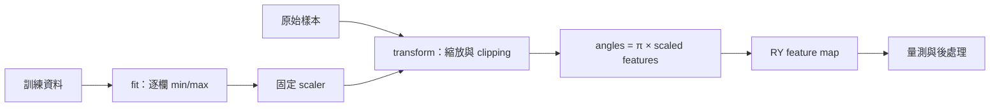

# Day 11｜Classical Data 怎麼變成 Quantum Data？

## 本章摘要｜初學者學習筆記

### 中文

[Day10](../day10/README.md) 加入損失函數與最佳化器，讓量子電路的權重根據預測誤差更新，完成第一個訓練迴圈。Day11 接著回到資料進入電路之前的步驟，探討原始數值如何經過前處理與編碼，以及哪些差異可能在轉換途中消失。

這一章目標在於理解 **「一般數值資料如何成為量子態，以及資料轉換是否保留了任務需要的資訊」**，為後續選擇編碼方式與建立 QML 模型打下基礎。本章先比較 basis encoding（基底編碼）、angle encoding（角度編碼）與 amplitude encoding（振幅編碼）各自如何表示資料，再實作角度編碼的完整路徑：只用訓練資料計算縮放範圍，將數值轉到指定區間，最後換成 RY 旋轉角度。重點在於區分原始資料、scaler（縮放器）的統計量與模型權重，並確保 holdout（保留資料）不參與縮放規則的擬合。本章也追查資訊在哪個階段消失：clipping（截斷越界值）可能讓不同資料變成相同輸入；編碼本身可能把不同輸入映成相同物理態；即使量子態不同，選定的量測方式仍可能得到相同分布。實作以 NumPy 比較三種表示方式，並用 CUDA-Q 的 CPU／GPU 模擬核對角度編碼結果，尚未新增模型訓練。讀完本章，應能描述「原始資料 → 縮放 → 角度 → 量子態 → 量測」的流程，理解為什麼要保存前處理規則與截斷紀錄，並分辨問題來自資料處理、編碼方式，還是量測選擇。

### English

[Day10](../day10/README.md) added a loss function and an optimizer so that prediction errors could guide quantum-circuit weight updates, completing the first training loop. Day11 returns to the steps before data enters the circuit, examining how raw numerical values are preprocessed and encoded, and which differences may disappear during those transformations.

This chapter aims to explain **how ordinary numerical data becomes a quantum state and whether the transformation preserves information needed for the task**, laying the foundation for encoding choices and QML model construction. The chapter first compares how basis, angle, and amplitude encoding represent data, then implements an angle-encoding workflow: fit scaling ranges using training data only, transform values into a specified interval, and convert the scaled values into RY rotation angles. A central distinction is between raw data, fitted scaler statistics, and model weights. Holdout data must not participate in fitting the scaling rules. The chapter also traces where information can be lost: clipping can turn different raw values into identical inputs; encoding can map distinct inputs to the same physical state; and a chosen measurement can produce identical distributions even when the states differ. NumPy illustrates the three representations, while CUDA-Q CPU/GPU simulation verifies angle encoding without additional model training. The learning goal is to describe the raw-data–scaling–angle–state–measurement workflow, explain why preprocessing rules and clipping records must be preserved, and distinguish issues caused by data processing, encoding, or measurement choice.

---

Day 10 已完成訓練迴圈，但資料本來就位於 `[-1,1]`。今天往前補上工程邊界：**原始數值如何經過 preprocessing，成為電路角度與量子態？哪些資訊在途中消失？**

完整程式：[encoding.py](encoding.py)、[experiment.py](experiment.py)。本日實際執行 angle encoding 的 CUDA-Q 電路；basis 與 amplitude 先用 NumPy 比較表示方式，Day 12、13 再深入。

## 1. 資料不是直接塞進 Qubit 的表格



每次準備的是某筆資料對應的 `|ψ(x)⟩ = U(x)|00⟩`。本例逐筆呼叫 kernel，沒有把整個資料表同時載入疊加態，也沒有 QRAM。

資料 x、scaler 統計量、模型 weights 是三種不同物件。本日只有前兩者；沒有 optimizer 或 Ansatz，避免把資料映射與可訓練參數混在一起。沿用 [Day 9 feature_map](../day09/pqc.py)，配置兩個 qubit 後各做一次 RY。

## 2. 三種編碼的最小比較

| 編碼 | 本文例子 | 放進量子態的內容 | 本文示範限制 |
|---|---|---|---|
| Basis | `[1,0] → |10⟩` | bit string 對應的計算基底態 | 實數須先定義離散化／二進位表示 |
| Angle | `x → RY(πx0) ⊗ RY(πx1)|00⟩` | 由旋轉角度決定 amplitudes | 本例兩個 features 用兩個 qubit，有週期性 |
| Amplitude | `[3,4,0] → [0.6,0.8,0,0]` | 正規化、補零後的向量係數 | 三個值補成四個 amplitudes，用兩個 qubit |

NVIDIA Python API 的 amplitude encoding 說明也採取補至 2 的次方長度、再做 L2 normalization 的定義。[D5] 本文的 `amplitude_reference` 是小型實數 NumPy 範例，沒有呼叫 `cudaq.contrib`，也沒有實作振幅態準備電路。

少量 qubit 可描述許多 amplitudes，不代表資料準備免費，也不能從一次量測讀回整個向量。`[3,4]` 與 `[30,40]` 正規化後相同，原始大小已消失；全零向量不能直接正規化，本例明確拒絕。補零與正規化屬於 amplitude encoding，**不是所有量子編碼都要求輸入向量的 L2 norm 為 1**。

可在專案根目錄比較：

```python
from articles.day11.encoding import basis_reference, amplitude_reference, angle_reference
print(basis_reference([1, 0]))       # [0, 0, 1, 0]
print(amplitude_reference([3, 4, 0])) # [0.6, 0.8, 0, 0]
print(angle_reference([0.25, 0]))
```

NumPy 的兩個 qubit 順序固定為 `|q0 q1⟩`。CUDA-Q 實驗用 `State.amplitude('00')` 等具名 basis labels 核對，不猜測 raw state buffer 的排列。

## 3. 只在 Train 上 Fit

本日使用固定、無標籤的合成資料：

```python
train = [[10,100], [20,160], [30,120], [40,200]]
holdout = [[25,150], [5,250], [50,80], [10,200]]
```

兩欄可視為不同單位的數值特徵。由 train 得到 min=`[10,100]`、max=`[40,200]`。轉換公式：

```text
clipped_j = clip(raw_j, train_min_j, train_max_j)
scaled_j = 2 × (clipped_j − train_min_j) / (train_max_j − train_min_j) − 1
angle_j = π × scaled_j
```

```python
scaler = fit_scaler(train)
train_scaled, train_flags = transform(train, scaler)
holdout_scaled, holdout_flags = transform(holdout, scaler)
```

holdout 不參與 fit。若錯把所有資料合併後 fit，同一筆 `[25,150]` 就會從 `[0,0]` 變成約 `[-0.1111,-0.1765]`。實驗將這個錯誤版本獨立存成 `leakage_example`，僅作反例，不用它執行電路。本例直接展示資料表示被 holdout 改變，未做模型評分，也不宣稱量化了 leakage 的效能影響。

## 4. 越界值需要明確政策

本例選擇 clipping，並回傳每格布林旗標：

| Raw | Scaled | Clipped |
|---|---|---|
| `[25,150]` | `[0,0]` | `[false,false]` |
| `[5,250]` | `[-1,1]` | `[true,true]` |
| `[50,80]` | `[1,-1]` | `[true,true]` |
| `[10,200]` | `[-1,1]` | `[false,false]` |

`[5,250]` 和 `[10,200]` 因 clipping 成為相同的輸入，因此後續電路無法還原它們原本的差異。保留 raw 與 flags 才能追查。

這是示範選擇，不是通用最佳策略。另一種產品需求可能選擇拒絕越界或重新設計縮放範圍。程式拒絕 NaN／Inf、錯誤欄數、空資料與常數訓練欄；常數欄的移除或固定映射必須另定政策，不能直接除以零。

## 5. 編碼碰撞與量測碰撞不同

單 qubit 的 angle encoding 為：

```text
RY(θ)|0⟩ = cos(θ/2)|0⟩ + sin(θ/2)|1⟩
⟨Z⟩ = cos(θ)
⟨X⟩ = sin(θ)
```

本例使用 θ=πx，延續 Day 9。當 x=−1 與 x=+1，兩個狀態只差 global phase，所以是相同物理態。即使換 observable 也不能區分它們。這是映射本身的碰撞，不是 shots 不足。

另一方面，x=+0.25 與 x=−0.25 的狀態不同，卻具有相同 Z 基底機率。測試得到兩態 fidelity 為 0.5；改用 X expectation 就得到正負相反的結果。此時資訊仍在量子態中，但選定讀出沒有辨識它。

因此「scaler 輸出不同」「量子態不同」「目前量測結果不同」不能畫上等號。後面的 Ansatz 與 observable 設計也會影響模型能看到哪些差異。

## 6. 可重現的 CPU／GPU 實驗

沿用獨立 `.venv`，沒有新增依賴；固定版本入口為 [requirements-day11.txt](../../requirements-day11.txt)。從專案根目錄執行：

```bash
source .venv/bin/activate
OMP_NUM_THREADS=1 python articles/day11/experiment.py
OMP_NUM_THREADS=1 python articles/day11/experiment.py --backend nvidia
```

每個 backend 執行 4 筆 train 與 4 筆 holdout。每筆保存 raw、scaled、clipping flags、radians、各 basis probability、fidelity、exact Z0／X0，以及 1,000 shots 的 Z 基底 counts 與 seed。

`summary.json` 保留 scaler、環境與誤差統計，`predictions.json` 保留逐筆紀錄。預設寫入 `results/day11/<backend>/`；重跑更新同一目錄，可加 `--output-dir /tmp/day11-check` 另存。

Exact state 與 expectation 用於無噪聲 simulator correctness check，並非 QPU 能直接回傳完整量子態。sampling 使用另加量測的 wrapper，與 exact kernel 共用 feature_map。

## 7. 測試與銜接

```bash
OMP_NUM_THREADS=1 python -m unittest discover -s articles/day11 -p 'test_*.py' -v
OMP_NUM_THREADS=1 DAY11_TARGET=nvidia python -m unittest discover -s articles/day11 -p 'test_*.py' -v
```

六個測試涵蓋 train-only 縮放、clipping 與輸入不變性、錯誤輸入、basis／amplitude 語意、angle 端點碰撞、Z 機率隱藏符號，以及 CUDA-Q basis 順序與 X 讀出。完整實測數字見 [結果紀錄](../../results/day11/README.md)。

[Day 12](../day12/README.md) 將深入 Angle Encoding，Day 13 處理 Amplitude Encoding。本日先建立可檢查的資料契約，沒有重訓 Day 10 模型或新增分類成效宣稱。

## 8. 來源

[D5] [NVIDIA CUDA-Q Python API](https://nvidia.github.io/cuda-quantum/latest/api/languages/python_api.html)：Quantum Embeddings 的 amplitude／angular encoding 定義。查閱日期：2026-09-06，實際環境 CUDA-Q 0.15.1。其餘縮放與碰撞例子由本文程式、RY 解析式與測試核對；索引見 [REFERENCES.md](../../REFERENCES.md)。
