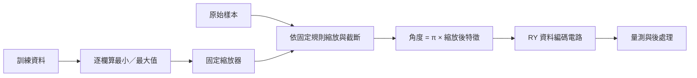

# Day 11｜一般數值資料如何轉成量子態？

Day 10 的訓練資料本來就落在 `[-1, 1]`，像是已經切好的食材。真實工作往往從「公分、公斤、原始分數」開始。今天回到更早一步：**原始數字怎麼變成電路能用的角度與量子態？途中又可能弄丟哪些差異？**

想像要把身高、體重送進一台只吃「−1 到 +1」的機器。你得先訂縮放尺規：用誰的最小／最大值？遇到超出範圍的人怎麼辦？換成旋轉角度後，兩個看起來不同的數字，會不會其實變成同一個物理狀態？就算狀態不同，你選的量測方式會不會讀不出差別？

本章先用 NumPy 比較三種常見編碼，再把**角度編碼**走完整條可檢查的路：只用訓練資料訂縮放規則 → 縮放與截斷 → 換成 RY 角度 → 準備量子態 → 量測。完整程式：[encoding.py](encoding.py)、[experiment.py](experiment.py)。基底與振幅編碼今天只做表示比較；Day 12、13 再深入。本日**沒有**重訓模型。

Day11 traces raw numerical features through a train-only scaler into RY angle encoding, and compares basis and amplitude representations in NumPy. Worked examples separate clipping collisions, encoding collisions, and measurement collisions. CUDA-Q CPU/GPU checks verify the angle-encoding path without claiming training results, QRAM loading, or quantum advantage.

---

## 1. 資料不是直接塞進量子位元的表格



**前處理**是進模型前的整理，例如調整數值範圍。**特徵**是描述樣本的數字。**縮放器（scaler）**保存「怎麼換算」的規則；**權重**才是訓練時要調的模型旋鈕。三者不要混成同一個東西。

每次準備的是某一筆資料對應的狀態 `|ψ(x)⟩ = U(x)|00⟩`：`x` 是這筆輸入，`U(x)` 是由資料決定的操作。本例**逐筆**呼叫量子核心程式，沒有把整張資料表一次載進疊加態，也沒有使用量子隨機存取記憶體（QRAM）這類「依位址取資料」的構想。

本日只有資料與縮放器；沒有電路模板（ansatz）與最佳化器，避免把「資料怎麼進去」和「模型怎麼學」綁死。編碼電路沿用 [Day 9 的 feature_map](../day09/pqc.py)：兩個量子位元各做一次 RY。

## 2. 三種編碼，先用最小例子對齊直覺

| 編碼 | 本文例子 | 放進量子態的是什麼 | 要注意什麼 |
|---|---|---|---|
| 基底編碼 | `[1,0] → \|10⟩` | 對應某個確定的 0／1 字串 | 實數要先決定怎麼離散化、怎麼變二進位 |
| 角度編碼 | `x → RY(πx0) ⊗ RY(πx1)\|00⟩` | 旋轉角度決定振幅 | 本例兩特徵用兩位元；有週期性 |
| 振幅編碼 | `[3,4,0] → [0.6,0.8,0,0]` | 正規化、補零後的向量係數 | 三個數要補成四個振幅（兩位元） |

白話對照：

- **基底編碼**：像把資料變成「第幾號抽屜」，量測時直接對應某個位元字串
- **角度編碼**：像把資料轉成旋鈕角度，轉動後改變狀態
- **振幅編碼**：像把資料寫進狀態向量的各個係數；係數絕對值平方才是量測機率

`⊗` 是張量積，用來組合兩個位元的狀態或操作。`|00⟩` 表示兩個位元都從 0 開始。

振幅編碼常先把長度補到 2 的次方，再做 **L2 正規化**（每個分量除以「平方和再開根」的長度）。例如 `[3,4]` 長度是 5，正規化後是 `[0.6,0.8]`；兩位元需要四個振幅，所以三個數的例子尾端再補 0。[D5] 本日的 `amplitude_reference` 是小型 NumPy 示範，沒有呼叫 `cudaq.contrib`，也沒有實作振幅態準備電路。

重點：**位元少、振幅多，不代表資料準備免費**，也不能從一次量測讀回整個向量。`[3,4]` 與 `[30,40]` 正規化後相同，原始大小已消失；全零向量不能直接正規化，本例會拒絕。補零與正規化是振幅編碼的規則，**不是所有編碼都要求輸入向量長度為 1**。

可在專案根目錄試：

```python
from articles.day11.encoding import basis_reference, amplitude_reference, angle_reference
print(basis_reference([1, 0]))       # [0, 0, 1, 0]
print(amplitude_reference([3, 4, 0])) # [0.6, 0.8, 0, 0]
print(angle_reference([0.25, 0]))
```

NumPy 的兩位元順序固定為 `|q0 q1⟩`。CUDA-Q 實驗用 `State.amplitude('00')` 等具名標籤核對，不猜測底層記憶體排列。

## 3. 縮放規則只准看訓練資料

**保留資料（holdout）**不參與訂規則，只用來檢查「同一把尺」怎麼量其他輸入。本日用固定、無標籤的合成數字：

```python
train = [[10,100], [20,160], [30,120], [40,200]]
holdout = [[25,150], [5,250], [50,80], [10,200]]
```

兩欄可想成不同單位的特徵。由訓練資料得到最小值 `[10,100]`、最大值 `[40,200]`。越界先**截斷（clip）**到訓練範圍，再映到 `[-1, 1]`，最後乘 π 變角度：

```text
clipped_j = clip(raw_j, train_min_j, train_max_j)
scaled_j = 2 × (clipped_j − train_min_j) / (train_max_j − train_min_j) − 1
angle_j = π × scaled_j
```

```python
scaler = fit_scaler(train)
train_scaled, train_flags = transform(train, scaler)
holdout_scaled, holdout_flags = transform(holdout, scaler)
```

`fit_scaler` 只看訓練集；`transform` 套用已固定的規則。

若錯誤地把訓練與保留資料合併後再訂尺規，同一筆 `[25,150]` 會從正確的 `[0,0]` 變成約 `[-0.1111, -0.1765]`。評估資料提前影響處理規則，稱為**資料洩漏（data leakage）**。實驗把這個錯誤版本存成 `leakage_example` 當反例，**不用它跑電路**。本例直接展示表示被改掉，沒有做模型評分，也不量化「洩漏讓準確率差多少」。

## 4. 超出範圍時，要先說清楚怎麼辦

截斷會把越界值改成邊界值；旗標記錄有沒有發生：

| 原始值 | 縮放值 | 是否截斷 |
|---|---|---|
| `[25,150]` | `[0,0]` | `[false,false]` |
| `[5,250]` | `[-1,1]` | `[true,true]` |
| `[50,80]` | `[1,-1]` | `[true,true]` |
| `[10,200]` | `[-1,1]` | `[false,false]` |

注意：`[5,250]` 與 `[10,200]` 截斷後變成**同一組輸入**，後面電路分不出它們原本不同。若沒保存原始值與旗標，這種碰撞很難追查。

這是本日示範政策，不是唯一正確做法。產品也可能選擇直接拒絕越界，或重新設計範圍。程式會拒絕無效數值（NaN）、無限大（Inf）、欄數錯誤、空資料，以及「訓練欄全相同」的常數欄（此時最大值等於最小值，不能直接除以零）。常數欄要移除或固定映射，必須另定規則。

## 5. 兩種「撞在一起」：編碼撞上，還是量測看不見？

**碰撞**指不同輸入在某階段變得無法區分。對單一 RY：

```text
RY(θ)|0⟩ = cos(θ/2)|0⟩ + sin(θ/2)|1⟩
⟨Z⟩ = cos(θ)
⟨X⟩ = sin(θ)
```

本日用 `θ = πx`（延續 Day 9）。當 `x = −1` 與 `x = +1`，兩個狀態只差**整體相位**（所有振幅乘上同一個長度為 1 的複數），屬於相同物理態。換任何可觀測量都分不出來——這是**映射本身**的碰撞，不是量測次數不夠。

另一邊：`x = +0.25` 與 `x = −0.25` 的狀態不同（保真度 0.5；**保真度**衡量狀態有多像，1 表示相同），但 Z 基底機率相同。改看 X 期望值，符號會相反。資訊還在狀態裡，是**你選的讀出**沒看見。

因此三句話不能畫等號：

1. 縮放器輸出不同  
2. 量子態不同  
3. 目前量測結果不同  

後面若再加電路模板與其他可觀測量，模型「看得到什麼」還會再變一次。

## 6. 可重現的 CPU／GPU 實驗

沿用 `.venv`；固定依賴見 [requirements-day11.txt](../../requirements-day11.txt)。

```bash
source .venv/bin/activate
OMP_NUM_THREADS=1 python articles/day11/experiment.py
OMP_NUM_THREADS=1 python articles/day11/experiment.py --backend nvidia
```

`qpp-cpu` 用 CPU，`nvidia` 用 GPU；`OMP_NUM_THREADS=1` 固定 CPU 執行緒數。每個後端跑 4 筆訓練與 4 筆保留。每筆保存：原始值、縮放值、截斷旗標、角度、各基底機率、保真度、精算 Z0／X0，以及 1,000 次量測的計數與種子。

- `summary.json`：縮放器、環境、誤差統計  
- `predictions.json`：逐筆紀錄  

預設寫入 `results/day11/<backend>/`；可用 `--output-dir /tmp/day11-check` 另存。

精算狀態與期望值用於無雜訊模擬器的正確性檢查，**不代表**真實量子處理器（QPU）能直接回傳完整狀態。抽樣使用另加量測的外層函式，與精算路徑共用同一個 `feature_map`。

## 7. 測試與銜接

```bash
OMP_NUM_THREADS=1 python -m unittest discover -s articles/day11 -p 'test_*.py' -v
OMP_NUM_THREADS=1 DAY11_TARGET=nvidia python -m unittest discover -s articles/day11 -p 'test_*.py' -v
```

六個測試涵蓋：只用訓練資料縮放、截斷與輸入不變性、錯誤輸入、基底／振幅語意、角度編碼端點碰撞、Z 機率隱藏符號，以及 CUDA-Q 基底順序與 X 讀出。數字見 [結果紀錄](../../results/day11/README.md)。

[Day 12](../day12/README.md) 深入角度編碼；[Day 13](../day13/README.md) 處理振幅編碼。本日建立的是可檢查的**資料契約**：規則從哪來、越界怎麼辦、差異在哪一層消失；並區分截斷碰撞、編碼碰撞與量測看不見。它不是分類準確率報告，也不是振幅載入效能或 QPU 實測。

## 8. 來源

[D5] [NVIDIA CUDA-Q Python API](https://nvidia.github.io/cuda-quantum/latest/api/languages/python_api.html)：Quantum Embeddings 的振幅／角度編碼定義。查閱日期：2026-09-06，實際環境 CUDA-Q 0.15.1。其餘縮放與碰撞例子由本日程式、RY 解析式與測試核對；索引見 [REFERENCES.md](../../REFERENCES.md)。

## 延伸研究

[N6] Kevin W. Aoun et al. “Quantum State Preparation via Neural Network Encoding in Quantum Machine Learning.” arXiv:2605.31006v1 (2026)；預印本。[原始來源](https://arxiv.org/abs/2605.31006v1)；[完整書目](../../REFERENCES.md#n6)。

本章比較不同資料表示；這篇研究提供先學習編碼規則的延伸方向。比較時也要把編碼器本身的訓練成本算進去。
