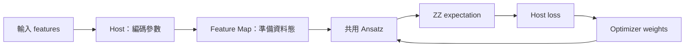

# Day 14｜Feature Map＋Ansatz：組成可訓練的 QML Model

## 本章摘要｜初學者學習筆記

### 中文

[Day13](../day13/README.md) 將資料轉成量子態的振幅，區分正規化與實際狀態準備，並核對直接載入模擬器與 RY／CNOT 電路兩條路徑。Day14 接著把角度編碼與振幅編碼接到共用的可調電路與訓練介面，整理成後續分類任務可延伸的模型。

這一章目標在於理解 **「資料表示、可訓練電路、量測輸出與最佳化程序如何組合成同一個模型，同時保留各自的責任」**，讓前幾章的獨立元件成為可重用的 QML 流程。Feature map（資料編碼電路）負責準備輸入對應的量子態；Ansatz（含可調權重的電路結構）接著改變狀態；固定的 `Z0Z1` 讀出提供數值；一般 Python 程式再計算 loss 並更新權重。本章讓兩種編碼共用同一份 Ansatz，但仍分別檢查輸入維度與前處理規則，因為更換編碼並不代表可以直接使用相同格式的資料。另一個重點是：對一次編碼後的所有資料施加相同量子閘序列，可以改變讀出結果，卻無法重新區分已經編成相同物理態的輸入。實作提供單筆與批次前向介面，並接回 Day10 的座標搜尋，透過短訓練確認元件能一起運作。讀完本章，應能說明模型各部分的分工，理解保存模型時需要記錄編碼與結構設定，以及為什麼本章的兩種編碼使用不同合成資料，訓練誤差不能直接拿來判定編碼優劣。

### English

[Day13](../day13/README.md) encoded data into quantum-state amplitudes, distinguished normalization from state preparation, and checked both direct simulator loading and explicit RY/CNOT circuits. Day14 connects angle and amplitude encoding to a shared adjustable circuit and training interface, creating a model that can support the classification task developed next.

This chapter aims to explain **how data representation, a trainable circuit, measurement readout, and optimization form one model while retaining distinct responsibilities**, turning earlier components into a reusable QML workflow. The feature map prepares the state associated with an input. The Ansatz, a circuit structure with adjustable weights, then transforms that state. A fixed `Z0Z1` readout supplies a numerical output, and ordinary Python code calculates the loss and updates the weights. Both encodings share the same Ansatz implementation, but their input dimensions and preprocessing rules are checked separately: interchangeable encoding components do not imply identical input formats. Another key point is that applying the same gate sequence to all states after a single encoding can change readout values, but cannot distinguish inputs already mapped to the same physical state. The implementation provides single-input and batch forward interfaces and reconnects Day10's coordinate search for short training runs that check integration. The learning goal is to explain each component's role, understand why saved models need encoding and structural settings, and recognize that training errors from the two encodings cannot directly establish encoding quality because the synthetic datasets differ.

---

Day 12、13 已分別準備 angle 與 amplitude states。今天將它們接到 **同一個 Ansatz、同一個 ZZ readout、同一個 optimizer 介面**，建立 Day 15 分類任務可延伸的模型骨架。

完整程式：[model.py](model.py)、[demo.py](demo.py)、[experiment.py](experiment.py)。本日重用既有 kernels，沒有複製另一份可訓練電路。

## 1. 模型的四個邊界



```text
|ψ(x,w)⟩ = U_ansatz(w) U_feature(x)|00⟩
f(x,w) = ⟨ψ(x,w)|Z0 Z1|ψ(x,w)⟩
```

features 決定資料表示；weights 由 optimizer 更新；layers 決定電路結構；observable 決定輸出語意。把它們全部叫作「參數」很容易在程式中混用。

| 物件 | 本日實作 | 誰更新 |
|---|---|---|
| Model config | `Config(encoding, layers)` | 使用者選定，dataclass frozen |
| Data arguments | `encode(features, config)` | 每筆輸入經 host 轉換 |
| Trainable weights | 長度 `4*layers` 的向量 | classical optimizer |
| Readout | 固定 ZZ | 本日模型定義 |

`Config` 限定 angle／amplitude、layers=1–3。配置兩個 qubit 的工作只在外層 kernel 做一次，feature map 與 Ansatz 共享同一個 register。CUDA-Q 支援 kernel 呼叫 sub-kernel，並以 `cudaq.qview` 傳入既有 qubits。[D11]

## 2. 可替換 Feature Map，不代表輸入契約相同

| Encoding | 接受的 features | Host 前處理 | 準備 kernel |
|---|---|---|---|
| angle | 兩個已縮放至 [−1,1] 的值 | Day 12 positive_half：π(x+1)/2 | Day 9 `feature_map`，兩個 RY |
| amplitude | 3 或 4 個有限非零實數向量元素 | Day 13 補零、L2 normalization、gate angles | Day 13 `prepare`，3 RY＋2 CNOT |

amplitude 輸入的**整個向量**不能全零，個別元素可以是零或負數。限定 3／4 維是為了和本日兩個 qubit 的 Ansatz 對接；Day 13 的兩維資料只需要一個 qubit，本日明確拒絕，不偷偷改變配置。

angle 的 raw dataset 仍須在外部使用 Day 11 的 train-only scaler。模型不會對每次 batch 重新 fit scaler。預設角度策略是 Day 12 的 positive_half，與 Day 9 原本 θ=πx 不同；因此不能把兩個模型的同一組 weights 當成完全相同的函數。

當把模型用於真實資料時，保存 weights 之外，還須保存 config、scaler、欄位順序及標籤／讀出定義。本日輸出的 training 紀錄保存合成 features、config、labels 和 weights；沒有外部 scaler artifact，因為實驗不使用原始量綱資料。

## 3. Ansatz 只維護一份

沿用 Day 9 每層的結構：

```text
RY(w0) on q0 + RY(w1) on q1
CNOT(q0 → q1)
RY(w2) on q0 + RY(w3) on q1
```

一層四個 weights；L 層共有 4L。核心組合為：

```python
@cudaq.kernel
def preparation(q: cudaq.qview, data: list[float], weights: list[float],
                encoding: int, layers: int):
    if encoding == 0:
        feature_map(q, data)
    else:
        amplitude_prepare(q, data, 2)
    ansatz(q, weights, layers)
```

feature preparation 在最前面執行一次，Ansatz 內部重複 L 層。這不是每層重新輸入 x 的 data re-uploading 電路。

零 weights 不會消除 CNOT：奇數層仍保留一個 CNOT，偶數層的連續 CNOT 可相消。測試以 angle features `[0,1]` 核對一層零 weights 的 ZZ=−1、兩層 ZZ=0。初始化與電路 identity 是不同概念。

本日資料和旋轉皆為實數 RY 結構，不能表示任意複數量子態；也沒有宣稱這個 Ansatz 是通用或最適合分類的設計。

## 4. 共用 Ansatz 能改變讀出，但不能修復編碼碰撞

固定同一組 w，Ansatz 是一個對所有資料共用的 unitary U：

```text
⟨Uψ(a)|Uψ(b)⟩ = ⟨ψ(a)|U†U|ψ(b)⟩ = ⟨ψ(a)|ψ(b)⟩
```

因此單次 feature encoding 之後加上共用 Ansatz，不會改變兩筆資料的 state overlap。它能調整量子態相對於選定 observable 的方向，從而改變 ZZ 預測；不能讓原本相同的資料態變得不同。

例如 amplitude `[3,4,0]` 與 `[30,40,0]` 正規化後相同。測試確認加入非零 weights 後預測仍相同。若任務標籤依賴原始大小，這個模型必須重新設計輸入表示，不能只增加 optimizer 迭代。

這個結論針對「同一 unitary 作用在一次編碼之後」。本日未實作 data re-uploading、noise channels 或依 x 改變的後續操作，不能直接把公式套到不同結構上。

## 5. Forward 與 Batch API

```python
import cudaq
from articles.day14.model import Config, initialize, predict, predict_batch

cudaq.set_target('qpp-cpu')
config = Config(encoding='angle', layers=1)
weights = initialize(config.layers, seed=42)
value = predict([0.25, -0.4], weights, config)
values = predict_batch([[0.25, -0.4], [0.8, 0.5]], weights, config)
```

batch 是 host 上逐筆執行，回傳一維 NumPy array，沒有宣稱量子並行載入或 GPU batching。輸入 features 與 weights 不被修改，錯誤 encoding、shape、非有限 weights 和空 batch 都有檢查。

ZZ 值在 [−1,1]，目前仍是 expectation，不是分類機率。`circuit` 沒有量測，供 exact observe／state 驗證；`measured` 共用 preparation，另加兩個 mz，用 counts parity 計算 finite-shot ZZ。

## 6. 接回 Day 10 Optimizer

```python
from articles.day10.train import coordinate_search, mse

def objective(weights):
    return mse(predict_batch(features, weights, config), labels)

final_weights, history, stop_reason = coordinate_search(
    objective, initialize(config.layers, 42), sweeps=4)
```

本日兩種 encoding 各使用三筆不同的合成輸入；labels 由相同模型家族的 NumPy teacher、weights=`[0.2,0.6,-0.3,0.4]` 產生。optimizer 只取得 scalar loss，不直接拿 teacher weights 更新自己。

這是可達目標下的**訓練介面整合檢查**。兩種 encoding 的資料與 labels 不同，不能比較它們的 MSE 高低來評定 encoding 優劣；沒有 holdout、accuracy 或泛化結論。正式分類資料切分與評分留待 Day 15。

每次短訓練最多四輪，四個 weights 每輪評估八個候選，加上初始 loss 共 33 次 objective、99 次訓練 observe。history 保存每輪 weights、loss、step 及評估次數；exact 無噪聲 expectation 用於 optimizer，sampling 只用於 forward 展示。

## 7. 執行示範與完整實驗

沿用 `.venv`，沒有新增依賴；版本鏈：[requirements-day14.txt](../../requirements-day14.txt)。從專案根目錄執行：

```bash
source .venv/bin/activate
OMP_NUM_THREADS=1 python articles/day14/demo.py
OMP_NUM_THREADS=1 python articles/day14/demo.py --encoding amplitude --features 1 -2 3 -4
OMP_NUM_THREADS=1 python articles/day14/demo.py --encoding amplitude --layers 2 --backend nvidia

OMP_NUM_THREADS=1 python articles/day14/experiment.py
OMP_NUM_THREADS=1 python articles/day14/experiment.py --backend nvidia
```

每個 backend 包含 2 encodings × 2 層數 × 零／seed42 weights × 3 筆 features，共 24 組 forward 設定。每組核對 NumPy state fidelity、exact ZZ，並保存 1,000 shots counts。另外執行兩個 encoding 的短訓練。

結果存於 `results/day14/<backend>/`：`predictions.json`、`training.json`、`summary.json`、兩種 encoding 的 `*_circuit.txt`。重跑更新該目錄，可用 `--output-dir /tmp/day14-check` 另存。

## 8. 驗證與下一步

```bash
OMP_NUM_THREADS=1 python -m unittest discover -s articles/day14 -p 'test_*.py' -v
OMP_NUM_THREADS=1 DAY14_TARGET=nvidia python -m unittest discover -s articles/day14 -p 'test_*.py' -v
```

六個測試包含 config／輸入契約、兩種 encoding 的 L=1–3 組合、batch 與輸入不變性、零 weights 的 CNOT、weights 調整影響，以及 amplitude 尺度碰撞。完整 forward／training 數字見 [結果紀錄](../../results/day14/README.md)。

本日完成可訓練模型骨架，所有執行為 simulator correctness 與 integration checks，沒有 QPU、速度或量子優勢宣稱。[Day 15](../day15/README.md) 將加入真正的 Quantum Classifier 任務與評分流程。

## 9. 來源與重用

[D11] [NVIDIA Quantum Kernels](https://nvidia.github.io/cuda-quantum/latest/specification/cudaq/kernels.html)：kernel composition、entry-point 與 qview sub-kernel。查閱日期 2026-09-07，實際 CUDA-Q 0.15.1。

模型重用 Day 9 Ansatz、Day 12 角度策略、Day 13 明確 amplitude gate preparation 與 Day 10 optimizer。unitary 保持 overlap 的結論由上式推導；來源索引見 [REFERENCES.md](../../REFERENCES.md)。
