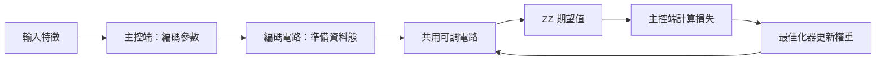

# Day 14｜資料編碼與可調電路：組成可訓練的量子模型

[Day13](../day13/README.md) 將資料轉成量子態的振幅，區分正規化與實際狀態準備，並核對直接載入模擬器與 RY／CNOT 電路兩條路徑。Day14 接著把角度編碼與振幅編碼接到共用的可調電路與訓練介面，整理成後續分類任務可延伸的模型。

**一個可訓練的量子模型，需要把資料編碼、可調電路、量測與權重更新接在一起。** 清楚區分各部分的用途，才能更換編碼或調整電路時，知道哪些設定與檢查也要跟著改變。Feature map（資料編碼電路）負責準備輸入對應的量子態；Ansatz（含可調權重的電路結構）接著改變狀態；固定的 `Z0Z1` 讀出提供數值；一般 Python 程式再計算預測誤差 並更新權重。本章讓兩種編碼共用同一份 Ansatz，但仍分別檢查輸入維度與前處理規則，因為更換編碼並不代表可以直接使用相同格式的資料。另一個重點是：對一次編碼後的所有資料施加相同量子閘序列，可以改變讀出結果，卻無法重新區分已經編成相同物理態的輸入。實作提供單筆與批次前向介面，並接回 Day10 的座標搜尋，透過短訓練確認元件能一起運作。保存模型時，除了權重，也需要記錄編碼與電路結構。本章兩種編碼使用不同合成資料，短訓練只確認元件能一起運作，不能用誤差高低判定編碼優劣。

[Day13](../day13/README.md) encoded data into quantum-state amplitudes, distinguished normalization from state preparation, and checked both direct simulator loading and explicit RY/CNOT circuits. Day14 connects angle and amplitude encoding to a shared adjustable circuit and training interface, creating a model that can support the classification task developed next.

**A trainable quantum model connects data encoding, an adjustable circuit, measurement, and weight updates.** Keeping their roles clear helps identify which settings and checks must change when an encoding or circuit is replaced. The feature map prepares the state associated with an input. The Ansatz, a circuit structure with adjustable weights, then transforms that state. A fixed `Z0Z1` readout supplies a numerical output, and ordinary Python code calculates the loss and updates the weights. Both encodings share the same Ansatz implementation, but their input dimensions and preprocessing rules are checked separately: interchangeable encoding components do not imply identical input formats. Another key point is that applying the same gate sequence to all states after a single encoding can change readout values, but cannot distinguish inputs already mapped to the same physical state. The implementation provides single-input and batch forward interfaces and reconnects Day10's coordinate search for short training runs that check integration. Saved models need encoding and structural settings as well as weights. These short training runs check that the components work together; their errors cannot rank the encodings because the synthetic datasets differ.

---

Day 12、13 已分別準備角度編碼與振幅編碼狀態。今天將它們接到 **同一個電路模板、同一個 ZZ 輸出讀取、同一個最佳化器介面**，建立 Day 15 分類任務可延伸的模型骨架。

完整程式：[model.py](model.py)、[demo.py](demo.py)、[experiment.py](experiment.py)。本日重用既有量子核心程式，沒有複製另一份可訓練電路。

## 1. 模型的四個邊界



```text
|ψ(x,w)⟩ = U_ansatz(w) U_feature(x)|00⟩
f(x,w) = ⟨ψ(x,w)|Z0 Z1|ψ(x,w)⟩
```

量子機器學習（Quantum Machine Learning，QML）讓量子計算參與機器學習。特徵是描述輸入樣本的數值，權重是訓練時調整的模型係數，量子核心程式（quantum kernel）則是描述量子操作的函式。

式中的 `x` 是資料、`w` 是權重，`U` 表示電路操作；從右向左先準備資料態，再套用可調電路。`ψ` 是最後狀態的名稱，`f(x,w)` 是預測輸出。

特徵決定資料表示；權重由最佳化器更新；層數決定電路結構；可觀測量決定輸出語意。把它們全部叫作「參數」很容易在程式中混用。

| 物件 | 本日實作 | 誰更新 |
|---|---|---|
| 模型設定 | `Config(encoding, layers)` | 使用者選定，不可直接改寫欄位的資料類別 |
| 資料引數 | `encode(features, config)` | 每筆輸入經主控端轉換 |
| 可訓練權重 | 長度 `4*layers` 的向量 | 一般電腦上的最佳化器 |
| 輸出讀取 | 固定 ZZ | 本日模型定義 |

設定（config）記錄模型的編碼方式與層數；此處使用不可直接改寫欄位的資料類別，讓建立後的設定保持固定。主控端（host）是安排電路執行與處理資料的一般 Python 程式。

`Config` 限定角度編碼／振幅編碼、層數=1–3。配置兩個量子位元的工作只在外層量子核心程式做一次，資料編碼電路與電路模板共享同一個量子暫存器，也就是一組量子位元。CUDA-Q 支援量子核心程式呼叫子函式，並以 `cudaq.qview` 傳入既有量子位元。[D11]

## 2. 更換編碼時，輸入格式也要檢查

| 編碼 | 接受的特徵 | 主控端前處理 | 準備量子核心程式 |
|---|---|---|---|
| 角度編碼 | 兩個已縮放至 [−1,1] 的值 | Day 12 positive_half：π(x+1)/2 | Day 9 `feature_map`，兩個 RY |
| 振幅編碼 | 3 或 4 個有限實數，整個向量不可全零 | Day 13 補零、L2 正規化、量子閘角度 | Day 13 `prepare`，3 RY＋2 CNOT |

角度編碼（angle encoding）將資料轉成旋轉角度；振幅編碼（amplitude encoding）將資料轉成狀態向量的係數。振幅的絕對值平方才是量測機率。L2 正規化將各分量除以向量長度，長度是分量絕對值平方相加後的平方根。有限數值不包含無限大或無效數值。

振幅編碼輸入的**整個向量**不能全零，個別元素可以是零或負數。限定 3／4 維是為了和本日兩個量子位元的電路模板對接；Day 13 的兩維資料只需要一個量子位元，本日明確拒絕，不偷偷改變配置。

角度編碼的原始資料集仍須在外部使用 Day 11 的僅由訓練資料決定的縮放器。縮放器（scaler）保存由訓練資料計算的數值轉換規則；批次（batch）是一組一起交給介面處理的樣本。模型不會對每個批次重新計算縮放規則，以免同一筆資料隨同行樣本改變表示。預設角度策略是 Day 12 的 positive_half，與 Day 9 原本 θ=πx 不同；因此不能把兩個模型的同一組權重當成完全相同的函數。

當把模型用於真實資料時，保存權重之外，還須保存設定、scaler、欄位順序及標籤／讀出定義。本日輸出的訓練紀錄保存合成特徵、設定、標籤和權重；沒有外部縮放器紀錄，因為實驗直接使用已指定的數值，沒有需要從公分、公斤等原始單位縮放的資料。標籤是訓練時用來比較的正確答案。

## 3. 電路模板只維護一份

電路模板（ansatz）是預先安排、含可調權重的操作組合。RY 以角度旋轉單一量子位元的狀態；CNOT 是受控反相閘，控制位元為 1 時翻轉目標位元。q0、q1 是位元編號。沿用 Day 9 每層的結構：

```text
RY(w0) on q0 + RY(w1) on q1
CNOT(q0 → q1)
RY(w2) on q0 + RY(w3) on q1
```

一層四個權重；L 層共有 4L。核心組合為：

```python
@cudaq.kernel
def preparation(q: cudaq.qview, data: list[float], weights: list[float],
                encoding: int, layers: int):
    if encoding == 0:
        feature_map(q, data)
    else:
        amplitude_prepare(q, data, 2)
    ansatz(q, weights, layers)
```

`qview` 用來操作已配置的量子位元，`list[float]` 表示浮點數清單，`int` 是整數；浮點數是電腦以有限位數表示的小數。`if` 依編碼選項選擇準備方法，再呼叫共用模板。

資料狀態準備在最前面執行一次，電路模板內部重複 L 層。這不是每層重新輸入 x 的資料重複編碼電路。

零權重不會消除 CNOT：奇數層仍保留一個 CNOT，偶數層的連續 CNOT 可相消。測試以角度編碼特徵 `[0,1]` 核對一層零權重的 ZZ=−1、兩層 ZZ=0。初始化是指定起始權重，單位操作則是完全不改變狀態，以 `I` 表示。兩者不同。

本日資料和旋轉皆為實數 RY 結構，不能表示任意複數量子態；也沒有宣稱這個電路模板是通用或最適合分類的設計。

## 4. 共用電路模板能改變讀出，但不能修復編碼碰撞

么正操作（unitary）保持狀態向量的長度與內積，且能反向還原。內積描述兩個狀態的重疊，對複數向量需先對第一個向量取共軛再計算。`U†` 是共軛轉置，也就是交換矩陣的列與欄並將虛部反號；么正性使 `U†U=I`。固定同一組 w，便有：

```text
⟨Uψ(a)|Uψ(b)⟩ = ⟨ψ(a)|U†U|ψ(b)⟩ = ⟨ψ(a)|ψ(b)⟩
```

因此單次資料編碼之後加上共用電路模板，不會改變兩筆資料的狀態重疊。它能調整量子態相對於選定可觀測量的方向，從而改變 ZZ 預測；不能讓原本相同的資料態變得不同。

例如振幅編碼 `[3,4,0]` 與 `[30,40,0]` 正規化後相同。測試確認加入非零權重後預測仍相同。若任務標籤依賴原始大小，這個模型必須重新設計輸入表示，不能只增加最佳化器迭代。

這個結論針對「同一么正操作作用在一次編碼之後」。本日未實作資料重複編碼、雜訊通道或依 x 改變的後續操作，不能直接把公式套到不同結構上。

## 5. 單筆與批次的前向計算介面

```python
import cudaq
from articles.day14.model import Config, initialize, predict, predict_batch

cudaq.set_target('qpp-cpu')
config = Config(encoding='angle', layers=1)
weights = initialize(config.layers, seed=42)
value = predict([0.25, -0.4], weights, config)
values = predict_batch([[0.25, -0.4], [0.8, 0.5]], weights, config)
```

API 是程式呼叫功能的介面。前向計算固定權重，從輸入算到輸出，不會更新權重。NumPy 是 Python 的數值運算套件，一維陣列是按順序排列的一串數值。

批次是主控端上逐筆執行，回傳一維 NumPy 陣列，沒有宣稱量子並行載入或 GPU 批次運算。輸入特徵與權重不被修改，錯誤編碼、形狀、非有限權重和空批次都有檢查。

ZZ 是 `Z0Z1` 的簡寫，量測兩個位元相同記為 +1、不同記為 −1。期望值是依機率計算的平均值，這裡的 ZZ 值在 [−1,1]，目前仍是期望值，不是分類機率。`circuit` 沒有量測，供精確 observe／狀態驗證；`measured` 共用狀態準備，另加兩個 mz，用各結果的次數計算 `(n00+n11−n01−n10)/總次數`，得到有限次抽樣的 ZZ 估計；`n00` 指 `00` 出現幾次，其餘同理。

## 6. 接回 Day 10 最佳化器

```python
from articles.day10.train import coordinate_search, mse

def objective(weights):
    return mse(predict_batch(features, weights, config), labels)

final_weights, history, stop_reason = coordinate_search(
    objective, initialize(config.layers, 42), sweeps=4)
```

座標搜尋每次只嘗試增減一個權重，接受誤差較低的候選值。MSE 是平均平方誤差：將每筆預測與答案的差距平方，再取平均。目標函數回傳這個誤差，讓最佳化器比較候選權重。

本日兩種編碼各使用三筆不同的合成輸入；標籤由相同模型家族的 NumPy 教師模型、權重=`[0.2,0.6,-0.3,0.4]` 產生。最佳化器只取得單一損失數值，不直接拿教師權重更新自己。

教師模型（teacher）在此只是產生合成答案的固定參考模型，不是實際標註資料的人。

這是可達目標下的**訓練介面整合檢查**。兩種編碼的資料與標籤不同，不能比較它們的 MSE 高低來評定編碼優劣；沒有另外留出不參與訓練的保留資料，也未評估分類正確比例（準確率），或對新資料的表現（泛化能力）。正式分類資料切分與評分留待 Day 15。

每次短訓練最多四輪，四個權重每輪評估八個候選，加上初始損失共 33 次目標函數、99 次訓練 observe。步長是每次嘗試改動權重的幅度。紀錄保存每輪權重、損失、步長及評估次數；精確無噪聲期望值用於最佳化器，抽樣只用於前向計算展示。

## 7. 執行示範與完整實驗

CPU 是中央處理器，GPU 是擅長平行運算的圖形處理器。執行後端（backend）指定使用的模擬器；本章預設使用 CPU，`nvidia` 使用 GPU。`.venv` 是專案獨立保存套件的虛擬環境；`OMP_NUM_THREADS=1` 將 CPU 平行工作的執行緒數設為 1。

沿用 `.venv`，沒有新增依賴；版本鏈：[requirements-day14.txt](../../requirements-day14.txt)。從專案根目錄執行：

```bash
source .venv/bin/activate
OMP_NUM_THREADS=1 python articles/day14/demo.py
OMP_NUM_THREADS=1 python articles/day14/demo.py --encoding amplitude --features 1 -2 3 -4
OMP_NUM_THREADS=1 python articles/day14/demo.py --encoding amplitude --layers 2 --backend nvidia

OMP_NUM_THREADS=1 python articles/day14/experiment.py
OMP_NUM_THREADS=1 python articles/day14/experiment.py --backend nvidia
```

隨機種子（seed）設定隨機序列的起點，方便重做權重初始化。保真度衡量兩個狀態的重疊，1 表示相同物理狀態；精確期望值直接由模擬器狀態計算，仍有有限數值精度的誤差。JSON 用欄位名稱保存資料，TXT 保存純文字。

每個執行後端包含 2 編碼方式 × 2 層數 × 零／隨機種子 42 的權重 × 3 筆特徵，共 24 組前向計算設定。每組核對 NumPy 狀態保真度、精確 ZZ，並保存 1,000 次量測的計數。另外執行兩個編碼的短訓練。

結果存於 `results/day14/<backend>/`：`predictions.json`、`training.json`、`summary.json`、兩種編碼的 `*_circuit.txt`。重跑更新該目錄，可用 `--output-dir /tmp/day14-check` 另存。

## 8. 驗證與下一步

```bash
OMP_NUM_THREADS=1 python -m unittest discover -s articles/day14 -p 'test_*.py' -v
OMP_NUM_THREADS=1 DAY14_TARGET=nvidia python -m unittest discover -s articles/day14 -p 'test_*.py' -v
```

六個測試包含設定／輸入契約、兩種編碼的 L=1–3 組合、批次與輸入不變性、零權重的 CNOT、權重調整影響，以及振幅編碼尺度碰撞。完整前向計算／訓練數字見 [結果紀錄](../../results/day14/README.md)。

本日完成可訓練模型骨架，所有執行為模擬器正確性驗證與整合檢查，沒有使用實際執行量子操作的量子處理器（QPU），也未比較速度或證明量子方法優於適當的一般計算方法。[Day 15](../day15/README.md) 將加入真正的量子分類器任務與評分流程。

## 9. 來源與重用

[D11] [NVIDIA Quantum Kernels](https://nvidia.github.io/cuda-quantum/latest/specification/cudaq/kernels.html)：量子核心程式組合、程式入口與 qview 子函式。查閱日期 2026-09-07，實際 CUDA-Q 0.15.1。

模型重用 Day 9 電路模板、Day 12 角度策略、Day 13 明確振幅態準備電路與 Day 10 最佳化器。么正操作保持重疊的結論由上式推導；來源索引見 [REFERENCES.md](../../REFERENCES.md)。
