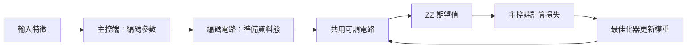

# Day 14｜資料編碼與可調電路：組成可訓練的量子模型

Day 12、13 分別把資料變成「角度」或「振幅狀態」。今天要把兩邊接到**同一套可調電路、同一個 ZZ 讀出、同一個最佳化器介面**，組成 Day 15 分類任務能繼續用的模型骨架。

想像組一套音響：麥克風（資料怎麼進來）、等化器（可調旋鈕）、喇叭（怎麼讀出聲音）、調音師（依誤差調旋鈕）。插頭規格不同，不能假裝「換麥克風就直接接」；而且若兩段錄音在進等化器前已經完全一樣，後面怎麼調旋鈕也分不出來。

完整程式：[model.py](model.py)、[demo.py](demo.py)、[experiment.py](experiment.py)。本日重用既有量子核心程式，沒有另抄一份可訓練電路。

Day14 connects angle and amplitude encoding to one shared ansatz, ZZ readout, and Day10's coordinate-search interface. Forward checks and short synthetic training verify integration. Lower MSE on different toy datasets does not rank encodings, and the chapter does not claim QPU results, generalization, or quantum advantage.

---

## 1. 先畫清四個邊界



```text
|ψ(x,w)⟩ = U_ansatz(w) U_feature(x)|00⟩
f(x,w) = ⟨ψ(x,w)|Z0 Z1|ψ(x,w)⟩
```

由右往左：先依資料 `x` 準備狀態，再套用權重 `w` 的可調電路；最後讀 ZZ 得到預測 `f`。

| 物件 | 本日實作 | 誰改它 |
|---|---|---|
| 模型設定 | `Config(encoding, layers)` | 使用者選定後固定 |
| 資料引數 | `encode(features, config)` | 每筆輸入經主控端轉換 |
| 可訓練權重 | 長度 `4 × layers` | 一般電腦上的最佳化器 |
| 輸出讀取 | 固定 ZZ | 本日模型定義 |

全部都叫「參數」很容易混。**設定**記編碼方式與層數；**主控端**是安排執行與處理資料的一般 Python 程式。`Config` 只允許角度／振幅編碼、層數 1–3。兩個量子位元只在外層配置一次，編碼與模板共用同一個暫存器；子函式透過 `cudaq.qview` 操作既有位元。[D11]

## 2. 換編碼，就要換輸入契約

| 編碼 | 接受什麼 | 主控端先做什麼 | 準備電路 |
|---|---|---|---|
| 角度 | 兩個已縮到 [−1,1] 的值 | Day 12 `positive_half`：π(x+1)/2 | Day 9 `feature_map`（兩個 RY） |
| 振幅 | 3 或 4 個有限實數，**整向量不可全零** | Day 13 補零、L2 正規化、閘角度 | Day 13 `prepare`（3 RY＋2 CNOT） |

白話：角度編碼吃「兩個刻度」；振幅編碼吃「一小段向量係數」。元件可互換，**不代表資料格式相同**。

振幅路徑允許個別元素為零或負數，但整段不能全零。只接 3／4 維，是為了對上本日兩個位元的模板；Day 13 的兩維（一個位元）在此明確拒絕，不偷偷改配置。

角度路徑若接真實資料，仍須在外部用 Day 11「只看訓練集」的縮放器。模型**不會**對每個批次重算縮放範圍，以免同一筆資料因同行樣本不同而改變表示。預設角度策略是 `positive_half`，與 Day 9 的 `θ=πx` 不同，因此不能把兩套模型的同一組權重當成同一個函數。

真正部署時，保存權重之外，還要保存設定、縮放器、欄位順序與標籤／讀出定義。本日實驗直接使用已指定的合成數值，訓練紀錄裡沒有外部縮放器檔。

## 3. 可調電路只維護一份

**電路模板（ansatz）**是預先排好、含可調權重的操作。沿用 Day 9 每層：

```text
RY(w0) on q0 + RY(w1) on q1
CNOT(q0 → q1)
RY(w2) on q0 + RY(w3) on q1
```

一層四個權重；L 層共 `4L`。組合核心：

```python
@cudaq.kernel
def preparation(q: cudaq.qview, data: list[float], weights: list[float],
                encoding: int, layers: int):
    if encoding == 0:
        feature_map(q, data)
    else:
        amplitude_prepare(q, data, 2)
    ansatz(q, weights, layers)
```

資料態只在最前面準備一次，模板再重複 L 層。這**不是**每層重新灌一次資料的「資料重複編碼」。

權重全零也不等於「什麼都沒做」：奇數層仍留一個 CNOT；偶數層連續兩個 CNOT 可相消。測試用角度特徵 `[0,1]` 核對一層零權重 ZZ=−1、兩層 ZZ=0。本日結構是實數 RY，不能表示任意複數態；也不宣稱這是通用或最適合分類的模板。

## 4. 共用模板能改讀出，修不好編碼碰撞

對固定權重的么正操作 `U`（能反向還原、保長度與內積的操作）：

```text
⟨Uψ(a)|Uψ(b)⟩ = ⟨ψ(a)|ψ(b)⟩
```

意思是：兩筆資料編碼後若已相同，後面再套同一組旋鈕，**重疊度不變**。模板可以改變狀態相對 ZZ 的方向，從而改預測數字；但不能讓「本來就撞在一起的資料態」突然分開。

例如振幅編碼的 `[3,4,0]` 與 `[30,40,0]` 正規化後相同；測試確認加上非零權重後預測仍相同。若標籤其實依賴原始大小，必須改輸入表示，不能只多跑幾輪最佳化。

此結論針對「一次編碼後，對所有樣本施加同一么正模板」。本日未做資料重複編碼、雜訊通道或依 `x` 改變的後續操作，公式不要直接套到那些結構。

## 5. 單筆與批次前向介面

```python
import cudaq
from articles.day14.model import Config, initialize, predict, predict_batch

cudaq.set_target('qpp-cpu')
config = Config(encoding='angle', layers=1)
weights = initialize(config.layers, seed=42)
value = predict([0.25, -0.4], weights, config)
values = predict_batch([[0.25, -0.4], [0.8, 0.5]], weights, config)
```

**前向計算**固定權重、從輸入算到輸出，不更新權重。批次是主控端**逐筆**呼叫，回傳一維 NumPy 陣列；沒有宣稱量子並行載入或 GPU 批次加速。輸入與權重不被修改；錯誤編碼、形狀、非有限權重與空批次都會被拒絕。

ZZ 把兩個量測位元相同記 +1、不同記 −1，期望值落在 `[−1, 1]`，**還不是**分類機率。`circuit` 不含量測，供精算 `observe`／狀態檢查；`measured` 共用準備再加兩個 `mz`，用 `(n00+n11−n01−n10)/總次數` 估計 ZZ。

## 6. 接回 Day 10 的最佳化器：整合檢查，不是編碼賽

```python
from articles.day10.train import coordinate_search, mse

def objective(weights):
    return mse(predict_batch(features, weights, config), labels)

final_weights, history, stop_reason = coordinate_search(
    objective, initialize(config.layers, 42), sweeps=4)
```

座標搜尋一次試改一個權重；MSE 是預測與答案差距的平均平方。兩種編碼各用三筆不同的合成輸入；標籤由同家族的 NumPy「教師模型」（固定權重 `[0.2,0.6,-0.3,0.4]`）產生。最佳化器只看到單一損失數字，拿不到教師權重本身。

這是**訓練介面能不能接上**的檢查：沒有 holdout、沒有準確率、沒有泛化評估。兩種編碼的資料與標籤不同，**不能**用 MSE 高低排編碼優劣。正式分類切分與評分留到 Day 15。

短訓練最多四輪：每輪八個候選＋初始損失 → 33 次目標函數、99 次訓練 `observe`。精算無雜訊期望值進最佳化器；抽樣只用於前向展示。

## 7. 怎麼跑示範與實驗

沿用 `.venv`；固定依賴見 [requirements-day14.txt](../../requirements-day14.txt)。

```bash
source .venv/bin/activate
OMP_NUM_THREADS=1 python articles/day14/demo.py
OMP_NUM_THREADS=1 python articles/day14/demo.py --encoding amplitude --features 1 -2 3 -4
OMP_NUM_THREADS=1 python articles/day14/demo.py --encoding amplitude --layers 2 --backend nvidia

OMP_NUM_THREADS=1 python articles/day14/experiment.py
OMP_NUM_THREADS=1 python articles/day14/experiment.py --backend nvidia
```

每個後端：2 編碼 × 2 層數 × 零／種子 42 權重 × 3 筆特徵 → **24** 組前向計算；每組核對 NumPy 保真度、精算 ZZ，並保存 1,000 次量測計數。另跑兩種編碼的短訓練。

結果在 `results/day14/<backend>/`：`predictions.json`、`training.json`、`summary.json`、兩種編碼的 `*_circuit.txt`。可用 `--output-dir /tmp/day14-check` 另存。參考數字：四輪後角度／振幅路徑的訓練 MSE 都明顯下降（例如 CPU 約 0.38→0.015 與 0.36→0.017），但那只說明介面可訓練，不是編碼排名。

## 8. 驗證與限制

```bash
OMP_NUM_THREADS=1 python -m unittest discover -s articles/day14 -p 'test_*.py' -v
OMP_NUM_THREADS=1 DAY14_TARGET=nvidia python -m unittest discover -s articles/day14 -p 'test_*.py' -v
```

六個測試涵蓋：設定／輸入契約、兩種編碼 × 層數組合、批次與輸入不變性、零權重 CNOT、權重能拉動輸出，以及振幅尺度碰撞。完整數字見 [結果紀錄](../../results/day14/README.md)。

本日完成可訓練模型骨架：編碼、模板、讀出與最佳化可分開替換，輸入契約與保存清單寫清楚；么正重疊說明共用模板改得了讀出、修不好編碼碰撞。短訓練只確認**元件能一起動**，不是編碼優劣排名。沒有 QPU、沒有速度比較、沒有「量子優於經典」的證明。

[Day 15](../day15/README.md) 會加上真正的分類標籤、資料切分、模型保存與評分。

## 9. 來源與重用

[D11] [NVIDIA Quantum Kernels](https://nvidia.github.io/cuda-quantum/latest/specification/cudaq/kernels.html)：量子核心程式組合與 `qview` 子函式。查閱日期 2026-09-07，實際 CUDA-Q 0.15.1。

模型重用 Day 9 模板、Day 12 角度策略、Day 13 振幅準備與 Day 10 最佳化器。么正操作保持重疊由上式推導；索引見 [REFERENCES.md](../../REFERENCES.md)。

## 延伸研究

[N3] Seungcheol Oh et al. “Fourier Analysis Perspective on Quantum Neural Networks.” Communications Physics 9, 176 (2026)；觀點論文。[原始來源](https://doi.org/10.1038/s42005-026-02680-x)；[完整書目](../../REFERENCES.md#n3)。

本章組合資料編碼與可訓練電路；延伸閱讀可觀察這種組合如何限制模型能出現的頻率成分。
