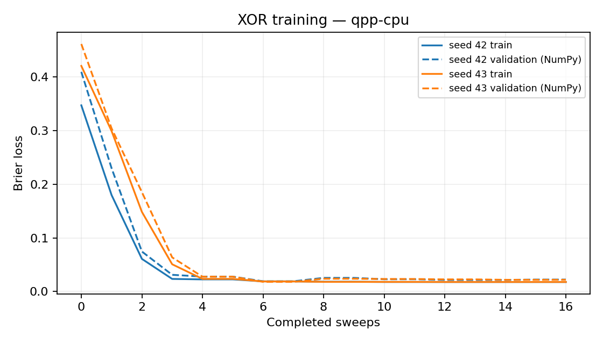
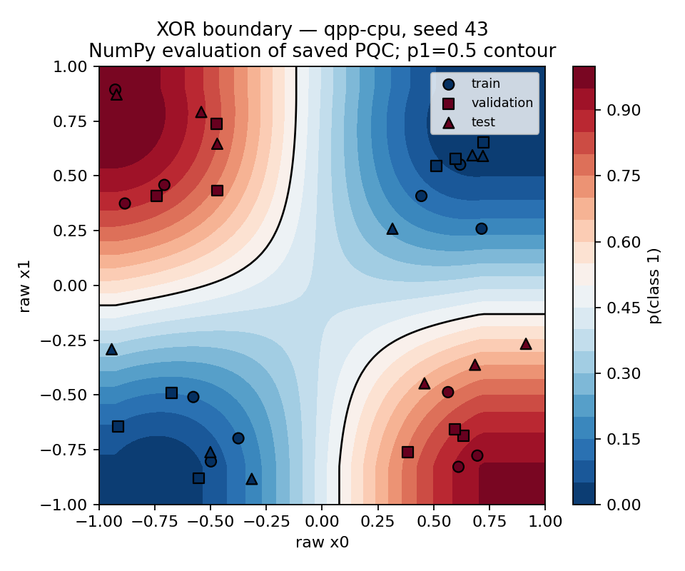

# Day 15｜第一個 CUDA-Q 量子分類器：訓練、評分與模型保存

Day 14 把編碼、可調電路、讀出與最佳化器接成骨架。今天補上分類真正需要的流程：**標籤、資料切分、訓練、選模型、評分、存檔、重新載入還能預測**。

用考試打比方：練習題用來學會怎麼寫（訓練集）、模擬考用來挑哪套複習法比較穩（驗證集）、真正考卷最後才拆封評分（測試集）。若用真正考卷決定要不要改答案規則，成績就不可信。電路先給出一個介於 −1 與 1 的分數，再依固定公式變成「像機率的數字」，最後用 0.5 門檻判成類別 0 或 1。

任務是小型 **XOR**：兩個座標異號為類別 1，同號為類別 0。程式入口：[classifier.py](classifier.py)、[experiment.py](experiment.py)、[demo.py](demo.py)、[plot_results.py](plot_results.py)。

Day15 builds a reloadable XOR classifier on Day14's angle-encoded circuit: train/validation/test splits, Brier loss with coordinate search, checkpointing, curves, and a decision-boundary plot. Exact-simulator training and a separate finite-shot test are recorded without claiming real-data generalization, QPU results, or quantum advantage.

---

## 1. 任務與資料：先說清楚誰可以影響什麼

**XOR（互斥或）**：兩個條件「剛好一個成立」時為真。這裡把座標正負號當兩個條件：

```python
y = (x0 * x1 < 0).astype(int)
```

乘積小於 0 表示異號 → 類別 1；否則類別 0。

`dataset(seed=2026)` 在四個象限各抽三筆，座標絕對值在 `[0.25, 0.95]`。訓練／驗證／測試各 12 筆，共 36 筆；每組各六筆類別 0／1，無重複樣本。種子與實際樣本都保存。

這是離座標軸有間隔的小型合成資料。測試成績**只描述這份切分**，不是「整個 XOR 平面都學好了」，也不是真實資料的泛化估計。

| 資料分組 | 用途 | 會不會改權重／選模型？ |
|---|---|---|
| 訓練 | 訂縮放規則、算訓練損失 | 會更新權重 |
| 驗證 | 比較兩個初始化誰比較好 | 只選種子，不更新權重 |
| 測試 | 選定後才評分 | 否 |

縮放器仍只用訓練集的最小／最大值；驗證／測試只套用規則，越界截斷並留旗標。先切分再訂規則，避免**資料洩漏**（評估資料提前影響前處理或模型）。[D14]

## 2. 電路分數 → 機率 → 類別

固定 Day 14 的 `Config('angle', 1)`：`positive_half` 角度映射、兩位元、四個權重、ZZ 讀出。

```text
f(x,w) = ⟨Z0 Z1⟩
p(class 1 | x,w) = (1 − f)/2
predicted class = 1 if p >= 0.5 else 0
```

ZZ 在 `00`／`11` 為 +1，在 `01`／`10` 為 −1。因此 `p1` 是「兩個位元剛好不同」的量測機率，不是隨便把期望值改名叫機率。類別 1 的意義由本章 XOR 標籤定義；本章**沒有**做機率校準（例如預測 0.8 的樣本是否大約八成真的是該類）。

浮點數若因模擬誤差略微超出 `[0,1]`，允許在 `1e-5` 內截回；明顯越界則拒絕。`p=0.5` 平手固定判為類別 1；常數比較基準也用同一規則。

## 3. 損失與最佳化器：練的是機率誤差

使用 **Brier 損失**：預測機率與 0／1 標籤的平均平方誤差。

```text
L(w) = mean((p1(x,w) − y)²)
```

例如 `p1=0.8`、`y=1`，該筆平方誤差是 0.04。它和 Day 10「直接對期望值做回歸」的目標不同，但同樣在主控端算完，再交給座標搜尋（一次試改一個權重，變差就退回）：

```python
def objective(weights):
    p = probabilities(predict_batch(train_scaled, weights, CONFIG))
    return metrics(train_labels, p)['brier']

weights, history, reason = coordinate_search(
    objective, initialize(1, seed), sweeps=16)
```

預先固定：初始化種子 42／43、每種子最多 16 輪、初始步長 0.4、步長門檻 `1e-4`。**沒有**根據測試集改電路、預算或分類門檻。完整 16 輪約 129 次目標函數、1,548 次訓練 `observe`。

訓練用無雜訊精算期望值（`shots_count=-1`），不把抽樣波動放進候選比較。紀錄保存每輪權重、損失、步長與累積評估次數。

## 4. 怎麼選模型？怎麼報成績？

兩個種子都跑完後，取**最終驗證 Brier 較低者**；相同則取種子編號較小者。不從紀錄裡挑「某一輪訓練最好」。驗證曲線上的每輪參考值用 NumPy 畫圖；選模型時的最終驗證分數用 CUDA-Q。

選定後才載入檢查點，計算各分組預測與測試指標：

- **準確率**：固定 0.5 門檻下答對比例
- **Brier**：機率平方誤差
- **混淆矩陣**：列＝真實類別，欄＝預測類別（例如真實 0、預測 1 那格＝誤判成 1 的筆數）
- **常數基準**：所有樣本都輸出訓練標籤平均值（本例 0.5）→ 準確率 50%、Brier 0.25

常數基準只是最低限度對照，不是完整的經典機器學習公平比較；後者留待後續章節。

程式通過條件檢查數值正確性、兩種子訓練損失下降與量測次數；**不用測試準確率當單元測試門檻**，避免為了「測試變綠」去調測試成績。

參考結果（種子 2026 資料、選定種子 43）：CPU／GPU 測試準確率皆 100%、測試 Brier 約 0.051；混淆矩陣為 `[[6,0],[0,6]]`。100% **只描述這 12 筆離軸測試點**。

## 5. 檢查點：不只存權重

**檢查點（checkpoint）**是可重新載入的完整模型紀錄。只有權重不夠：還要知道資料怎麼縮放、欄位順序、輸出怎麼判類別，以及檔案格式版本。

`checkpoint.json` 含：格式版本、編碼／層數、`positive_half`、讀出、分類門檻、欄位順序、標籤規則、縮放器、權重、選定種子。

```bash
OMP_NUM_THREADS=1 python articles/day15/demo.py --features -0.7 0.7
```

示範讀原始座標、套用保存的縮放器，印出 `p1`、類別與截斷旗標。預設載入 CPU 檢查點；後端與路徑可分開指定：

```bash
OMP_NUM_THREADS=1 python articles/day15/demo.py \
  --checkpoint results/day15/nvidia/checkpoint.json \
  --backend nvidia --features 0.7 0.7
```

載入程式拒絕不支援的格式、設定、映射、讀出、門檻與錯誤權重，避免拿別種模型的參數硬推論。

## 6. 訓練曲線與決策邊界

[plot_results.py](plot_results.py) 匯出兩張 PNG：

- **訓練曲線**：兩種子的訓練 Brier 與驗證參考 Brier（含第 0 輪）
- **決策邊界**：保存模型在原始座標 `[−1,1]²`、81×81 網格上的 `p1`；黑線為 `p1=0.5`；散點標三個資料分組





網格用 Day 14 的 NumPy 參考值計算，避免為展示另跑 6,561 次 CUDA-Q；**不是** GPU 全網格效能評測。CUDA-Q 與參考值已在資料分組上逐筆核對；網格另存 `boundary_grid.npz`。網格也套用保存的縮放與截斷，訓練範圍外可能變平。

圖表只展示選定結果，沒有「看完測試圖再調參」。本日不宣稱決策邊界在整個連續平面都符合 XOR；座標軸附近確實不完全像理想 XOR。

## 7. 環境與重跑

本日新增固定版本 Matplotlib 等繪圖依賴；不改 CUDA-Q／NumPy 組合。

```bash
source .venv/bin/activate
python -m pip install -r requirements-day15.txt

OMP_NUM_THREADS=1 python articles/day15/experiment.py
OMP_NUM_THREADS=1 python articles/day15/experiment.py --backend nvidia

OMP_NUM_THREADS=1 python articles/day15/plot_results.py
OMP_NUM_THREADS=1 python articles/day15/plot_results.py --backend nvidia
```

結果在 `results/day15/<backend>/`：資料集、兩候選訓練紀錄、CSV、檢查點、各分組預測／指標、測試抽樣、摘要，以及兩張 PNG 與邊界網格。可用 `--output-dir /tmp/day15-check` 另存。細節見 [結果紀錄](../../results/day15/README.md)。

## 8. 精算訓練後的有限次量測，以及單元測試

選定模型後，測試集每筆另抽樣 1,000 次，由 `01`／`10` 計數估 `p1`。這是**精算訓練後的抽樣評估**，不是用抽樣來訓練。靠近 0.5 的樣本可能因抽樣翻轉分類。

```bash
OMP_NUM_THREADS=1 python -m unittest discover -s articles/day15 -p 'test_*.py' -v
OMP_NUM_THREADS=1 DAY15_TARGET=nvidia python -m unittest discover -s articles/day15 -p 'test_*.py' -v
```

四個測試涵蓋：分組不重疊、標籤與固定種子、機率／門檻／混淆矩陣、浮點容許範圍，以及存檔再載入後 CUDA-Q／NumPy 預測一致。

Day 11–15 至此交付：可重載的量子分類器、訓練曲線、決策邊界。流程涵蓋資料切分、洩漏防護、選模規則、檢查點語意與常數基準對照。成績屬於合成 XOR、無雜訊模擬器；測試 100% 僅限這 12 筆。它不是真實任務泛化報告，也不是 QPU 或量子優勢證據。

下一篇 [Day 16](../day16/README.md) 比較這類模型與一般神經網路。

## 9. 來源

[D14] [scikit-learn Common pitfalls](https://scikit-learn.org/stable/common_pitfalls.html)：資料切分、前處理與資料洩漏；本日以 NumPy 實作，未新增 scikit-learn。查閱日期 2026-09-07。

電路、縮放器與最佳化器分別沿用 Day 14、11、10。同位性機率與 Brier 定義在本文明示；索引見 [REFERENCES.md](../../REFERENCES.md)。

## 延伸研究

[N5] Brian Coyle et al. “Training-efficient density quantum machine learning.” npj Quantum Information 11, 172 (2025)；研究論文。[原始來源](https://doi.org/10.1038/s41534-025-01099-6)；[完整書目](../../REFERENCES.md#n5)。

本章建立量子分類器；這篇研究可作為不同模型結構與訓練成本的比較入口。本章並未採用該論文的機率混合架構。
