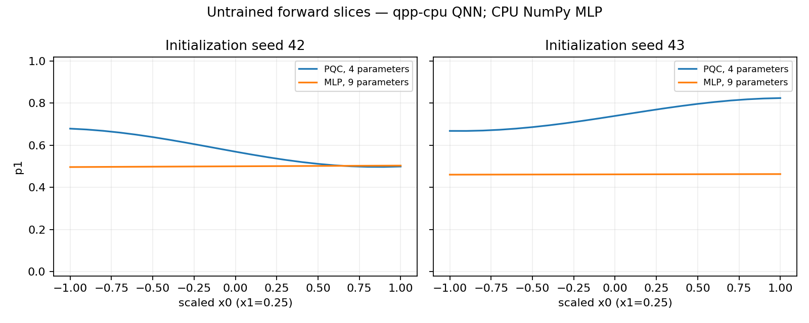

# Day 16｜量子神經網路與一般神經網路：參數、運算與輸出的差別

[Day15](../day15/README.md) 完成具有資料切分、模型保存與評分流程的 XOR 量子分類器，將電路輸出接到實際的分類標籤。Day16 接著比較這類量子模型與一般神經網路的內部計算，釐清共同的訓練介面背後有哪些重要差異。

**量子模型與一般神經網路都能依預測誤差調整參數，但內部的參數與運算規則不同。** 比較之前，需要先釐清每個數值在模型裡代表什麼。本章將 QNN（量子神經網路）的範圍限定為前幾章的參數化電路模型，並與小型 MLP（多層感知器）使用相同二維輸入、各自產生一個數值輸出。QNN 的四個權重是旋轉角度，MLP 的九個參數則是連接權重與偏差；量子態中的振幅也不等於可獨立訓練的神經元。核心重點是分清楚「對什麼而言是線性」：固定量子閘對狀態向量的作用是線性的，但輸入經角度編碼、電路運算與期望值讀出後，仍可形成非線性函數，例如 `RY(θ)` 後的 Z 期望值為 `cos(θ)`。實作比較重新初始化、尚未訓練的兩種模型，觀察輸出曲線、單一參數改動與旋轉角度的週期性，並核對數值正確性。相同的輸出介面不代表相同模型能力；未訓練曲線的形狀，也不能用來判定分類成效或量子優勢。

[Day15](../day15/README.md) completed an XOR quantum classifier with data splits, model persistence, and evaluation, connecting circuit outputs to class labels. Day16 compares the internal computation of this type of quantum model with a conventional neural network, clarifying the differences behind a shared training interface.

**Quantum models and conventional neural networks can both adjust parameters using prediction errors, but their parameters and internal operations have different meanings.** Those differences need to be clear before comparing the models. Here, QNN refers specifically to the parameterized circuit model developed in earlier chapters. A small multilayer perceptron (MLP) receives the same two-dimensional inputs, and each model produces a scalar output. The QNN's four weights are rotation angles, whereas the MLP's nine parameters are connection weights and biases. Quantum-state amplitudes are not independently trainable neurons. A central distinction is what linearity refers to: a fixed quantum gate acts linearly on a state vector, but angle encoding, circuit operations, and expectation readout can together form a nonlinear function of the input. For example, the Z expectation after `RY(θ)` is `cos(θ)`. The implementation compares newly initialized, untrained models through output curves, individual parameter changes, and rotation-angle periodicity, while checking numerical correctness. A shared output interface does not imply equal model capacity, and untrained curve shapes cannot establish classification performance or quantum advantage.

---

**在本系列，QNN 指以參數化量子電路提供可訓練輸出的模型；它能接入機器學習流程，但不等同把 MLP 的神經元換成量子位元。** QNN 也不是所有文獻中只有一種架構的名稱。本文聚焦 Day 14–15 使用的可調參數的電路分類器。

今天以相同二維輸入與單一機率數值介面，比較一個四參數 PQC 和九參數 MLP。程式：[models.py](models.py)、[demo.py](demo.py)、[experiment.py](experiment.py)。兩者都重新初始化，沒有載入 Day 15 訓練權重，沒有準確率排名。

## 1. 相似的是訓練介面

QNN 是量子神經網路（Quantum Neural Network），本章特指參數化量子電路（Parameterized Quantum Circuit，PQC）模型。MLP 是多層感知器（Multilayer Perceptron），由多層一般數值計算組成。神經元是把多個輸入加權、加上偏差再轉換輸出的計算單位，不是生物神經細胞。

```text
輸入特徵 → 模型與權重 → 預測 → 計算誤差 → 最佳化器更新權重
```

特徵是描述樣本的數值；損失函數衡量預測與答案的差距，最佳化器則依誤差選擇新的參數。前向計算是固定參數後從輸入算到輸出，不包含更新。

Day 15 的量子模型與 MLP 都可以提供單一損失值給最佳化器。但相同的介面不代表相同的內部計算、參數意義或成本。NVIDIA 的 Hybrid QNN 教學示範將一般神經網路層與量子期望值組合，提供這種整合的實例。[D15] 本文不安裝 PyTorch，也不移植該版本教學的梯度實作。

| 項目 | 本日 PQC／QNN | 本日 MLP |
|---|---|---|
| 輸入 | 兩個已縮放特徵 | 同一組特徵 |
| 內部 | RY 資料編碼電路＋一層 RY／CNOT 可調電路模板 | 2→2→1 全連接層 |
| 參數 | 四個旋轉角度 | 連接權重與偏差，共九個 |
| 非線性表現 | 角度編碼及期望值對輸入／參數的函數 | 隱藏層 tanh 活化函數＋sigmoid 輸出 |
| 單一數值輸出 | p1=(1−ZZ)/2 | sigmoid(logit) |
| 本日執行 | qpp-cpu 或 nvidia 模擬器 | NumPy 主控端 CPU |

CPU 是中央處理器，GPU 是擅長平行運算的圖形處理器；NumPy 是 Python 數值運算套件。執行後端指定使用的模擬器，模擬器以一般電腦運算模仿量子電路。

GPU 執行後端指 QNN 的模擬器；本日 MLP 在兩次執行中都由 CPU NumPy 計算。沒有做兩者速度比較。

## 2. 九個 MLP 參數怎麼數？

全連接層將上一層每個輸出連到下一層每個計算單位，每條連線都有權重；偏差（bias）是加到加權和上的常數。2→2→1 表示兩個輸入、兩個隱藏單位與一個輸出。隱藏層是輸入和最終輸出之間的計算層。

活化函數將加權和轉成另一個數值，讓模型能表示更複雜的關係。`tanh` 將數值壓到 −1 與 1 之間；`sigmoid(z)=1/(1+exp(−z))` 則轉到 0 與 1 之間。`exp` 是指數函數，`logit` 在此指套用 sigmoid 前的原始分數。下式的 `h` 是隱藏層輸出，`z` 是原始分數，`p1` 是最後輸出：

```text
h = tanh(x W1 + b1)
z = h W2 + b2
p1 = sigmoid(z)
```

| 部分 | 形狀 | 參數數量 |
|---|---|---:|
| W1 | 2×2 | 4 |
| b1 | 2 | 2 |
| W2 | 2 | 2 |
| b2 | 單一數值 | 1 |
| 合計 | | 9 |

`mlp_forward` 的權重展平成長度 9：前四個重新排列為 W1，第 4–5 個為 b1，第 6–7 個為 W2，最後一個為 b2。索引從 0 起算。

```python
hidden = np.tanh(x @ w[:4].reshape(2, 2) + w[4:6])
logits = hidden @ w[6:8] + w[8]
p1 = 0.5 * (1 + np.tanh(logits / 2))
```

`@` 是矩陣乘法，`reshape` 將一串數值重新排成指定列數與欄數，`w[4:6]` 取索引 4、5 的值，不包含 6。

最後一行等價於 sigmoid，避免直接計算巨大 exp。測試另外用逐個隱藏神經元的單一數值公式核對批次矩陣計算，並驗證零權重輸出 0.5、只有輸出偏差時的解析結果。

這是刻意選擇的最小 MLP，不是為了匹配 QNN 容量而搜尋到的架構。

## 3. 四個 QNN 參數不是四個振幅

Day 14 一層可調電路模板有四個 RY 角度；兩個量子位元的純態恰好有四個複數振幅，但兩個「四」沒有一對一關係。

純態是能用單一向量完整描述的量子狀態。振幅是向量中的係數，可能是複數；絕對值平方才是量測機率。正規化要求這些機率總和為 1；整體相位則是所有振幅乘上同一個長度為 1 的複數，不影響物理預測。

權重決定量子閘，量子閘共同改變狀態。振幅是運算中間態，受正規化與整體相位等條件約束，不是四個獨立可訓練神經元。四個旋轉參數也不表示能自由指定任意四個複數振幅；本例僅使用 RY 旋轉從實數態出發。

CNOT 是兩個量子位元之間的么正操作，沒有新增一個浮點數權重。增加層數會增加旋轉參數和電路成本，不能直接對應成 MLP 隱藏層寬度。

## 4. 量子閘線性，為什麼輸出可以非線性？

么正操作保持向量長度與內積，且可以反向還原。線性表示先將向量加權組合再運算，等同先各自運算再用相同係數組合。固定么正操作 U，對任意向量 v、w 與係數 a、b：

```text
U(av+bw) = aUv+bUw
```

實驗用 Day 3 的 RY 矩陣核對此式。線性代數測試的向量組合不要求已正規化；它檢查矩陣作用的性質，不是宣稱所有係數組合都直接是合法量子態。

另一方面，從 |0⟩ 做 RY(θ) 再讀 Z：

```text
f(θ) = cos(θ)
f(π/4) − [f(0)+f(π/2)]/2 ≈ 0.207107
```

因此 θ→f(θ) 並非線性。θ 依賴輸入 x 時，模型也能對一般 x 呈現非線性，無需在量子位元振幅上插入 tanh。

期望值是依機率計算的平均值。`ψ†` 是向量的共軛轉置，表示轉成橫向並將虛部反號；`O` 是可觀測量的矩陣，也就是指定量測所關心的量。密度矩陣 `ρ` 可描述純態與機率混合，`Tr` 表示將矩陣對角線元素加總。

要區分三種敘述：

- U 對狀態向量的作用是線性。
- 期望值對純態振幅是二次形式 `ψ†Oψ`，對密度矩陣則是線性 `Tr(ρO)`。
- 一般特徵經角度編碼、參數化量子閘到期望值，可以形成非線性函數。

ReLU 是把負數改成 0、保留正數的活化函數。不能把這些結論簡化為「量測就是 ReLU」或「量子量子閘是非線性神經元」。本例的精確期望值是結果確定的模擬器計算，仍然會呈現上述非線性，不需要抽樣噪聲才產生它。

## 5. 參數幾何也不同

單個 RY 角度增加 2π，該量子閘只差整體相位，所以本例的預測不變。測試逐一對四個 QNN 權重加 2π 核對。MLP 的一般連接權重沒有同樣的 2π 週期規則。

當輸入很大或很小時，tanh 與 sigmoid 會接近各自的上下限，這稱為飽和，因此某些參數改變可能很難反映到輸出。

tanh 或 sigmoid 可能使某些參數改動只造成很小的輸出變化；QNN 也可能因選定狀態、量子閘或可觀測量而不敏感。本日只做固定點的有限參數改動，**不是梯度、可訓練性或貧瘠高原證據**。

梯度描述參數微小變化時輸出的變化方向與幅度；可訓練性關心是否能用合理資源找到有效參數。貧瘠高原指特定條件下梯度隨規模快速縮小、使訓練困難的現象。

實驗固定特徵 `[0.25,-0.4]`、隨機種子 42，對每個參數分別加 −0.5、0、+0.5：QNN 共 4×3=12 組，MLP 共 9×3=27 組，合計 39 組。兩種模型的參數單位與用途不同，不能把相同改動量當成公平容量比較。

## 6. 同介面不代表同樣的輸出語意

QNN 的 p1 是 ZZ 奇數同位性的機率；MLP 的 p1 是 sigmoid 分數。ZZ 是 `Z0Z1` 的簡寫，將兩個位元相同記為 +1、不同記為 −1；奇數同位性表示兩位元中恰有一個 1。二元分類只分兩種類別。都可接二元分類的損失函數，但都沒有因為輸出在 [0,1] 就自動得到機率校準；校準檢查的是例如預測 80% 的樣本是否約有 80% 屬於該類別。

Day 15 已展示其中一個 QNN 可完成小型 XOR 任務。本日使用**未訓練**模型，畫出固定 x1=0.25、x0∈[−1,1] 的輸出切片。曲線較彎、較平或靠近 0.5，不代表模型較好或較差。



初始化是指定模型起始參數，隨機種子控制隨機序列以方便重現。兩個隨機種子都使用 `normal(0,0.2)`，也就是平均值 0、標準差 0.2 的常態分布產生起始參數；常態分布呈鐘形，標準差描述分散尺度，但參數數量、意義與資料流不同；相同隨機種子不是對等的初始化。圖中沒有標籤、損失或準確率，不能用來評估泛化。

## 7. 可執行示範

`.venv` 是專案獨立保存 Python 套件的虛擬環境；`OMP_NUM_THREADS=1` 將 CPU 平行工作的執行緒數設為 1。JSON 以欄位名稱保存資料，PNG 是圖片格式。

沿用 `.venv` 和 Day 15 繪圖套件，本日無新增依賴；版本鏈：[requirements-day16.txt](../../requirements-day16.txt)。專案根目錄執行：

```bash
source .venv/bin/activate
OMP_NUM_THREADS=1 python articles/day16/demo.py
OMP_NUM_THREADS=1 python articles/day16/demo.py --features -0.5 0.25 --backend nvidia

OMP_NUM_THREADS=1 python articles/day16/experiment.py
OMP_NUM_THREADS=1 python articles/day16/experiment.py --backend nvidia
OMP_NUM_THREADS=1 python articles/day16/plot_results.py
OMP_NUM_THREADS=1 python articles/day16/plot_results.py --backend nvidia
```

每個執行後端保存 2 隨機種子 × 21 個輸入，共 42 組 QNN／MLP 前向計算比較，以及上述 39 組參數反應。QNN 的 CUDA-Q 結果與 NumPy 參考值核對；MLP 則由單一數值單元測試核對矩陣實作，未把同一函式再執行一次當作獨立參考值。

輸出為 `results/day16/<backend>/predictions.json`、`parameter_response.json`、`summary.json`、`forward_comparison.png`。前兩者保存完整輸入與權重。實驗重跑更新目錄，可加 `--output-dir /tmp/day16-check` 另存；繪圖工具讀取預設執行後端目錄。

## 8. 驗證與下一步

```bash
OMP_NUM_THREADS=1 python -m unittest discover -s articles/day16 -p 'test_*.py' -v
OMP_NUM_THREADS=1 DAY16_TARGET=nvidia python -m unittest discover -s articles/day16 -p 'test_*.py' -v
```

六個測試核對 MLP 偏差／單一數值參考值／輸入契約、初始化與不變性、QNN 週期性與參數反應，以及狀態線性／角度輸出非線性的區別。完整結果見 [實驗紀錄](../../results/day16/README.md)。

[Day 17](../day17/README.md) 再處理梯度如何取得，Day 18 才進行公平一般機器學習與量子機器學習的效能比較；Day 19 延伸一般神經網路層與量子電路層的混合模型。本日未執行梯度訓練、真實量子處理器（QPU）實驗、速度評比或量子優勢驗證。

## 9. 來源

[D15] [NVIDIA Hybrid Quantum Neural Networks（CUDA-Q 0.8.0 教學）](https://nvidia.github.io/cuda-quantum/0.8.0/examples/python/tutorials/hybrid_qnns.html)：作為一般神經網路層與量子期望值整合的歷史範例，不作本日 API／梯度正確性的依據。查閱日期 2026-09-07，實際環境 CUDA-Q 0.15.1。

本日 MLP 與線性代數公式均明示並測試，QNN 重用 Day 14；來源索引見 [REFERENCES.md](../../REFERENCES.md)。
