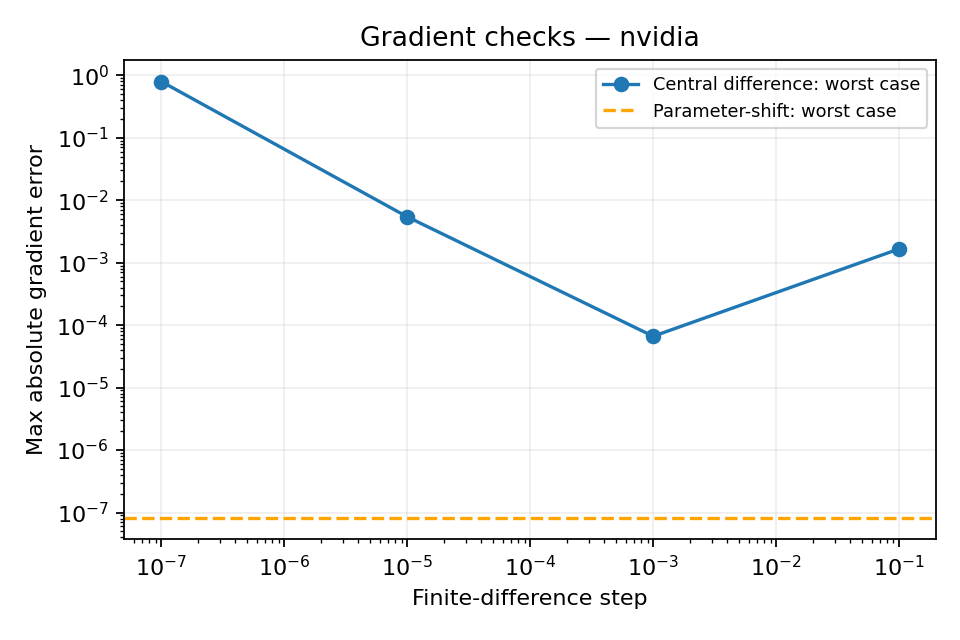

# Day 17｜量子模型的梯度：從電路輸出到訓練損失

[Day16](../day16/README.md) 比較 QNN 與 MLP 的參數、運算與讀出，釐清量子閘對狀態的線性作用，如何與模型輸出的非線性並存。Day17 接著探討如何計算參數變動對輸出與損失的影響，讓最佳化器能利用梯度調整權重。

**電路輸出如何隨權重改變，與訓練誤差如何隨權重改變，是兩個相連但不同的問題。** 計算電路導數後，還需要把機率轉換與損失函數一起納入，才能取得更新權重所需的梯度。梯度（gradient）描述各個權重微小改變時，目標數值如何變化，可用來決定更新方向。本章先用 中央有限差分（central finite difference）比較權重增加與減少一小段距離後的輸出，理解近似步長與數值誤差的取捨；再實作 參數位移法（parameter-shift），對本章每個只控制一次 RY 的獨立權重，利用正負 π/2 位移後的兩次電路輸出求導。重點是位移公式有適用條件，不能直接套到任意共享權重或整個損失函數；電路期望值的導數仍須透過 鏈式法則（chain rule），接上機率轉換與 Brier loss。本章以獨立矩陣導數核對結果，執行短程梯度下降，並觀察有限 shots 如何使梯度估計產生波動。取得梯度需要額外執行電路；即使位移公式在數學上精確成立，有限次量測得到的估計仍會波動。

[Day16](../day16/README.md) compared QNN and MLP parameters, computation, and readout, clarifying how linear gate action on states can coexist with nonlinear model outputs. Day17 examines how parameter changes affect outputs and loss, enabling an optimizer to use gradients for weight updates.

**How a circuit output changes with a weight and how the training loss changes with that weight are connected but different questions.** Circuit derivatives must be combined with probability conversion and the loss function to obtain the gradient used for updates. A gradient describes how a target quantity changes under small changes to each weight and can guide the update direction. The chapter first uses central finite differences to compare outputs at slightly increased and decreased weights, examining the tradeoff between approximation step size and numerical error. It then implements parameter-shift: for each independent weight controlling a single RY gate in this model, two circuit evaluations at shifts of plus and minus π/2 provide the output derivative. The shift rule has specific conditions and cannot be applied directly to arbitrary shared weights or the entire loss. Expectation derivatives must still pass through the chain rule for the probability conversion and Brier loss. Independent matrix derivatives check the results, a short gradient-descent run tests integration, and finite-shot experiments illustrate fluctuations in gradient estimates. Computing gradients requires additional circuit evaluations, and finite-shot estimates still fluctuate even when the analytic shift identity is exact.

---

Day 15 用不需要梯度的座標搜尋，Day 16 比較 QNN 與 MLP。今天實作 **參數位移法、中央有限差分、獨立矩陣導數與損失的鏈式法則**，再跑四次梯度下降更新。

程式：[gradients.py](gradients.py)、[experiment.py](experiment.py)、[demo.py](demo.py)。沿用 Day 14 的獨立 RY 權重；沒有使用 PyTorch 的 autograd（自動追蹤運算並計算導數的功能），也未在真實量子處理器（QPU）上執行。

## 1. 反向傳播的外層還是鏈式法則

```text
weights → PQC → f=⟨ZZ⟩ → p=(1−f)/2 → Brier loss
```

導數描述一個變數微小改變時，輸出的變化率；梯度將各個權重的導數排成向量。鏈式法則（chain rule）把相連步驟的變化率相乘，算出起點對終點的影響。PQC 是參數化量子電路，ZZ 是 `Z0Z1`，其量測結果在兩位元相同時記為 +1、不同時記為 −1。期望值是依機率計算的平均值。

一般損失函數可用一般微積分求導；量子部分需要提供 `df/dw`。參數位移法是取得電路期望值導數的方法，不等於整個機器學習計算圖的反向傳播。計算圖記錄各步驟的依賴；反向傳播從最終誤差往回套用鏈式法則，計算各參數的影響。

本日對每個參數逐一執行位移後的電路。沒有儲存每個量子量子閘的中間輸出後倒傳，也沒有使用模擬器伴隨微分法。伴隨微分法利用模擬器能存取狀態的能力，沿反向操作計算導數；它與重複執行位移電路有不同需求。這些方法的執行需求不同，不能只用「都是 backprop」略過成本。

## 2. 中央有限差分：步長是近似參數

```text
df/dw_j ≈ [f(w+h e_j) − f(w−h e_j)] / (2h)
```

`w_j` 是第 j 個權重，`e_j` 是只在第 j 個位置為 1、其餘為 0 的向量。因此 `w+h e_j` 只增加一個權重，`h` 是改動大小。中央有限差分用兩側的輸出差除以距離，近似中間的變化率。

對平滑函數，中央差分用有限距離近似導數的截斷誤差隨小 h 下降，但 h 太小會放大浮點相減誤差；有限次量測時還會放大抽樣波動。因此不是 h 越小越好。

本日比較 h=`1e-1,1e-3,1e-5,1e-7`，CPU 是中央處理器，GPU 是擅長平行運算的圖形處理器；執行後端指定實際使用的模擬器。fp64 與 fp32 分別用 64、32 位元表示浮點數，位數有限會產生數值誤差。兩個執行後端的精度分別為 CPU fp64、GPU fp32。有限差分是**診斷結果**，不要求所有 h 都通過同一誤差門檻；故意保留小步長在 fp32 上可能失準的數字。

## 3. 參數位移法：符合條件時的解析等式

RY 是繞單一量子位元狀態的 y 軸旋轉的量子閘；`π/2` 弧度代表四分之一圈。`exp` 表示指數運算，`i²=-1`。對只出現一次的獨立 RY 參數，`RY(w)=exp(−iwY/2)`：

```text
df/dw_j = [f(w + π/2 e_j) − f(w − π/2 e_j)] / 2
```

這不是把有限差分的 h 隨便設成 π/2：分母是 **2，不是 π**。生成元是決定旋轉如何隨角度改變的矩陣；對本例為 `Y/2`，具有 +1/2 與 −1/2 兩個本徵值，這組值就是此處的頻譜。公式依據這個結構成立；Schuld 等人的研究推導了這類解析位移電路梯度。[P3]

本日實作共用中央差分輔助函式，再乘上 π/2，把分母轉回 2。可讀成以下等價程式：

```python
plus = weights.copy()
minus = weights.copy()
plus[j] += np.pi / 2
minus[j] -= np.pi / 2
gradient[j] = 0.5 * (predict(x, plus) - predict(x, minus))
```

Day 9／14 的每個權重只控制一個 RY，符合本例條件；層數 1 有四個、層數 2 有八個獨立權重。這不自動適用於任意量子閘、不同生成元、縮放角度或共享權重。

## 4. 共享參數的反例

若同一 θ 出現在連續兩個 RY：`RY(θ)RY(θ)=RY(2θ)`，讀 Z 得 `f(θ)=cos(2θ)`。此時：

```text
真實導數 = −2 sin(2θ)
直接把共享 θ 同時 ±π/2：差值為 0
```

必須處理各量子閘出現位置的導數並加總，或使用符合該頻率／生成元的規則。若實際角度為 `a*w+b`，還要乘上一般鏈式法則的係數 a。本日測試保存共享參數的反例，沒有把標準兩點公式當通用黑盒。

## 5. 正確接到 Brier 損失

Brier 損失是預測機率與 0／1 標籤的平均平方誤差。`f` 是電路期望值，`p` 是轉換後的類別 1 機率，`y` 是正確標籤，`mean` 表示對樣本取平均。

`p=(1−f)/2`、`L=mean((p−y)²)`，因此：

```text
dL/dw = mean[2(p−y) × (−1/2) × df/dw]
       = −mean[(p−y) df/dw]
```

```python
values = np.array([predict(x, weights, config) for x in features])
p = (1 - values) / 2
jacobian = np.array([parameter_shift(x, weights, config) for x in features])
gradient = np.mean(-(p - labels)[:, None] * jacobian, axis=0)
```

程式中的 `jacobian` 是雅可比矩陣：每列是一筆資料，每欄是一個權重，元素保存該輸出對該權重的導數。`[:, None]` 增加一個維度，讓每筆誤差乘上對應的一整列導數；`axis=0` 沿樣本方向取平均。NumPy 是 Python 的數值運算套件。

不能直接計算 `[L(w+π/2)−L(w−π/2)]/2` 就宣稱得到損失梯度：平方等一般數值處理會改變函數形式。本日用單量子位元 Brier 反例驗證兩者不一致。

這裡明確對未截斷的解析 `p=(1−f)/2` 求導；精確模擬器輸出在數值誤差內符合機率範圍。若在計算圖額外加截斷或門檻，必須另處理其導數，不能默認套用本式。截斷將越界值改到邊界；硬分類門檻則將連續機率直接判成 0 或 1。分類門檻不在這條損失計算路徑中。

## 6. 不用參數位移法驗證自己

`matrix_gradient` 使用 Day 3 的矩陣：

```text
dRY(w)/dw = (−iY/2) RY(w)
df/dw_j = 2 Re[⟨∂ψ/∂w_j|ZZ|ψ⟩]
```

`∂ψ/∂w_j` 表示狀態向量對第 j 個權重的導數，`Re` 取複數的實部。

逐量子閘傳遞狀態及每個參數的狀態導數，遇到對應旋轉操作時加入該量子閘的導數。這個參考值不使用位移求值，也不用有限差分，因此能獨立檢查位移的符號、倍率與層數。

損失梯度再與 NumPy 完整 Brier 損失的中央差分（h=1e-5）比較，核對外層鏈式法則。測試也涵蓋振幅編碼電路的兩層可調電路模板，但主要設定掃描固定角度編碼。

## 7. 梯度成本與短更新

前向計算是固定權重後從輸入算出結果；每個權重需要正、負兩次位移。P 個獨立權重、B 筆資料：

```text
expectation Jacobian：2PB 次 shifted forward
loss + gradient：B(1+2P) 次 forward（含原始 p）
```

本日 B=2、P=4，每次損失＋gradient 為 18 次 observe。四次更新 `w ← w−0.4*gradient`，另外在最終權重評估一次，共五次梯度評估、90 次 observe。未把 NumPy 參考值、主要設定掃描與抽樣額外成本算進這個數字。

梯度下降沿梯度的反方向更新，學習率控制每次移動的幅度；本例為 0.4。保留資料是不參與訓練更新的資料，準確率是分類正確的比例。

兩筆特徵=`[[0.25,-0.4],[-0.6,0.2]]`，標籤=`[1,1]`；這是梯度更新整合檢查，不是重訓 Day 15 的分類器，也沒有保留資料或準確率。固定學習率的梯度下降一般不保證每步損失都下降；本次結果如實保存，不透過測試資料調整步長。

## 8. 有限次量測仍有梯度不確定性

固定隨機種子 42 的權重、特徵=`[0.25,-0.4]` 的 w1 導數，用 100／1,000 shots **每個位移**，各十對抽樣隨機種子。每筆梯度是兩個 ZZ 估計值差的一半，保存兩份量測計數與隨機種子。

隨機種子控制抽樣序列，量測計數（counts）記錄各結果出現幾次，shots 是量測次數。變異數描述反覆抽樣時估計值的波動，等於偏離平均值的差距平方再取平均。

解析公式成立，不代表有限次抽樣的梯度恰好等於真值。若兩個位移的抽樣獨立：

```text
Var(g_hat) = [Var(f_plus_hat) + Var(f_minus_hat)] / 4
```

對 ±1 可觀測量、每側 S shots，其變異數上界為 `1/(2S)`。本日這個公式由獨立樣本平均推導，十次重複只作小型展示，不保證實測誤差隨 shots 嚴格單調。沒有把含抽樣波動的 p 與含抽樣波動的 Jacobian 相乘來宣稱損失梯度的無偏性；無偏表示反覆抽樣的估計平均等於真值，不能只從單次接近真值判斷。

## 9. 執行與圖表

`.venv` 是專案獨立保存 Python 套件的虛擬環境；`OMP_NUM_THREADS=1` 將 CPU 平行工作的執行緒數設為 1。

沿用 `.venv`，無新增依賴；[requirements-day17.txt](../../requirements-day17.txt)。在專案根目錄執行：

```bash
source .venv/bin/activate
OMP_NUM_THREADS=1 python articles/day17/demo.py
OMP_NUM_THREADS=1 python articles/day17/experiment.py
OMP_NUM_THREADS=1 python articles/day17/experiment.py --backend nvidia
OMP_NUM_THREADS=1 python articles/day17/plot_results.py
OMP_NUM_THREADS=1 python articles/day17/plot_results.py --backend nvidia
```

每個執行後端：L=1／2 × 三筆特徵，共六個梯度設定；每個設定四種有限差分 h，保存 24 筆向量比較。另有五筆短更新紀錄與 20 筆有限次量測梯度估計。



圖示每個 h 在所有設定／參數上的最大誤差，虛線是參數位移法最大誤差。輸出存 `results/day17/<backend>/`，可用 `--output-dir /tmp/day17-check` 另存實驗；繪圖讀取預設執行後端目錄。完整數字見 [結果紀錄](../../results/day17/README.md)。

## 10. 測試與下一篇

```bash
OMP_NUM_THREADS=1 python -m unittest discover -s articles/day17 -p 'test_*.py' -v
OMP_NUM_THREADS=1 DAY17_TARGET=nvidia python -m unittest discover -s articles/day17 -p 'test_*.py' -v
```

五個測試涵蓋差分與輸入驗證、角度／振幅編碼的位移、矩陣導數與 NumPy 有限差分、損失的鏈式法則、損失直接位移反例，以及共享參數反例。

下一篇 [Day 18](../day18/README.md) 進行一般機器學習與量子機器學習的公平效能比較。本日仍是無噪聲模擬器數值核對與梯度示範，沒有 QPU 或量子優勢宣稱。

## 11. 來源

[P3] Maria Schuld, Ville Bergholm, Christian Gogolin, Josh Izaac, Nathan Killoran. “Evaluating analytic gradients on quantum hardware.” *Physical Review A* **99**, 032331 (2019). [出版商／DOI](https://doi.org/10.1103/PhysRevA.99.032331)，[arXiv:1811.11184](https://arxiv.org/abs/1811.11184)。2018 為預印本年份，正式出版為 2019。

2026-09-07 核對作者、題名、年份、DOI 與兩次 shifted circuit 的主張；本日 RY 公式、鏈式法則與反例均由獨立矩陣導數／解析式核對。共用索引：[REFERENCES.md](../../REFERENCES.md)。

## 延伸研究

[N5] Brian Coyle et al. “Training-efficient density quantum machine learning.” npj Quantum Information 11, 172 (2025)；研究論文。[原始來源](https://doi.org/10.1038/s41534-025-01099-6)；[完整書目](../../REFERENCES.md#n5)。

本章核對參數位移與鏈式法則；這篇研究可延伸比較特定模型結構下的梯度成本。位移公式仍須依本章各量子閘的條件使用。
