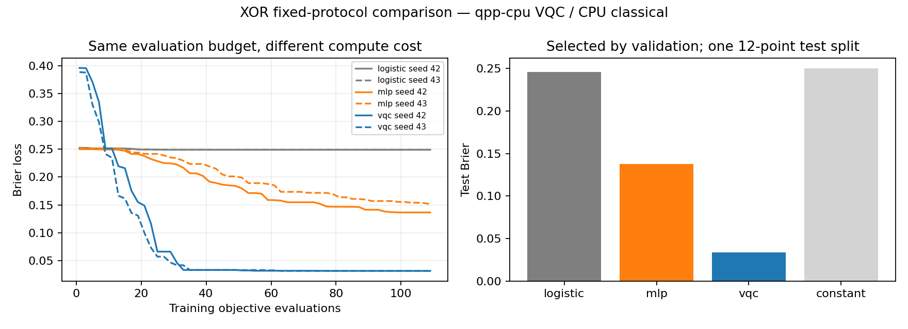

# Day 18｜Classical ML vs QML：第一次公平 Benchmark

今天把 Day 16 的 MLP 與 Day 14 的 VQC 放在同一個比較協定下，加入 logistic baseline，實際訓練後再評分。**公平在本文指比較條件公開且一致，不代表一個 optimizer、單一 split 就能判定模型家族優劣。**

程式：[benchmark.py](benchmark.py)、[plot_results.py](plot_results.py)。本日採用共同 Brier objective 的控制實驗，所有差異與成本都保留。

## 1. 先固定比較協定

每次 benchmark 在訓練開始前寫入 `protocol.json`、`dataset.json`、`scaler.json`：

| 項目 | 固定設定 |
|---|---|
| Dataset | Day 15 XOR generator，新 seed=2027 |
| Split | train／validation／test 各 12 筆，各 class 6 筆 |
| Preprocessing | 同一份 train-only min/max；越界 clipping |
| Loss | Brier：mean((p1−y)²) |
| Optimizer | 同一份 derivative-free coordinate search |
| 每次 fit 預算 | 109 次 objective evaluations |
| 初始化 | normal(0,0.2)，每模型 seeds 42／43 |
| 選模 | 每個模型選 final validation Brier 較低的 seed |
| Classification threshold | 固定 p1≥0.5 為 class 1 |
| Test | 各模型選定 seed 後才評分 |

資料 SHA-256 保存於 protocol，CPU／GPU 兩次執行必須一致。使用新 split 是為了不把先前已檢視的 Day 15 test 當成新的盲測；它仍是同一個小型合成 XOR 分布，不是獨立真實資料集。

preprocessing 僅在 train fit、test 不參與模型選擇，沿用官方 model-evaluation 建議。[D14] 看完本次 test 不再調整預算或 weights。

## 2. 三個模型與一個常數基準

| Model | 計算 | 可訓練參數 |
|---|---|---:|
| logistic | sigmoid(x·w+b) | 3 |
| MLP | 2→tanh(2)→sigmoid(1)，含 biases | 9 |
| VQC | 兩個 qubit、positive_half encoding、一層 Ansatz、p1=(1−ZZ)/2 | 4 |
| constant | train label 平均值=0.5 | 不訓練 |

**本日 logistic 使用 Brier loss，而非標準 maximum-likelihood Logistic Regression 的 log loss。** 官方 log-loss 文件明確說明常見 logistic regression 的負對數概似目標。[D16] 這裡保留 logistic link，刻意統一 objective；不能把它稱作 scikit-learn LogisticRegression 的效能或最佳 classical baseline。

logistic 的 0.5 邊界是線性的；MLP 與 VQC 能形成不同的非線性函數。XOR 刻意需要非線性，因此 logistic 結果差不表示 classical ML 整體不如 QML。MLP 容量、初始化及 optimizer 也沒有經廣泛搜尋。

## 3. 相同 Iterations 不等於相同工作量

Day 10 座標搜尋每輪對 P 個 weights 各試正負方向，需要 2P 次 objective。如果讓三個模型都跑相同輪數，九參數 MLP 會得到比三參數 logistic 更多次評估。

本日改用**固定 109 次 objective**：一次初始 loss，剩餘 108 次形成 54 對候選。只接受完整的正負候選 pair，不超出預算；每一對之後保存已接受的 weights 與 loss。每輪沒有改善才把 step=0.4 減半；預算耗盡直接停止。

| Model | 完整 sweeps | 最後 partial sweep |
|---|---:|---|
| logistic（3 參數） | 18 | 無 |
| MLP（9 參數） | 6 | 無 |
| VQC（4 參數） | 13 | 再處理兩個座標 |

partial sweep 不觸發 step 縮減。所有模型都取得同樣的 candidate evaluation 數，但參數較多的模型更新每個座標的機會較少；座標順序也可能影響最後結果。這是此資源分配規則的取捨，不是唯一公平定義。

## 4. 相同 Objective 次數仍不等於相同成本

一個 objective 都看相同 12 筆 train 資料：

- logistic／MLP 使用 NumPy batch matrix operations。
- VQC 逐筆執行 exact `observe`，每次 fit 有 109×12=1,308 次訓練電路呼叫。
- 每模型各兩個 seeds；VQC 每 backend 共 2,616 次訓練 observe，validation／test／reference 另計。

本日選擇不需梯度的共同 optimizer，避免拿不同梯度估計成本假裝同等；Day 17 的 parameter-shift 沒有在此呼叫。這也不代表座標搜尋是每個模型的最佳 optimizer。

記錄 `fit_seconds_including_first_compilation`，包含 fit 內的首次 JIT 及 host overhead，不包含後續 validation／test。CPU／GPU 實驗可能同時執行、後續 seeds 也可能使用快取，未做隔離、warm-up 或重複計時。因此此耗時僅供工程成本追蹤，**不能推論 GPU speedup 或 classical／quantum 演算法複雜度**。GPU run 裡的 classical 模型仍在 NumPy CPU 上執行。

## 5. 選模與報告

每種模型內只依 final validation Brier 選 seed，平手取較小 seed；不挑 history 的最低 validation epoch，也不以 test 選最佳模型家族。

報告 train／validation／test Brier、accuracy 與 confusion matrix；row=true class、column=predicted class。常數 p1=0.5 依相同 threshold 全預測 1，所以 balanced test 的 accuracy=50%、Brier=0.25。

不只公布 winner：`candidates.json` 保存所有 seeds 的 validation、初始／最終 weights、每對候選後的 train history、預算與時間。`selected.json` 保存每模型選定 weights 及所有 split probabilities／metrics。原始 labels 與 raw features 在 dataset，縮放規則在 scaler，模型定義在 protocol。

## 6. 如何解讀結果



曲線橫軸是 objective evaluations，不是 sweeps 或秒。右圖的 test Brier 只描述此 12 筆 split。數字、候選及時間見 [結果紀錄](../../results/day18/README.md)。

兩個 initialization seeds 不等於兩個獨立 dataset splits；CPU／GPU 同一資料的結果也不是額外統計樣本。本日不做顯著性檢定、信賴區間或量子優勢結論。若要推廣結論，仍需更大資料、多 splits、合理的各模型 tuning budget 與真正的 classical baselines，後續 Day 20／25 會繼續擴充任務。

## 7. 重跑與測試

沿用 `.venv`，無新增依賴；[requirements-day18.txt](../../requirements-day18.txt)。從專案根目錄：

```bash
source .venv/bin/activate
OMP_NUM_THREADS=1 python articles/day18/benchmark.py
OMP_NUM_THREADS=1 python articles/day18/benchmark.py --backend nvidia
OMP_NUM_THREADS=1 python articles/day18/plot_results.py
OMP_NUM_THREADS=1 python articles/day18/plot_results.py --backend nvidia

OMP_NUM_THREADS=1 python -m unittest discover -s articles/day18 -p 'test_*.py' -v
OMP_NUM_THREADS=1 DAY18_TARGET=nvidia python -m unittest discover -s articles/day18 -p 'test_*.py' -v
```

預設寫入 `results/day18/<backend>/`，重跑會更新。benchmark 支援 `--output-dir /tmp/day18-check`；繪圖工具讀取預設目錄。

載入已保存的三個模型做單筆推論：

```bash
OMP_NUM_THREADS=1 python articles/day18/demo.py --features -0.7 0.7
```

四個測試涵蓋三種參數維度都恰好用完 109 次評估、loss 不增加、輸入不被改動、logistic 解析輸出、split／scaler 邊界與 VQC NumPy reference。實驗通過條件只要求預算、loss 與數值核對，不要求某個模型擊敗另一個。

所有 VQC 結果為無噪聲 exact simulator；本日沒有 finite-shot 或 QPU benchmark。下一篇 [Day 19](../day19/README.md) 將探索 classical layer＋quantum layer 的 Hybrid Neural Network。

## 8. 來源

- [D14] [scikit-learn Common pitfalls](https://scikit-learn.org/stable/common_pitfalls.html)：train-only preprocessing 與資料洩漏。
- [D16] [scikit-learn log_loss](https://scikit-learn.org/stable/modules/generated/sklearn.metrics.log_loss.html)：標準 logistic regression 的 log-loss 目標；與本文 Brier 控制實驗區別。

查閱日期 2026-09-07。本日採 NumPy 自訂實作，沒有安裝 scikit-learn；共用索引見 [REFERENCES.md](../../REFERENCES.md)。
