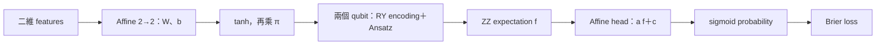
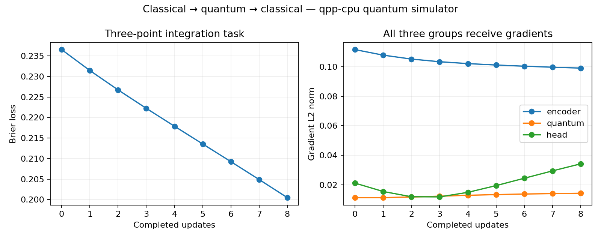

# Day 19｜Hybrid Neural Network：Classical＋Quantum＋Classical

Day 18 比較不同模型。今天建立一個真正串接的模型：**classical encoder 產生電路角度，quantum layer 回傳 expectation，classical head 產生機率，三組參數一起更新。**

完整程式：[hybrid.py](hybrid.py)、[experiment.py](experiment.py)、[demo.py](demo.py)。本日手寫 chain rule，沿用 NumPy／CUDA-Q，不新增 PyTorch；重點是驗證梯度穿過整個模型，不是再做分類 benchmark。

## 1. 十二個參數的資料流



| 部分 | 公式 | 參數數量 | flat vector 索引 |
|---|---|---:|---|
| Classical encoder | z=xW+b，h=tanh(z)，θ=πh | 4＋2=6 | W=`[0:4]`、b=`[4:6]` |
| Quantum Ansatz | f=⟨ZZ⟩ | 4 | `[6:10]` |
| Classical head | u=af+c，p=sigmoid(u) | 2 | a=`[10]`、c=`[11]` |

slice 索引採 Python 的左含右不含規則。W reshape 為 2×2；一批 B 筆資料的 shape 依序為 B×2、B×2、B、B。

量子 kernel 重用 Day 9 的一層 model，但不走其 `features→πx` host wrapper，因為 classical encoder 已直接產生 radians。前後的 classical 計算都在 NumPy CPU；`--backend nvidia` 只切換量子 simulator。

## 2. 與固定 Feature Map 有何不同？

Day 14／15 的 angle map 由固定縮放規則決定。本日 W、b 也接受 optimizer 更新，因此角度會隨訓練改變：

```python
hidden = np.tanh(x @ parameters[:4].reshape(2, 2) + parameters[4:6])
angles = np.pi * hidden
```

tanh 將輸出限制在 [−1,1]，再映射至 [−π,π]。沒有以 hard clipping 截斷這一層，但 tanh 飽和時導數可能很小。這不是最佳角度範圍的結論，也不保證所有 features 都保持可區分。

示範 features 已是小尺度的二維數值，API 接受有限 B×2 矩陣，沒有在模型內 fit scaler。真實資料仍需獨立的 train-only preprocessing，且應與 checkpoint 一起保存；本日沒有隱藏的 scaler。

## 3. Quantum Layer 必須回傳兩種導數

若只求量子 weights 的梯度，classical encoder 就無法得到正確的更新方向。本日的 quantum Jacobian 包含：

```text
[df/dθ0, df/dθ1, df/dw0, df/dw1, df/dw2, df/dw3]
```

六個角度各自控制一個獨立 RY，因此可以使用 Day 17 的標準兩點 parameter-shift：

```text
df/dα = [f(α+π/2) − f(α−π/2)]/2
```

shift θ 時固定 quantum weights；shift weights 時固定 θ。這裡求的是量子層的局部 partial derivatives，接著才乘 classical chain factors。不能直接對 W 加 π/2 然後套用同一公式，因為 W 經 affine、tanh、π 才進入多筆資料的電路。

## 4. 完整 Chain Rule

Brier loss 為 `L=mean((p−y)²)`。定義每筆資料對 head logit 的導數：

```text
δ_i = 2(p_i−y_i) p_i(1−p_i) / B
```

Head gradients：

```text
dL/da = Σ_i δ_i f_i
dL/dc = Σ_i δ_i
```

Quantum weights gradients：

```text
dL/dw_j = Σ_i δ_i a (df_i/dw_j)
```

Encoder preactivation gradients：

```text
g_i = δ_i a (df_i/dθ) ⊙ π(1−h_i²)
dL/dW = Σ_i outer(x_i,g_i)
dL/db = Σ_i g_i
```

程式的外積方向與 `x @ W` 一致。每個 gradient component 都與 NumPy 完整模型 loss 的 central difference（h=1e-5）核對，包含六個 encoder、四個 quantum 和兩個 head 參數。

這是手寫的 chain rule，不是已完成 PyTorch autograd bridge。若未來包成 custom autograd function，仍須維持相同的 input／weight Jacobian 與 batch reduction 規則。

## 5. Head 初始化也會影響梯度

由公式可見，a=0 時 encoder 與 quantum weights 的梯度全部為 0，即使 head bias 的梯度非零。測試刻意把 a 設為 0，驗證這個阻斷效果。

正式示範以 seed42 的 normal(0,0.2) 初始化 12 個參數，再將 a 指定為 0.8。這是為了展示三組參數都能更新，不是經搜尋得到的最佳初始化。sigmoid 或 tanh 飽和也可能減弱梯度，不能把所有小梯度都歸因於 barren plateau。

本日 p 是 `sigmoid(af+c)`，**不再是 Day 15 的直接 parity probability `(1−ZZ)/2`**。它是 classical head 的輸出 score，沒有機率校準宣稱。

## 6. 三筆資料的 Joint Update

```text
features = [[−0.6,0.4], [0.3,0.5], [0.7,−0.2]]
labels   = [1,0,1]
```

固定 learning rate=0.4，執行八次 `parameters -= 0.4 * gradient`。記錄初始化與八次更新後的 loss／gradient，共九筆 history。

CPU／GPU 的 loss 都從約 0.236563 降至 0.200478，三組參數均有改變。但最終三筆 p 都大於 0.5，並未把 class 0 樣本分類正確。**loss 下降只驗證更新流程，不代表分類任務已解決。** 本日沒有 train／test split、選模或 accuracy benchmark，也沒有將結果與 Day 18 排名混用。



右圖為各參數群組的 gradient L2 norm，不同群組參數數量與單位不同，不能直接解讀為「哪一層更重要」。

## 7. 成本與可觀察中間值

每筆資料需一次原始 forward，加上六個局部導數各兩次 shifted forward，共 13 次量子 observe。B=3、九次 gradient evaluations：

```text
9 × 3 × 13 = 351 次訓練 observe
```

最終 reference／checkpoint reload 的評估另計，沒有算進 351。這些都是無噪聲 exact expectation，沒有 finite-shot 訓練。

`forward` 同時回傳 probability 和 cache：hidden、angles、quantum expectation、logits。它們是 host 保留的 classical 數值，不是從 QPU 直接取得所有內部 amplitudes。

## 8. 執行、Checkpoint 與測試

沿用 `.venv`，無新增依賴；[requirements-day19.txt](../../requirements-day19.txt)。在專案根目錄執行：

```bash
source .venv/bin/activate
OMP_NUM_THREADS=1 python articles/day19/experiment.py
OMP_NUM_THREADS=1 python articles/day19/experiment.py --backend nvidia
OMP_NUM_THREADS=1 python articles/day19/plot_results.py
OMP_NUM_THREADS=1 python articles/day19/plot_results.py --backend nvidia

# 讀取保存參數，印出各層中間值。
OMP_NUM_THREADS=1 python articles/day19/demo.py --features -0.6 0.4
```

輸出為 `results/day19/<backend>/history.json`、`summary.json`、`checkpoint.json`、`hybrid_training.png`。checkpoint 包含架構描述、參數分段、輸入契約、seed 與所有 12 個參數。experiment 會重新載入 JSON，驗證輸出一致。demo 僅供此固定架構，不是跨模型的通用載入器。

experiment 可加 `--output-dir /tmp/day19-check` 另存；預設重跑更新目錄，plot／demo 讀取預設 backend 路徑。

```bash
OMP_NUM_THREADS=1 python -m unittest discover -s articles/day19 -p 'test_*.py' -v
OMP_NUM_THREADS=1 DAY19_TARGET=nvidia python -m unittest discover -s articles/day19 -p 'test_*.py' -v
```

五個測試涵蓋 forward reference／輸入不變性、全部 12 個參數的 chain rule、量子輸入與 weights Jacobian、zero-head-scale 梯度阻斷、錯誤輸入。完整數字見 [結果紀錄](../../results/day19/README.md)。

## 9. 來源與下一篇

[D15] [NVIDIA Hybrid QNN 教學（0.8.0）](https://nvidia.github.io/cuda-quantum/0.8.0/examples/python/tutorials/hybrid_qnns.html) 示範 classical／quantum layers 的整合。2026-09-07 重新查閱；本日未移植其歷史版本梯度程式，而是沿用 Day 17 的 shift 規則並獨立核對完整 chain rule。來源索引：[REFERENCES.md](../../REFERENCES.md)。

下一篇 [Day 20](../day20/README.md) 將進入 Iris 的 Classical／Quantum／Hybrid 比較。本日不作 QPU、速度或量子優勢宣稱。
