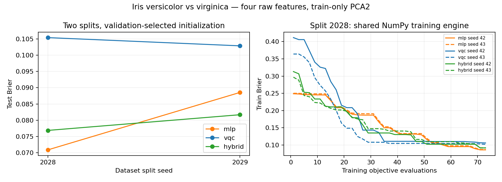

# Day 20｜Iris 鳶尾花分類：一般、量子與混合模型的比較

[Day19](../day19/README.md) 將經典編碼層、量子層與經典輸出層串接成混合模型，核對完整梯度並確認三組參數能共同更新。Day20 接著把這個模型與既有的經典、量子模型放到 Iris 資料上，透過共同的前處理、訓練預算與評分規則，比較實際分類結果。

**從合成示範轉向真實資料後，資料來源、前處理與模型選擇都需要留下紀錄，才能重做實驗並解讀結果。**本章選取 Iris 的兩個花種作二分類，將四個原始特徵先標準化，再用 PCA（主成分分析）轉成兩個綜合特徵，讓 MLP、VQC 與 Hybrid 都收到相同的二維輸入。這些轉換規則只從 train 學得；validation 用來選擇各模型的初始化結果，test 則在選定模型後評分。三種模型共用 Brier loss 與固定評估次數的座標搜尋，因此本章沒有沿用 Day19 的梯度下降。另一個核心重點是分清楚訓練與驗證：全部訓練先在 NumPy CPU 完成，其中量子部分使用精確狀態向量模擬；保存權重後，才以 CUDA-Q CPU／GPU 核對含量子層模型的輸出。資料切分與初始化可能改變結果；這份二分類報告不能代表完整 Iris 三分類的排名，也不能用來宣稱 GPU 訓練加速或量子優勢。

[Day19](../day19/README.md) connected a classical encoder, quantum layer, and classical output head, checking the full gradient and confirming that all three parameter groups could update jointly. Day20 compares this hybrid model with the existing classical and quantum models on Iris, using shared preprocessing, training budgets, and evaluation rules.

**Moving from synthetic examples to real data requires records of data sources, preprocessing, and model selection so that results can be reproduced and interpreted.** Two Iris species form a binary classification task. The four original features are standardized and reduced to two components through principal component analysis (PCA), giving the MLP, VQC, and hybrid model the same two-dimensional inputs. All preprocessing is fitted on training data only. Validation selects an initialization result within each model family, and test scoring follows model selection. The models share Brier loss and coordinate search with a fixed evaluation budget, rather than reusing Day19's gradient descent. Another central distinction is between training and verification: all training runs on the NumPy CPU, with exact state-vector simulation for the quantum components. After weights are saved, CUDA-Q CPU/GPU execution checks the outputs of models containing quantum layers. Data splits and initialization can affect results. This restricted binary report is neither a full three-class Iris ranking nor evidence of GPU training acceleration or quantum advantage.

---

今天把 Day 18 的比較流程與 Day 19 的混合模型放到 Iris。**本日是 versicolor／virginica 二分類、四個原始特徵經僅由訓練資料決定的兩維主成分分析的受限比較實驗，不是完整三分類 Iris 排行榜。**

程式：[iris_models.py](iris_models.py)、[experiment.py](experiment.py)、[demo.py](demo.py)、[plot_results.py](plot_results.py)。所有訓練先在 NumPy CPU 的精確參考計算完成，再用 CUDA-Q CPU／GPU 核對選定模型；這兩個階段的時間與作用分開保存。

## 1. 從真實資料開始

Iris 是鳶尾花資料集，UCI 是保存與發布機器學習資料的資料庫。特徵是描述樣本的數值，標籤是要預測的花種。

UCI Iris 有 150 筆、四個數值特徵、三類各 50 筆。[D17] 本日保留 versicolor=0、virginica=1，排除 setosa，以沿用已驗證的二分類模型。

CC BY 4.0 是要求保留署名的創用 CC 授權；SHA-256 是由檔案內容計算的摘要，用來確認使用的檔案是否一致。

原始檔案保存在 [data/day20](../../data/day20/README.md)，包含 UCI 來源、CC BY 4.0 授權與下載日期。程式記錄原始檔案 SHA-256，資料可離線重跑。

二分類子集原本 100 筆，其中一筆特徵與標籤完全重複；切分前保留第一筆、移除原始從 0 起算的資料列編號 142，剩 99 筆。這避免完全相同的紀錄跨資料切分；不代表有足夠資訊確認所有植物樣本的個體獨立性。原始下載檔案不修改。

四個欄位順序固定：花萼長度（sepal length）、花萼寬度（sepal width）、花瓣長度（petal length）、花瓣寬度（petal width），單位 cm。不同版本的 Iris 數字可能有差異，因此本日以保存的 UCI 檔案和雜湊為準。

## 2. 兩組分層資料切分

分層切分會分別處理每個類別，使各組的類別比例接近原資料。訓練資料用來調整模型，驗證資料用來選擇設定，測試資料留到模型選定後評分。隨機種子控制打亂順序或初始化的隨機序列，方便重做實驗。

預先指定資料切分隨機種子 2028／2029，每一類各自打亂，前 60% 訓練資料、接下來 20% 驗證資料、其餘測試資料，取整數後得到：

| 資料分組 | 總數 | versicolor | virginica |
|---|---:|---:|---:|
| 訓練資料 | 59 | 30 | 29 |
| 驗證資料 | 19 | 10 | 9 |
| 測試資料 | 21 | 10 | 11 |

每個資料切分保存原始資料列編號、特徵、標籤。不同資料切分隨機種子的資料會重疊，所以兩個測試資料成績不是獨立實驗樣本，不做顯著性推論。

## 3. 四維到二維，全部只在訓練資料建立規則

```text
四個原始特徵 → 標準化 → 兩維主成分分析 → 按訓練範圍縮放 → 截斷到 [-1,1]
```

標準化先減去每欄平均值，再除以標準差，避免較大尺度的欄位主導後續計算。標準差衡量數值分散程度；此處母體標準差的計算以該欄訓練樣本數作分母。

主成分分析（principal component analysis，PCA）將多個特徵組合成新的座標方向，依訓練資料在各方向的變動大小排序。本章只保留前兩個方向，因此會丟棄部分資訊。奇異值分解（singular value decomposition，SVD）是用來求出這些方向的矩陣運算。

1. 用訓練資料計算每欄平均值／母體標準差。
2. 對訓練資料標準化矩陣做 NumPy SVD，取前兩個主成分。
3. 固定主成分符號：每個主成分最大絕對值係數為正，減少符號不定性。
4. 以訓練資料的兩個主成分範圍建立最小值／最大值縮放器。
5. 驗證資料／測試資料僅使用這些保存的統計量轉換，保留截斷數量。

主成分的正負方向在數學上可互換，因此程式固定符號，方便比較與重現。最小值／最大值縮放器保存訓練範圍，截斷將越界值改成邊界值，並記錄數量。解釋變異比例表示保留的主成分涵蓋多少標準化資料的變動，不等於分類準確率。

PCA 是資料驅動轉換，即使不使用標籤也不能先對全資料建立規則。[D14] 所有模型收到同一個二維表示；一般 MLP 沒有額外取得四維原始資料。因此本日不代表一般模型在全部四個特徵上的最佳表現。

`datasets.json` 保存平均值、標準差、主成分、解釋變異比例與主成分縮放器，示範載入同一組前處理，不會依新輸入重新建立規則。

## 4. 三個模型與共同預算

MLP 是多層感知器，用一般神經網路計算預測；VQC 是變分量子分類器，調整電路角度來分類；Hybrid 將一般編碼層、量子電路與一般輸出層串在一起。`tanh` 將數值轉到 −1 與 1 之間，`sigmoid` 轉到 0 與 1 之間；仿射轉換（affine）則是乘上權重再加偏差。

| 模型 | 架構 | 參數 |
|---|---|---:|
| MLP | Day 16：2→tanh(2)→sigmoid(1) | 9 |
| VQC | Day 14：positive_half、兩量子位元、一層可調電路模板、p1=(1−ZZ)/2 | 4 |
| 混合模型 | Day 19：仿射轉換與 tanh 編碼層 → 參數化量子電路 → 仿射轉換與 sigmoid 輸出層 | 12 |

`positive_half` 把縮放後的值轉成 0 至 π 的角度。可調電路模板（ansatz）提供旋轉權重；ZZ 將兩位元相同記為 +1、不同記為 −1，`p1=(1−ZZ)/2` 將其期望值轉成類別 1 的機率。期望值是依機率計算的平均值。

每種模型每個資料切分各隨機種子 42／43，共 2×3×2=12 次訓練。使用 Day 18 同一份座標搜尋、初始步長=0.4、每次 73 次目標函數、共同 Brier 損失。參數初始化 normal(0,0.2)，混合模型輸出層倍率依 Day 19 固定起始為 0.8。

Brier 損失是預測機率與 0／1 標籤的平均平方誤差。座標搜尋每次嘗試增減一個權重，接受誤差較低者；步長是改動幅度，目標函數每次計算整批訓練誤差。`normal(0,0.2)` 從平均值 0、標準差 0.2 的常態分布產生起始參數。

每次訓練看 59 筆訓練資料，共 73×59=4,307 筆模型輸入評估。相同目標函數預算不代表相同計算量、參數更新頻率或最佳最佳化器。混合模型不在本日使用 Day 19 的梯度下降，VQC 也不使用參數位移法，避免把不同訓練成本混在同一個預算名稱下。

每模型依最終驗證 Brier 選隨機種子，平手取較小隨機種子；測試資料不參與。所有候選模型保留，不只公布表現最好者。

## 5. 訓練引擎與 CUDA-Q 驗證必須分清楚

NumPy 是 Python 的數值運算套件。CPU 是中央處理器，GPU 是擅長平行運算的圖形處理器；本章訓練都在 CPU，GPU 只用於核對保存模型。

本日完整搜尋使用 NumPy CPU：

- MLP 用全連接層的矩陣運算。
- VQC 用 Day 14 的明確狀態向量矩陣參考計算。
- 混合模型用 Day 19 的一般計算層與 NumPy 量子模擬參考計算。

這些參考計算表示與既有電路相同的兩個量子位元無噪聲模型，使整個資料搜尋可快速重跑；**不是 CUDA-Q 訓練，也不是 GPU 訓練加速**。`training_summary.json` 明確記錄 `cudaq_training_calls=0`。

模型選定並保存權重後，`verify` 才切換 CUDA-Q 執行後端，逐筆執行相同電路並比較機率。每執行後端：2 資料切分 × 99 筆 × 2 個含量子層的模型=396 次 observe；MLP 仍在 CPU NumPy。總共 18 筆驗證紀錄，對應 2 資料切分 × 3 模型 × 3 資料分組。

訓練的 `fit_seconds_numpy` 與驗證的 `verification_seconds_including_compilation` 不可相除當作加速幅度。後者可能包含即時編譯（JIT，執行時將程式轉成可用形式），也可能使用先前保存的編譯快取，CPU／GPU 驗證也可能同時執行，未做隔離效能測量。

## 6. 評分與穩定性

準確率是分類正確的比例；混淆矩陣記錄每種真實類別被判成哪種類別。常數比較基準不依輸入改變預測，只用訓練資料中類別 1 的比例輸出固定機率。

每模型保存訓練資料／驗證資料／測試資料預測機率、Brier、準確率、混淆矩陣（列為真實類別、欄為預測類別），另有依訓練類別比例決定的常數比較基準。因訓練資料不是完全平衡，常數 p1=29/59，不能沿用 Day 18 的固定 0.5。



左圖顯示兩個資料切分的選定模型測試資料 Brier；右圖保留資料切分 2028 的兩個初始化結果的訓練紀錄。完整準確率、選定隨機種子、PCA 變異、時間與 CUDA-Q 誤差見 [結果紀錄](../../results/day20/README.md)。

交叉驗證會輪流保留不同資料作評估；信賴區間則需依合適的抽樣設計描述估計的不確定性。

穩定性報告只展示兩個資料切分與各兩個初始化，不稱作完整交叉驗證或可靠信賴區間。不同隨機種子的最終模型、資料難度與驗證資料選擇都可能影響測試資料；單次較好不能外推為模型家族優勢。

## 7. 重跑與單筆推論

推論是使用選定模型產生預測，不更新權重。`.venv` 是專案獨立保存套件的虛擬環境；`OMP_NUM_THREADS=1` 將 CPU 平行工作的執行緒數設為 1。JSON 是結構化文字資料格式，PNG 是圖片格式。

沿用 `.venv`，本日無新增套件；資料已保存在專案，[requirements-day20.txt](../../requirements-day20.txt) 延續依賴鏈。

```bash
source .venv/bin/activate

# 一次建立共同 protocol、preprocessing、12 次 NumPy 訓練及選定模型。
OMP_NUM_THREADS=1 python articles/day20/experiment.py train

# 驗證保存模型，不重新訓練或挑選參數。
OMP_NUM_THREADS=1 python articles/day20/experiment.py verify
OMP_NUM_THREADS=1 python articles/day20/experiment.py verify --backend nvidia
OMP_NUM_THREADS=1 python articles/day20/plot_results.py

# 輸入四個原始 cm 數值，預設載入 split2028 選定的模型。
OMP_NUM_THREADS=1 python articles/day20/demo.py --features 6.0 2.9 4.5 1.5
```

示範可加 `--split-seed 2029`、`--backend nvidia`，會印出縮放後主成分、截斷旗標與三個模型的 p(virginica)。不需下載資料或重新建立規則縮放器。

結果位於 `results/day20/`：比較規則、資料紀錄、候選模型、選定模型、training_summary、comparison.png。`qpp-cpu/`、`nvidia/` 子目錄分別保存驗證結果與摘要。重跑使用固定路徑並更新檔案；重訓後應重新執行兩個 verify 和繪圖，避免引用舊驗證。

## 8. 測試與結果範圍

```bash
OMP_NUM_THREADS=1 python -m unittest discover -s articles/day20 -p 'test_*.py' -v
OMP_NUM_THREADS=1 DAY20_TARGET=nvidia python -m unittest discover -s articles/day20 -p 'test_*.py' -v
```

正交表示主成分方向的內積為 0，也就是座標方向彼此垂直。

四個測試涵蓋來源／去重與資料切分不交疊、僅由訓練資料決定的 PCA／正交性／縮放器不被重建立規則、三模型 CUDA-Q／NumPy 輸出及錯誤輸入。驗證通過不要求某模型擊敗另一個，也不以測試資料準確率作程式正確性的門檻。

Day 16–20 至此完成模型結構、梯度、受控比較實驗、混合模型聯合更新與第一份 Iris 比較報告。這仍是受限二分類任務、兩維表示、小預算與精確模擬器結果，沒有完整三分類、含噪聲訓練、真實量子處理器（QPU）、GPU 訓練或量子優勢結論。

## 9. 來源

- [D17] [UCI Iris](https://archive.ics.uci.edu/dataset/53/iris)，DOI [10.24432/C56C76](https://doi.org/10.24432/C56C76)：資料、欄位、類別與授權資訊。
- [D14] [scikit-learn Common pitfalls](https://scikit-learn.org/stable/common_pitfalls.html)：訓練資料-only 前處理，本文以 NumPy 實作 PCA，不安裝 scikit-learn。

查閱日期 2026-09-07；資料來源署名與處理政策見 [data/day20/README.md](../../data/day20/README.md)，共用來源索引見 [REFERENCES.md](../../REFERENCES.md)。

下一日：[Day21｜Qubit 不夠、Feature 太多怎麼辦？](../day21/README.md)，比較 PCA、特徵選擇（只保留部分原始欄位）與可訓練的壓縮層（由訓練決定如何將多個特徵轉成較少數值）。
