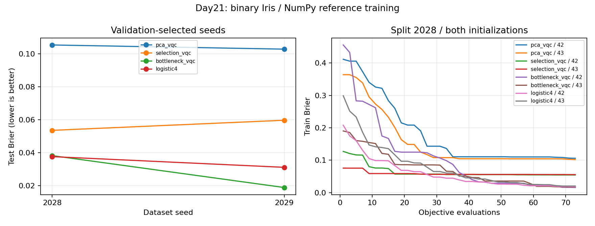
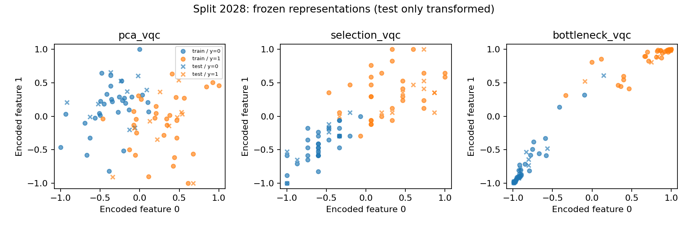

# Day 21｜特徵多、量子位元少：比較三種資料壓縮方式

[Day20](../day20/README.md) 將 Iris 的四個原始特徵經 PCA 轉成兩個主成分，再比較經典、量子與混合模型的二分類結果。Day21 接著檢查這個降維選擇，固定兩個量子位元與量子讀出，觀察不同的四維到二維表示如何影響分類與資訊保留。

**當資料的特徵比電路一次接受的角度數更多，就需要決定哪些資訊保留、哪些資訊壓縮。** 不同方法保留資訊的依據不同，也會改變訓練成本。本章比較三種方法：PCA（主成分分析）將四個特徵線性組合成兩個高變異方向；feature selection（特徵選擇）依訓練資料與標籤的關係保留兩個原始欄位；learned bottleneck（可訓練的壓縮層）則將四維輸入轉成兩個數值，並與量子電路權重一起依分類 loss 更新。重點是三種方法保留資訊的依據不同：高變異不保證有助分類，單欄排序可能漏掉特徵間的聯合作用，可訓練壓縮則增加參數與搜尋成本。本章另加入使用完整四維輸入的經典模型作對照，避免把所有比較都限制在同一份壓縮資料上。實作沿用 Day20 的資料切分，全部訓練先在 NumPy CPU 完成，再以 CUDA-Q CPU／GPU 核對保存模型的輸出。特徵數與量子位元數沒有固定的一對一關係；但已被壓縮丟失的差異，不會因接上量子電路而自動恢復。比較結果需要同時考慮資料表示、模型參數量與訓練預算。

[Day20](../day20/README.md) reduced Iris's four original features to two principal components and compared classical, quantum, and hybrid models on a binary classification task. Day21 examines that reduction choice, keeping two qubits and the quantum readout fixed while exploring how different four-to-two-dimensional representations affect classification and information retention.

**When data has more features than the circuit accepts as encoding angles, a representation must determine which information to retain or compress.** Different choices preserve different relationships and incur different training costs. Three approaches are compared. Principal component analysis (PCA) combines the four features into two high-variance directions. Feature selection retains two original columns based on their relationship with training labels. A learned bottleneck maps four inputs to two values and updates its parameters jointly with the quantum circuit using classification loss. Each approach prioritizes information differently: high variance does not guarantee useful class information, single-feature ranking can miss joint effects, and a trainable bottleneck adds parameters and search cost. A classical model using all four features provides an additional comparison beyond compressed inputs. The implementation reuses Day20's data splits, trains entirely on the NumPy CPU, and then verifies saved model outputs with CUDA-Q CPU/GPU execution. Feature count and qubit count need not correspond one to one. A downstream quantum circuit cannot recover discarded information, so representation, parameter count, and training budget must be considered together.

---

[Day20](../day20/README.md) 把四維 Iris 壓到兩個主成分，再送入兩個量子位元。今天把這個決定拆開實驗：**固定兩個量子位元，改變四維到二維的表示方法，觀察分類、資訊損失與訓練成本。**

程式與結果：[表示與模型](reduction.py)、[訓練／驗證](experiment.py)、[單筆推論](demo.py)、[圖表／報告產生器](plot_results.py)、[測試](test_reduction.py)、[實測結果](../../results/day21/README.md)。沿用獨立 `.venv` 與本機 Iris 資料，不增加套件。

## 1. 特徵數不等於量子位元數

特徵是描述樣本的數值，例如花瓣長度；維度是這些數值的數量。量子位元是電路操作的資訊單位。角度編碼將特徵轉成旋轉角度，再透過量子閘改變狀態。

本系列目前的角度編碼電路每個量子位元使用一個資料角度，所以一次準備需要兩個數值。這是此電路的介面限制，不是「兩個量子位元永遠只能使用兩個特徵」的定律。

| 方案 | 如何處理四維輸入 | 代價／限制 |
|---|---|---|
| PCA2 | 線性組合成兩個主成分 | 保留高變異方向，不保證保留分類訊號 |
| 特徵選擇 | 保留兩個原始欄位 | 易解釋，但丟棄其他欄位及可能的交互作用 |
| 可訓練壓縮層 | 可訓練的 4→2 編碼層 | 增加參數與搜尋難度，需連同下游損失訓練 |
| 增加量子位元 | 可擴充一次角度編碼的寬度 | 狀態向量模擬器的振幅數是 2^n，增加記憶體與運算需求 |
| 振幅編碼 | 四個數值正規化成兩量子位元的振幅 | 丟失整體尺度，需要狀態準備，不能直接讀回所有數值 |
| 分段輸入／資料重複編碼 | 在多個編碼區段使用資料 | 增加電路操作；下一日再實作比較 |

PCA 是主成分分析，將多個原始特徵加權組合成新的座標；特徵選擇保留部分原始欄位；可訓練壓縮層（learned bottleneck）則由分類誤差決定如何組合輸入。振幅是量子態的係數，絕對值平方才是量測機率；振幅編碼把資料除以向量長度後作為係數。狀態向量模擬器保存這些係數，以一般電腦計算電路。

今天實測前三種與一般模型比較基準；振幅編碼的正規化與量子閘準備已在 [Day13](../day13/README.md) 實作。四維到二維的投影不是無損壓縮，也不會因下游接量子電路就恢復被丟掉的資訊。

## 2. 沿用相同 Iris 切分

Iris 是鳶尾花資料集，本章只辨認 versicolor 與 virginica 兩個花種。訓練資料用來建立前處理規則與調整權重；驗證資料選擇模型；測試資料在模型選定後評分。隨機種子控制打亂與初始化的序列，SHA-256 是檔案內容摘要，用來檢查來源是否一致。JSON 是以欄位名稱保存資料的文字格式。

使用 [Day20 原始資料](../../data/day20/README.md)：versicolor=0、virginica=1，去除一筆完全重複特徵與標籤後 99 筆。資料切分隨機種子 2028／2029，各為訓練資料 59、驗證資料 19、測試資料 21；資料列編號與來源 SHA-256 保存於 JSON。這不是完整三分類 Iris。

標準化先減去每欄平均值，再除以標準差，避免不同尺度影響比較。標準差描述數值分散程度，本例以訓練樣本數作分母計算母體標準差。

所有方法只用訓練資料的平均值／母體標準差標準化：

```text
z = (raw - train_mean) / train_std
```

PCA／特徵排序／最小值／最大值縮放器都在訓練資料建立規則。驗證資料只挑初始化隨機種子；測試資料只在隨機種子選定後評分。即使 PCA 不需要標籤，也不能先在全資料建立規則。[D14]

因為沿用 Day20 已公開的測試資料，本日是探索性系列實驗，不視為新的盲測。若要依多日實驗挑最終方案，需另留未查看的保留資料，或用巢狀交叉驗證：內層資料用來選設定，外層另留資料評估選擇後的結果。

## 3. 三種表示，一個相同的量子輸出讀取

### PCA2：優先保留訓練資料變異

SVD 是奇異值分解，用矩陣運算找出資料變動較大的方向。主成分方向正負可互換，因此固定符號有助重現；最小值／最大值縮放則把各主成分轉到固定範圍。

直接重用 Day20 的 SVD、主成分符號規則與訓練主成分範圍縮放。`pca_vqc` 是連續性檢查，應重現 Day20 VQC 的初始化、訓練與預測。

PCA 尋找高變異的線性子空間。[D18] 解釋變異比例是標準化訓練資料資料的變異占比，不能解釋成「保留多少分類能力」。程式的碰撞測試沿被捨棄的方向改變四維輸入，確認兩個不同輸入可以產生一樣的主成分；這類差異無法再由下游模型分辨。

### 特徵選擇：只用訓練標籤排序

NumPy 是 Python 的數值運算套件。Pearson 相關係數衡量兩個數值的線性關係，範圍 −1 至 1；取絕對值後只看關係強弱。當其中一個變數是 0／1 標籤時，也稱點二系列相關（point-biserial correlation）。

本日自行以 NumPy 計算每個欄位與二元標籤的絕對 Pearson correlation（point-biserial correlation）：

```python
z = (x_train - train_mean) / train_std
score = abs(np.mean(z * ((y_train - y_train.mean()) / y_train.std())[:, None], axis=0))
indices = sorted(range(4), key=lambda j: (-score[j], j))[:2]
```

程式中的 `axis=0` 按欄取平均，`abs` 取絕對值，`sorted` 依分數排序，`[:2]` 取前兩個結果。欄位索引從 0 開始。

固定取前兩欄，平手取較小欄位索引；對選中欄位建立規則訓練資料範圍，再截斷至 [-1,1]。不看測試資料挑欄位，也沒有嘗試全部欄位組合後挑最高測試分數。

這是單變量監督式排序示範，參照特徵選擇的流程概念。[D19] 並未呼叫 scikit-learn 的 `SelectKBest`，也不計算 p 值；p 值用來描述在指定假設成立時，出現目前或更極端結果的機率，本例只用分數排序，不做顯著性判斷。相關欄位可能互相冗餘，單欄弱但聯合作用強的特徵也可能被漏掉。

### 可訓練壓縮層：以分類損失聯合更新

```text
raw4 → train standardize → tanh(z @ W + b) → angle encoding → Ansatz → ZZ → p1
                            W:4×2, b:2                         p1=(1-ZZ)/2
```

`W` 是 4×2 的權重矩陣，將四個數值組合成兩個；`b` 是兩個加法偏差，`@` 表示矩陣乘法。`tanh` 將輸出壓到 −1 與 1 之間。

編碼層有 8+2=10 個參數，量子可調電路模板有 4 個，合計 14。此處不接 Day19 的 sigmoid 輸出層，讓三個量子方案共用相同的 `p1=(1−ZZ)/2` 輸出讀取。壓縮層直接接收標準化四維資料，沒有先做 PCA。

`tanh` 將兩個輸出限制在 [-1,1]，不需另建立規則壓縮後數值的最小值／最大值規則。過大的絕對值會趨近飽和；結果保存 `abs(h)>0.99` 的座標數，這只是描述性門檻，不是梯度消失檢定。編碼層與可調電路模板都由訓練資料 Brier 的座標搜尋更新，自編碼器（autoencoder）通常先壓縮再重建輸入，用重建結果與原始資料的差距訓練；本例直接依分類誤差更新，沒有這個重建步驟。

Brier 損失是預測機率與 0／1 標籤的平均平方誤差。座標搜尋每次嘗試增減一個權重，接受誤差較低的候選。ZZ 將兩個量測位元相同記為 +1、不同記為 −1，期望值是依機率計算的平均值。

三個量子模型皆重用 Day14：兩量子位元、positive_half 角度編碼、單層四參數可調電路模板、精確 ZZ。電路寬度與可調電路模板相同，前處理的監督資訊及參數容量並不相同。

## 4. 一般模型比較基準與預算

| 模型 | 一般輸入／表示 | 可訓練參數 | 量子位元數 |
|---|---|---:|---:|
| pca_vqc | PCA2＋訓練資料範圍 | 4 | 2 |
| selection_vqc | 訓練資料排序 top2＋minmax | 4 | 2 |
| bottleneck_vqc | 四維標準化→tanh2 | 14 | 2 |
| logistic4 | 完整四維標準化→sigmoid | 5 | 0 |

sigmoid 將分數轉到 0 與 1 之間；logistic4 先對四個輸入加權、加上偏差，再做這個轉換。常見邏輯斯迴歸使用對數形式的交叉熵誤差，本章改用 Brier，因此訓練目標不同。

一般模型比較基準使用完整四維輸入，補上 Day20 所有模型都只能看到 PCA2 的限制。它是以 Brier 損失訓練的 logistic 輸出轉換，並非標準交叉熵邏輯斯迴歸求解器。

步長是每次試探權重的幅度，目標函數每次計算完整訓練資料的損失。`normal(0,0.2)` 以平均值 0、標準差 0.2 的常態分布產生起始參數。

共同比較規則：兩個資料切分 × 四模型 × 初始化隨機種子 42／43 = **16 次建立規則**。每次 normal(0,0.2) 初始化，Day18 座標搜尋、步長=0.4、73 次目標函數；每次目標函數用全部 59 筆訓練資料，因此各 4,307 筆輸入評估。每模型每資料切分依最終驗證 Brier 選隨機種子，平手取較小隨機種子。

73 次目標函數意味 36 次座標嘗試，每次比較 ±步長；4、14、5 參數模型完成的完整輪次不同。參數較多不會自動獲得額外預算，也不能把這個小預算結果當作充分收斂後的模型排名。PCA／排序的建立規則成本不包含於 `fit_seconds_numpy`；本日不做完整流程耗時評測。

## 5. 實測與圖表





第一張圖保存兩個資料切分的測試資料 Brier 與兩個初始化的訓練曲線；第二張圖顯示資料切分 2028 的凍結表示，測試資料點只套用轉換，不重新建立規則。完整評估指標、混淆矩陣、特徵欄位、截斷、飽和、全部候選時間見 [實驗報告](../../results/day21/README.md)。

準確率是分類正確比例；混淆矩陣分別記錄每種真實類別被判成哪一類。截斷把越界值改到邊界，飽和則指 tanh 接近上下限、輸入改變卻只有很小輸出變化。

不要只比較準確率：同樣的分類決策可能有不同的機率與 Brier。也不要因壓縮層較好就推論量子優勢；它增加了使用標籤訓練的編碼層，與 PCA 的資訊目標不同。若要隔離量子層貢獻，還需要容量／預算相近的一般模型壓縮層對照，這種更換或移除一個元件以追查貢獻的對照，稱為消融實驗，本章未進行。

## 6. NumPy 訓練，CUDA-Q 驗證

CPU 是中央處理器，GPU 是擅長平行運算的圖形處理器；後端指定實際使用的模擬器。精確期望值由保存的量子態直接計算，仍可能有有限數值精度的誤差。

所有搜尋在 NumPy CPU 精確狀態向量參考計算上完成，`cudaq_training_calls=0`。CUDA-Q 在選定權重後逐筆核對三個量子模型，CPU／GPU 每個執行後端共 2×99×3=**594 次 observe**，另核對一般模型比較基準；合計 24 筆資料分組紀錄。沒有有限次量測、使操作偏離理想情況的雜訊，或真實量子處理器（QPU）實測。

保存訓練與驗證的不同時間欄位；編譯將程式轉成可執行形式，快取保存可重用的編譯產物。驗證可能包含編譯成本或使用快取，不能與訓練時間相除宣稱 GPU 加速幅度。`artifact_sha256` 綁定比較規則、資料紀錄、選定模型；報告產生器會拒絕引用與當前模型不符的後端摘要。

## 7. 重跑與示範

`.venv` 是專案獨立保存套件的虛擬環境，`OMP_NUM_THREADS=1` 將 CPU 平行工作的執行緒數設為 1。單筆推論是使用保存模型產生預測，不更新參數。

使用現有 `.venv`；[requirements-day21.txt](../../requirements-day21.txt) 延續 Day20 依賴。

```bash
source .venv/bin/activate
OMP_NUM_THREADS=1 python articles/day21/experiment.py train
OMP_NUM_THREADS=1 python articles/day21/experiment.py verify
OMP_NUM_THREADS=1 python articles/day21/experiment.py verify --backend nvidia
OMP_NUM_THREADS=1 python articles/day21/plot_results.py

# 四個 cm 數值：sepal length、sepal width、petal length、petal width
OMP_NUM_THREADS=1 python articles/day21/demo.py --features 6.0 2.9 4.5 1.5

OMP_NUM_THREADS=1 python -m unittest discover -s articles/day21 -p 'test_*.py' -v
OMP_NUM_THREADS=1 DAY21_TARGET=nvidia python -m unittest discover -s articles/day21 -p 'test_*.py' -v
```

示範可加 `--backend nvidia` 或 `--split-seed 2029`；載入保存的前處理與權重，印出表示、截斷、p(virginica) 及類別。沒有 GPU 時可執行預設 CPU 訓練資料／verify／demo／tests；完整雙執行後端報告需要兩邊驗證。

輸出在 `results/day21/`，重跑會更新同名檔案。更改訓練後重新執行 verify 與 plot。五項測試涵蓋訓練資料-only 邊界與資料切分、排序／Day20 PCA 相容、丟失方向的碰撞、CUDA-Q／參考計算與編碼層／量子電路參數作用，以及錯誤輸入。

本機 GPU 驗證結束時仍出現 `cudaErrorCudartUnloading`，但程序退出碼（結束時回報的狀態數字）為 0 且所有數值檢查通過；退出訊息的根因未在本日定位。

## 8. 下一步與來源

Day22 將實作資料重複編碼：在保持小量子位元數時，讓資料進入多個電路區段，繼續檢查表示能力與成本。

- [D14] [Common pitfalls](https://scikit-learn.org/stable/common_pitfalls.html)：前處理／特徵選擇的資料洩漏邊界。
- [D18] [PCA](https://scikit-learn.org/stable/modules/decomposition.html#pca)：線性子空間與解釋變異。
- [D19] [Feature selection](https://scikit-learn.org/stable/modules/feature_selection.html)：單變量選擇流程；本文使用自訂二元標籤相關分數。
- [D17] 資料來源與授權沿用 [Day20 UCI 紀錄](../../data/day20/README.md)。

官方文件查閱日 2026-09-07；本日以 NumPy 實作，沒有安裝 scikit-learn。完整索引見 [REFERENCES.md](../../REFERENCES.md)。

接續：[Day22｜Data Re-uploading](../day22/README.md)。

## 延伸研究

[N6] Kevin W. Aoun et al. “Quantum State Preparation via Neural Network Encoding in Quantum Machine Learning.” arXiv:2605.31006v1 (2026)；預印本。[原始來源](https://arxiv.org/abs/2605.31006v1)；[完整書目](../../REFERENCES.md#n6)。

本章處理輸入特徵與降維；此研究提供可學習編碼的比較方向。壓縮後是否保留任務需要的資訊，仍須在相同資料切分下評估。
