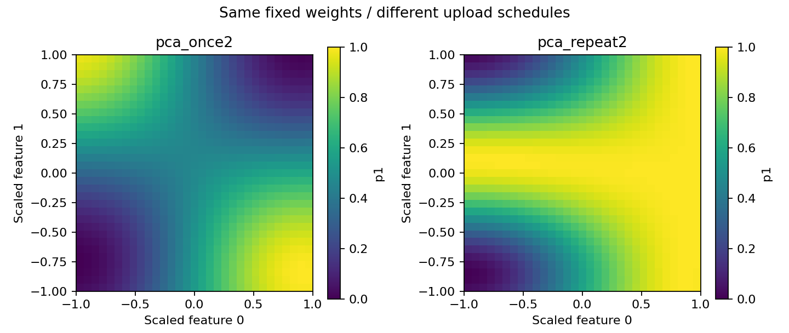
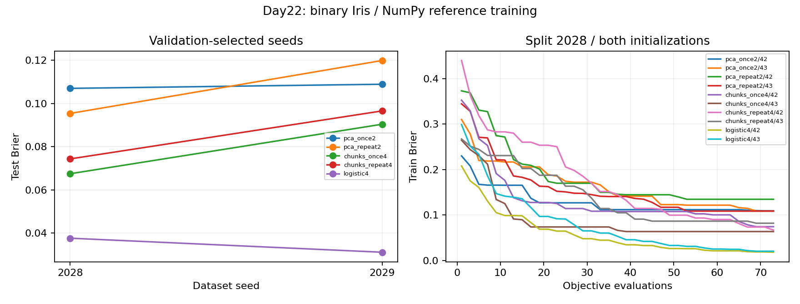

# Day 22｜資料重複編碼：讓資料再次進入量子電路

Day 21 固定兩位元，比較怎麼把四維壓成二維。今天改另一個旋鈕：**資料在電路裡出現幾次、出現在哪一段。**

多加一層可調模板，是多給模型幾個「旋鈕」；讓同一筆資料再進來一次，則是再決定一次旋轉角度。兩者常被混為一談。**資料重複編碼（data re-uploading）**指同一次狀態演化中，交替做資料編碼與可訓練操作，中途不量測、不重設——不是多抽幾次 shots，也不是把一筆樣本複製成兩筆訓練資料。

程式：[reuploading.py](reuploading.py)、[experiment.py](experiment.py)、[demo.py](demo.py)、[plot_results.py](plot_results.py)。沿用 Iris 與 `.venv`；NumPy 訓練、CUDA-Q 核對。

Day22 compares single vs repeated encoding schedules for PCA2 and four-feature chunked inputs under paired controls (same trainable count, ansatz block, and initial weights). Iris binary classification uses shared Brier/coordinate-search budgets. Curve changes do not establish better classification or quantum advantage.

---

## 1. 多一層 Ansatz ≠ 資料重複編碼

令 `E(x)` 為資料編碼、`A(θ)` 為可調區塊：

```text
single： |00⟩ → E(x) → A(θ0) → A(θ1) → ZZ
re-up：  |00⟩ → E(x) → A(θ0) → E(x) → A(θ1) → ZZ
```

兩者都有兩個可調區塊；後者多一次 `E(x)`。[P4] 是概念來源；本日是 RY／CNOT／ZZ 受限教學模型，不是該論文完整復現。

## 2. 四維可分段進兩位元

```text
E01 = RY(a0), RY(a1)    # 欄位 0／1
E23 = RY(a2), RY(a3)    # 欄位 2／3
一次完整 pass：E01 → A0 → E23 → A1
再次完整 pass：E01 → A2 → E23 → A3
```

第一次 `E23` 是**分段上傳**；第二次才是各特徵**再次上傳**。兩位元可接收四特徵，但仍非無損記憶，也不能一次量測讀回四個值。

## 3. 配對控制：只改排程

排程裡 `0`＝用欄位 0／1，`2`＝用 2／3，`−1`＝不編碼：

| 模型 | 表示 | 排程 | 參數 | 編碼區塊 |
|---|---|---|---:|---:|
| pca_once2 | PCA2 | [0,−1] | 8 | 1 |
| pca_repeat2 | 同 PCA2 | [0,0] | 8 | 2 |
| chunks_once4 | 四維 min-max | [0,2,−1,−1] | 16 | 2 |
| chunks_repeat4 | 同四維 | [0,2,0,2] | 16 | 4 |
| logistic4 | 四維標準化 | — | 5 | 0 |

每個 `A`：RY⊗RY → CNOT → RY⊗RY；讀出 `p1=(1−⟨ZZ⟩)/2`。配對內同種子＝同初始權重。未合併閘時深度約 7／8／14／16（原始計數，非硬體深度）。

## 4. 重複不自動等於更強

相鄰同軸旋轉可合併：`RY(b)RY(a)=RY(a+b)`。固定權重下比較 once2／repeat2 的二維機率反應：



四點混合差值 `Δ` 非零表示局部非加性；單次編碼也可能有交互作用，不能把所有交互都歸功於重複輸入。圖形改變 ≠ 證明表達能力全面提升。

## 5. 資料與訓練

沿用 Day 20 Iris 二分類切分。PCA 配對重用 train-only PCA；chunks 用各欄 train min-max；logistic 用四維標準化。[D14] 角度 `positive_half`。

2 切分 × 5 模型 × 種子 42／43＝**20** 次訓練；各 73 次目標函數。相同評估次數 ≠ 相同閘成本或已收斂。



本次結果**沒有**顯示重複輸入必然較好。完整數字見 [結果報告](../../results/day22/README.md)。不依測試成績改種子或預算。

`cudaq_training_calls=0`；選定後每後端 2×99×4＝**792** 次 `observe`。測試集已公開，屬探索性實驗，不做顯著性或優勢宣稱。

## 6. 重跑

```bash
source .venv/bin/activate
OMP_NUM_THREADS=1 python articles/day22/experiment.py train
OMP_NUM_THREADS=1 python articles/day22/experiment.py verify
OMP_NUM_THREADS=1 python articles/day22/experiment.py verify --backend nvidia
OMP_NUM_THREADS=1 python articles/day22/plot_results.py
OMP_NUM_THREADS=1 python articles/day22/demo.py --features 6.0 2.9 4.5 1.5
```

下一篇 [Day 23](../day23/README.md) 改談量子核方法（樣本相似度，而非訓練電路權重）。

## 7. 來源

- [P4] Pérez-Salinas et al. “Data re-uploading for a universal quantum classifier.” *Quantum* 4, 226 (2020). [DOI](https://quantum-journal.org/papers/q-2020-02-06-226/)
- [D14] [Common pitfalls](https://scikit-learn.org/stable/common_pitfalls.html)
- [D17] [Day20 UCI 紀錄](../../data/day20/README.md)

查閱日期 2026-09-07；索引：[REFERENCES.md](../../REFERENCES.md)。

## 延伸研究

[N3] Seungcheol Oh et al. “Fourier Analysis Perspective on Quantum Neural Networks.” Communications Physics 9, 176 (2026)；觀點論文。[原始來源](https://doi.org/10.1038/s42005-026-02680-x)；[完整書目](../../REFERENCES.md#n3)。

重複編碼會改變可出現的頻率結構；能表示的函數變多，不保證分類更好。
