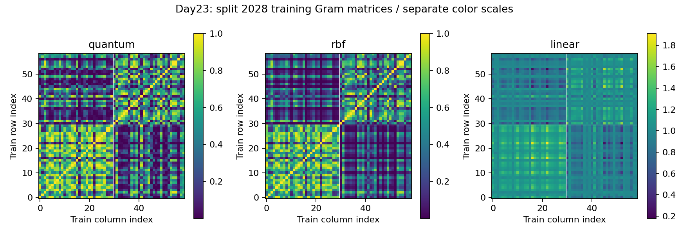
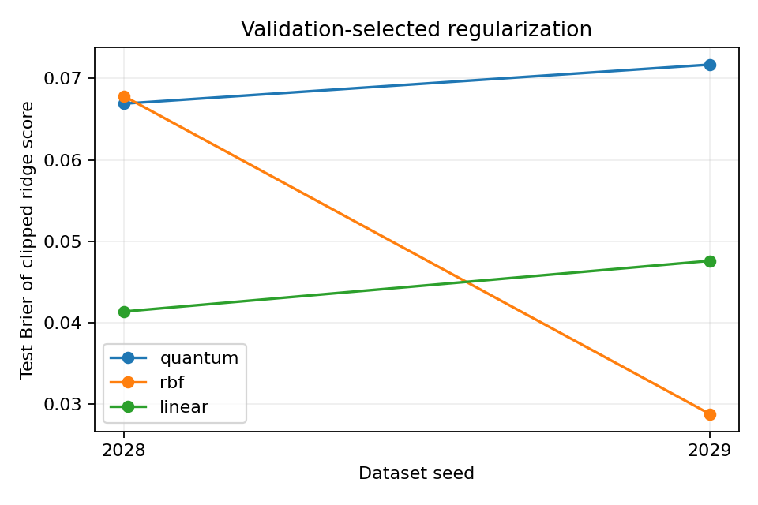

# Day 23｜量子核方法：從資料相似度建立分類模型

[Day22](../day22/README.md) 比較單次、分段與重複資料編碼，觀察資料進入電路的順序如何影響輸出與成本。Day23 固定編碼電路，改以兩筆資料對應量子狀態的相似程度建立分類模型。

**量子機器學習（QML）也能從資料之間的相似度學習。** 資料先經過固定電路，轉成量子狀態；量子核函數（quantum kernel）再為每一對狀態算出相似度。本章使用的數值介於 0 與 1，越接近 1 表示狀態越相似。所有訓練樣本兩兩比較後，形成一張相似度表，再由一般電腦求出預測所需的係數。這樣可以研究固定量子編碼是否提供有用的資料表示，而不必訓練電路中的旋轉角度。實驗沿用 Iris 鳶尾花資料，比較量子核與兩種傳統核函數，並核對 CPU 與 GPU 的計算結果。重點在於相似度如何變成預測，以及訓練資料順序、參數選擇與儲存成本如何影響整個流程；少量測試成績不能單獨證明量子方法更有優勢。

[Day22](../day22/README.md) compared single, segmented, and repeated data encoding, examining how encoding schedules affect model outputs and cost. Day23 instead uses a fixed encoding circuit to calculate similarities between the quantum states of two inputs, then builds a classifier through classical computation.

**QML can also learn from similarities between encoded samples.** A fixed quantum circuit represents each input as a quantum state, and a classical model uses comparisons between these states to make predictions. The quantum kernel measures similarity as the squared magnitude of the overlap between two states. This mathematical kernel is distinct from CUDA-Q's `@cudaq.kernel` function annotation. The implementation prepares one input's state, applies the inverse encoding circuit of another input, and obtains the kernel value from the probability of returning to the all-zero state. Pairwise comparisons of training samples form a Gram matrix, which kernel ridge regression uses to solve for classical coefficients. Predicting a new input still requires comparisons with the saved training samples. Key checks include symmetry and positive semidefiniteness, consistent training-sample ordering, and selection of the regularization parameter using validation data only. Quantum, RBF, and linear kernels are compared on the same Iris inputs, with NumPy model construction followed by CUDA-Q CPU/GPU verification of quantum matrices. Fixed quantum circuits still incur classical solving, matrix storage, and pair-evaluation costs. Heatmaps and small test sets alone do not establish quantum advantage.


---

程式：[kernels.py](kernels.py)、[experiment.py](experiment.py)、[demo.py](demo.py)、[圖表與報告](plot_results.py)、[測試](test_kernels.py)。實測見 [結果報告](../../results/day23/README.md)。沿用 `.venv` 虛擬環境，也就是專案獨立保存套件的目錄，無需新增套件或下載資料。

## 1. 從單筆預測到兩筆資料的相似度

特徵是描述一筆資料的數值，例如花瓣長度。特徵映射（feature map）將這些數值轉成另一種表示；這裡用電路 `U(x)`，把初始狀態 `|00⟩` 轉成資料 x 的量子狀態 `|φ(x)⟩`。量子特徵空間就是這些狀態所在的表示空間。

本章使用保真度核（fidelity kernel），以兩個狀態內積的絕對值平方衡量相似度。內積可以理解為比較兩組狀態振幅的重疊程度；振幅是決定量測機率的數值。

```text
k(x,z) = |⟨φ(z)|φ(x)⟩|²
K[i,j] = k(x_i, x_j)
```

`k(x,z)` 是兩筆資料的相似度；`K[i,j]` 是第 i 與第 j 筆訓練資料的相似度。訓練資料有 n 筆，Gram matrix（格拉姆矩陣）就是 n×n 的相似度表。對 m 筆新資料，則建立 m×n 的表：每一列代表一筆新資料，每一欄對應一筆保存的訓練資料，欄位順序必須一致。預測仍需要訓練樣本，不能只保存少量電路權重。

此處的核函數是數學上的相似度函數，與 CUDA-Q 用來標記量子程式的 `@cudaq.kernel` 不同。Havlíček 等人的研究展示以量子特徵空間估計核函數來分類的方法。[P5] 本章使用自行設定的小型電路與核嶺迴歸，並非原論文電路或支援向量機（SVM）的完整重現；SVM 是另一種利用分類邊界與樣本距離建立模型的方法。

## 2. 先編碼，再反向操作

兩個量子位元分段接收四個特徵，固定執行以下電路：

```text
U(x): RY(a0)⊗RY(a1) → CNOT(q0→q1) → RY(a2)⊗RY(a3)
a_j = π(x_j+1)/2
```

RY 是以指定角度旋轉單一量子位元的操作，`⊗` 表示兩個位元各自執行操作。CNOT 是受控反相閘，在計算基底中，q0 為 1 時翻轉 q1。縮放後的特徵 x_j 介於 −1 與 1，因此角度 a_j 介於 0 與 π。所有角度都由資料決定，沒有需要訓練的量子參數。

比較 x 與 z 時，先執行 `U(x)`，再執行 `U(z)†`。符號 `†` 在此表示電路的反向操作。這個流程稱為 compute–uncompute：先編碼，再嘗試以另一筆資料的電路撤銷編碼。

```text
|00> → U(x) → U(z)† → P(00)
P(00) = |⟨00|U(z)†U(x)|00⟩|² = k(x,z)
```

若兩筆資料準備出相同狀態，反向操作會回到 `|00⟩`；一般情況下，回到全零狀態的機率就是核函數值。反向電路必須倒轉量子閘順序，並將每個閘換成反向操作：RY 的角度取負，CNOT 再做一次即可撤銷。[kernels.py](kernels.py) 明確列出這些步驟。

全零投影算符可理解為只對 `00` 結果記 1、其餘結果記 0 的量測量，其期望值（依機率計算的平均值）就是 `P(00)`：

```text
|00⟩⟨00| = (I+Z0)(I+Z1)/4
```

I 表示不改變狀態的單位操作；Z0、Z1 分別對第 0、1 個位元的 0 結果記 +1、1 結果記 −1。本章以 `cudaq.observe(..., shots_count=-1)` 直接從模擬狀態計算期望值，不用有限次量測抽樣。一次 `observe` 呼叫不代表真實硬體只需量測一次。

原始比較電路有 8 個 RY 與 2 個 CNOT，編譯器可能合併相鄰旋轉。此處沒有量測量子處理器（QPU）的執行延遲，也未計算硬體原生閘，也就是硬體直接支援的操作成本。

NumPy 是 Python 數值運算套件。參考計算分別準備兩個狀態，再以 `abs(vdot(state_z,state_x))**2` 計算相似度，與反向電路使用不同計算路徑，供 CUDA-Q 核對。CPU 是中央處理器，GPU 是擅長平行運算的圖形處理器；本章兩者都用來模擬量子電路。

## 3. 相似度矩陣需要滿足哪些條件？

正規化狀態的所有量測機率總和為 1。本章的核函數因此滿足 `k(x,x)=1`、`k(x,z)=k(z,x)`，數值介於 0 與 1。相同樣本與自身完全相似，交換比較順序也不改變結果。

更關鍵的條件是半正定性（positive semidefinite，PSD）：對任意實數權重向量 c，`cᵀKc` 都不小於 0。這是核方法所需的數學結構，光是每一格都非負還不夠。將狀態寫成密度矩陣 `ρ(x)=|φ(x)⟩⟨φ(x)|`，也就是以矩陣保存狀態資訊，可得到：

```text
k(x,z) = Tr[ρ(x)ρ(z)]
cᵀKc = ||Σ_i c_i ρ(x_i)||²_F ≥ 0
```

`Tr` 是矩陣對角線元素的總和，`ᵀ` 表示轉置，`‖·‖_F²` 是矩陣每個元素絕對值平方的總和，因此不會為負。這說明精確計算的 Gram matrix 是半正定矩陣。

半正定允許某些非零 c 得到 0；正定則要求非零 c 一定得到正值。重複或相似的表示可能讓矩陣奇異，也就是無法直接求逆。測試檢查密度矩陣內積、對稱性、對角線與最小特徵值；特徵值描述矩陣沿特定方向的縮放，PSD 要求所有特徵值非負。浮點運算的有限精度可能產生極小負值，報告保留原始結果，沒有將負值改為 0 來修正矩陣。

若所有狀態最後都加上相同、與資料無關的酉操作 V，重疊程度不變。酉操作保留內積，並滿足 `V†V=I`，所以共同的末端操作會在比較時抵消。只在電路尾端加上可能產生糾纏的固定閘，不會自動改變核函數；糾纏是多個量子位元無法各自獨立描述的狀態關聯。本章的 CNOT 放在兩段資料旋轉之間，後面仍有依資料變化的操作。

## 4. 傳統比較基準與核嶺迴歸

所有方法接收相同的四個原始特徵。各欄位只用訓練資料的最小值與最大值建立縮放規則，轉到 [-1, 1]，超出範圍的值截斷到邊界。不使用類別標籤建立縮放規則，也不使用 PCA（主成分分析，將多個欄位組合成較少的新座標）。

| 核函數 | 定義 | 設定 |
|---|---|---|
| 量子核 | 量子狀態內積的絕對值平方 | 固定兩個量子位元的編碼電路 |
| RBF（徑向基底函數） | exp(−γ‖x−z‖²) | 預先固定 γ=1 |
| 線性核加常數 | 1+x·z/4 | 等價於使用特徵 [1,x/2] |

RBF 依資料間的直線距離計算相似度，距離越遠，值越接近 0；γ 控制下降速度。線性核使用內積 `x·z`，也就是對應特徵相乘後相加。額外的常數特徵讓輸出能整體平移，但此係數同樣受到正則化限制，不等於額外加入不受限制的截距。

核嶺迴歸（kernel ridge regression，KRR）利用相似度表求出每筆訓練樣本的係數，再加權組合成預測。[D20] 正則化是在貼近訓練標籤之外，加入限制函數大小的懲罰，降低過度迎合訓練資料的風險；λ 控制懲罰強度。不同核函數的數值尺度不同，相同 λ 不代表相同的限制效果。

```python
alpha = np.linalg.solve(K_train + lam * np.eye(n), y_train)
raw_score = K_query_train @ alpha
score = np.clip(raw_score, 0, 1)
predicted_class = score >= 0.5
```

`alpha` 是求得的係數，`np.eye(n)` 是對角線為 1、其餘為 0 的單位矩陣；`solve` 直接解線性方程組，不先計算矩陣的反矩陣。`@` 表示矩陣乘法，新資料與所有訓練樣本的相似度會依 `alpha` 加權相加。每個 λ 使用同一張 K，不需重跑量子電路。

求解的目標是 `sum_i(f(x_i)-y_i)^2 + λ||f||²`：前半是預測與標籤的平方誤差總和，沒有除以樣本數 n；後半是再生核希爾伯特空間（RKHS）中的函數範數懲罰。RKHS 可理解為由核函數決定、附有長度衡量方式的函數空間，這裡的範數衡量預測函數的大小。模型沒有額外截距。

這裡把迴歸結果用於 0／1 類別判斷。原始分數可能超出 [0, 1]，因此同時保存原始值與截斷值；以 0.5 為分類門檻，計算準確率與 Brier 分數。準確率是分類正確的比例，Brier 分數是輸出與 0／1 標籤的平均平方誤差。截斷不保證分數是校準機率，例如輸出 0.8 不一定對應約八成的實際發生率；求解器也不是直接最小化截斷後的 Brier 分數。

測試另比較線性模型直接求特徵權重的原始形式（primal）與透過核矩陣求樣本係數的對偶形式（dual），並檢查同步重排訓練樣本與係數後，預測是否一致。

## 5. 資料、參數選擇與實測

沿用 Day20 的 Iris 二分類資料，只比較兩個花種。去重後共 99 筆，使用隨機種子 2028／2029 產生兩組切分，每組有訓練資料 59 筆、驗證資料 19 筆、測試資料 21 筆。隨機種子用來重現資料打亂順序。資料列編號、縮放規則與來源 SHA-256 都有保存；SHA-256 是由檔案內容計算的摘要，用來核對檔案是否一致。

各模型只比較 `λ∈{0.01,0.1,1}`，依驗證資料的截斷後 Brier 分數選擇，平手取較小 λ，最後才對測試資料評分。此處沒有隨機初始化權重，共有 2 組切分 × 3 種核函數 × 3 個 λ，也就是 **18 次傳統核嶺迴歸求解**。



熱圖用顏色呈現矩陣數值。訓練樣本按原有類別分組順序顯示，白線為類別交界；標籤不參與核函數計算。每張圖使用獨立色階，不能直接以亮度比較不同核函數的品質。



完整數值見 [結果報告](../../results/day23/README.md)。量子核在兩組測試資料的準確率都是 90.48%，本次並未一致勝過傳統核函數。熱圖的分組形狀與少量測試成績不足以推論量子優勢。

兩組資料切分互相重疊，且測試資料已在 Day20 公開，因此屬於探索性實驗。正式選模型可另保留未查看的資料，或使用巢狀交叉驗證：內層選參數，外層評估選定方案。RBF 的 γ 固定，λ 候選也只有三個，這不是充分調整參數後的排行榜。此處與 Day22 的 73 次目標函數評估採用不同訓練預算，不能直接作為跨章速度或準確率的公平比較。

## 6. 核方法的成本移到哪裡？

本章先以 NumPy 建立矩陣、選擇 λ 並求出 `alpha`，訓練過程沒有呼叫 CUDA-Q。接著由 CPU／GPU 模擬器重建全部量子核矩陣元素，使用固定的 `alpha` 核對分數。後端（backend）是實際執行模擬的工具。

每組切分需要以下比較次數：

| 矩陣 | 大小 | 樣本配對計算次數 |
|---|---|---:|
| 訓練 × 訓練 | 59×59 | 3,481 |
| 驗證 × 訓練 | 19×59 | 1,121 |
| 測試 × 訓練 | 21×59 | 1,239 |
| 合計 | 99×59 | 5,841 |

每個後端的兩組切分共 **11,682 次直接計算期望值的 `observe` 呼叫**。本章包含對角線與對稱位置的重複計算，以便核對；一般可利用對稱性減少配對數。每筆新資料需要與 59 筆訓練資料比較。

若完整保存矩陣，n 筆訓練資料需要 O(n²) 儲存空間，直接求解通常需要 O(n³) 計算量；m 筆新資料需要 O(mn) 次配對。O 表示規模增加時的成長趨勢，例如 n 加倍，矩陣空間約變成四倍，直接求解的主要計算量約變成八倍。

NumPy 可以先保存每筆量子狀態，再用矩陣乘法比較；這與逐對執行反向電路的工作量不同，不能直接相除計時結果來宣稱 GPU 加速。此處只有兩個量子位元，一般電腦即可有效模擬，沒有計算優勢的結論。

GPU 使用 fp32，也就是 32 位元浮點數，有限精度造成的核函數誤差可能在乘上 `alpha` 後放大。因此分別要求矩陣誤差小於 `1e-5`、截斷分數誤差小於 `1e-4`。完整矩陣以 NPZ（NumPy 陣列封裝檔）保存，沒有用 GPU 結果重新訓練或選擇 λ。

本章模擬未加入硬體噪聲，也未使用有限次量測抽樣。若改以有限 shots（重複準備與量測的次數）估計相似度，抽樣誤差可能使矩陣失去半正定性；相關估計與修正方法尚未納入本實驗。

## 7. 重跑與單筆示範

沿用 [requirements-day23.txt](../../requirements-day23.txt)，不需安裝機器學習套件 scikit-learn。`OMP_NUM_THREADS=1` 將 CPU 平行工作的執行緒數設為 1。示範的四個輸入依序為花萼長度、花萼寬度、花瓣長度與花瓣寬度，單位為公分。

```bash
source .venv/bin/activate
OMP_NUM_THREADS=1 python articles/day23/experiment.py train
OMP_NUM_THREADS=1 python articles/day23/experiment.py verify
OMP_NUM_THREADS=1 python articles/day23/experiment.py verify --backend nvidia
OMP_NUM_THREADS=1 python articles/day23/plot_results.py

OMP_NUM_THREADS=1 python articles/day23/demo.py --features 6.0 2.9 4.5 1.5
OMP_NUM_THREADS=1 python -m unittest discover -s articles/day23 -p 'test_*.py' -v
OMP_NUM_THREADS=1 DAY23_TARGET=nvidia python -m unittest discover -s articles/day23 -p 'test_*.py' -v
```

示範可加 `--split-seed 2029` 或 `--backend nvidia`，載入保存的訓練樣本順序、縮放規則與 `alpha`，不需重訓。預設 CPU 可獨立執行訓練、驗證、示範與測試；完整報告需要 CPU 與 GPU 的驗證摘要。

輸出位於 `results/day23/`，重跑會覆寫同名檔案；重訓後需重新執行 `verify` 與繪圖程式。報告核對實驗設定、資料與選定模型檔案的內容摘要，避免混用舊的後端結果。已保存的 GPU 執行紀錄在結束時仍有 `cudaErrorCudartUnloading`；數值驗證與測試的退出碼為 0，表示程式回報成功，但該結束錯誤的根因尚未定位。

## 8. 下一步與來源

Day24 回到電路是否容易訓練的問題，觀察梯度，也就是參數小幅改動時目標函數的變化率。Barren Plateau（貧瘠高原）描述某些量子電路的梯度變得極小、難以提供有效調整方向的現象。

- [P5] Vojtěch Havlíček, Antonio D. Córcoles, Kristan Temme, Aram W. Harrow, Abhinav Kandala, Jerry M. Chow, Jay M. Gambetta. “Supervised learning with quantum-enhanced feature spaces.” *Nature* 567, 209–212 (2019). [DOI 與出版頁](https://www.nature.com/articles/s41586-019-0980-2)。
- [D20] [Kernel ridge regression](https://scikit-learn.org/stable/modules/kernel_ridge.html)：核嶺迴歸與核技巧，亦即透過核函數計算相似度，不必明確列出轉換後的所有特徵；本文以 NumPy 自行實作。
- [D17] [UCI 資料紀錄](../../data/day20/README.md)：兩類花種的資料選取與去重方式。

查閱日期 2026-09-07；完整索引見 [REFERENCES.md](../../REFERENCES.md)。

接續：[Day24｜Barren Plateau](../day24/README.md)。
