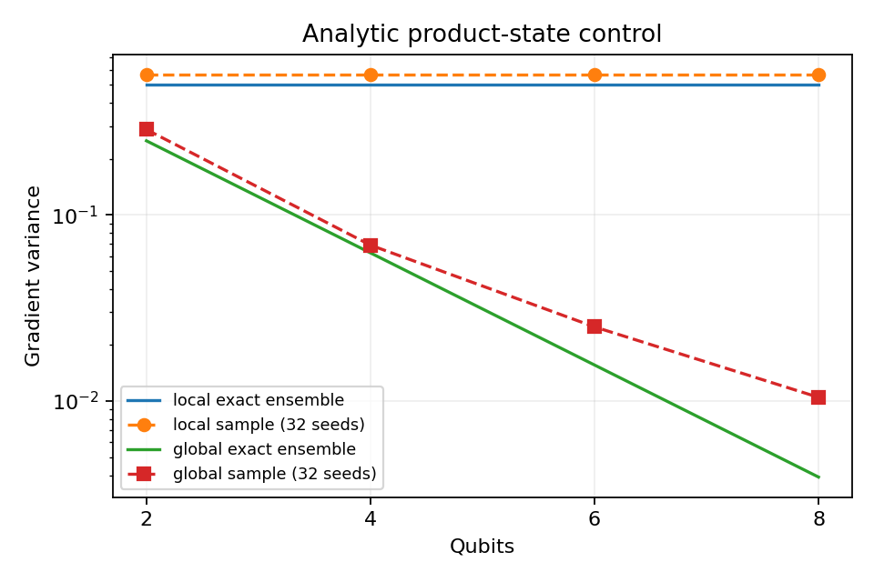
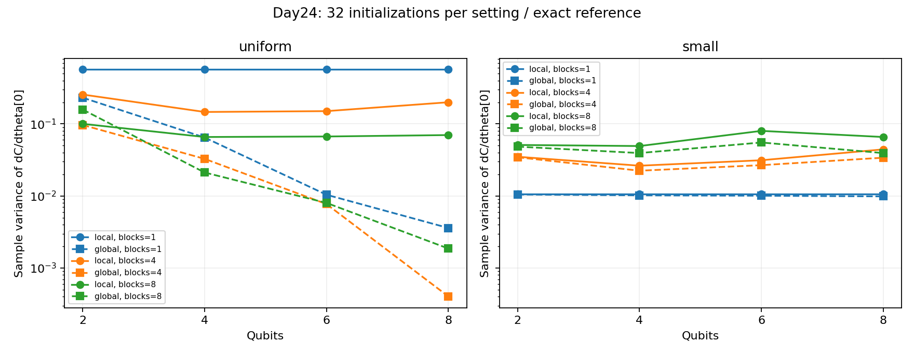

# Day 24｜Barren Plateau：為什麼 QNN 學不動？

[Day23](../day23/README.md) 固定量子資料編碼，以樣本間的量子態相似度建立相似度矩陣，再由一般電腦求解分類模型。Day24 回到需要更新電路權重的量子神經網路（QNN），探討即使梯度計算正確，是否仍可能因數值太小而難以估計或用於更新。

**梯度描述參數小幅改動時，目標函數會如何變化，是調整電路權重的重要依據。** 當梯度非常小，更新方向就可能難以辨認。Barren Plateau（貧瘠高原）關注的是在特定電路與初始化分布下，梯度集中於零附近，且衡量梯度分散程度的變異數可隨量子位元數呈指數下降；單次梯度為零或一條平坦的損失曲線（模型誤差隨訓練變化的紀錄），仍不足以確認這種現象。本章固定觀察同一個旋轉參數，改變量子位元數、電路區塊數與初始化方式，並比較只讀取一個量子位元的 local cost（局部目標）和涉及全部量子位元的 global cost（全域目標）。實作先用獨立矩陣導數與參數位移法核對梯度，再跨多個初始化觀察分布，另加入可直接推導的簡單電路作對照。重點是梯度大小也受目標定義、參數位置與初始化影響，換成局部目標或小角度初始化不保證解決原任務。梯度計算錯誤、特定位置的零梯度與跨初始化的梯度集中，需要分開辨認。若以重複量測估計梯度，小訊號可能需要更多 shots（重複準備狀態並量測的次數）才能辨認。本章以小規模、未加入硬體噪聲的模擬診斷這些現象，尚未驗證改善策略的分類成效。

[Day23](../day23/README.md) used a fixed quantum encoding to construct a kernel matrix from state similarities, then solved the classification model classically. Day24 returns to QNNs with trainable circuit weights and asks whether correctly computed gradients can nevertheless be too small to estimate or use effectively for updates.

**Gradients describe how an objective changes when a parameter changes slightly, providing a direction for weight updates.** Very small gradients can make that direction difficult to resolve. Barren-plateau research concerns gradients concentrating near zero under specified circuits and initialization distributions, with variance that can decrease exponentially with qubit count. A single zero gradient or flat loss curve is insufficient to establish this behavior. The chapter tracks the same rotation parameter while varying qubit count, circuit-block count, and initialization, comparing a local objective involving one qubit with a global objective involving all qubits. Independent matrix derivatives and parameter-shift check gradient correctness before distributions across initializations are examined. A simple circuit with analytically derivable gradients provides an additional control. Gradient magnitude also depends on the objective, parameter location, and initialization; choosing a local objective or small initial angles does not guarantee that the original task becomes easier. Calculation errors, zero gradients at particular points, and concentration across initializations require separate checks. Resolving small gradients may require more repeated measurements, or shots. This small-scale ideal-simulator diagnostic does not establish the classification performance of a mitigation strategy.

---

[Day17](../day17/README.md) 確認梯度怎麼算；今天問另一件事：**計算正確的梯度，是否仍小到難以估計或更新？** 本章比較量子位元數、電路區塊數、目標涵蓋的量子位元範圍與初始化，不執行分類器訓練。

程式與結果：[landscape.py](landscape.py)、[experiment.py](experiment.py)、[demo.py](demo.py)、[plot_results.py](plot_results.py)、[測試](test_landscape.py)、[實測報告](../../results/day24/README.md)。沿用 `.venv` 虛擬環境，也就是專案獨立保存套件的目錄，使用既有套件。

## 1. 損失沒下降，不等於 Barren Plateau

Barren Plateau 研究關注在指定的電路與初始化分布下，梯度集中在零附近，且梯度變異數可隨量子位元數呈指數下降。McClean 等人的結果與隨機電路及 2-design 性質有關，並非宣稱所有 QNN 都無法訓練。[P6]

單次梯度為 0，可能只是落在駐點，也就是當下的一階變化率為零；駐點不一定是最佳解。其他原因包括參數所控制的操作與量測量對易（交換順序不改變結果）、參數不在目標函數的因果範圍（操作無法影響被量測的部分）、程式漏接參數，或用微小差值估計梯度時產生數值誤差。損失停滯也可能來自最佳化器、預算、資料或損失設計。因此本日固定參數位置，在多個初始化樣本上看分布，而不是挑一條平坦訓練曲線就下結論。

初始化是決定訓練開始前的權重；初始化分布描述這些起始值如何隨機抽出。變異數衡量數值相對平均值的分散程度，越小代表越集中。指數下降例如每增加一個量子位元就乘上 1/2，比每次減去固定數值更快接近零。最佳化器則是根據目標函數或梯度決定如何更新權重的演算法。

2-design 是一種隨機性條件：對涉及至多二階矩的統計量，其平均表現與理想的均勻隨機酉操作一致。酉操作是可逆且保留量子狀態內積的操作。這項條件有特定數學意義，不能只憑電路看起來隨機就認定成立。

## 2. 固定實驗設定

| 項目 | 本日設定 |
|---|---|
| 量子位元數 n | 2、4、6、8 |
| 區塊數 L | 1、4、8 |
| 每個區塊 | 每個量子位元依序執行 RY→RZ，再 CZ(0,1)、CZ(1,2)…CZ(n−2,n−1) |
| 量子參數 | 2nL，每個旋轉操作獨立 |
| 初始狀態 | 全部從零態開始 |
| 初始化 | 均勻分布(−π,π)；常態分布(0,0.1) |
| 隨機種子 | 每組 0…31，32 個樣本 |
| 梯度座標 | 第一個區塊、第 0 個量子位元的 RY，`weights[0]` |
| 局部目標 | C_local=⟨Z0⟩ |
| 全域目標 | C_global=⟨Z0 Z1 … Z(n−1)⟩ |
| Shots／噪聲 | 直接計算期望值，無噪聲 |

RY 與 RZ 分別繞量子位元的 Y 軸與 Z 軸旋轉；CZ 是受控相位閘，只對兩位元皆為 1 的狀態分量改變正負號。區塊是依固定順序組合的一組操作，重複 L 次。均勻分布讓區間內等長範圍有相同抽取機會；常態分布則讓值集中在平均值附近，此處標準差 0.1 描述分散程度。隨機種子用來重現抽取序列。

Z 量測將 0 結果記為 +1、1 結果記為 −1。局部目標只取第 0 個位元的平均；全域目標先將所有位元的記分相乘，再取平均。`⟨·⟩` 表示這個依機率計算的平均值，也就是期望值。

四種 n×三種 L×兩種初始化×32 個隨機種子，共 **768 個電路初始化**；每個算兩種目標函數的同一個梯度，共 **1,536 個梯度數值**。沒有 Iris、準確率或訓練／測試切分，本章只診斷目標函數如何隨參數改變；可解析計算的對照見第 4 節。

狀態向量用一組複數振幅保存量子狀態，振幅的絕對值平方決定量測機率。n 個量子位元有 `2^n` 個基底狀態，因此要保存同樣數目的振幅。電路深度是必須依序執行的操作層數，不等於程式重複幾個區塊。

L 是區塊數，不是編譯後的電路深度。每區塊有 2n 個單量子位元閘、n−1 個 CZ；狀態向量有 2^n 個複數振幅。GPU 記憶體在本日 n≤8 並非瓶頸，也不做 GPU 加速結論。

兩個目標函數都在[-1,1]，避免把總和與平均值的任意數值尺度差異當成梯度消失；但它們代表不同目標函數。將全域目標換成局部目標可能改變任務，不能保證原本的解仍正確。[P7] 本章並非該論文使用局部 2-design 電路模板的完整重現。

## 3. 三條路徑核對梯度

NumPy 是 Python 數值運算套件。參考實作同時更新量子狀態與導數狀態；後者記錄所選參數小幅改變時，狀態如何變化。下式 G 是當前量子閘，θ 是所選參數，O 是量測量，Re 表示取複數的實部，i 是虛數單位，Y 是 Pauli Y 矩陣，也就是 RY 旋轉所對應的生成算符：

```text
|ψ'> = G|ψ>
|dψ'> = G|dψ> + (dG/dθ)|ψ>  # 第二項只在 weights[0] 對應的 gate 加入
∂C/∂θ = 2 Re⟨dψ|O|ψ⟩
dRY/dθ = (-iY/2) RY
```

張量在此可理解為多維陣列，每個軸對應一個量子位元。NumPy 以張量軸操作套用單量子位元閘，不建立大型 2^n×2^n 矩陣。此處陣列排序把第 0 個量子位元放在最高位；CUDA-Q 直接使用 `spin.z(0)` 指定量測量，避免把後端內部位元順序當成相同陣列排序。

CUDA-Q 是執行量子程式的工具；此處的後端指 CPU（中央處理器）或 GPU（圖形處理器）上的模擬器。參數位移法將同一個角度分別增加與減少 π/2，再由兩次目標值的差算出導數：

```text
g = [C(θ0+π/2) − C(θ0−π/2)] / 2
```

此規則適用於本日獨立 RY 參數，不是把完整損失隨意位移。每個梯度兩次 observe，兩後端各 **3,072 次 observe**；保存兩個位移後的期望值，不只保存相減後的值。測試與示範另以 NumPy 中央有限差分核對：以 `h=1e-5` 的微小步長，計算 `[C(θ+h)−C(θ−h)]/(2h)`。有限差分是近似法，可作為另一條檢查路徑。`observe` 是計算指定量測量期望值的程式呼叫。

## 4. 可解析對照：不用深電路也會有全域梯度縮小

乘積態表示每個量子位元能各自描述，沒有糾纏；糾纏則是無法拆成各位元獨立狀態的關聯。符號 `⊗` 表示組合各位元的狀態，`∏` 表示將各項相乘。考慮乘積態 `⊗_j RY(θ_j)|0⟩`，θ_j 獨立均勻分布於[−π,π]：

```text
C_local = cos θ0
C_global = ∏_j cos θ_j

g_local = −sin θ0
g_global = −sin θ0 × ∏_(j>0) cos θ_j
```

E 表示對隨機分布取平均，Var 表示變異數。由 E[sin θ]=0、E[sin² θ]=E[cos² θ]=1/2，可直接推導：

```text
E[g_local] = E[g_global] = 0
Var(g_local) = 1/2
Var(g_global) = (1/2)^n
```

這是對指定分布與目標函數直接推導的精確結論，不是用四個資料點擬合所得。模型可用一般電腦計算，卻已能展示全域目標的梯度變異數呈指數縮小。



主實驗單一區塊的 RZ 與 CZ 都對 Z 讀出對易，因此對兩種目標函數也有相同解析形式。CZ 可能改變狀態的糾纏，但此時不改變這些期望值；不要把單一區塊的下降歸因於「電路很深」。測試會直接核對單一區塊解析式。

對照的 32 個樣本另用長度 n 的均勻分布向量；主實驗用長度 2nL、交錯 RY／RZ 的向量，因此相同隨機種子 並非逐筆相同角度。兩者分布上的理論比較仍成立。

## 5. 如何讀變異數圖

對固定（n、L、初始化、目標函數）的 32 個梯度，報告平均值、樣本變異數(ddof=1)、RMS、梯度絕對值的中位數，以及 `|g|<0.01` 的比例。0.01 只是描述性門檻，不是 Barren Plateau 判定標準。

樣本變異數的 `ddof=1` 表示將離均差平方總和除以 31，而非 32。RMS（均方根）先將梯度平方、取平均再開根號，可避免正負抵消；絕對值中位數則是將梯度大小排序後的中間值。信賴區間用來表達估計的不確定程度，規模擬合則檢查數值是否符合某種隨量子位元數變化的關係。



本次均勻分布組的全域目標的梯度變異數隨 n 下降；局部目標反應不同。小角度組沒有呈現相同下降趨勢，但不能據此宣稱可擴展訓練已解決。每組僅 32 樣本、最多 8 個量子位元，沒有估信賴區間或做規模成長趨勢的擬合；曲線連線只幫助閱讀，不表示證明單調或指數關係。

不同設定重用隨機種子，因此曲線可能相關；這些曲線不是大量獨立重複評測。固定索引 0 的參數不代表完整梯度向量的長度，也不代表所有參數。局部量測量的因果範圍與所選參數位置都會影響結果。

完整數值與驗證誤差見 [結果報告](../../results/day24/README.md)，不只公布有下降的曲線。

## 6. 小角度初始化不是萬用解

本章的 `small` 設定是常態分布（平均值 0、標準差 0.1），不是由互為反向操作的區塊構成的恆等區塊初始化。恆等區塊由互相撤銷的操作組成，整體相當於不改變任何輸入狀態。即使所有旋轉角度為 0，CZ 仍是非恆等酉操作，只是它對初始全零態沒有作用。

在全零權重，兩個目標函數皆 1 且梯度=0；測試明確驗證此駐點。若最小化本日目標函數，這也不是想要的最小值。因此「把權重設小」可能避開某些隨機分布的集中，也可能落在駐點附近，不能只看變異數較小就說更容易訓練。

實際排查可依序核對：參數是否影響輸出、參數位移法與參考計算是否一致、目標函數與量測量的數值尺度與涵蓋的量子位元範圍、跨初始化分布、量子位元與區塊數依賴，最後再比較最佳化器和初始化的訓練結果。本日只完成前述梯度診斷，不聲稱已驗證改善策略的最終準確率。

## 7. 直接計算梯度與重複量測的成本

本章從模擬狀態直接計算期望值，不以有限次量測抽樣估計。若改成每個位移設定各執行 S 次獨立量測，估計 Pauli 量測量的期望值（此處每次結果為 +1 或 −1），參數位移法估計的變異數為：

```text
Var(g_hat) = [(1−C_plus²)+(1−C_minus²)] / (4S) ≤ 1/(2S)
```

`C_plus` 與 `C_minus` 是兩個位移設定的真實期望值，`g_hat` 是抽樣估計的梯度。這是在 ±1 量測結果與兩組獨立 shots 的假設下推導，不是本日實測。典型抽樣誤差按 1/√S 縮小，也就是量測次數增加為四倍，誤差才約減半；梯度很小時，區分訊號與量測抽樣的波動可能需要更多 shots。增加最佳化器迭代次數本身不會改善單次梯度估計的解析度。

浮點數以有限位數儲存數值，因此會產生捨入誤差。GPU 32 位元浮點數（fp32）與 CPU 64 位元浮點數（fp64）會有浮點差異，故驗證用絕對誤差容許值=1e-5，不在接近 0 的梯度上使用相對誤差，因為除以接近零的參考值會放大比例。本日沒有噪聲引起的貧瘠高原實驗，不能把浮點誤差叫做量子噪聲。

## 8. 重跑與示範

沿用 [requirements-day24.txt](../../requirements-day24.txt)，不新增套件。`OMP_NUM_THREADS=1` 將 CPU 平行工作的執行緒數設為 1：

```bash
source .venv/bin/activate
OMP_NUM_THREADS=1 python articles/day24/experiment.py run
OMP_NUM_THREADS=1 python articles/day24/experiment.py verify
OMP_NUM_THREADS=1 python articles/day24/experiment.py verify --backend nvidia
OMP_NUM_THREADS=1 python articles/day24/plot_results.py

OMP_NUM_THREADS=1 python articles/day24/demo.py --qubits 4 --depth 4 --initialization uniform
OMP_NUM_THREADS=1 python -m unittest discover -s articles/day24 -p 'test_*.py' -v
OMP_NUM_THREADS=1 DAY24_TARGET=nvidia python -m unittest discover -s articles/day24 -p 'test_*.py' -v
```

示範可加 `--seed`、`--backend nvidia`，比較兩種目標函數的導數狀態法、參數位移法與有限差分結果。CPU 可獨立執行實驗、驗證、示範與測試；完整圖表報告需兩後端驗證摘要。

輸出在 `results/day24/`，重跑覆寫同名檔案；重新 run 後再 verify 與 plot。SHA-256 是由檔案內容計算的摘要，用來核對實驗設定與樣本是否一致，防止引用舊的後端驗證摘要。已保存的 GPU 執行紀錄在結束時有 `cudaErrorCudartUnloading`，但驗證與測試的退出碼為 0，表示程式回報成功；該結束錯誤的根因尚未定位。

## 9. 下一步與文獻

Day25 將進入第二個真實資料集評測，把前面對表示、模型與成本的限制帶回分類任務。

- [P6] Jarrod R. McClean, Sergio Boixo, Vadim N. Smelyanskiy, Ryan Babbush, Hartmut Neven. “Barren plateaus in quantum neural network training landscapes.” *Nature Communications* 9, 4812 (2018). [arXiv 與期刊資訊](https://arxiv.org/abs/1803.11173)，DOI 10.1038/s41467-018-07090-4。
- [P7] M. Cerezo, Akira Sone, Tyler Volkoff, Lukasz Cincio, Patrick J. Coles. “Cost function dependent barren plateaus in shallow parametrized quantum circuits.” *Nature Communications* 12, 1791 (2021). [arXiv v3](https://arxiv.org/abs/2001.00550v3)，DOI 10.1038/s41467-021-21728-w。

查閱日期 2026-09-07；[REFERENCES.md](../../REFERENCES.md)保存版本與支持範圍。本日僅引用原始研究的概念與條件，不宣稱此 CZ 電路滿足論文全部假設。

接續：[Day25｜第二個真實資料集：Wine](../day25/README.md)。

## 延伸研究

[N8] Martín Larocca et al. “Barren plateaus in variational quantum computing.” Nature Reviews Physics 7, 174–189 (2025)；綜述論文。[原始來源](https://doi.org/10.1038/s42254-025-00813-9)；[完整書目](../../REFERENCES.md#n8)。

本章量測梯度隨設定改變的情形；這篇綜述可延伸辨認不同成因。單一小型實驗中的小梯度，仍不足以證明隨規模增長的貧瘠高原。
