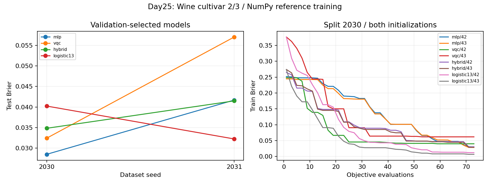

# Day 25｜第二個真實資料集：Wine 分類實驗

[Day24](../day24/README.md) 診斷梯度是否可能小到難以使用。今天回到分類：**同一套傳統／量子／混合流程，換到特徵更多、類別比例不同的 Wine 資料時，會發生什麼？**

想像同一套烹飪流程換一種食材：火候與步驟可以沿用，但切法與調味比例必須依新材料重訂。資料集換了，縮放與壓縮規則要依新的訓練資料重建；模型結構與比較預算則刻意保持一致，才能看出「流程能不能重用」。

程式：[wine_models.py](wine_models.py)、[experiment.py](experiment.py)、[demo.py](demo.py)、[plot_results.py](plot_results.py)、[test_wine.py](test_wine.py)。實測見 [結果報告](../../results/day25/README.md)。沿用 `.venv`，不新增套件。

Day25 transfers MLP, VQC, and hybrid classifiers to a binary UCI Wine subset (119 samples, 13 chemical features) under train-only standardization and PCA to two components, plus a full 13-feature logistic baseline. Sixteen NumPy fits share a 73-evaluation budget; CUDA-Q verifies frozen quantum outputs. Small-test gaps do not establish stable advantage or GPU training speedup.

---

## 1. 為何需要第二個資料集？

Day20 的 Iris 結果只對當時的資料、表示與訓練預算成立。Wine 有十三個化學特徵、類別比例也不同，適合檢查前處理與模型介面能否重用。這仍是小型教學實驗，不能代表大型部署效果。

UCI Wine 含 178 筆、十三個化學測量值與三個栽培品種。[D21] 本章預先選定原始類別 2 與 3，改記為標籤 0／1，保留 71＋48＝**119** 筆，沿用既有二分類模型——**沒有**依模型成績挑選類別組合。載入程式檢查特徵與標籤皆相同的重複列；本子集沒有這類重複。任務是判斷栽培品種，**不是**預測葡萄酒品質。

原始檔未修改，見 [資料目錄](../../data/day25/README.md)（來源、下載日期、CC BY 4.0）。`protocol.json` 記錄設定、特徵順序與 SHA-256。

## 2. 資料切分與僅使用訓練資料的轉換

預先指定種子 2030／2031：分別打亂各類別，再取約 60% 訓練、20% 驗證（筆數向下取整），其餘為測試。

| 資料用途 | 栽培品種 2／標籤 0 | 栽培品種 3／標籤 1 | 合計 |
|---|---:|---:|---:|
| 訓練：建轉換規則與更新權重 | 42 | 28 | 70 |
| 驗證：選擇訓練結果 | 14 | 9 | 23 |
| 測試：對選定模型評分 | 15 | 11 | 26 |

同一切分內訓練／驗證／測試互不重疊；不同種子的測試集可能重疊，因此不是兩個完全獨立抽樣實驗。

MLP／VQC／Hybrid 共用：

```text
raw13 → train mean/std standardization → train SVD PCA2
      → train PC minmax → clip [-1,1] → MLP / VQC / Hybrid
```

**標準化**將各欄減訓練平均、除以訓練標準差（分母為訓練筆數，對應母體標準差慣例）。**PCA（主成分分析）**經 **SVD（奇異值分解）**保留兩個主成分；固定每個主成分中絕對值最大係數為正，避免整體反號造成不可重現。再用訓練主成分的最小／最大值縮放到 [−1, 1]，越界**截斷（clip）**。

平均值、標準差、主成分與縮放範圍**全部只由訓練資料決定**；驗證／測試只套用既有規則。PCA 雖不用標籤，仍會從資料學方向——若用全部資料建規則，測試資訊會提前進入流程。做法沿用 [Day20](../day20/README.md)／[Day21](../day21/README.md)。

實測 PCA 解釋變異比例（標準化訓練）：種子 2030 約 0.372＋0.139＝0.511；2031 約 0.380＋0.160＝0.539。這描述保留了多少數值變化，**不等於**保留同樣比例的分類資訊。

完整十三維的 **Logistic13** 只做標準化，不做 PCA／截斷。它檢查壓縮後模型與完整輸入的差距；因可用資訊不同，無法單獨歸因於量子層。

## 3. 模型與固定搜尋預算

| 模型 | 結構 | 可訓練參數 | 量子位元 |
|---|---|---:|---:|
| MLP（多層感知器） | 兩主成分 → 兩隱藏單元 → 一輸出 | 9 | 0 |
| VQC（變分量子分類器） | 兩主成分 → 角度編碼 → 單層可調電路 → 輸出 | 4 | 2 |
| Hybrid（混合模型） | 兩主成分 → 傳統編碼 → 可調量子電路 → 傳統輸出 | 12 | 2 |
| Logistic13 | 十三標準化特徵 → 加權求和與 sigmoid | 14 | 0 |

MLP 隱藏單元經 `tanh` 壓到 (−1, 1)，輸出經 `sigmoid` 到 (0, 1)。VQC 用 `positive_half`：`a=π(x+1)/2` 把 [−1, 1] 映到 [0, π]；輸出 `(1−⟨ZZ⟩)/2`（兩位元量測相同記 +1、不同記 −1）。Hybrid 在量子前後加仿射＋`tanh`／`sigmoid`，直接重用 Day20 結構，仍接收 PCA2——沒有改成從十三維學壓縮的瓶頸層。

Logistic13 用 **Brier 損失**（預測與 0／1 標籤的平均平方誤差）訓練，與常見邏輯斯迴歸的交叉熵不同。

兩切分 × 四模型 × 初始化種子 42／43＝**16 次訓練**。初始化為常態(0, 0.2)；混合模型輸出層縮放係數另設 0.8。

沿用 Day18 座標搜尋：一次試改一個權重，步長 0.4。每次訓練評估損失 **73** 次，每次看全部 70 筆訓練＝**5,110** 筆模型輸入評估。`cudaq_training_calls=0`：訓練期間不呼叫 CUDA-Q。

每模型每切分依最終驗證 Brier 選種子，平手取較小種子；測試不參與選擇。初始／最終權重、歷程與全部候選皆保存。

相同 73 次評估只代表呼叫次數一致——參數量不同則完整輪次不同，成本也不同，不代表相同執行時間或已充分收斂。`fit_seconds_numpy` 不含建 PCA 時間。

## 4. 實測與結果判讀



左圖為驗證選定後的測試 Brier；右圖保留種子 2030 下兩種初始化的訓練曲線。選定測試成績：

| 切分 | 模型 | 種子 | 測試 Brier | 準確率 |
|---|---|---:|---:|---:|
| 2030 | mlp | 43 | 0.028478 | 96.15% |
| 2030 | vqc | 42 | 0.032404 | 96.15% |
| 2030 | hybrid | 42 | 0.034820 | 96.15% |
| 2030 | logistic13 | 43 | 0.040234 | 92.31% |
| 2031 | mlp | 42 | 0.041693 | 92.31% |
| 2031 | vqc | 42 | 0.057050 | 92.31% |
| 2031 | hybrid | 42 | 0.041495 | 92.31% |
| 2031 | logistic13 | 43 | 0.032224 | 92.31% |

常數對照不讀特徵，固定輸出訓練標籤 1 比例 `28/70=0.4`：兩切分測試準確率 57.69%、Brier 約 0.245——比固定 0.5 更能反映類別比例。

每個測試集只有 26 筆；一筆分類差異約 3.85 個百分點。兩個測試切分重疊；沒有交叉驗證信賴區間。Iris 與 Wine 任務不同，不能直接用準確率跨資料集排行。完整混淆矩陣、截斷計數與候選耗時見 [結果報告](../../results/day25/README.md)。

## 5. NumPy 訓練與 CUDA-Q 驗證

全部搜尋在 CPU 上以 NumPy 完成（含量子模型的狀態向量模擬）。權重固定後，才用 CUDA-Q 的 CPU／GPU 模擬器逐筆核對 VQC 與 Hybrid：

```text
2 splits × 119 samples × 2 quantum models = 476 observe / backend
```

實測最大機率誤差：CPU 約 `3.3e-16`、GPU 約 `1.1e-07`，皆通過。每後端另存 2 切分 × 4 模型 × 3 資料用途＝24 筆驗證紀錄。MLP／Logistic13 仍由 NumPy CPU 計算。

`shots=-1`：直接從模擬狀態算期望值。無硬體噪聲、非 QPU。驗證固定權重與搜尋權重是不同工作，不能把兩者耗時相除宣稱 GPU 訓練加速。

維持既有小型電路。Day24 的梯度診斷不代表本章已解決貧瘠高原；Day23 量子核方法未納入本次比較。

## 6. 重跑與單筆示範

使用 [requirements-day25.txt](../../requirements-day25.txt)，資料已保存，可離線重訓：

```bash
source .venv/bin/activate
OMP_NUM_THREADS=1 python articles/day25/experiment.py train
OMP_NUM_THREADS=1 python articles/day25/experiment.py verify
OMP_NUM_THREADS=1 python articles/day25/experiment.py verify --backend nvidia
OMP_NUM_THREADS=1 python articles/day25/plot_results.py

# 預設使用保存的切分 2030 中第一筆測試輸入；預測時不傳入正確標籤。
OMP_NUM_THREADS=1 python articles/day25/demo.py

OMP_NUM_THREADS=1 python -m unittest discover -s articles/day25 -p 'test_*.py' -v
OMP_NUM_THREADS=1 DAY25_TARGET=nvidia python -m unittest discover -s articles/day25 -p 'test_*.py' -v
```

示範支援 `--split-seed 2031`、`--backend nvidia`，或在 `--features` 後依序提供十三個原始數值：

| 順序 | 原始欄位 | 白話說明 |
|---|---|---|
| 1 | alcohol | 酒精含量 |
| 2 | malic acid | 蘋果酸含量 |
| 3 | ash | 灰分（燃燒後無機殘留） |
| 4 | alcalinity of ash | 灰分鹼度 |
| 5 | magnesium | 鎂含量 |
| 6 | total phenols | 總酚類含量 |
| 7 | flavanoids | 類黃酮含量 |
| 8 | nonflavanoid phenols | 非類黃酮酚類 |
| 9 | proanthocyanins | 原花青素含量 |
| 10 | color intensity | 顏色強度 |
| 11 | hue | 色調 |
| 12 | OD280/OD315 | 280／315 奈米光學密度比 |
| 13 | proline | 脯胺酸含量 |

數值與單位沿用原始資料慣例，不是 Iris 的公分長度。

五項測試涵蓋來源與切分、僅訓練資料建 PCA、模型與參考對照、完整十三維與共用 PCA 介面，以及錯誤輸入。預設 CPU 可獨立執行；完整報告需兩後端驗證摘要。

輸出在 `results/day25/`；重訓後需再跑 `verify` 與繪圖。SHA-256 連結設定、資料與選定模型。已保存 GPU 紀錄結束時有 `cudaErrorCudartUnloading`，驗證與測試退出碼為 0；根因尚未定位。

## 7. 範圍、下一步與來源

本章驗證了：Wine 二分類子集上的 train-only 標準化／PCA2 流程、四模型在 73 次評估預算下的驗證選模與測試評分，以及凍結權重後 CUDA-Q CPU／GPU 對量子模型輸出的一致性。未宣稱穩定模型家族優勢、GPU 訓練加速、貧瘠高原緩解，或跨 Iris／Wine 的準確率排名。

Day21–25 依序比較壓縮與特徵選擇、重複編碼、量子核、梯度診斷與第二個真實資料集；各章資料與預算不同，需連同設定判讀。

Day26 加入 **Quantum Noise（量子噪聲）**——使操作或量測偏離理想結果的干擾——檢查理想模擬與含噪聲實驗的差距。

來源：[D21] S. Aeberhard and M. Forina (1992). *Wine* [Dataset]. UCI Machine Learning Repository. [UCI 頁面](https://archive.ics.uci.edu/dataset/109/wine)，DOI [10.24432/C5PC7J](https://doi.org/10.24432/C5PC7J)，CC BY 4.0。查閱／下載日期 2026-09-07；完整 [參考索引](../../REFERENCES.md) 與 [資料處理紀錄](../../data/day25/README.md)。

接續：[Day26｜Quantum Noise](../day26/README.md)。

## 延伸研究

[N7] Jan Schnabel and Marco Roth. “Quantum kernel methods under scrutiny: a benchmarking study.” Quantum Machine Intelligence 7, 58 (2025)；研究論文。[原始來源](https://doi.org/10.1007/s42484-025-00273-5)；[完整書目](../../REFERENCES.md#n7)。

本章將比較延伸到 Wine；這篇研究有助於理解跨資料集評估的必要性。其量子核結果不等於本章分類模型的結果。
