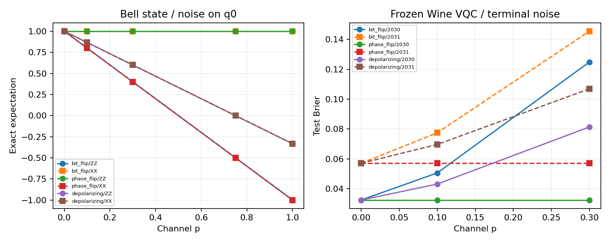

# Day 26｜量子噪聲：模擬干擾如何改變量測與預測

[Day25](../day25/README.md) 將傳統、量子與混合模型移到 Wine 資料集，在固定資料處理規則與訓練預算下，比較無噪聲的分類結果。Day26 接著加入明確的噪聲模型，觀察量子狀態、量測結果與已訓練模型的預測如何改變。

**增加量測次數可以減少抽樣波動，卻不能消除噪聲造成的偏移。** 噪聲通道（noise channel）是描述干擾如何改變量子狀態的數學規則；通道改變了各種結果的理論機率，而有限次量測則使實際計數在這些機率附近波動。本章從位元翻轉、相位翻轉與去極化三種通道開始，將噪聲加在狀態準備完成後的指定量子位元上，方便追蹤單一來源的影響。量測方式也會影響噪聲是否可見：相位翻轉可能不改變通常的 0／1 計數，卻能透過另一種量測方向觀察到變化。實驗先用 NumPy 與 CPU 密度矩陣模擬核對理論結果，再用 GPU 抽樣觀察有限量測次數的波動。最後固定 Day25 的 Wine 量子分類器與資料處理規則，檢查噪聲如何影響預測。分類準確率可能不變，但衡量預測值與標籤差距的 Brier 分數已經變差；因此需要同時觀察分布與評估指標。這些結果適用於指定通道與位置，尚不能代表真實量子硬體的完整表現。

[Day25](../day25/README.md) transferred classical, quantum, and hybrid models to the Wine dataset and compared noiseless classification results under fixed preprocessing and training budgets. Day26 introduces explicit noise channels into quantum circuits to examine changes in quantum states, measurement distributions, and predictions from a frozen model.

**Quantum noise can shift model outputs, and taking more measurements does not remove that shift.** Ideal circuits describe evolution without noise; density matrices represent potentially mixed quantum states, while noise channels describe how those states change. Three models—bit flip, phase flip, and depolarizing noise—are applied to a specified qubit after state preparation, making the effect of a single noise source easier to trace. The central distinction is between a channel changing the theoretical measurement distribution and a finite number of measurements, or shots, producing statistical fluctuations around that distribution. More shots reduce the fluctuations but do not restore the noiseless distribution. The measurement basis also matters: phase flips can leave Z-basis counts unchanged while producing visible changes in X-basis measurements. NumPy and CPU density-matrix simulation provide exact cross-checks, followed by GPU noisy-trajectory sampling to examine finite-shot fluctuations. Finally, the trained Wine VQC from Day25 retains its weights and preprocessing while noise is added: classification accuracy can remain unchanged even as the Brier score, which measures probability prediction error, worsens. Noise effects, sampling error, and evaluation metrics describe different aspects of the result. These simulations use specified channels and locations; they do not provide a complete model of real quantum hardware.


---

程式：[noise.py](noise.py)、[experiment.py](experiment.py)、[demo.py](demo.py)、[測試](test_noise.py)、[plot_results.py](plot_results.py)。結果見 [實測報告](../../results/day26/README.md)。沿用 `.venv` 虛擬環境，也就是專案獨立保存套件的目錄，無需新增套件。

## 1. 從狀態向量到密度矩陣

狀態向量用一組振幅描述純態；振幅是決定量測機率的複數，其絕對值平方就是對應結果的機率。純態不代表量測結果一定確定，例如疊加態也可以是純態。

若噪聲使狀態隨機經歷不同變化，整體結果可能成為混合態，需要以密度矩陣 ρ 表示。密度矩陣同時保存機率與相位關係；相位關係影響不同狀態分量如何相互增強或抵消。純態也是密度矩陣的特例，可寫成 `ρ=|ψ⟩⟨ψ|`。

噪聲通道可用 Kraus 算符描述。每個算符 K_k 是一個矩陣，表示通道的一種作用分量；把各分量的貢獻加總，就得到變化後的狀態：

```text
ρ' = Σ_k K_k ρ K_k†
Σ_k K_k† K_k = I
```

`†` 表示共軛轉置，也就是矩陣轉置後將複數取共軛；I 是單位矩陣。第二行是完備條件，確保所有結果的總機率仍為 1。這種方法描述隨機作用的整體狀態，不是直接在振幅上任意加亂數。

NumPy 是 Python 數值運算套件，此處實作上述矩陣計算。測試核對跡為 1、半正定性與完備條件。跡（trace）是對角線元素的總和，在此代表總機率；半正定（PSD）表示矩陣沿任何方向都不產生負的二次型，對密度矩陣而言可確保合法量測的機率非負。符合完全正性且保跡的通道稱為 CPTP；完全正性還要求系統與其他系統一起描述時，通道仍產生合法狀態。

n 個量子位元的狀態向量有 `2^n` 個複數，密度矩陣則有 `4^n` 個，因此更耗記憶體。本章只使用兩個量子位元。

## 2. 三種通道與噪聲機率 p

X、Y、Z 稱為 Pauli 操作。X 交換 0 與 1；Z 保留 0 分量，將 1 分量改變正負號，因而改變相對相位；Y 同時涉及位元與相位變化。以下 p 都介於 0 與 1：

| 通道 | 變化後的狀態 ρ′ | 直觀作用 |
|---|---|---|
| 位元翻轉（bit flip） | (1−p)ρ+pXρX | 以機率 p 套用 X |
| 相位翻轉（phase flip） | (1−p)ρ+pZρZ | 以機率 p 套用 Z |
| 去極化（depolarizing） | (1−p)ρ+(p/3)(XρX+YρY+ZρZ) | 以合計機率 p，等機率套用 X、Y 或 Z |

以上是本機 CUDA-Q 的 `BitFlipChannel`、`PhaseFlipChannel` 與 `DepolarizationChannel` 經實測核對的定義。[D22] CUDA-Q 是執行量子程式的工具，同名噪聲模型在不同工具中可能採用不同參數慣例。

Bloch 向量是用三個實數描述單一量子位元狀態的方式。此處去極化通道將向量乘上 `1−4p/3`：p=0.75 時向量變成零，得到完全混合態 `I/2`；p=1 時乘上 −1/3，反而不是完全混合態。完全混合態對任何單位元量測方向都給出各半的機率。位元翻轉與相位翻轉的 p=1，則表示每次都執行指定操作，也不代表完全混合。

另一種常見寫法是 `(1−p)ρ+pI/2`，其中 p 的意義不同，不能直接代換。本章以解析式（可直接推導的公式）與實測核對端點。

## 3. 噪聲加在哪裡？

先準備 `|00⟩`、`|+0⟩` 或 Bell 態 Φ+，再只在第 0 個量子位元 q0 加一次通道。`|+⟩=(|0⟩+|1⟩)/√2` 是等幅疊加態；Bell 態 `Φ+=(|00⟩+|11⟩)/√2` 則具有糾纏，也就是無法拆成兩個位元各自獨立的狀態。

```python
noise = cudaq.NoiseModel()
noise.add_channel('rz', [0], cudaq.PhaseFlipChannel(0.3))
```

`NoiseModel` 保存噪聲設定，`add_channel` 將通道綁定到指定量子閘與位元。電路末端執行 `rz(0.0,q[0])` 作為注入位置；RZ 是繞 Z 軸旋轉，角度為 0 時不改變理想狀態，但此處綁定的噪聲仍會執行。狀態準備與量測方向轉換不使用 RZ，因此通道只作用一次。測試核對通道確實生效，沒有被編譯最佳化或不支援的模擬器忽略。

本章使用已在本機驗證的量子閘綁定介面，沒有使用電路內的 `apply_noise` 寫法。這是刻意設定的末端噪聲來源，不是依真實量子處理器（QPU）校準資料建立的硬體模型，也沒有在所有量子閘後自動加入噪聲。

## 4. 計數不變，狀態仍可能改變

量測基底可理解為選擇用哪組方向區分量子狀態。Z 基底是通常的 0／1 量測；X 基底則區分 `|+⟩` 與 `|−⟩`，後者為 `(|0⟩−|1⟩)/√2`。轉換量測方向可以看見原先計數沒有顯示的相位差異。

ZZ 與 XX 分別表示沿 Z 或 X 方向量測兩個位元，把每個位元結果記為 +1 或 −1 後相乘，再取期望值，也就是依機率計算的平均。理想 Bell 態的兩者皆為 1。

- q0 的位元翻轉使 ZZ 變成 `1−2p`，XX 不變。
- 相位翻轉使 XX 變成 `1−2p`，ZZ 不變。
- 去極化使兩者都乘上 `1−4p/3`。

因此只觀察 Z 基底的 00／11 計數，可能漏看相位噪聲。實驗同時保存 Z 與 X 基底的計數；X 基底量測先在兩個位元加上 H（Hadamard 閘，用來轉換 X 與 Z 基底），再量測。此處的基底轉換閘未加入噪聲。

三種狀態 × 三種通道 × 五個 p（0、0.1、0.3、0.75、1）× 四種量測量（Z0、X0、ZZ、XX），共 180 筆直接計算的結果。Z0 與 X0 只觀察第 0 個位元。NumPy 參考計算與 CUDA-Q 的 `density-matrix-cpu` 密度矩陣模擬器，應在浮點數的有限精度誤差內一致。

## 5. 理論機率、有限次量測與 GPU 軌跡抽樣

CPU 是中央處理器，GPU 是擅長平行運算的圖形處理器。後端（backend）是實際執行模擬的工具。本章採用兩種方式：[D23]

- `density-matrix-cpu`：以密度矩陣直接計算期望值，也進行有限次量測抽樣。
- `nvidia`：以含噪聲的軌跡進行抽樣，不是直接計算完整密度矩陣。軌跡是一次隨機噪聲作用下的狀態演化，多次軌跡共同反映噪聲分布。

`observe` 計算指定量測量的期望值，`sample` 則回傳抽樣計數。一次 shot 表示一次狀態準備與量測。每種狀態、通道與 p，在 Z、X 基底各使用 4,096 shots，並使用隨機種子 42／43／44，共 270 筆紀錄、1,105,920 shots／後端。隨機種子用來重現隨機序列，但相同種子不保證不同後端得到相同計數。

兩個位元有 00、01、10、11 四種結果。實驗將各結果的出現頻率與 NumPy 理論機率比較，保留完整計數，要求最大的絕對差小於 0.06。這是預先設定、用來找出明顯異常的工程檢查門檻，不是表達統計估計不確定性的信賴區間，也不保證每次隨機重跑都通過。

增加 shots 可讓頻率更接近含噪聲的理論分布，卻不會讓該分布回到無噪聲狀態。

## 6. 回到 Day25：固定 Wine 量子分類器

VQC（變分量子分類器）是透過訓練調整電路參數的分類模型。本章載入 Day25 選定 VQC 的權重、前處理規則與測試資料，在完整電路後、ZZ 量測前，於 q0 加入同一種通道。兩組切分各有 26 筆測試資料，搭配三種通道與三個 p（0、0.1、0.3），共 18 筆批次紀錄、468 次直接計算期望值的呼叫；加上前面的 180 次，合計 648 次。

若無噪聲時 `z=⟨ZZ⟩`，末端噪聲有以下解析式：

```text
bit flip:     z'=(1−2p)z
phase flip:   z'=z
depolarizing: z'=(1−4p/3)z
p(label1)=(1−z')/2
```

`z′` 是加入噪聲後的期望值，最後一行將其轉成標籤 1 的預測值。所有權重、資料處理規則與測試樣本保持固定，不重新訓練，也不依噪聲結果挑選種子。保存的 Day25 檔案摘要用來確認模型來源，NumPy 密度矩陣計算與上述公式則用來核對輸出。

另沿用 Day25 的常數對照：每筆資料都輸出訓練集標籤 1 的比例。這個傳統對照不經過量子通道。

本章選取的 Wine 噪聲強度讓縮放因子仍為正，因此理論上不會改變預測值在 0.5 門檻的哪一側，但可能使預測更靠近 0.5。準確率只計算分類正確比例，可能保持不變；Brier 分數計算預測值與 0／1 標籤的平均平方誤差，仍可能變差。

末端相位翻轉與 ZZ 量測對易，也就是交換操作順序不改變相關結果，因此這個位置的相位翻轉不影響 ZZ 輸出。若改在可調電路模板（Ansatz）中間加入，後續操作可能讓相位差異出現在結果中。這不能證明模型普遍不受相位噪聲影響，也不是在訓練過程納入噪聲的實驗。



## 7. 重跑與示範

套件清單：[requirements-day26.txt](../../requirements-day26.txt)。完整實驗使用 Day25 已保存的模型。`OMP_NUM_THREADS=1` 將 CPU 平行工作的執行緒數設為 1。

```bash
source .venv/bin/activate
OMP_NUM_THREADS=1 python articles/day26/experiment.py run
OMP_NUM_THREADS=1 python articles/day26/experiment.py sample
OMP_NUM_THREADS=1 python articles/day26/experiment.py sample --backend nvidia
OMP_NUM_THREADS=1 python articles/day26/plot_results.py

OMP_NUM_THREADS=1 python articles/day26/demo.py --channel phase_flip --probability 0.3
OMP_NUM_THREADS=1 python -m unittest discover -s articles/day26 -p 'test_*.py' -v
```

示範預設使用 CPU 密度矩陣模擬器，顯示 Bell 態的 ZZ／XX 期望值與兩種基底計數，可調整 shots 與隨機種子。CPU 可獨立完成期望值計算、抽樣、示範與測試；完整圖表報告需要 GPU 抽樣摘要。

輸出位於 `results/day26/`，重跑會更新同名檔案。修改實驗設定或 Day25 模型後，應全部重跑，避免舊計數與新設定混用。

五項測試涵蓋通道與密度矩陣的合法性、解析公式、相位翻轉的量測差異、去極化端點、結果確定時的抽樣，以及錯誤輸入。本章只模擬指定的末端 Pauli 通道，未加入振幅阻尼（描述激發態向較低能量狀態衰減）、讀出錯誤（量測結果被誤記）、相關噪聲（多個位元的錯誤彼此相關），也未使用 QPU 校準資料。

Day27 將比較 CPU／GPU 的模擬效能。本章計時可能包含 JIT（執行時編譯）、快取（保存可重用的編譯結果）與軌跡抽樣成本，尚不能單獨歸因於處理器加速。

## 8. 來源

- [D22] [NVIDIA Noisy Simulation](https://nvidia.github.io/cuda-quantum/latest/examples/python/noisy_simulations.html)：噪聲模型、依量子閘注入通道，以及期望值計算與抽樣。
- [D23] [NVIDIA Noisy Simulators](https://nvidia.github.io/cuda-quantum/latest/using/backends/sims/noisy.html)：CPU 密度矩陣與 GPU 軌跡模擬方式。

查閱日期 2026-09-07；本章以安裝的 CUDA-Q 0.15.1 函式說明、解析式與實際執行共同核對通道定義。完整索引見 [REFERENCES.md](../../REFERENCES.md)。

已保存的 GPU 抽樣程序在結束時有 `cudaErrorCudartUnloading` 訊息；退出碼為 0，表示程式回報成功，且分布檢查全部通過，但該結束錯誤的根因尚未定位。

接續：[Day27｜CPU vs GPU Quantum Simulation](../day27/README.md)。

## 延伸研究

[N9] Antonio Anna Mele et al. “Noise-induced shallow circuits and the absence of barren plateaus.” Nature Physics 22, 751–756 (2026)；研究論文。[原始來源](https://doi.org/10.1038/s41567-026-03245-z)；[完整書目](../../REFERENCES.md#n9)。

本章觀察噪聲對結果的影響；此研究提醒噪聲類型與量測範圍會改變理論結論。本章的 Pauli 噪聲通道不能直接套用非保單位噪聲的結論。
