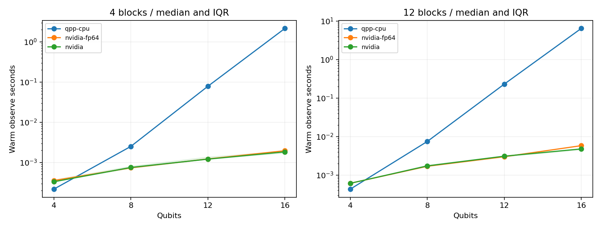

# Day 27｜CPU 與 GPU：如何比較量子模擬效能

[Day26](../day26/README.md) 把噪聲造成的分布偏移，和有限次量測的抽樣波動分開看了。今天回到**無噪聲**模擬，問另一個工程問題：同一份工作，CPU 與 GPU 各要等多久？

想像兩台廚房：一道菜的食譜、份量、火候都釘死，才談得上「誰比較快出鍋」。若菜變了、或一邊用不同精度的秤，時間差就不能直接解讀成「這台爐永遠比較強」。有意義的效能比較，要固定工作內容，並說清楚時間從哪裡起、到哪裡停。

程式：[benchmark.py](benchmark.py)、[run_all.py](run_all.py)、[plot_results.py](plot_results.py)、[結果核對](audit_results.py)。數值與圖表見 [實測報告](../../results/day27/README.md)。沿用 `.venv`，不新增套件。

Day27 compares noiseless statevector `observe` latency for a fixed RY/RZ/CZ circuit on `qpp-cpu` (fp64) versus `nvidia` (fp64 primary, fp32 supplemental) at 4–16 qubits. First-call and post-warmup medians are recorded after numerical checks; results describe this machine and workload, not training, noisy trajectories, or QPU speed.

---

## 1. 固定比較條件

**狀態向量**用一組複數振幅描述量子狀態；振幅絕對值平方決定量測機率。本章直接從狀態向量求期望值，沒有有限次抽樣誤差，但仍有浮點捨入。**fp32**／**fp64**＝用 32 或 64 位元存每個實數；後者較精、也較占記憶體。

| 比較項目 | 本章設定 |
|---|---|
| 相同任務 | RY／RZ／CZ 電路，加上全域 Z 奇偶性期望值 |
| 相同輸入 | 種子 42 產生的權重，保存 SHA-256 摘要 |
| 量子位元數 | 4、8、12、16 |
| 電路區塊數 | 4、12 |
| CPU | `qpp-cpu`、fp64、`OMP_NUM_THREADS=1` |
| GPU 主要比較 | `nvidia`，`option='fp64'` |
| GPU 補充比較 | `nvidia` 預設 fp32 |
| 噪聲與抽樣 | 無噪聲，`shots_count=-1`，直接算期望值 |
| 每組呼叫 | 首次 1 次、暖機 2 次、正式計時 7 次 |

**後端**＝實際執行模擬的工具。CUDA-Q 文件列出 `nvidia` 的精度選項。[D24] 結果目錄標籤寫 `nvidia-fp64`，實際呼叫是 `cudaq.set_target('nvidia', option='fp64')`，並保存環境回報的精度。

SHA-256 用來確認兩邊權重相同。CPU fp64 與 GPU fp32 數值條件不同，因此分開呈現。

## 2. 固定電路與量測目標

重用 Day24 電路：每個區塊先對各位元做 RY、RZ，再依序做相鄰 CZ。RY／RZ＝繞 Y／Z 軸旋轉；CZ＝受控相位，對兩位元皆為 1 的分量改正負號。n 位元、L 區塊 → `2nL` 個旋轉角與 `(n−1)L` 個 CZ。

量測量為 `Z0Z1…Z(n−1)`：每位元 0→+1、1→−1，全部相乘後，偶數個 1 得 +1、奇數個得 −1（奇偶性）。程式只回傳這個期望值，不把完整狀態向量傳回 Python。

L 是區塊數，不是編譯後的電路深度。後端可能合併閘；實驗未刻意關閉某一邊的最佳化。權重是固定隨機數，不是訓練結果，輸出也不一定有分類意義。

## 3. 計時範圍與暖機

```python
start = time.perf_counter()
value = float(cudaq.observe(circuit, observable, n, blocks, weights,
                            shots_count=-1).expectation())
elapsed = time.perf_counter() - start
```

`time.perf_counter()` 適合量經過時間。計時停在期望值已可用之後，不是只記「送進佇列」的時間。權重產生與量測量建構在計時外；範圍內含主機端呼叫、執行環境與計算，**不能**稱為純 GPU 運算時間。

每組保留首次呼叫，再暖機兩次，再存七次正式計時。暖機讓可能只在初次發生的準備先做完，方便看重複呼叫成本。

主要結果用**中位數**（七次排序後的中間值），並列 Q25／Q75；兩者差距是四分位距（IQR），描述這批時間的分散，不是信賴區間。不以最快一次當主結果。

每個後端在獨立程序跑，但同一後端的八組設定共用程序。因此各組「首次」不保證都含全新 JIT；只有該程序第一組才是真正的首次電路執行，磁碟上仍可能有快取。另記錄整個程序牆鐘時間（含 import、設定、輸出與參考核對）——與單次電路計時範圍不同。

## 4. 依序執行與硬體條件

`run_all.py` 依 CPU → GPU fp64 → GPU fp32 啟動子程序，前一個結束才跑下一個。每位元數遞增，再比 4／12 區塊；計時期間不另開其他效能測試。

`OMP_NUM_THREADS=1` 固定 OpenMP 執行緒為 1，方便重現，不代表已找到最快 CPU 設定。

背景負載、動態時脈、散熱與執行順序仍可能影響結果；本章未鎖頻、未控管所有作業系統活動。報告保存 CPU 型號（本機為 11th Gen i7-11800H）、CUDA-Q／Python／NumPy 版本，以及 GPU 跑完後的快照（RTX 3060 Laptop、約 6144 MiB）。單次溫度快照≠全程監測。

## 5. 先確認答案，再看速度比

每次執行都存期望值，檢查是否有限、重複間差異。4／8 位元、4 區塊另與 Day24 NumPy 參考核對；其餘由 CPU／GPU 交叉比對——不是每個 16 位元結果都有第三份獨立實作。

報告產生器核對設定、權重摘要、fp64 主比較條件，以及小於 `1e-5` 的輸出誤差後，才算速度比：

```text
ratio = CPU warm median / GPU warm median
ratio > 1：此設定下 GPU 較快
ratio < 1：此設定下 CPU 較快
```

實測摘要（暖機後中位數，單位 ms；完整表見結果報告）：

| 位元／區塊 | CPU | GPU fp64 | 比值 |
|---|---:|---:|---:|
| 4／4 | 0.2180 | 0.3557 | 0.613 |
| 8／12 | 7.4470 | 1.6859 | 4.417 |
| 12／12 | 230.4207 | 2.9851 | 77.190 |
| 16／12 | 6442.4541 | 5.7890 | 1112.885 |

小電路常被固定呼叫成本主導，GPU 不一定較快；狀態變大後才有更多可平行的工作。交叉點要本機實測，不能預設對所有電路成立。單一設定的最高比值也不能代表 CUDA-Q 的普遍加速幅度。



## 6. 記憶體估算只是下限

狀態向量要 `2^n` 個複數（實部＋虛部）：

```text
fp32 complex：8 × 2^n bytes
fp64 complex：16 × 2^n bytes
```

每多一個量子位元，儲存加倍。本章 16 位元約需 **0.5 MiB／1 MiB**（fp32／fp64）。MiB＝`2^20` 位元組；GiB＝`2^30`。

這些遠低於本機 RTX 3060 的 6 GiB VRAM，但執行環境還可能配置暫存、額外狀態副本與緩衝。不能只把總容量除以上式，就宣稱最大可跑位元數。本章未量測 peak RAM／VRAM、OOM 邊界，也未測多卡。

Day26 密度矩陣要 `4^n` 元素；含噪聲軌跡要重複抽噪聲並演化。兩者與本章單次無噪聲求值的工作量不同，不能塞進同一條效能曲線。

## 7. 重跑與單一後端範例

使用 [requirements-day27.txt](../../requirements-day27.txt)，在沒有其他重負載時依序執行：

```bash
source .venv/bin/activate
# 三個後端依序執行，完成後產生報告與圖表。
OMP_NUM_THREADS=1 python articles/day27/run_all.py

# 也可只測一邊；結果寫入同名目錄。
OMP_NUM_THREADS=1 python articles/day27/benchmark.py --backend qpp-cpu
OMP_NUM_THREADS=1 python articles/day27/benchmark.py --backend nvidia-fp64
OMP_NUM_THREADS=1 python articles/day27/benchmark.py --backend nvidia
OMP_NUM_THREADS=1 python articles/day27/plot_results.py
OMP_NUM_THREADS=1 python articles/day27/audit_results.py
```

`run_all.py` 含 CPU 與 GPU，不需重跑 Day25 訓練。沒有 GPU 時可只跑 `qpp-cpu`；完整比較報告需要三組後端資料。

結果在 `results/day27/`：`protocol`、`process_times`，以及各後端原始紀錄與摘要。單獨重跑某一後端後，舊的程序總時間不代表新一次；要完整更新用 `run_all.py`。

每個後端 8 組 × 10 次呼叫＝80 次 `observe`；三後端合計 **240** 次。數值檢查通過**不**要求 GPU 必須較快。重跑會覆寫同名檔；應避免同時啟動多個 `run_all.py`。

若 GPU 結束出現 `cudaErrorCudartUnloading`，需一併看程序退出狀態與保存結果，才能判斷量測是否完成；該訊息根因尚未定位。

## 8. 下一步與來源

Day28 檢視多 GPU 的程式介面與資源需求，並說明單 GPU 環境能驗證的範圍。本機只有一張 RTX 3060，因此沒有多 GPU 實測。

[D24] [NVIDIA State Vector Simulators](https://nvidia.github.io/cuda-quantum/latest/using/backends/sims/svsims.html)：CPU／GPU 狀態向量模擬器與精度選項，查閱日期 2026-09-07。另沿用 [Day24](../day24/README.md) 的電路與 NumPy 參考。完整 [參考索引](../../REFERENCES.md)。

本日在固定電路、權重與精度下，記錄首次與暖機後的 `observe` 等待時間，並先核對數值再解讀速度比。結果描述本機、此工作負載與單執行緒 CPU 條件；不是完整 QML 訓練、噪聲軌跡或真實 QPU 的速度證明，也未量測記憶體峰值。

## 延伸研究

[N10] W. Michael Brown et al. “Multi-GPU Quantum Circuit Simulation and the Impact of Network Performance.” Computer Physics Communications 324, 110126 (2026)；研究論文。[原始來源](https://doi.org/10.1016/j.cpc.2026.110126)；[完整書目](../../REFERENCES.md#n10)。

本章測量單 GPU 模擬時間；該研究可銜接多 GPU 系統的通訊成本。外部硬體的加速比不能直接套用到 RTX 3060。
