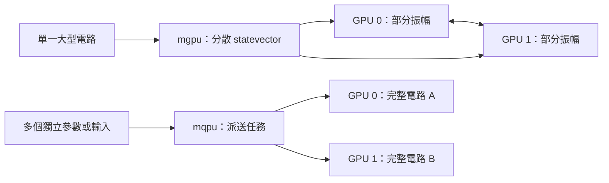

# Day 28｜從單 GPU 到多 GPU：容量與任務分工

[Day27](../day27/README.md) 在相同電路與精度下，比較了 CPU 與單張 GPU 的模擬等待時間。今天延續那份基準，問：多加幾張卡時，到底是在撐**更大的單一狀態**，還是在同時跑**更多獨立任務**？

想像搬家：可以把同一張大桌子拆成幾塊由多人抬（一起扛一個大物件），也可以每人各搬一箱（同時處理多件獨立工作）。多一雙手解決的問題不同——前者衝容量，後者衝吞吐量。搞混兩者，會把「記憶體不夠」和「任務排太久」用同一套加速故事硬套。

已保存設備為 RTX 3060 Laptop、6 GiB 顯示記憶體。本章環境探測中，GPU 驅動查詢失敗，也未找到 `mpiexec`，因此以 Day27 單卡實測為輸入，做容量估算與延遲敏感度分析——**改變假設看曲線怎麼變**，不是多卡加速實測。

程式與結果：[可執行模型](scaling.py)、[測試](test_scaling.py)、[結果與圖表](../../results/day28/README.md)、[環境探測](../../results/day28/environment.json)。

Day28 distinguishes `mgpu` (one statevector split across GPUs) from `mqpu` (independent tasks, each needing a full statevector). Capacity tables and a Day27-based latency model are computed under stated assumptions; no multi-GPU timing was collected on this one-GPU host.

---

## 1. 先選擇平行化的單位

**狀態向量**以一組複數振幅保存量子狀態。分散一個向量，與同時跑多個向量，是不同配置：

| 模式 | 工作分配 | 適用問題 | 記憶體需求 |
|---|---|---|---|
| 單 GPU `nvidia` | 一張卡完成模擬 | Day27 的單次期望值 | 完整狀態放在一張卡 |
| `mgpu` | 多張卡共同處理單一狀態向量 | 單卡容不下的大電路 | 每卡保存部分振幅，運算時可能交換資料 |
| `mqpu` | 各卡處理不同量子任務 | 不同輸入、參數位移或隨機起始權重 | 每個任務仍需容納完整狀態向量 |

CUDA-Q 文件提供 `nvidia` 的 `mgpu` 選項與 MPI 啟動方式，並說明多程序／節點數需為 2 的冪（2、4、8…）。[D25] **後端**＝執行工具；**程序**＝作業系統中的一份執行實例；**節點**＝一台參與運算的主機。**MPI**＝多程序交換訊息、協同運算的介面。

`mqpu` 為各 GPU 提供模擬的 QPU，可用 `observe_async` 與 `qpu_id` 派送任務。[D26] 前者提交非同步期望值計算；後者指定用哪個模擬處理器。



Day17 的參數位移法透過不同角度下的多次求值算梯度；這些求值可獨立進行（任務平行），但最佳化器仍要等梯度彙整完才能更新權重。

Day27 只算一個全域 Z 項，沒有許多可分開派送的 Hamiltonian 項。**哈密頓量**常拆成多個 Pauli 乘積之和；能同時跑多少，取決於任務結構與依賴關係。

## 2. GPU 數量加倍，理想容量只多一個量子位元

n 位元狀態向量有 `2^n` 個複數。fp32 一個複數 8 位元組；fp64 為 16。若 P 張卡均勻分攤，一份狀態向量的每卡儲存下限為：

```text
bytes_per_gpu = complex_bytes × 2^n / P
n_max = floor(log2(P × memory_bytes_per_gpu × usable_fraction / complex_bytes))
```

`usable_fraction`＝假設可供狀態向量使用的記憶體比例；`floor`＝向下取整。

假設每卡 6 GiB 且全部可用，fp64 在 1／2／4／8 張卡上的理論上限為 **28／29／30／31** 位元；fp32 各多一個。程式另產生 **75%** 可用比例情境；該比例只是設定，不是實測，也不保證剩餘空間夠跑。完整表見 [結果報告](../../results/day28/README.md)（16 組容量情境）。

真實運算還需要執行環境、通訊緩衝、額外狀態副本與暫存，也受其他程序與資料分割規則影響。

`mqpu` 兩張卡各跑一個電路，**不能**把兩張卡的 VRAM 直接相加當單一任務容量。密度矩陣要 `4^n` 元素，也不適用這份狀態向量公式。

## 3. 延遲模型與假設參數

**延遲**＝從工作開始到結果可用的等待時間。本章取 Day27 的 `nvidia-fp64`、16 位元／12 區塊，暖機後中位數約 **5.7890 ms** 作為單卡基準 T1。來源 SHA-256 寫在模型輸出中，可核對是否對應同一份 Day27 紀錄。

固定問題大小後：

```text
T(P) = T1 × [s + (1-s)/P + c × log2(P)]
Speedup(P) = T1 / T(P)
Efficiency(P) = Speedup(P) / P
```

- s：無法平行化的工作比例。
- `(1−s)/P`：其餘工作均勻分到 P 張卡。
- c：每增加一級 `log2(P)` 時，通訊／協調成本相對 T1 的比例。
- Speedup＝單卡時間／多卡時間；Efficiency 再除以卡數。

這是自訂簡化公式；對數通訊項不是 CUDA-Q 實作保證。Day27 的 CPU／GPU 比也不足以推算 s 或 c。

三種假設：

| 情境 | s | c | 8 卡模型加速（約） |
|---|---:|---:|---:|
| 理想線性 | 0 | 0 | 8.000 |
| 低成本 | 0.1 | 0.05 | 2.759 |
| 較高成本 | 0.3 | 0.2 | 1.013 |

較高成本情境下，8 卡約 **1.013** 倍，甚至低於 4 卡約 **1.143** 倍——在該公式裡，加卡效益可被協調成本抵消。這是假設下的計算結果，不是硬體量測。


固定位元與區塊、只加硬體＝**強擴展**（strong scaling）。**弱擴展**則隨硬體增加工作量。若加 GPU 同時加量子位元，工作已變，不能沿用同一 T1，也不能把本章曲線當成弱擴展實測。

單 GPU 的一個計時點，無法辨認真正的序列比例、互連頻寬或通訊延遲；本章沒有估計這些硬體參數。

## 4. CUDA-Q 介面與版本條件

以下是設定片段，**尚未在本章執行**：

```python
# 分散單一 statevector；需完整 MPI／GPU 環境。
cudaq.set_target('nvidia', option='mgpu,fp64')

# 或：在獨立任務流程中選用 mqpu。
cudaq.set_target('nvidia', option='mqpu,fp64')
# future = cudaq.observe_async(kernel, observable, *args, qpu_id=0)
# value = future.get().expectation()
```

兩種後端是替代選擇，依工作類型擇一。`future.get()` 會等到結果完成，才能讀期望值。

文件中的 MPI 啟動形式為 `mpiexec -np 2 python3 program.py --target nvidia --target-option mgpu,fp64`。`program.py` 代表待建立的量子程式，不是本章只算公式的 `scaling.py`。程式內的 `set_target` 會覆蓋命令列後端設定。[D25]

本機 CUDA-Q **0.15.1**；已檢查安裝內 `targets/nvidia.yml`，確認兩種配置名稱存在，但不代表 MPI、驅動等依賴皆可用。文件 `latest` 會變動，不能把所有預設值套到 0.15.1。

小電路可能尚未達到啟用狀態向量分散的門檻。實際驗證需核對版本條件與執行紀錄，確認工作確實分到多卡，再解讀計時。[D25]

## 5. 多卡實測需要保存哪些資訊？

後續量測可沿用 Day27：相同權重與摘要、fp64、直接算期望值，分開存首次與暖機後時間。固定位元與區塊，依可用設備比較 1／2／4／8 卡，保留每次數值與耗時。多個程序共用一張卡，不能代替多卡量測。

`mgpu` 需讓所有 **rank**（MPI 程序編號）準備完成再計時；以最慢 rank 衡量整個任務，因為要等所有部分完成。另存程序總時間、MPI 版本、各 rank 用哪張 GPU、GPU UUID 與互連拓撲。

`mqpu` 應量測一整批從派送到所有 `future.get()` 完成的時間，並記批次大小、每秒完成任務數（吞吐量）與單任務延遲。只量「送出非同步呼叫」會漏掉實際運算。

不同精度、任務數或電路的時間，不能當相同工作量比較。若某電路只有多卡才容得下，便沒有單卡 T1 可當分母——應報告可執行容量與完成時間，不計算缺乏基準的加速比。本章提供這些量測條件，尚未新增或執行多卡測試程式。

## 6. 重跑與驗證

沿用 [requirements-day28.txt](../../requirements-day28.txt)；公式模型無需新增 MPI 或 CUDA 套件。

```bash
OMP_NUM_THREADS=1 .venv/bin/python articles/day28/scaling.py
.venv/bin/python -m unittest discover -s articles/day28 -p 'test_*.py'
```

程式讀取 Day27 已保存的單卡紀錄，產生 **16** 組容量與 **12** 組延遲情境，輸出 PNG、JSON 與 Markdown。保存來源 SHA-256，避免 Day27 重跑後混用新舊基準。

測試涵蓋：記憶體邊界、卡數翻倍與精度切換、理想平行與完全序列兩極端、非法輸入，以及公式與來源一致性。

保存的環境 JSON 記錄 `nvidia-smi` 退出碼 9 與 `mpiexec=null`；只反映當時程序可見環境，不代表所有執行環境皆不可用。公式模型與測試不依賴 GPU 探測成功。

## 7. 接續 Day29

擴充模擬器資源，不會消除真實 QPU 的量測次數、排隊與噪聲成本。Day29 將區分切換後端的程式介面，以及真正提交硬體任務所需的條件。

[D25] [NVIDIA State Vector Simulators](https://nvidia.github.io/cuda-quantum/latest/using/backends/sims/svsims.html)，查閱日期 2026-09-08；說明 `mgpu`／MPI 介面與版本條件。本章假設的效能數字並非出自該文件。

[D26] [NVIDIA Multiple QPUs](https://nvidia.github.io/cuda-quantum/latest/using/backends/sims/mqpusims.html) 與 [Multi-GPU Workflows](https://nvidia.github.io/cuda-quantum/latest/using/examples/multi_gpu_workflows.html)，查閱日期 2026-09-08；說明非同步任務與 GPU 派送。完整 [參考索引](../../REFERENCES.md)。

本日以單卡基準做容量下限估算與延遲敏感度曲線，並整理 `mgpu`／`mqpu` 介面與後續量測應保存的欄位。本機未執行多 GPU 計時；模型數字描述假設情境，不是加速證據。容量估算、效能模型與硬體量測應分開判讀。

## 延伸研究

[N10] W. Michael Brown et al. “Multi-GPU Quantum Circuit Simulation and the Impact of Network Performance.” Computer Physics Communications 324, 110126 (2026)；研究論文。[原始來源](https://doi.org/10.1016/j.cpc.2026.110126)；[完整書目](../../REFERENCES.md#n10)。

本章估算多 GPU 容量與延遲；該實測研究可協助辨認模型中的通訊假設。文獻實測與本章假設模型應分開解讀。
