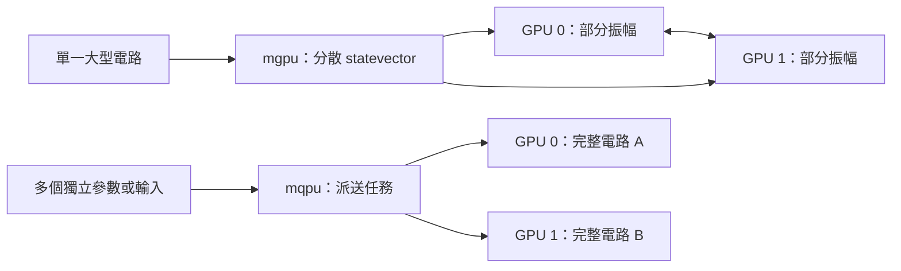

# Day 28｜從單 GPU 到 Multi-GPU

## 本章摘要｜初學者學習筆記

### 中文

[Day27](../day27/README.md) 在相同電路、參數與精度條件下比較 CPU 與單張 GPU 的量子模擬延遲，並區分首次呼叫與暖機後的時間。Day28 延續單 GPU 的實測基準，探討增加 GPU 時，如何分別擴充單一電路的容量與多個任務的處理能力。

這一章目標在於理解 **「多張 GPU 應該如何分工，以及為何增加硬體不等於等比例加速」**。QML 實驗可能遇到兩種不同需求：單一電路的量子態太大，無法放進一張 GPU 的記憶體；或是需要執行大量彼此獨立的電路，例如不同輸入與計算梯度所需的參數位移。本章先區分兩種做法：`mgpu` 將單一狀態向量分散儲存與運算，`mqpu` 則把獨立任務派送到不同 GPU，每個任務仍需容納完整狀態向量。這個區分決定了增加資源是在解決容量問題，還是在提高每秒完成的任務數。由於 n 個量子位元需要 2^n 個複數振幅，理想情況下，即使總記憶體加倍，單一狀態向量也只多容納一個量子位元；實際容量還要扣除執行環境與通訊等額外空間。接著以 Day27 的單 GPU 時間建立簡化模型，調整無法平行化的工作比例與通訊成本，觀察相同工作量下的延遲如何變化，理解多卡效益可能被協調成本抵消。本章沒有多 GPU 實測，模型中的數字代表假設情境，不能視為硬體加速的證據。完成本章後，應能依任務選擇分工方式，分辨容量估算、效能模型與實測結果，並理解後續驗證需要固定工作量、核對計算結果，以及量測所有工作真正完成所需的時間。

### English

[Day27](../day27/README.md) compared CPU and single-GPU quantum simulation latency using the same circuit, parameters, and precision, separating first-call timing from measurements after warmup. Day28 builds on the single-GPU baseline to explore how additional GPUs can expand the capacity of one circuit or the processing capacity for multiple tasks.

This chapter aims to explain **how multiple GPUs should share work and why adding hardware does not imply proportional speedup**. QML experiments can face two distinct needs: a quantum state too large for one GPU's memory, or many independent circuit evaluations, such as different inputs and parameter shifts for gradient calculations. The chapter distinguishes `mgpu`, which distributes one statevector across GPUs, from `mqpu`, which assigns independent tasks to different GPUs while each task still requires a complete statevector. This distinction determines whether additional resources address memory capacity or increase the number of tasks completed per second. Since n qubits require 2^n complex amplitudes, doubling total memory ideally accommodates only one additional qubit in a single statevector; runtime and communication allocations further constrain actual capacity. A simplified model then uses Day27's single-GPU timing to explore how serial work and communication costs affect latency for a fixed workload, showing how coordination overhead can offset the benefits of more GPUs. No multi-GPU measurements were performed: the model's numbers describe assumed scenarios rather than evidence of hardware speedup. The intended outcome is an ability to choose a suitable work distribution, distinguish capacity estimates and performance models from measurements, and understand that validation requires fixed workloads, numerical checks, and timing through the completion of all work.

---

Day27量測了相同電路在CPU與單GPU的延遲。下一個問題是：加第二張GPU，能跑更大的電路，還是讓更多電路同時完成？這兩個目標需要不同的工作分配。

本日採用Roadmap允許的 **reproducible scaling model**：延續Day27單GPU實測，建立容量與延遲敏感度分析。已知設備紀錄是RTX3060 Laptop 6GiB；本日沙箱的driver探測失敗，也沒有找到`mpiexec`。**沒有multi-GPU實測，沒有宣稱多卡speedup。**

交付：[可執行模型](scaling.py)、[測試](test_scaling.py)、[結果與圖表](../../results/day28/README.md)、[環境探測](../../results/day28/environment.json)。

## 1. 先選平行化的單位

| 模式 | 分配的工作 | 適用問題 | 記憶體意義 |
|---|---|---|---|
| 單GPU `nvidia` | 一次完整模擬 | Day27單一observe | statevector在一張卡 |
| `mgpu` | 分散單一statevector | 單卡容量不足的大電路 | 理想情況每卡持有部分振幅 |
| `mqpu` | 獨立量子任務 | batch inputs、parameter-shift、不同seeds | 每個任務仍需容納完整statevector |

官方文件提供`nvidia`的`mgpu`選項與MPI啟動方式；多進程／節點數需為2的冪。[D25] `mqpu`則為各GPU提供模擬QPU，能使用`observe_async`與`qpu_id`派送工作。[D26]



Day17的parameter-shift需要多次獨立forward，具有task parallelism；optimizer下一步仍依賴梯度聚合。Day27的observable只有一個全域Z Pauli term，不能期待把許多Hamiltonian terms分散出去。模型訓練的依賴關係，會限制能同時派送多少工作。

## 2. 多一倍GPU，理想容量只多一個Qubit

n-qubit statevector有2^n個complex數。fp32每個complex是8bytes；fp64為16bytes。若P張GPU均勻分攤，單buffer每卡下限為：

```text
bytes_per_gpu = complex_bytes × 2^n / P
n_max = floor(log2(P × memory_bytes_per_gpu × usable_fraction / complex_bytes))
```

這是本章的儲存模型，不是backend容量測試。假設每卡6GiB且100%可用，fp64的1／2／4／8卡單buffer上限為28／29／30／31qubits；改成fp32各加一個qubit。程式同時產生75%可用比例的情境。75%沒有經過量測，也不能保證足以容納workspace。

真實配置還要計入runtime、通訊buffer、額外state、其他程序與分割規則。`mqpu`的兩張卡各自跑一個電路，不能直接把兩張VRAM相加當成單一任務容量。density matrix的4^n entries也不適用本日statevector公式。

## 3. 延遲模型：明確暴露未知量

取Day27 `nvidia-fp64`、16qubits／12blocks的warm median作T1（約5.7890ms），固定問題規模，定義：

```text
T(P) = T1 × [s + (1-s)/P + c × log2(P)]
Speedup(P) = T1 / T(P)
Efficiency(P) = Speedup(P) / P
```

s是無法平行化的比例；c是每log2(P)級額外通訊／協調成本相對T1的比例。這是本日自訂的簡化模型，log2通訊項不是CUDA-Q實作保證，也沒有從Day27 CPU／GPU比例推算s或c。

程式比較三種假設：s=0、c=0的理想線性情境；s=.1、c=.05的低成本情境；s=.3、c=.2的較高成本情境。最後一種在8卡只有約1.013倍模型speedup，低於4卡的約1.143倍；更多資源可能被協調成本抵消。這些數值只描述公式。


這是strong-scaling情境：n與blocks固定。增加GPU同時增加qubits則改變工作量，不能套用同一個T1，更不能拿本日曲線當weak-scaling實測。單GPU的一個時間點無法識別序列比例、互連頻寬或延遲；本章未估計這些參數。

## 4. CUDA-Q介面與版本邊界

以下是官方介面的設定片段，並未在本日執行：

```python
# 分散單一statevector；需完整MPI／GPU環境。
cudaq.set_target('nvidia', option='mgpu,fp64')

# 或：在獨立任務流程中選用mqpu。
cudaq.set_target('nvidia', option='mqpu,fp64')
# future = cudaq.observe_async(kernel, observable, *args, qpu_id=0)
# value = future.get().expectation()
```

兩種target是替代選擇。官方MPI啟動形式是`mpiexec -np 2 python3 program.py --target nvidia --target-option mgpu,fp64`；`program.py`代表待建置的量子程式，不是本日`scaling.py`。在程式內`set_target`會覆蓋命令列target。[D25]

本機CUDA-Q為0.15.1，已讀取安裝內的`targets/nvidia.yml`確認`mgpu,fp64`與`mqpu,fp64`配置存在；有配置不等於依賴可用。官方`latest`文件會變動，不能直接當0.15.1的所有預設值。尤其小電路可能不啟用statevector分散，實際測試必須核對所用版本的分散門檻與runtime紀錄。[D25]

## 5. 有多卡設備後，如何把模型換成證據？

延續Day27的相同weights／hash、fp64、exact observable及first／warm分離。固定n、blocks後依序跑1／2／4／8卡，保存每次原始結果與時間，並確認數值誤差。只在實際可用卡數內執行，不用多個process共享一張卡來代替多卡。

mgpu計時需使所有ranks準備完成後再開始，涵蓋同步結果取得，並以各rank耗時最大值衡量整個分散任務；同時保存process總時間、MPI版本、rank-to-GPU映射、GPU UUID與互連拓撲。先檢查是否真正分散，再解讀speedup。

mqpu則量整個batch從派送到所有`future.get()`完成的wall time，同時記錄每秒任務數、batch大小與單任務延遲。只量送出async呼叫的時間會漏掉實際執行。不同精度、不同總任務數或不同電路的時間不混作同一對照。

容量不足而只能在多卡執行的case，沒有單卡T1，就報告容量與完成時間，不能製造speedup分母。本日保留這套後續量測規格，沒有新增未驗證的MPI benchmark runner。

## 6. 重跑與驗證

沿用[requirements-day28.txt](../../requirements-day28.txt)，無需新增MPI或CUDA套件：

```bash
OMP_NUM_THREADS=1 .venv/bin/python articles/day28/scaling.py
.venv/bin/python -m unittest discover -s articles/day28 -p 'test_*.py'
```

模型會讀Day27已保存的單GPU紀錄，產生16組容量與12組延遲情境、PNG、JSON與Markdown報告。保存來源SHA-256，防止Day27重跑後仍誤認舊模型使用新baseline。測試涵蓋記憶體邊界、GPU翻倍／精度切換、理想與全序列極限、非法輸入，以及報告公式與來源一致性。

環境JSON記錄本次`nvidia-smi`退出碼9與`mpiexec=null`；這只反映當前程序可見性。本日的可重現成果是模型運算與測試，不依賴GPU探測成功。

## 7. 接到Day29

擴充simulator的運算資源，不會消除真實QPU的shots、queue與noise成本。Day29將把backend切換的介面與實際硬體執行條件分開處理。

[D25] [NVIDIA State Vector Simulators](https://nvidia.github.io/cuda-quantum/latest/using/backends/sims/svsims.html)，查閱2026-09-08；支持mgpu／MPI介面與版本相關條件，不支持本日假設的效能數字。

[D26] [NVIDIA Multiple QPUs](https://nvidia.github.io/cuda-quantum/latest/using/backends/sims/mqpusims.html)與[Multi-GPU Workflows](https://nvidia.github.io/cuda-quantum/latest/using/examples/multi_gpu_workflows.html)，查閱2026-09-08；支持非同步任務與GPU派送概念。完整[參考索引](../../REFERENCES.md)。
