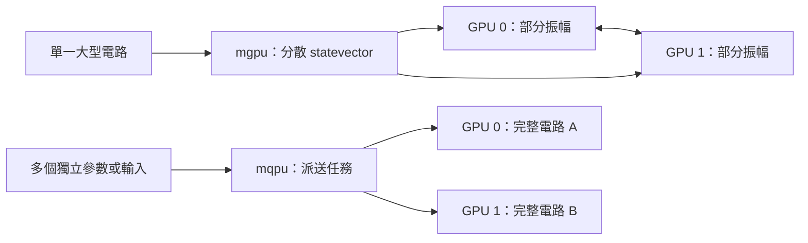

# Day 28｜從單 GPU 到多 GPU：容量與任務分工

[Day27](../day27/README.md) 在相同電路、參數與數值精度下比較 CPU 與單張 GPU 的量子模擬時間，並分開記錄首次呼叫與暖機後的結果。Day28 延續這份基準，探討增加 GPU 時，如何擴大單一電路的容量，或讓更多獨立任務同時執行。

**多張 GPU 可以共同處理一個大型量子狀態，也可以各自處理不同任務，兩種分工解決的問題不同。** GPU 是擅長平行運算的圖形處理器；量子模擬以一般硬體計算量子狀態的變化。本章區分 `mgpu` 與 `mqpu`：前者將一個狀態向量分散到多張卡，後者派送獨立電路，每個任務仍需要完整狀態向量。這決定增加資源是在解決記憶體不足，還是在提高每秒完成的任務數。n 個量子位元需要 `2^n` 個複數振幅，因此總記憶體加倍，理想上也只多容納一個量子位元，實際容量還要扣除執行與通訊的額外空間。接著以 Day27 的單卡時間建立簡化模型，觀察無法平行化的工作與協調成本如何影響效益。本章沒有多 GPU 實測，模型數字是不同假設下的計算結果；容量估算、效能模型與硬體量測需要分開判讀。

[Day27](../day27/README.md) compared CPU and single-GPU quantum simulation latency using the same circuit, parameters, and precision, separating first-call timing from measurements after warmup. Day28 builds on the single-GPU baseline to explore how additional GPUs can expand the capacity of one circuit or the processing capacity for multiple tasks.

**Multiple GPUs can share one large statevector or process independent tasks, addressing different resource needs.** QML experiments can face two distinct needs: a quantum state too large for one GPU's memory, or many independent circuit evaluations, such as different inputs and parameter shifts for gradient calculations. The chapter distinguishes `mgpu`, which distributes one statevector across GPUs, from `mqpu`, which assigns independent tasks to different GPUs while each task still requires a complete statevector. This distinction determines whether additional resources address memory capacity or increase the number of tasks completed per second. Since n qubits require 2^n complex amplitudes, doubling total memory ideally accommodates only one additional qubit in a single statevector; runtime and communication allocations further constrain actual capacity. A simplified model then uses Day27's single-GPU timing to explore how serial work and communication costs affect latency for a fixed workload, showing how coordination overhead can offset the benefits of more GPUs. No multi-GPU measurements were performed: the model's numbers describe assumed scenarios rather than evidence of hardware speedup. Capacity estimates, performance models, and hardware measurements provide different kinds of evidence. Validation requires fixed workloads, numerical checks, and timing through the completion of all work.


---

已保存的設備紀錄為 RTX 3060 Laptop、6 GiB 顯示記憶體。本章保存的環境探測中，GPU 驅動程式查詢失敗，也未找到 `mpiexec` 多程序啟動工具，因此以 Day27 單 GPU 實測作為輸入，進行容量估算與效能敏感度分析。敏感度分析是改變假設參數，觀察結果如何變化，並不是多卡加速的實測證據。

程式與結果：[可執行模型](scaling.py)、[測試](test_scaling.py)、[結果與圖表](../../results/day28/README.md)、[環境探測](../../results/day28/environment.json)。

## 1. 先選擇平行化的單位

狀態向量（statevector）以一組複數振幅保存量子狀態，振幅的絕對值平方決定量測機率。分散一個向量與同時執行多個向量，是不同的工作配置：

| 模式 | 工作分配 | 適用問題 | 記憶體需求 |
|---|---|---|---|
| 單 GPU `nvidia` | 一張卡完成模擬 | Day27 的單次期望值計算 | 完整狀態放在一張卡 |
| `mgpu` | 多張卡共同處理單一狀態向量 | 單卡容不下的大電路 | 每張卡保存部分振幅，運算時可能需要交換資料 |
| `mqpu` | 各卡處理不同量子任務 | 不同輸入、參數位移或隨機起始權重 | 每個任務仍需容納完整狀態向量 |

CUDA-Q 是執行量子程式的工具。其文件提供 `nvidia` 後端的 `mgpu` 選項與 MPI 啟動方式，並說明多程序／節點數需為 2 的冪，例如 2、4、8。[D25] 後端是實際執行運算的工具；程序是作業系統中執行的一份程式，節點則是一台參與運算的主機。MPI 是讓多個程序交換訊息、協同運算的介面。

`mqpu` 為各 GPU 提供模擬的 QPU（量子處理器），可使用 `observe_async` 與 `qpu_id` 派送任務。[D26] 前者提交計算量測期望值的非同步工作，呼叫後可先繼續其他操作；後者指定使用哪個模擬處理器。



Day17 的參數位移法透過不同角度下的多次電路求值計算梯度。這些求值可獨立進行，稱為任務平行化；但決定下一次權重更新的最佳化器，仍需要等待梯度結果彙整完成。

Day27 只計算一個全域 Z 量測項，也就是將所有位元的 Z 量測記分相乘後取平均。它沒有許多可分開派送的 Hamiltonian（哈密頓量）項；哈密頓量是描述系統能量的量測算符，常可拆成多個 Pauli 操作乘積之和。因此可同時執行多少工作，取決於任務結構與相互依賴的關係。

## 2. GPU 數量加倍，理想容量只多一個量子位元

n 個量子位元的狀態向量有 `2^n` 個複數，每個複數包含實部與虛部。fp32 以 32 位元保存每個實數，因此一個複數占 8 位元組；fp64 使用 64 位元，一個複數占 16 位元組。fp64 精度較高，也需要較多空間。

若 P 張 GPU 均勻分攤，一份狀態向量的每卡儲存下限為：

```text
bytes_per_gpu = complex_bytes × 2^n / P
n_max = floor(log2(P × memory_bytes_per_gpu × usable_fraction / complex_bytes))
```

`complex_bytes` 是一個複數的位元組數，`usable_fraction` 是假設可供狀態向量使用的記憶體比例。`log2` 是以 2 為底的對數，`floor` 表示向下取整；公式反推記憶體能容納多少個量子位元。

假設每卡 6 GiB 且全部可用，fp64 在 1／2／4／8 張卡上的理論上限為 28／29／30／31 個量子位元；fp32 各多一個。GiB 是 `2^30` 位元組。程式另產生 75% 可用比例的情境，但此比例只是設定，不是實測，也不保證剩餘空間足夠執行。

真實運算還需要執行環境、通訊緩衝區、額外狀態副本與暫存工作空間，也受其他程序與資料分割規則影響。緩衝區是暫時保存運算或傳輸資料的空間。

`mqpu` 的兩張卡各自跑一個電路，不能將兩張卡的顯示記憶體（VRAM）直接相加，當成單一任務可用容量。密度矩陣以矩陣描述可能混合的量子狀態，需要 `4^n` 個元素，也不適用這份狀態向量公式。

## 3. 延遲模型與假設參數

延遲是從工作開始到結果可用的等待時間。本章取 Day27 的 `nvidia-fp64`、16 個量子位元、12 個電路區塊，暖機後時間中位數約 5.7890 毫秒，作為單卡基準 T1。暖機是在正式計時前先執行幾次，以減少初次準備工作的影響；中位數是多次時間排序後的中間值。

固定問題大小後，使用以下模型：

```text
T(P) = T1 × [s + (1-s)/P + c × log2(P)]
Speedup(P) = T1 / T(P)
Efficiency(P) = Speedup(P) / P
```

- s 是無法平行化的工作比例，例如必須依序完成的處理。
- `(1−s)/P` 假設其餘工作能均勻分配到 P 張卡。
- c 是每增加一級 `log2(P)` 時，額外通訊與協調成本相對於 T1 的比例。
- Speedup 是單卡時間除以多卡時間；Efficiency 再除以卡數，表示相對於理想等比例加速的效率。

這是自訂的簡化公式，對數形式的通訊項不是 CUDA-Q 的實作保證。Day27 的 CPU／GPU 時間比也不足以推算 s 或 c。

程式比較三種假設：s=0、c=0 的理想線性加速；s=0.1、c=0.05 的低成本情境；s=0.3、c=0.2 的較高成本情境。最後一種在 8 張卡時只有約 1.013 倍加速，低於 4 張卡的約 1.143 倍。這說明在該公式下，增加卡數的效益可能被協調成本抵消，並非硬體量測結果。


固定量子位元與區塊數、只增加硬體，稱為強擴展（strong scaling）。弱擴展（weak scaling）則隨硬體增加工作量，通常讓每個處理單位負責的工作量大致固定。若增加 GPU 同時增加量子位元，工作內容已改變，不能直接沿用相同 T1，也不能將本章曲線視為弱擴展實測。

單 GPU 的一個計時點，無法辨認真正的序列比例、互連頻寬或通訊延遲。互連是 GPU 之間交換資料的連線，頻寬表示每秒能傳輸多少資料；本章沒有估計這些硬體參數。

## 4. CUDA-Q 介面與版本條件

以下是設定片段，尚未在本章執行：

```python
# 分散單一 statevector；需完整 MPI／GPU 環境。
cudaq.set_target('nvidia', option='mgpu,fp64')

# 或：在獨立任務流程中選用 mqpu。
cudaq.set_target('nvidia', option='mqpu,fp64')
# future = cudaq.observe_async(kernel, observable, *args, qpu_id=0)
# value = future.get().expectation()
```

兩種後端是替代選擇，依工作類型使用其中一種。`observe_async` 回傳的 future 是代表尚待取得結果的物件，`future.get()` 會等待結果完成，之後才能讀取期望值。

文件中的 MPI 啟動形式為 `mpiexec -np 2 python3 program.py --target nvidia --target-option mgpu,fp64`，其中 `-np 2` 指定兩個程序。`program.py` 代表待建立的量子程式，不是本章只計算公式的 `scaling.py`。程式內的 `set_target` 會覆蓋命令列的後端設定。[D25]

本章記錄的本機 CUDA-Q 版本為 0.15.1，已檢查安裝內的 `targets/nvidia.yml`，確認兩種配置名稱存在，但這不代表 MPI、驅動程式等依賴皆可用。文件的 `latest` 版本會變動，不能將其所有預設值套用到 0.15.1。

小電路可能尚未達到啟用狀態向量分散的門檻。實際驗證需核對版本條件與執行紀錄，確認工作確實分到多張卡，再解讀計時結果。[D25]

## 5. 多卡實測需要保存哪些資訊？

後續量測可沿用 Day27 的相同權重與內容摘要、fp64 精度，以及直接計算期望值的方式，分開保存首次與暖機後時間。固定量子位元與區塊數，依實際可用設備比較 1／2／4／8 張卡，保留每次數值與耗時。多個程序共用一張卡，不能代替多卡量測。

`mgpu` 需讓所有 rank 準備完成再開始計時；rank 是 MPI 中辨認各程序的編號。計時涵蓋結果取得，並以最慢 rank 的耗時衡量整個任務，因為必須等所有部分完成。另保存程序總時間、MPI 版本、每個 rank 使用哪張 GPU、GPU UUID 與互連拓撲。UUID 是裝置識別碼，拓撲則描述裝置如何連接，有助於確認工作配置與通訊路徑。

`mqpu` 應量測一整批任務從派送到所有 `future.get()` 完成的時間，同時記錄批次大小、每秒完成任務數與單任務延遲。每秒完成任務數稱為吞吐量，與單一任務等待多久不同。只量送出非同步呼叫的時間，會漏掉實際運算。

不同精度、任務數或電路的時間不能當作相同工作量比較。若某個電路只有多卡才能容納，便沒有單卡 T1 可作分母，應報告可執行容量與完成時間，不計算缺乏基準的加速比。本章提供這些量測條件，尚未新增或執行多卡測試程式。

## 6. 重跑與驗證

沿用 [requirements-day28.txt](../../requirements-day28.txt)，公式模型無需新增 MPI 或 CUDA 套件。`.venv` 是專案的套件虛擬環境；`OMP_NUM_THREADS=1` 將 CPU 平行工作的執行緒數設為 1。

```bash
OMP_NUM_THREADS=1 .venv/bin/python articles/day28/scaling.py
.venv/bin/python -m unittest discover -s articles/day28 -p 'test_*.py'
```

程式讀取 Day27 已保存的單卡紀錄，產生 16 組容量與 12 組延遲情境，輸出 PNG 圖片、JSON 結構化資料與 Markdown 文字報告。保存來源 SHA-256，也就是由檔案內容計算的摘要，可核對模型使用哪一份單卡基準，避免 Day27 重跑後混用新舊結果。

測試涵蓋記憶體邊界、卡數翻倍與精度切換、理想平行與完全序列兩種極端情境、非法輸入，以及公式和來源的一致性。完全序列表示工作只能依序執行，增加卡數也無法分攤。

保存的環境 JSON 記錄 `nvidia-smi` 退出碼 9 與 `mpiexec=null`。前者是 NVIDIA 裝置查詢工具的失敗狀態，後者表示未找到 MPI 啟動工具；這些紀錄只反映當時程序可見的環境，不代表所有執行環境皆不可用。公式模型與測試不依賴 GPU 探測成功。

## 7. 接續 Day29

擴充模擬器資源，不會消除真實 QPU 的量測次數、排隊與噪聲成本。Day29 將區分切換後端的程式介面，以及真正提交硬體任務所需的條件。

[D25] [NVIDIA State Vector Simulators](https://nvidia.github.io/cuda-quantum/latest/using/backends/sims/svsims.html)，查閱日期 2026-09-08；說明 `mgpu`／MPI 介面與版本條件，本章假設的效能數字並非出自該文件。

[D26] [NVIDIA Multiple QPUs](https://nvidia.github.io/cuda-quantum/latest/using/backends/sims/mqpusims.html) 與 [Multi-GPU Workflows](https://nvidia.github.io/cuda-quantum/latest/using/examples/multi_gpu_workflows.html)，查閱日期 2026-09-08；說明非同步任務與 GPU 派送。完整 [參考索引](../../REFERENCES.md)。

## 延伸研究

[N10] W. Michael Brown et al. “Multi-GPU Quantum Circuit Simulation and the Impact of Network Performance.” Computer Physics Communications 324, 110126 (2026)；研究論文。[原始來源](https://doi.org/10.1016/j.cpc.2026.110126)；[完整書目](../../REFERENCES.md#n10)。

本章估算多 GPU 容量與延遲；這篇實測研究可協助辨認模型中的通訊假設。文獻實測與本章假設模型應分開解讀。
