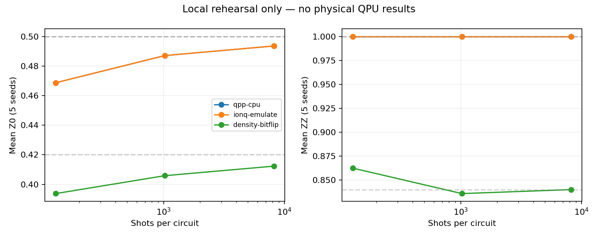
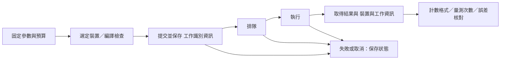

# Day 29｜從模擬器到 QPU：量測預算與遠端工作追蹤

[Day28](../day28/README.md) 區分分散單一狀態向量與平行執行獨立任務，並以容量與延遲模型探討增加 GPU 的可能效益與限制。Day29 接著從本地模擬走向真實量子處理器（QPU）的執行流程，說明除了切換後端（實際執行計算的工具），還需要準備哪些驗證與工作紀錄。

**將量子電路移到真實硬體，需要同時處理量測結果、工作追蹤與執行預算。** 在本地模擬中，一次函式呼叫就能取得結果；遠端執行則還涉及裝置選擇、編譯、排隊、有限量測次數（shots）與結果回收，因此相同的程式介面不代表相同的執行條件。本章先用具有解析答案的兩量子位元小電路，依序完成 CPU 理想抽樣、IonQ 後端 的本地無噪聲預演，以及加入指定雜訊的抽樣，讓預期結果可以逐項核對。實驗先確認回傳位元字串與量子位元的對應、將量測次數統計（counts）換成期望值，以及用統計區間表達有限 shots 帶來的不確定性；增加 shots 能降低抽樣變異，卻不能消除雜訊造成的偏差。接著將一次電路求值展開成包含參數、量測基底與總 shots 的工作規格，並說明遠端工作識別碼、狀態與裝置資訊為何需要保存，才能追蹤結果並判斷失敗後是否需要重送。計時也必須區分整體等待、排隊與硬體執行，不能把取得結果前的等待都當成 QPU 計算時間。本章完成的是本地預演與尚未提交的工作規格，沒有真實 QPU 實測。本地驗證與硬體執行提供不同的證據。將量子機器學習（QML）實驗移到遠端裝置前，需要明確定義輸出格式、量測預算與結果追蹤方式。

[Day28](../day28/README.md) distinguished distributing one statevector from running independent tasks in parallel, using capacity and latency models to explore the potential benefits and limits of additional GPUs. Day29 moves from local simulation toward execution on a physical quantum processing unit (QPU), explaining the validation and records needed beyond switching the backend.

**Moving a quantum circuit to physical hardware requires explicit measurement budgets, traceable jobs, and interpretable results.** A local function call returns a result, while remote execution also involves device selection, compilation, queues, finite measurement counts (shots), and result retrieval. The same programming interface therefore does not imply the same execution conditions. A two-qubit circuit with analytical answers provides a small, checkable example for CPU ideal sampling, noiseless local emulation of the IonQ 後端, and sampling with a specified noise channel. Key steps include checking how returned bitstrings map to qubits, converting counts into expectation values, and expressing finite-shot uncertainty with statistical intervals. More shots reduce sampling variance but do not remove noise-induced bias. A circuit evaluation is then expanded into a job specification containing parameters, measurement bases, and a total shot budget. Saving remote job identifiers, statuses, and device information supports result tracking and decisions about resubmission after failures. Timing must also distinguish total waiting, queueing, and hardware execution rather than treating the entire wait as QPU computation. The chapter delivers a local rehearsal and an unsubmitted job specification, with no physical-QPU measurements. Local validation and physical execution provide different evidence. Output formats, measurement budgets, and result tracking must be defined before moving QML experiments to a remote device.

---

Day28 把「單一狀態向量分散」與「獨立任務平行」分開。今天再往外走一步：本地模擬器回傳一個數字，到了遠端 QPU，就成為有 shots、排隊、裝置條件與結果追蹤的工作。

本章延續 Day08 的 RY＋CNOT 狀態準備、Day26 的噪聲位置標記，完成 **CPU 理想抽樣 → IonQ 本地預演 → 合成噪聲抽樣** 的可重現預演。本文沒有真實 QPU 實測，也沒有提交雲端模擬器工作。成果是通過驗證的本地程式與一份可檢視的待提交規格。

程式：[execution.py](execution.py)、[experiment.py](experiment.py)、[run_all.py](run_all.py)、[報告與資料核對](report.py)、[測試](test_execution.py)。完整 [結果報告](../../results/day29/README.md)。

CPU 是中央處理器，GPU 是擅長平行運算的圖形處理器；模擬器用一般電腦計算量子狀態，QPU 則以實際量子系統執行操作。IonQ 是量子運算供應商。本章的預演是先經過指定後端的編譯流程，再於本地模擬執行；編譯是將程式轉成後端可執行的操作。解析式則是可直接推導預期答案的公式。

## 1. 後端名稱不等於執行證據

| 層級 | 本日狀態 | 能驗證什麼 | 仍未知的事 |
|---|---|---|---|
| `qpp-cpu`理想模擬器 | 已執行 | 解析式、計數後處理 | 真實裝置噪聲 |
| `ionq, emulate=True` | 已執行，本地無噪聲 | 此後端編譯路徑與取樣結果 | 帳號權限、遠端接收、QPU 執行 |
| `density-matrix-cpu`＋位元翻轉 | 已執行，合成噪聲 | 指定通道造成的偏差 | 裝置校準與實際各種誤差來源的大小 |
| 雲端模擬器／語法檢查工具 | 未提交 | 依服務而異 | 不等於 實體量子處理器 |
| 實體量子處理器 | 未提交 | 需遠端工作與裝置紀錄才有證據 | 排隊、硬體時間與費用皆未量測 |

NVIDIA 文件說明`cudaq.set_target('ionq', emulate=True)`會在本地執行無噪聲預演；單純選`ionq`預設可能提交到供應商模擬器。硬體執行需要帳號與具體裝置選擇。[D27] 本日將`CUDAQ_DEFAULT_SIMULATOR=qpp`固定在子程序載入套件前，並使用本機 CUDA-Q 0.15.1 實際驗證。

```python
# execution.py 內的本地硬體 target 預演
cudaq.set_target('ionq', emulate=True)
counts = cudaq.sample(measured, theta, basis, shots_count=1024)
```

程式只接受三個明確的本地模式。沒有可直接提交遠端的命令，也不需要憑證。本地預演成功不代表現在選得到任何特定 QPU。

## 2. 用小電路確認輸出格式與意義

先用能直接推導答案的小電路做初步檢查，再搬分類模型。兩量子位元準備沿用 Day08：

```text
|ψ(θ)⟩ = cos(θ/2)|00⟩ + sin(θ/2)|11⟩
θ = π/3
q0: RY(θ) — control — RZ(0) — [H if X basis] — MZ
q1:         X              — [H if X basis] — MZ
```

RY 與 RZ 分別是繞 Y 軸與 Z 軸的旋轉操作；θ 是旋轉角度。CNOT 是受控反相閘，q0 為 1 時翻轉 q1。H（Hadamard 閘）用來轉換量測方向，MZ 表示沿 Z 基底量測。基底是用來區分狀態的一組方向，Z 基底對應通常的 0／1 結果，X 基底可顯示不同的相位關係。

`RZ(0)` 是 Day26 沿用的噪聲位置標記；理想電路中不改變狀態。用 Z 基底計數估 Z0 與 ZZ，用兩個 H 之後的計數估 X0 與 XX。同一基底內共用 shots，兩基底是兩次電路執行。

Z0 與 X0 只觀察第 0 個量子位元；ZZ 與 XX 將兩個位元在對應方向的 ±1 記分相乘，再取平均。噪聲通道是描述干擾如何改變狀態的規則，位元翻轉則以指定機率交換 0 與 1。

解析值如下；p=.08 表示**僅在準備完成後，對 q0 套一次位元翻轉**，不是每個量子閘 都出錯 8%，也不是 IonQ 校準值：

| 量測量 | 理想值 | 指定位元翻轉後 |
|---|---:|---:|
| Z0 | cosθ = 0.5 | (1−2p)cosθ = 0.42 |
| ZZ | 1 | 1−2p = 0.84 |
| X0 | 0 | 0 |
| XX | sinθ ≈ 0.866025 | sinθ ≈ 0.866025 |

位元翻轉對 X 方向的量測量沒有改變，但會改變 Z 方向。這說明噪聲的影響必須連同量測方式解讀。這個小電路用來核對執行方式與輸出，沒有新訓練，也不宣稱本日重跑了 Wine 分類器或得到 QML 準確率。

## 3. 位元順序不能只靠 Bell 態猜

Bell 態是具有糾纏的雙位元狀態，例如 `(|00⟩+|11⟩)/√2`；糾纏表示兩個位元無法各自獨立描述。這個例子在 Z 基底只出現 00 或 11，但 00 與 11 交換位元順序後仍相同，無法驗證 q0 到底在哪一側。本日先對 q0 施 X，明確依 q0、q1 順序 MZ，三種模式都得到`{'10': 32}`，才繼續解讀計數。

`estimate()`要求兩位元字串、非負整數計數、總和等於 shots。Z0／X0 將第一位的 0 記為 +1、1 記為 −1；ZZ／XX 則依奇偶性記分，00、11 記 +1，01、10 記 −1。將來接其他後端時，仍需重新做這個檢查電路與必要的資料格式轉換，不能推論所有供應商都使用相同字串順序。

明確末端量測也保留了需要的輸出量子位元。[D28] 本地硬體後端的編譯轉換可能與一般模擬器的`explicit_measurements`支援不同，因此本日用末端 Z 量測加上非對稱檢查電路驗證實際回傳格式。

## 4. Shots 能降低變異，不能消掉偏差

一次 shot 是一次狀態準備與量測。計數（counts）記錄每種結果出現幾次，期望值則是依機率計算的平均。每個量測量的單次記分是 ±1。N 次獨立、同分布 shots 下：

```text
E_hat = (N_plus − N_minus) / N
Var(E_hat) = (1 − E²) / N
SE(E_hat) ≤ 1 / sqrt(N)
```

`N_plus` 與 `N_minus` 是 +1 與 −1 的次數，`E_hat` 是由樣本估計的平均值，E 是理論期望值。Var 表示變異數，衡量估計值的分散程度；SE 是標準誤，描述估計值的典型波動大小。

獨立同分布表示各次抽樣不互相影響，且使用相同機率分布。這裡的獨立同分布是假設；真實裝置的時間漂移與相關性可能違反它。理想 ZZ=1 沒有抽樣變異；加入位元翻轉後，ZZ 會往 0.84 收斂，增加 shots 不會讓它回到 1。

`sample` 是回傳抽樣計數的程式呼叫；隨機種子用來重現本地抽樣序列。

本日每模式跑 128／1024／8192 shots，各 5 個隨機種子、2 個基底，共 30 次 sample。三模式合計 90 筆計數與 180 個期望值；主實驗共 280,320 shots，另有 96 個檢查電路 shots 與 8 次 CPU 直接計算期望值的呼叫。



圖為 5 個隨機種子的平均值，虛線是模式的解析參考值，不是信賴區間。CPU 與 IonQ 預演曲線重疊：兩者本次使用相同底層模擬器與隨機種子，不能視為兩份獨立的硬體證據。

JSON 是保存結構化資料的文字格式。Wilson 區間是估計二項比例不確定性的方法；二項分布在此描述 N 次抽樣中 +1 出現的次數。95% 指在相同假設下反覆抽樣並建立區間，長期約有 95% 的區間涵蓋真值，不表示所有項目必定同時涵蓋真值。

原始 JSON 保存每個期望值的逐項 95% Wilson 區間。做法是先對`P(+1)`算二項分布比例區間，再透過`E=2P(+1)−1`轉換。即使本次全是+1，Wilson 區間也不會退化成零寬度；它仍不包含噪聲模型誤差或硬體漂移。

測試不要求「每個 95%區間都包含參考值」，也不要求更多 shots 時每次誤差都更小。數值驗證使用 Hoeffding 界：

```text
Pr(|E_hat−E| ≥ ε) ≤ 2 exp(−Nε²/2)
ε(N) = sqrt(2 ln(2M/α) / N)
M=180，α=.01
```

Hoeffding 界對抽樣誤差超過 ε 的機率給出上限。Pr 表示機率，exp 是指數函數，ln 是自然對數；M 是檢查總數，α 是允許整組出現超界的機率上限。聯集界將各項超界機率上限加總，用來控制整組檢查的風險。

對 180 個檢查用聯集界，得到整組檢查至少 99%的覆蓋保證；這不要求各組估計彼此獨立，但各組內仍需滿足 shot 假設。寬鬆界適合抓大幅錯誤，不能拿「通過」宣稱硬體品質。另以 8 個直接計算期望值的呼叫對解析式核對，避免完全依賴隨機檢查。

## 5. 把一次電路求值變成工作規格

[submission_plan.json](../../results/day29/submission_plan.json) 保存固定 θ、一組參數、兩個量測電路、每個 1024 shots、總共要求 2,048 次量測。`status=not_submitted`；裝置、排隊、硬體執行時間與費用欄位皆為 `null`，工作識別碼為空。這些 null 表示尚未知，不是零成本或零等待。

`status=not_submitted` 表示尚未提交，`null` 表示沒有已知數值。校準是量測並記錄裝置當時的行為，誤差緩解則用額外量測或後處理降低部分誤差影響，可能增加工作量。

這是主電路的邏輯預算，不含未來硬體位元檢查電路、校準、誤差緩解或重試。供應商可能批次處理多個電路、產生子工作或加入處理成本，因此兩個電路不保證剛好兩個遠端工作，也不等於最終計費單位。

梯度描述參數小幅改動時，目標函數如何變化。參數位移法以兩個角度設定下的結果差來求適用參數的導數。移植 Day17 參數位移法時也要展開預算。若 K 個參數、B 筆輸入、G 組量測基底、每組 N shots，單次完整位移梯度的簡化需求是`2K × B × G × N`，另加損失函數評估、重複與可能的額外電路。這是每參數適用兩次位移的假設，不是所有梯度方法的通用公式。Day28 的任務平行化能併發部分工作，不能減少原本需要的總 shots。

## 6. 遠端生命週期與計時



本章引用的 IonQ 文件區分 submitted（已提交）、ready（就緒）、started（已開始），以及 completed（完成）、failed（失敗）、canceled（取消）；v0.3 與部分介面將執行中稱為 running。[D29] 實作需保留供應商原始狀態與 API 版本，而不只保留成功或失敗兩種值。API 是程式與服務交換請求和結果的介面。

future 是代表尚待取得結果的物件，`get()` 會等待結果完成。主機在此指提交工作的本地電腦。CUDA-Q 提供 `sample_async`，以 future 的`get()`取得結果，遠端流程可保存工作識別資訊再回取。[D28] 非同步呼叫讓主機繼續工作，不代表 QPU 已完成，也不會消除排隊。

未來量測要分別保存主機提交到取得結果的總時間、供應商回報的排隊／執行時間、編譯資訊與裝置附加資訊。用戶端程式等待`get()`的時間不能直接叫 QPU 運算時間。本日 JSON 中的`sample_wall_seconds`只量本地同步 sample，包含可能的編譯成本，未分暖機，不用來比較硬體速度。

網路逾時只代表用戶端程式沒有及時收到回覆，工作可能已建立。工程上的處理是先依已保存的工作識別資訊查詢，再決定是否重送；本日待提交規格的自動重新提交次數為 0，以免預算在不知情下翻倍。這是本日的工作規格選擇，不是供應商的重試保證。

## 7. 真的移到 QPU 前還缺哪些資訊？

原生量子閘是裝置直接支援的操作，連接性描述哪些位元能直接互相作用。電路深度是必須依序執行的操作層數，量子位元對應則記錄程式中的位元被安排到哪些硬體位元。糾纏閘是可建立位元間糾纏的操作，編譯後的數量可能與原始電路不同。SDK 是與裝置或服務互動的軟體開發工具組。

先在有權限的帳號選定當時可用的實體裝置，核對原生量子閘、連接性、量子位元／shots 限制及量測能力，再檢視編譯後的量子閘數、深度與量子位元對應。邏輯 CNOT 數不等於裝置實際糾纏閘數。

保存執行日期、裝置名稱、校準快照或可取得的校準識別、編譯與 SDK 版本、參數／原始碼摘要、量測基底、要求／回傳 shots，以及誤差緩解設定。若供應商回傳的是機率或已處理的分布，需另建格式轉換程式保留原始語義，不能隨意取整數湊成計數。

取得實際費用或配額條件後，才能把本日的 2048-shot 規格變成可提交工作。本文不固定當前 QPU 型號、可用性或價格。本日沒有設定帳號或裝置，因此目前保存的是本地預演結果與待提交規格，沒有硬體效能結論。

## 8. 重跑與可重現性

`.venv` 是專案獨立保存套件的虛擬環境。`OMP_NUM_THREADS=1` 固定 CPU 平行執行緒數；`MPLCONFIGDIR` 指定繪圖套件的設定與快取目錄。

沿用 [requirements-day29.txt](../../requirements-day29.txt)，三模式依序在獨立程序執行：

```bash
MPLCONFIGDIR=/tmp/day29-matplotlib .venv/bin/python articles/day29/run_all.py
OMP_NUM_THREADS=1 CUDAQ_DEFAULT_SIMULATOR=qpp \
  .venv/bin/python -m unittest discover -s articles/day29 -p 'test_*.py'

# 單一 mode 範例
OMP_NUM_THREADS=1 CUDAQ_DEFAULT_SIMULATOR=qpp \
  .venv/bin/python articles/day29/experiment.py --mode ionq-emulate
# 核對現有三 mode 紀錄並重新產生報告
MPLCONFIGDIR=/tmp/day29-matplotlib .venv/bin/python articles/day29/report.py
```

輸出到 `results/day29/`並覆寫同名檔案。每筆記錄包含原始計數、shots、隨機種子、解析參考值、區間與本地經過時間；各模式保存原始碼 SHA-256 摘要與版本；SHA-256 是由檔案內容計算的摘要，可用來核對程式是否一致。隨機種子只服務本地重跑，不保證不同版本、不同後端或真實 QPU 會回傳同一計數。

8 個測試涵蓋非對稱位元順序、奇偶性、Wilson 邊界、非法計數、噪聲極限、本地預演設定、離線預算、保存結果核對與損壞資料偵測。報告產生前會重新從計數計算統計，核對完整 90 組設定與原始碼摘要。

## 9. 接到 Day30

現在證據鏈包含理想模擬、噪聲模型、單 GPU 計時、多 GPU 情境模型與 QPU 本地預演。Day30 將回顧這些成果能支持哪些 QML 結論，以及哪些問題仍需要更大資料集、多卡設備或真實量子硬體才能回答。

[D27] [NVIDIA Ion Trap Backends](https://nvidia.github.io/cuda-quantum/latest/using/backends/hardware/iontrap.html)與[Quantum Hardware 入口](https://nvidia.github.io/cuda-quantum/latest/using/backends/hardware.html)，查閱 2026-09-08；說明本地預演、供應商與裝置的區分與帳號條件。本日使用本機 0.15.1 實測，不把 latest 所有範例當固定版本契約。

[D28] [Executing Kernels](https://nvidia.github.io/cuda-quantum/latest/using/examples/executing_kernels.html)與[Using Quantum Hardware Providers](https://nvidia.github.io/cuda-quantum/latest/using/examples/hardware_providers.html)，查閱 2026-09-08；說明末端量測、`sample_async` 及遠端結果取得方式。

[D29] [IonQ Jobs](https://docs.ionq.com/user-manual/jobs)與[API v0.4 Get Job](https://docs.ionq.com/api-reference/v0.4/jobs/get-job)，查閱 2026-09-08；說明工作狀態與附加資訊，不代表本日使用了該 API。完整 [參考索引](../../REFERENCES.md)。
