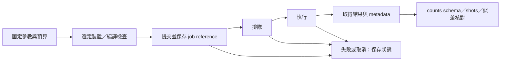

# Day 29｜Simulator → QPU：換 Backend 之後，還有哪些工程工作？

## 本章摘要｜初學者學習筆記

### 中文

[Day28](../day28/README.md) 區分分散單一狀態向量與平行執行獨立任務，並以容量與延遲模型探討增加 GPU 的可能效益與限制。Day29 接著從本地模擬走向真實量子處理器（QPU）的執行流程，說明除了切換 backend，還需要準備哪些驗證與工作紀錄。

這一章目標在於理解 **「量子電路從模擬器移到 QPU 時，如何確認結果可解讀、工作可追蹤，以及量測預算可掌握」**。在本地模擬中，一次函式呼叫就能取得結果；遠端執行則還涉及裝置選擇、編譯、排隊、有限量測次數（shots）與結果回收，因此相同的程式介面不代表相同的執行條件。本章先用具有解析答案的兩量子位元小電路，依序完成 CPU 理想抽樣、IonQ target 的本地無噪聲預演，以及加入指定雜訊的抽樣，讓預期結果可以逐項核對。學習重點包含確認回傳位元字串與量子位元的對應、將量測次數統計（counts）換成期望值，以及用統計區間表達有限 shots 帶來的不確定性；增加 shots 能降低抽樣變異，卻不能消除雜訊造成的偏差。接著將一次電路求值展開成包含參數、量測基底與總 shots 的工作規格，並說明遠端工作識別碼、狀態與裝置資訊為何需要保存，才能追蹤結果並判斷失敗後是否需要重送。計時也必須區分整體等待、排隊與硬體執行，不能把取得結果前的等待都當成 QPU 計算時間。本章完成的是本地預演與尚未提交的工作規格，沒有真實 QPU 實測。完成本章後，應能分辨本地驗證與硬體執行證據，並理解將 QML 實驗移到遠端裝置前，需要明確定義輸出格式、量測預算與結果追蹤方式。

### English

[Day28](../day28/README.md) distinguished distributing one statevector from running independent tasks in parallel, using capacity and latency models to explore the potential benefits and limits of additional GPUs. Day29 moves from local simulation toward execution on a physical quantum processing unit (QPU), explaining the validation and records needed beyond switching the backend.

This chapter aims to explain **how to keep results interpretable, jobs traceable, and measurement budgets explicit when moving a quantum circuit from a simulator to a QPU**. A local function call returns a result, while remote execution also involves device selection, compilation, queues, finite measurement counts (shots), and result retrieval. The same programming interface therefore does not imply the same execution conditions. A two-qubit circuit with analytical answers provides a small, checkable example for CPU ideal sampling, noiseless local emulation of the IonQ target, and sampling with a specified noise channel. Key steps include checking how returned bitstrings map to qubits, converting counts into expectation values, and expressing finite-shot uncertainty with statistical intervals. More shots reduce sampling variance but do not remove noise-induced bias. A circuit evaluation is then expanded into a job specification containing parameters, measurement bases, and a total shot budget. Saving remote job identifiers, statuses, and device information supports result tracking and decisions about resubmission after failures. Timing must also distinguish total waiting, queueing, and hardware execution rather than treating the entire wait as QPU computation. The chapter delivers a local rehearsal and an unsubmitted job specification, with no physical-QPU measurements. The intended outcome is an understanding of the difference between local validation and hardware execution evidence, and of the output formats, measurement budgets, and tracking needed before moving QML experiments to a remote device.

---

Day28把「單一statevector分散」與「獨立任務平行」分開。今天再往外走一步：本地simulator回傳一個數字，到了遠端QPU，就成為有shots、排隊、裝置條件與結果追蹤的工作。

本章延續Day08的RY＋CNOT狀態準備、Day26的noise位置標記，完成 **CPU理想抽樣 → IonQ本地emulation → 合成noise抽樣** 的可重現預演。本文沒有真實QPU實測，也沒有提交雲端simulator工作。成果是通過驗證的本地程式與一份可檢視的待提交規格。

程式：[execution.py](execution.py)、[experiment.py](experiment.py)、[run_all.py](run_all.py)、[報告與資料核對](report.py)、[測試](test_execution.py)。完整[結果報告](../../results/day29/README.md)。

## 1. Backend名稱不等於執行證據

| 層級 | 本日狀態 | 能驗證什麼 | 仍未知的事 |
|---|---|---|---|
| `qpp-cpu`理想simulator | 已執行 | 解析式、counts後處理 | 真實裝置noise |
| `ionq, emulate=True` | 已執行，本地無noise | 此target編譯路徑與取樣結果 | 帳號權限、遠端接收、QPU執行 |
| `density-matrix-cpu`＋bit flip | 已執行，合成noise | 指定channel造成的偏差 | 裝置校準與實際error budget |
| Cloud simulator／syntax checker | 未提交 | 依服務而異 | 不等於physical QPU |
| Physical QPU | 未提交 | 需遠端job與裝置紀錄才有證據 | queue、硬體時間與費用皆未量測 |

NVIDIA文件說明`cudaq.set_target('ionq', emulate=True)`會在本地執行無noise emulation；單純選`ionq`預設可能提交到供應商simulator。硬體執行需要帳號與具體裝置選擇。[D27] 本日將`CUDAQ_DEFAULT_SIMULATOR=qpp`固定在子程序import前，並使用本機CUDA-Q 0.15.1實際驗證。

```python
# execution.py內的本地硬體target預演
cudaq.set_target('ionq', emulate=True)
counts = cudaq.sample(measured, theta, basis, shots_count=1024)
```

程式只接受三個明確的本地mode。沒有可直接提交遠端的命令，也不需要憑證。本地emulation成功不代表現在選得到任何特定QPU。

## 2. 用小電路確認輸出契約

先用可解析的小電路做移植smoke test，再搬分類模型。兩qubit準備沿用Day08：

```text
|ψ(θ)⟩ = cos(θ/2)|00⟩ + sin(θ/2)|11⟩
θ = π/3
q0: RY(θ) — control — RZ(0) — [H if X basis] — MZ
q1:         X              — [H if X basis] — MZ
```

`RZ(0)`是Day26沿用的noise位置標記；理想電路中不改變狀態。用Z基底counts估Z0與ZZ，用兩個H之後的counts估X0與XX。同一基底內共用shots，兩基底是兩次電路執行。

解析值如下；p=.08表示**僅在準備完成後，對q0套一次bit flip**，不是每個gate都出錯8%，也不是IonQ校準值：

| Observable | 理想值 | 指定bit-flip後 |
|---|---:|---:|
| Z0 | cosθ = 0.5 | (1−2p)cosθ = 0.42 |
| ZZ | 1 | 1−2p = 0.84 |
| X0 | 0 | 0 |
| XX | sinθ ≈ 0.866025 | sinθ ≈ 0.866025 |

bit flip對X方向的observable沒有改變，但會改變Z方向。這說明noise的影響必須連同量測方式解讀。這個小電路用來驗證執行契約，沒有新訓練，也不宣稱本日重跑了Wine classifier或得到QML準確率。

## 3. 位元順序不能只靠Bell State猜

00與11交換bit順序後仍相同，無法驗證q0到底在哪一側。本日先對q0施X，明確依q0、q1順序MZ，三種mode都得到`{'10': 32}`，才繼續解讀counts。

`estimate()`要求兩位元字串、非負整數count、總和等於shots。Z0／X0取第一位的±1；ZZ／XX取兩位parity。將來接其他backend時，仍需重新做這個probe與必要的schema轉換，不能推論所有provider都使用相同字串順序。

明確terminal measurement也保留了需要的輸出qubits。[D28] 本地硬體target的lowering可能與一般simulator的`explicit_measurements`支援不同，因此本日用terminal MZ加上非對稱probe驗證實際回傳契約。

## 4. Shots能降低變異，不能消掉偏差

每個observable的單次結果是±1。N次獨立、同分布shots下：

```text
E_hat = (N_plus − N_minus) / N
Var(E_hat) = (1 − E²) / N
SE(E_hat) ≤ 1 / sqrt(N)
```

這裡的獨立同分布是假設；真實裝置的時間漂移與correlation可能違反它。理想ZZ=1沒有抽樣變異；加入bit flip後，ZZ會往0.84收斂，增加shots不會讓它回到1。

本日每模式跑128／1024／8192 shots，各5個seeds、2個基底，共30次sample。三模式合計90筆counts與180個expectations；主實驗共280,320 shots，另有96個probe shots與8次CPU exact observe。


圖為5個seeds的平均值，虛線是模式的解析reference，不是信賴區間。CPU與IonQ emulation曲線重疊：兩者本次使用相同底層simulator與seeds，不能視為兩份獨立的硬體證據。

原始JSON保存每個expectation的pointwise 95% Wilson區間。做法是先對`P(+1)`算binomial比例區間，再透過`E=2P(+1)−1`轉換。即使本次全是+1，Wilson區間也不會退化成零寬度；它仍不包含noise模型誤差或硬體漂移。

測試不要求「每個95%區間都包含reference」，也不要求更多shots時每次誤差都更小。數值驗證使用Hoeffding界：

```text
Pr(|E_hat−E| ≥ ε) ≤ 2 exp(−Nε²/2)
ε(N) = sqrt(2 ln(2M/α) / N)
M=180，α=.01
```

對180個檢查用union bound，得到family-wise至少99%的覆蓋保證；這不要求各組估計彼此獨立，但各組內仍需滿足shot假設。寬鬆界適合抓大幅錯誤，不能拿「通過」宣稱硬體品質。另以8個exact observe對解析式核對，避免完全依賴隨機檢查。

## 5. 把一次Forward變成工作規格

[submission_plan.json](../../results/day29/submission_plan.json)保存固定θ、一組參數、兩個measurement circuits、每個1024 shots、總計2048 requested shots。`status=not_submitted`；machine、queue、硬體執行時間與cost皆為null，job IDs為空。這些null表示尚未知，不是零成本或零等待。

這是主電路的邏輯預算，不含未來硬體位元probe、校準、error mitigation或重試。provider可能batch多個circuits、產生child jobs或加入處理成本，因此兩個circuits不保證剛好兩個遠端jobs，也不等於最終計費單位。

移植Day17 parameter-shift時也要展開預算。若K個參數、B筆輸入、G組量測基底、每組N shots，單次完整shift梯度的簡化需求是`2K × B × G × N`，另加loss評估、重複與可能的額外電路。這是每參數適用兩次shift的假設，不是所有gradient方法的通用公式。Day28的task parallelism能併發部分工作，不能減少原本需要的總shots。

## 6. 遠端生命週期與計時



IonQ文件區分submitted、ready、started與completed／failed／canceled；v0.3與部分介面將執行中稱為running。[D29] 實作需保留provider原始狀態與API版本，而不只轉成一個成功布林值。

CUDA-Q提供`sample_async`，以future的`get()`取得結果，遠端流程可保存job reference再回取。[D28] Async讓host繼續工作，不代表QPU已完成，也不會消除排隊。

未來量測要分別保存host提交到結果的wall time、provider回報的queue／execution timing、編譯資訊與裝置metadata。client等待`get()`的時間不能直接叫QPU execution time。本日JSON中的`sample_wall_seconds`只量本地同步sample，包含可能的編譯成本，未分暖機，不用來比較硬體速度。

網路timeout只代表client沒有及時收到回覆，工作可能已建立。工程上的處理是先依已保存的job reference查詢，再決定是否重送；本日待提交規格的automatic resubmissions為0，以免預算在不知情下翻倍。這是本日的工作規格選擇，不是供應商的重試保證。

## 7. 真的移到QPU前還缺哪些資訊？

先在有權限的帳號選定當時可用的physical device，核對native gates、連接性、qubit／shots限制及量測能力，再檢視編譯後gate count／depth與qubit mapping。邏輯CNOT數不等於裝置實際entangling gates數。

保存執行日期、裝置名稱、校準快照或可取得的校準識別、編譯與SDK版本、參數／source hash、measurement basis、requested／returned shots，以及mitigation設定。若provider回傳的是機率或已處理的分布，需另建adapter保留原始語義，不能隨意取整數湊成counts。

取得實際費用或配額條件後，才能把本日的2048-shot規格變成可提交工作。本文不固定當前QPU型號、可用性或價格。本日沒有設定帳號或裝置，所以交付止於完整本地預演與待提交規格，沒有硬體效能結論。

## 8. 重跑與可重現性

沿用[requirements-day29.txt](../../requirements-day29.txt)，三mode依序在獨立process執行：

```bash
MPLCONFIGDIR=/tmp/day29-matplotlib .venv/bin/python articles/day29/run_all.py
OMP_NUM_THREADS=1 CUDAQ_DEFAULT_SIMULATOR=qpp \
  .venv/bin/python -m unittest discover -s articles/day29 -p 'test_*.py'

# 單一mode範例
OMP_NUM_THREADS=1 CUDAQ_DEFAULT_SIMULATOR=qpp \
  .venv/bin/python articles/day29/experiment.py --mode ionq-emulate
# 核對現有三mode紀錄並重新產生報告
MPLCONFIGDIR=/tmp/day29-matplotlib .venv/bin/python articles/day29/report.py
```

輸出到`results/day29/`並覆寫同名檔案。每筆記錄包含raw counts、shots、seed、解析reference、區間與本地wall time；各mode保存source SHA-256與版本。seed只服務本地重跑，不保證不同版本、不同backend或真實QPU會回傳同一counts。

8個測試涵蓋非對稱位元順序、parity、Wilson邊界、非法counts、noise極限、local emulation設定、離線預算、保存結果核對與損壞資料偵測。報告產生前會重新從counts計算統計，核對完整90組設定與source hash。

## 9. 接到Day30

現在證據鏈包含理想模擬、noise模型、單GPU計時、多GPU情境模型與QPU本地預演。Day30將回顧這些成果能支持哪些QML結論，以及哪些問題仍需要更大資料集、多卡設備或真實量子硬體才能回答。

[D27] [NVIDIA Ion Trap Backends](https://nvidia.github.io/cuda-quantum/latest/using/backends/hardware/iontrap.html)與[Quantum Hardware入口](https://nvidia.github.io/cuda-quantum/latest/using/backends/hardware.html)，查閱2026-09-08；支持本地emulation、provider／device區分與帳號條件。本日使用本機0.15.1實測，不把latest所有範例當固定版本契約。

[D28] [Executing Kernels](https://nvidia.github.io/cuda-quantum/latest/using/examples/executing_kernels.html)與[Using Quantum Hardware Providers](https://nvidia.github.io/cuda-quantum/latest/using/examples/hardware_providers.html)，查閱2026-09-08；支持terminal measurement、sample_async及遠端結果取得概念。

[D29] [IonQ Jobs](https://docs.ionq.com/user-manual/jobs)與[API v0.4 Get Job](https://docs.ionq.com/api-reference/v0.4/jobs/get-job)，查閱2026-09-08；支持job生命週期與metadata分工，不代表本日使用了該API。完整[參考索引](../../REFERENCES.md)。
