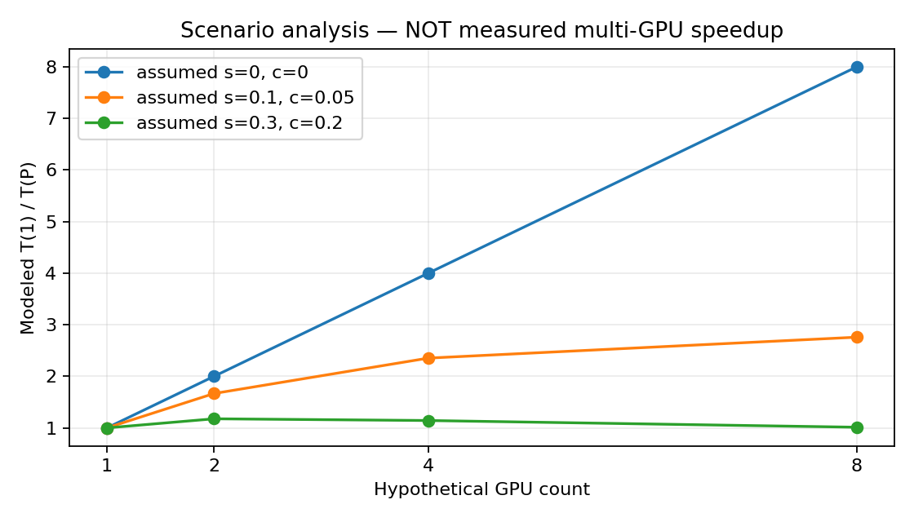

# Day28｜可重現 Scaling Model 報告

**本報告沒有 multi-GPU 實測。**容量與延遲皆為明確假設下的模型輸出。

Day27 單GPU fp64、16qubits／12blocks warm median：5.7890 ms。來源與 SHA-256 見 [model.json](model.json)。

## 容量模型

假設每卡6GiB、均勻切分單份statevector；75%是任意預留情境，非runtime實測。表中數字不是可執行上限。

| GPUs | Precision | 可用比例 | 單buffer qubit上限 |
|---:|---|---:|---:|
| 1 | fp32 | 100% | 29 |
| 2 | fp32 | 100% | 30 |
| 4 | fp32 | 100% | 31 |
| 8 | fp32 | 100% | 32 |
| 1 | fp32 | 75% | 29 |
| 2 | fp32 | 75% | 30 |
| 4 | fp32 | 75% | 31 |
| 8 | fp32 | 75% | 32 |
| 1 | fp64 | 100% | 28 |
| 2 | fp64 | 100% | 29 |
| 4 | fp64 | 100% | 30 |
| 8 | fp64 | 100% | 31 |
| 1 | fp64 | 75% | 28 |
| 2 | fp64 | 75% | 29 |
| 4 | fp64 | 75% | 30 |
| 8 | fp64 | 75% | 31 |

## 延遲敏感度

s是序列比例，c是每log2(P)級通訊／協調成本相對T1的比例；兩者都未經量測或擬合。

| GPUs | s | c | 模型 ms | Speedup | Efficiency |
|---:|---:|---:|---:|---:|---:|
| 1 | 0 | 0 | 5.7890 | 1.000 | 1.000 |
| 2 | 0 | 0 | 2.8945 | 2.000 | 1.000 |
| 4 | 0 | 0 | 1.4472 | 4.000 | 1.000 |
| 8 | 0 | 0 | 0.7236 | 8.000 | 1.000 |
| 1 | 0.1 | 0.05 | 5.7890 | 1.000 | 1.000 |
| 2 | 0.1 | 0.05 | 3.4734 | 1.667 | 0.833 |
| 4 | 0.1 | 0.05 | 2.4603 | 2.353 | 0.588 |
| 8 | 0.1 | 0.05 | 2.0985 | 2.759 | 0.345 |
| 1 | 0.3 | 0.2 | 5.7890 | 1.000 | 1.000 |
| 2 | 0.3 | 0.2 | 4.9206 | 1.176 | 0.588 |
| 4 | 0.3 | 0.2 | 5.0653 | 1.143 | 0.286 |
| 8 | 0.3 | 0.2 | 5.7166 | 1.013 | 0.127 |

固定問題規模的情境分析；不外推更大qubit時間，不代表mgpu backend對16qubits實際啟用分散。

硬體可見性與MPI executable探測見 [environment.json](environment.json)；探測失敗不表示主機沒有GPU。

重跑：`OMP_NUM_THREADS=1 .venv/bin/python articles/day28/scaling.py`。會覆寫本日報告、JSON與圖，不執行量子模擬。

[教學與模型限制](../../articles/day28/README.md)
