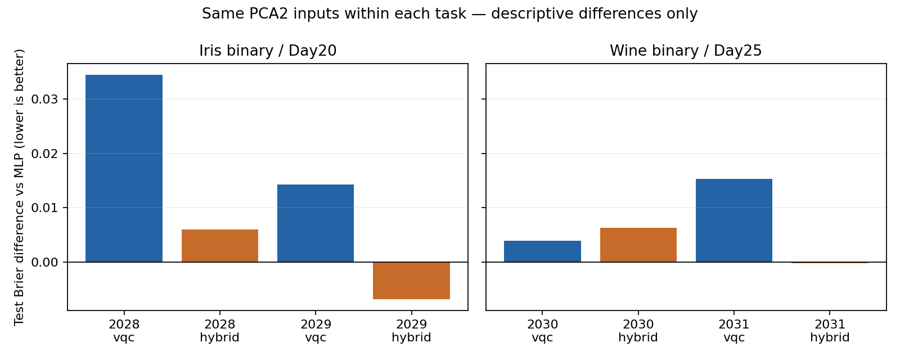

# Day30｜系列證據彙整

由保存的JSON重算；本日沒有重訓、重跑GPU benchmark或提交QPU。來源SHA-256見[evidence.json](evidence.json)。

## 分類與Kernel結果

20個選定模型、60組train／validation／test metrics重新核算。依各日validation選seed或λ；test未用於本次選擇。
Day20與Day25的MLP／VQC／Hybrid用PCA2；Day25 logistic13用完整13維；Day23三kernel共用四維縮放輸入。
各任務分開解讀，不跨日合併成總accuracy或顯著性檢定。

| Day | Split | Model | Test N | Brier | Accuracy |
|---:|---:|---|---:|---:|---:|
| 20 | 2028 | mlp | 21 | 0.070884 | 90.48% |
| 20 | 2028 | vqc | 21 | 0.105396 | 85.71% |
| 20 | 2028 | hybrid | 21 | 0.076867 | 90.48% |
| 20 | 2029 | mlp | 21 | 0.088543 | 85.71% |
| 20 | 2029 | vqc | 21 | 0.102869 | 85.71% |
| 20 | 2029 | hybrid | 21 | 0.081691 | 90.48% |
| 23 | 2028 | quantum | 21 | 0.066907 | 90.48% |
| 23 | 2028 | rbf | 21 | 0.067819 | 90.48% |
| 23 | 2028 | linear | 21 | 0.041345 | 95.24% |
| 23 | 2029 | quantum | 21 | 0.071703 | 90.48% |
| 23 | 2029 | rbf | 21 | 0.028753 | 100.00% |
| 23 | 2029 | linear | 21 | 0.047579 | 90.48% |
| 25 | 2030 | mlp | 26 | 0.028478 | 96.15% |
| 25 | 2030 | vqc | 26 | 0.032404 | 96.15% |
| 25 | 2030 | hybrid | 26 | 0.034820 | 96.15% |
| 25 | 2030 | logistic13 | 26 | 0.040234 | 92.31% |
| 25 | 2031 | mlp | 26 | 0.041693 | 92.31% |
| 25 | 2031 | vqc | 26 | 0.057050 | 92.31% |
| 25 | 2031 | hybrid | 26 | 0.041495 | 92.31% |
| 25 | 2031 | logistic13 | 26 | 0.032224 | 92.31% |

## 相同PCA2輸入的描述性差值

ΔBrier = model − MLP；負值表示本次較低。不是confidence interval或統計優勢。

| Day | Split | Model | ΔBrier |
|---:|---:|---|---:|
| 20 | 2028 | vqc | +0.034512 |
| 20 | 2028 | hybrid | +0.005982 |
| 20 | 2029 | vqc | +0.014326 |
| 20 | 2029 | hybrid | -0.006852 |
| 25 | 2030 | vqc | +0.003926 |
| 25 | 2030 | hybrid | +0.006342 |
| 25 | 2031 | vqc | +0.015357 |
| 25 | 2031 | hybrid | -0.000198 |

## Day27 fp64計時核對

由每case的7次warm latency重算median與比值，確認weights hash及輸出一致。CPU固定OMP_NUM_THREADS=1。
這是特定simulator inference比較；不是QPU或QML training speedup。

| Qubits | Blocks | CPU ms | GPU ms | CPU/GPU |
|---:|---:|---:|---:|---:|
| 4 | 4 | 0.2180 | 0.3557 | 0.613 |
| 4 | 12 | 0.4298 | 0.6104 | 0.704 |
| 8 | 4 | 2.5186 | 0.7380 | 3.413 |
| 8 | 12 | 7.4470 | 1.6859 | 4.417 |
| 12 | 4 | 78.7158 | 1.2231 | 64.357 |
| 12 | 12 | 230.4207 | 2.9851 | 77.190 |
| 16 | 4 | 2159.3767 | 1.9608 | 1101.300 |
| 16 | 12 | 6442.4541 | 5.7890 | 1112.885 |

## Noise與執行邊界

Day26的18組Wine noise metrics由保存機率與Day25 labels重新核算。以下保留bit flip兩端情境：

| Split | p | Test Brier | Accuracy |
|---:|---:|---:|---:|
| 2030 | 0.0 | 0.032404 | 96.15% |
| 2030 | 0.3 | 0.124883 | 96.15% |
| 2031 | 0.0 | 0.057050 | 92.31% |
| 2031 | 0.3 | 0.145514 | 92.31% |

末端q0 channel不是全電路noise，也不是noise-aware training。

- Day20／25共28次NumPy reference fits；兩日CUDA-Q training calls皆為0。
- Day28：16組容量與12組延遲模型，核對Day27 baseline hash；無多卡實測。
- Day29：90組本地counts，280,320 requested shots；不含96個probe shots。Physical QPU jobs=0。
- Day29的2048-shot工作規格仍為not_submitted；費用與queue未知。

## 系列交付索引

已核對30篇文章存在，Day03–30各有Python程式或Notebook。這是檔案存在性檢查，不是全部歷史測試重跑。

| Day | Article | Python files | Notebooks |
|---:|---|---:|---:|
| 01 | [文章](../../articles/day01/README.md) | 0 | 0 |
| 02 | [文章](../../articles/day02/README.md) | 1 | 0 |
| 03 | [文章](../../articles/day03/README.md) | 4 | 0 |
| 04 | [文章](../../articles/day04/README.md) | 5 | 0 |
| 05 | [文章](../../articles/day05/README.md) | 5 | 1 |
| 06 | [文章](../../articles/day06/README.md) | 3 | 0 |
| 07 | [文章](../../articles/day07/README.md) | 4 | 0 |
| 08 | [文章](../../articles/day08/README.md) | 3 | 0 |
| 09 | [文章](../../articles/day09/README.md) | 4 | 0 |
| 10 | [文章](../../articles/day10/README.md) | 2 | 0 |
| 11 | [文章](../../articles/day11/README.md) | 3 | 0 |
| 12 | [文章](../../articles/day12/README.md) | 4 | 0 |
| 13 | [文章](../../articles/day13/README.md) | 4 | 0 |
| 14 | [文章](../../articles/day14/README.md) | 4 | 0 |
| 15 | [文章](../../articles/day15/README.md) | 5 | 0 |
| 16 | [文章](../../articles/day16/README.md) | 5 | 0 |
| 17 | [文章](../../articles/day17/README.md) | 5 | 0 |
| 18 | [文章](../../articles/day18/README.md) | 4 | 0 |
| 19 | [文章](../../articles/day19/README.md) | 5 | 0 |
| 20 | [文章](../../articles/day20/README.md) | 5 | 0 |
| 21 | [文章](../../articles/day21/README.md) | 5 | 0 |
| 22 | [文章](../../articles/day22/README.md) | 5 | 0 |
| 23 | [文章](../../articles/day23/README.md) | 5 | 0 |
| 24 | [文章](../../articles/day24/README.md) | 5 | 0 |
| 25 | [文章](../../articles/day25/README.md) | 5 | 0 |
| 26 | [文章](../../articles/day26/README.md) | 5 | 0 |
| 27 | [文章](../../articles/day27/README.md) | 4 | 0 |
| 28 | [文章](../../articles/day28/README.md) | 2 | 0 |
| 29 | [文章](../../articles/day29/README.md) | 5 | 0 |
| 30 | [文章](../../articles/day30/README.md) | 2 | 0 |

重跑：`.venv/bin/python articles/day30/evidence.py`；驗證保存彙整未過期：加`--check`。
此audit核對保存資料的一致性，未重算所有模型forward、preprocessing或先前全部測試。

[總結文章與後續研究規格](../../articles/day30/README.md)
